<properties
	pageTitle="Esercitazione sul database SQL: creare un database SQL | Microsoft Azure"
	description="L'articolo fornisce informazioni su come configurare un server logico del database SQL, una regola firewall del server, un database SQL e dati di esempio. Fornisce anche informazioni su come connettersi con strumenti client, configurare utenti e impostare una regola firewall del database."
	keywords="esercitazione sul database sql, creare un database sql"
	services="sql-database"
	documentationCenter=""
	authors="CarlRabeler"
	manager="jhubbard"
	editor=""/>

<tags
	ms.service="sql-database"
	ms.workload="data-management"
	ms.tgt_pltfrm="na"
	ms.devlang="na"
	ms.topic="hero-article"
	ms.date="09/07/2016"
	ms.author="carlrab"/>

# Esercitazione sul database SQL: Creare un database SQL in pochi minuti usando il portale di Azure

> [AZURE.SELECTOR]
- [Portale di Azure](sql-database-get-started.md)
- [C#](sql-database-get-started-csharp.md)
- [PowerShell](sql-database-get-started-powershell.md)

In questa esercitazione si apprenderà come usare il portale di Azure per:

- Creare un database SQL di Azure con dati di esempio.
- Creare una regola del firewall a livello di server per un singolo indirizzo IP o per un intervallo di indirizzi IP.

Per eseguire le stesse attività è possibile usare [C#](sql-database-get-started-csharp.md) o [PowerShell](sql-database-get-started-powershell.md).

[AZURE.INCLUDE [Login](../../includes/azure-getting-started-portal-login.md)]

## Creare il primo database SQL di Azure 

1. Se non è ancora stato fatto, connettersi al [portale di Azure](http://portal.azure.com).
2. Fare clic su **Nuovo**, quindi su **Dati e archiviazione** e cercare **Database SQL**.

    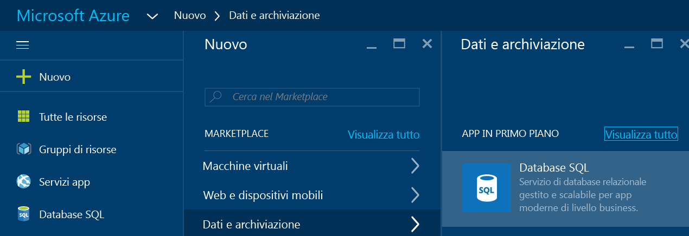

3. Fare clic su **Database SQL** per aprire il relativo pannello. Il contenuto del pannello Database SQL varia a seconda del numero di sottoscrizioni e di oggetti esistenti, ad esempio i server.

    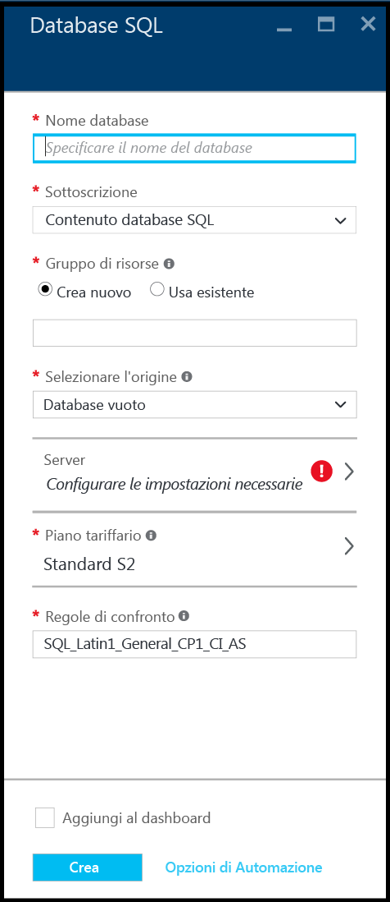

4. Nella casella di testo **Nome database** specificare un nome per il primo database, ad esempio "database-personale". Un segno di spunta verde indica che è stato specificato un nome valido.

    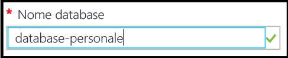

5. Se sono disponibili più sottoscrizioni, selezionarne una.
6. In **Gruppo di risorse** fare clic su **Crea nuovo** e specificare un nome per il primo gruppo di risorse, ad esempio "gruppo-di-risorse-personale". Un segno di spunta verde indica che è stato specificato un nome valido.

    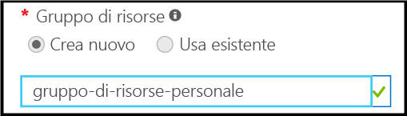

7. In **Selezionare l'origine** fare clic su **Esempio** e quindi in **Selezionare l'esempio** fare clic su **AdventureWorksLT [V12]**.

    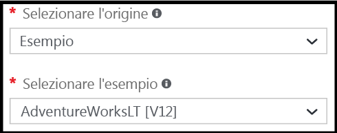

8. In **Server** fare clic su **Configurare le impostazioni necessarie**.

    

9. Nel pannello Server fare clic su **Crea un nuovo server**. Verrà creato un database SQL di Azure all'interno di un oggetto server, che può essere un nuovo server o un server esistente.

    

10. Esaminare il pannello **Nuovo server** per sapere quali informazioni è necessario fornire per il nuovo server.

    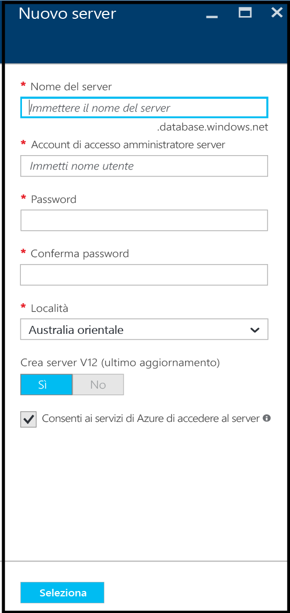

11. Nella casella di testo **Nome del server** specificare un nome per il server, ad esempio "nuovo-oggetto-server-personale". Un segno di spunta verde indica che è stato specificato un nome valido.

    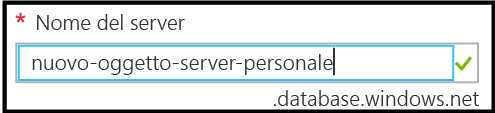
 
12. In **Account di accesso amministratore server** specificare un nome utente per l'account di accesso amministratore per questo server, ad esempio "account-amministratore-personale". Questo è noto come account di accesso dell'entità server. Un segno di spunta verde indica che è stato specificato un nome valido.

    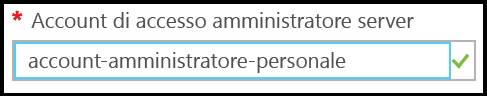

13. In **Password** e **Conferma password** specificare una password per l'account di accesso dell'entità server, ad esempio "p@ssw0rd1". Un segno di spunta verde indica che è stata specificata una password valida.

    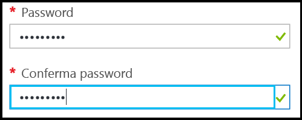
 
14. In **Località** selezionare un data center adatto alla propria località, ad esempio "Australia orientale".

    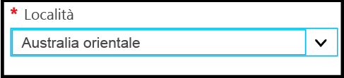

15. Si noti che **Crea server V12 (ultimo aggiornamento) offre soltanto la possibilità di creare una versione corrente del server SQL Azure.

    

16. Si noti che, per impostazione predefinita, la casella di controllo **Consenti ai servizi di Azure di accedere al server** è selezionata e non può essere modificata da qui. Si tratta di un'opzione avanzata. Per modificarla è possibile usare le impostazioni firewall del server per l'oggetto server, anche se nella maggior parte degli scenari non è necessario.

    

17. Nel pannello Nuovo server rivedere le selezioni effettuate e quindi fare clic su **Seleziona** per scegliere il nuovo server per il nuovo database.

    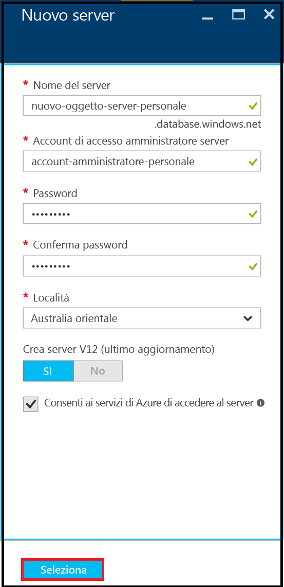

18. In **Piano tariffario** nel pannello Database SQL fare clic su **Standard S2** e quindi su **Basic** per scegliere il piano tariffario meno costoso per il primo database. È comunque possibile modificare il piano tariffario in un secondo momento.

    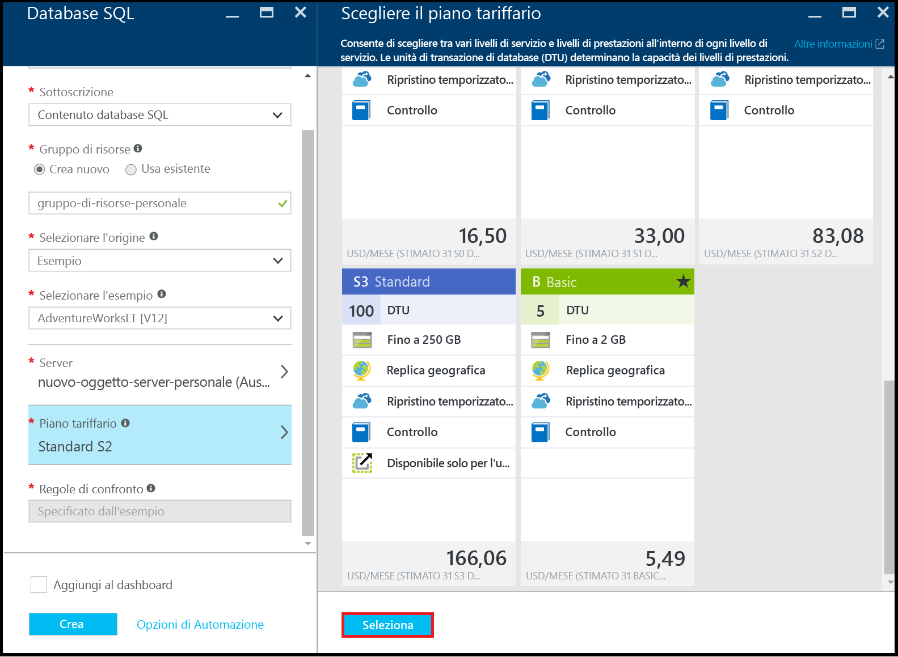

19. Nel pannello Database SQL rivedere le selezioni effettuate e quindi fare clic su **Crea** per creare il primo server e il primo database. I valori specificati vengono convalidati e viene avviata la distribuzione.

    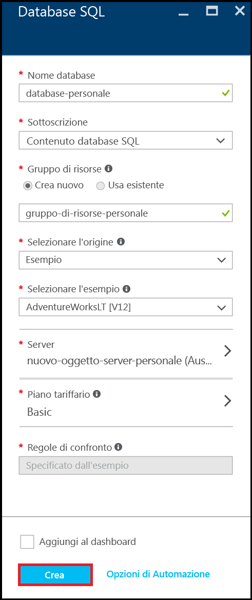

20. Sulla barra degli strumenti del portale fare clic sull'icona delle **Notifiche** per controllare lo stato della distribuzione.

    

>[AZURE.IMPORTANT]Al termine della distribuzione, il nuovo server SQL Azure e il database vengono creati in Azure. Per connettersi al nuovo server o database con gli strumenti di SQL Server è necessario creare una regola firewall del server per aprire il firewall del database SQL alle connessioni provenienti dall'esterno di Azure.

[AZURE.INCLUDE [Creare una regola firewall del server](../../includes/sql-database-create-new-server-firewall-portal.md)]

## Passaggi successivi
Al termine dell'esercitazione sul database SQL e dopo aver creato un database con alcuni dati di esempio, è possibile iniziare l'esplorazione con gli strumenti preferiti.

- Se si ha familiarità con Transact-SQL e SQL Server Management Studio (SSMS), vedere [Connettersi al database SQL con SQL Server Management Studio ed eseguire una query T-SQL di esempio](sql-database-connect-query-ssms.md).

- Se si ha familiarità con Excel, vedere l'esercitazione [Connettere Excel a un database SQL di Azure e creare un report](sql-database-connect-excel.md).

- Se si è pronti per iniziare a scrivere codice, scegliere il linguaggio di programmazione in [Raccolte di connessioni per database SQL e SQL Server](sql-database-libraries.md).

- Per spostare i database SQL Server locali in Azure, vedere [Migrazione di un database SQL Server al database SQL nel cloud](sql-database-cloud-migrate.md).

- Per caricare alcuni dati in una nuova tabella da un file CSV usando lo strumento da riga di comando BCP, vedere [Caricare dati da CSV in Azure SQL Data Warehouse (file flat)](sql-database-load-from-csv-with-bcp.md).

- Per informazioni sulla sicurezza del database SQL di Azure, vedere l'[introduzione alla sicurezza](sql-database-get-started-security.md).

## Risorse aggiuntive

[Informazioni sul database SQL](sql-database-technical-overview.md)

<!---HONumber=AcomDC_0914_2016-->