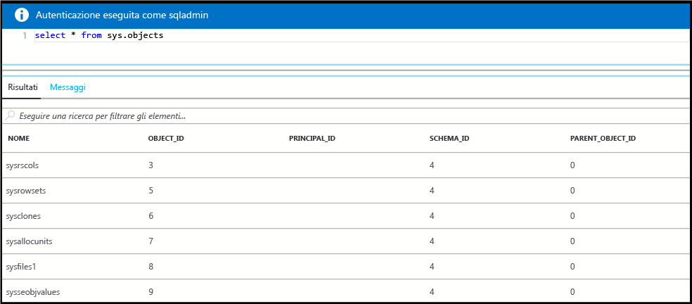

# <a name="create-and-query-a-single-azure-sql-database-in-the-azure-portal"></a>Creare ed effettuare una query su un singolo database SQL di Azure nel portale di Azure

È possibile creare database SQL di Azure tramite il portale di Azure. Questo metodo fornisce un'interfaccia utente basata sul browser per la creazione e la configurazione dei database SQL di Azure e di tutte le risorse di Azure correlate.

## <a name="log-in-to-the-azure-portal"></a>Accedere al Portale di Azure.

Accedere al [Portale di Azure](https://portal.azure.com/).

## <a name="create-a-sql-database"></a>Creazione di un database SQL

Un database SQL di Azure viene creato in un gruppo di risorse di Azure, su un server logico e con un set definito di risorse di archiviazione e di calcolo. Seguire questi passaggi per creare un database SQL contenente i dati di esempio di Adventure Works LT. 

1. Fare clic sul pulsante **Nuovo** nell'angolo superiore sinistro del portale di Azure.

2. Selezionare **Database** nel pannello **Nuovo** e selezionare **Database SQL** nel pannello **Database**.

3. Compilare il modulo Database SQL con le informazioni obbligatorie: 
   - Nome database: specificare un nome per il database
   - Sottoscrizione: selezionare la sottoscrizione
   - Gruppo di risorse: selezionarne uno nuovo o esistente
   - Origine: selezionare **Sample (AdventureWorksLT)**
   - Server: creare un nuovo server (**Server** deve essere un nome univoco globale)
   - Pool elastico: selezionare **Non ora** per questa guida introduttiva
   - Piano tariffario: selezionare **20 DTU** e **250** GB di memoria
   - Regole di confronto: non è possibile modificare questo valore quando si importa il database di esempio 
   - Aggiungi al dashboard: selezionare questa casella di controllo

      

4. Al termine, fare clic su **Crea**. Il provisioning richiede alcuni minuti.
5. Al termine della distribuzione del database SQL, selezionare i **database SQL** nel dashboard oppure scegliendo **Database SQL** dal menu a sinistra e fare clic sul nuovo database nella pagina **Database SQL**. Si apre una pagina di panoramica per il database che visualizza il nome completo del server (ad esempio, **mynewserver20170313.database.windows.net**) e fornisce altre opzioni di configurazione.

       

## <a name="create-a-server-level-firewall-rule"></a>Creare una regola del firewall a livello di server

Il servizio Database SQL crea un firewall che impedisce alle applicazioni e agli strumenti esterni di connettersi al nuovo server e al nuovo database. Seguire questi passaggi per creare una regola del firewall a livello di server di database SQL per l'indirizzo IP per poter abilitare la connettività esterna tramite il firewall del database SQL. 

1. Fare clic su **Imposta firewall server** sulla barra degli strumenti del database. Si apre la pagina **Impostazioni del firewall** per il server del database SQL. 

       

2. Fare clic su **Aggiungi IP client** sulla barra degli strumenti e fare clic su **Salva**. Una regola del firewall a livello di server viene creata per l'indirizzo IP corrente.

3. Fare clic su **OK** e quindi sulla **X** per chiudere la pagina Impostazioni del firewall.

È ora possibile connettersi al database e al server usando SQL Server Management Studio o un altro strumento di propria scelta.

## <a name="query-the-sql-database"></a>Effettuare una query sul database SQL

Seguire questi passaggi per effettuare una query sul database usando l'editor di query nel portale di Azure. 

1. Nella pagina Database SQL del database fare clic su **Strumenti** sulla barra degli strumenti. Si apre la pagina di anteprima **Editor di query**.

      

2. Fare clic su **Editor di query (anteprima)**, fare clic sulla casella di controllo **Condizioni per l'anteprima** e quindi su **OK**. Si apre l'editor di query.

3. Fare clic su **Accedi** e quindi, quando viene richiesto, selezionare **Autenticazione di SQL Server** e infine immettere l'account e la password di accesso amministratore server.
4. Fare clic su **OK** per accedere.

5. Dopo l'autenticazione, nella finestra di query digitare una query di propria scelta, ad esempio la query seguente:

   ```
   SELECT pc.Name as CategoryName, p.name as ProductName
   FROM SalesLT.ProductCategory pc
   JOIN SalesLT.Product p
   ON pc.productcategoryid = p.productcategoryid;
   ```

6. Fare clic su **Esegui** e quindi esaminare i risultati della query nel riquadro **Risultati**.

    

7. Fare clic sulla **X** per chiudere la pagina Editor di query.

## <a name="clean-up-resources"></a>Pulire le risorse

È possibile scegliere di salvare le risorse create in questa guida introduttiva per le esercitazioni successive. È anche possibile usare i passaggi seguenti per eliminare tutte le risorse create da questa a guida introduttiva nel portale di Azure.

1. Scegliere **Gruppi di risorse** dal menu a sinistra del portale di Azure e quindi fare clic su **myResourceGroup**. 
2. Nella pagina del gruppo di risorse fare clic su **Elimina**, digitare **myResourceGroup** nella casella di testo e quindi fare clic su **Elimina**.

## <a name="next-steps"></a>Passaggi successivi

- Per connettersi ed effettuare una query usando SQL Server Management Studio, vedere [Connettersi ed eseguire una query con SSMS](sql-database-connect-query-ssms.md)
- Per connettersi usando Visual Studio, vedere [Connettersi ed eseguire query con Visual Studio](sql-database-connect-query.md).
- Per una panoramica tecnica del database SQL, vedere [Informazioni sul servizio di database SQL](sql-database-technical-overview.md).

