# <a name="configure-and-restore-from-azure-sql-database-long-term-backup-retention"></a>Configurare e ripristinare dalla conservazione dei backup a lungo termine del database SQL di Azure

È possibile configurare l'insieme di credenziali di Servizi di ripristino di Azure per archiviare i backup del database SQL di Azure e quindi ripristinare un database tramite backup conservati nell'insieme di credenziali usando il portale di Azure o PowerShell.

## <a name="azure-portal"></a>Portale di Azure

Nelle sezioni seguenti viene illustrato come usare il portale di Azure per configurare l'insieme di credenziali di Servizi di ripristino di Azure, visualizzare i backup nell'insieme di credenziali ed eseguire il ripristino dall'insieme di credenziali.

### <a name="configure-the-vault-register-the-server-and-select-databases"></a>Configurare l'insieme di credenziali, registrare il server e selezionare i database

Si [configurerà un insieme di credenziali di Servizi di ripristino di Azure per conservare i backup automatici](sql-database-long-term-retention.md) per un periodo più lungo rispetto al periodo di conservazione associato al livello di servizio. 

1. Aprire la pagina **SQL Server** per il server in uso.

   

2. Fare clic su **Conservazione backup a lungo termine**.

   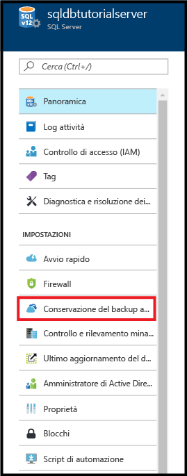

3. Nella pagina **Conservazione backup a lungo termine** del server in uso leggere e accettare le condizioni preliminari (se non sono già state accettate o se questa funzionalità non è più in versione di anteprima).

   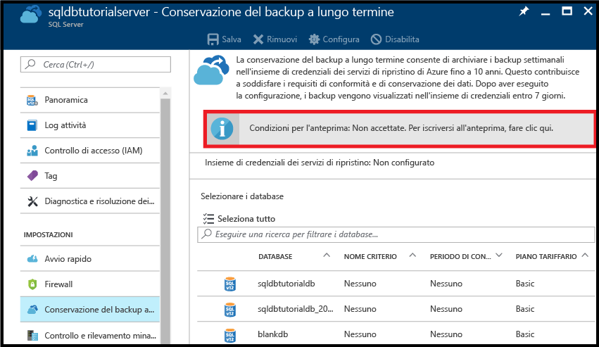

4. Per configurare la conservazione a lungo termine dei backup, selezionare il database nella griglia e quindi fare clic su **Configura** sulla barra degli strumenti.

   

5. Nella pagina **Configura** fare clic su **Configurare le impostazioni necessarie** in **Insieme di credenziali di Servizi di ripristino**.

   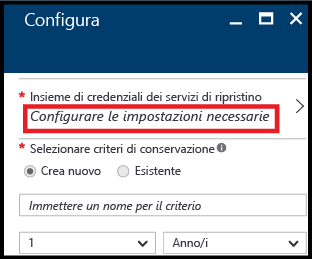

6. Nella pagina **Insieme di credenziali di Servizi di ripristino** selezionare un insieme di credenziali esistente, se disponibile. In caso contrario, se per la propria sottoscrizione non è presente alcun insieme di credenziali dei servizi di ripristino, fare clic per chiudere il flusso e creare un insieme di credenziali dei servizi di ripristino.

   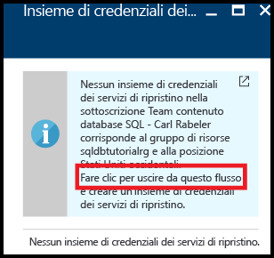

7. Nella pagina **Insiemi di credenziali dei servizi di ripristino** fare clic su **Aggiungi**.

   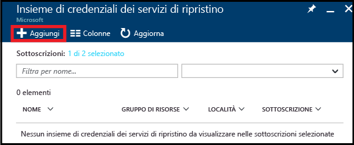
   
8. Nella pagina **Insieme di credenziali di Servizi di ripristino** specificare un nome valido per l'insieme di credenziali di Servizi di ripristino.

   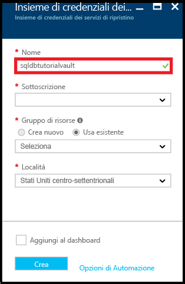

9. Selezionare la propria sottoscrizione e il relativo gruppo di risorse e quindi specificare il percorso per l'insieme di credenziali. Al termine, fare clic su **Crea**.

   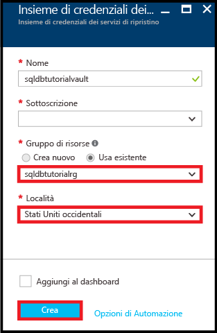

   > [!IMPORTANT]
   > L'insieme di credenziali deve trovarsi nella stessa area del server logico di Azure SQL e deve usare lo stesso gruppo di risorse del server logico.
   >

10. Dopo aver creato il nuovo insieme di credenziali, eseguire i passaggi necessari per tornare alla pagina **Insieme di credenziali di Servizi di ripristino**.

11. Nella pagina **Insieme di credenziali di Servizi di ripristino** fare clic sull'insieme di credenziali e quindi su **Seleziona**.

   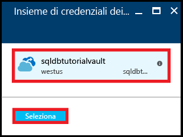

12. Nella pagina **Configura** specificare un nome valido per i nuovi criteri di conservazione, modificare i criteri di conservazione predefiniti in base alle esigenze e quindi fare clic su **OK**.

   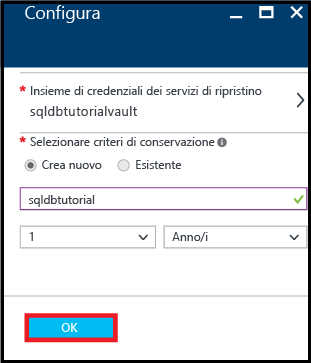
   
   >[!NOTE]
   >I nomi dei criteri di conservazione non consentono determinati caratteri, inclusi gli spazi.

13. Nella pagina **Conservazione backup a lungo termine** del database in uso fare clic su **Salva** e quindi su **OK** per applicare i criteri di conservazione dei backup a lungo termine a tutti i database selezionati.

   

14. Fare clic su **Salva** per abilitare la conservazione dei backup a lungo termine usando i nuovi criteri per l'insieme di credenziali di Servizi di ripristino di Azure appena configurato.

   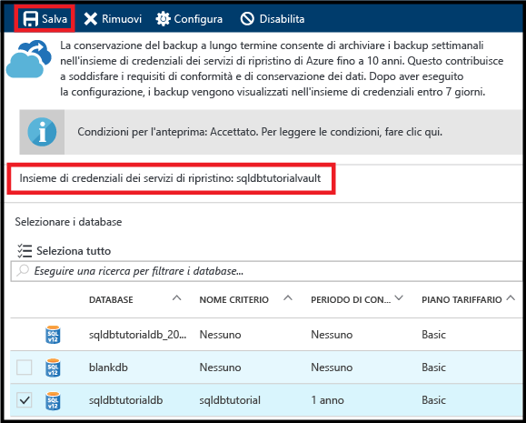

> [!IMPORTANT]
> Dopo essere stati configurati, i backup verranno visualizzati nell'insieme di credenziali entro i successivi sette giorni. Non continuare questa esercitazione finché i backup non verranno visualizzati nell'insieme di credenziali.
>

### <a name="view-backups-in-long-term-retention-using-azure-portal"></a>Visualizzare i backup nella conservazione a lungo termine con il portale di Azure

Visualizzare informazioni sui backup del database nella [conservazione backup a lungo termine](sql-database-long-term-retention.md). 

1. Nel portale di Azure aprire l'insieme di credenziali di Servizi di ripristino di Azure per i backup del database (andare a **Tutte le risorse** e selezionarlo dall'elenco delle risorse correlate alla sottoscrizione) per visualizzare la quantità di spazio di archiviazione usata dai backup del database nell'insieme di credenziali.

   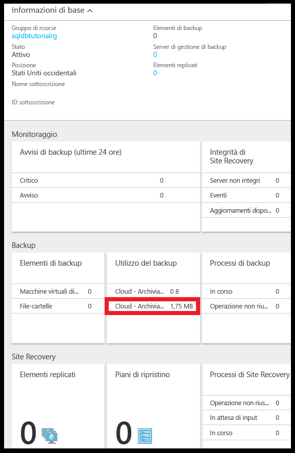

2. Aprire la pagina **Database SQL** per il database.

   

3. Sulla barra degli strumenti fare clic su **Ripristina**.

   

4. Nella pagina Ripristina fare clic su **A lungo termine**.

5. Nei backup dell'insieme di credenziali di Azure fare clic su **Selezionare un backup** per visualizzare i backup di database disponibili nella conservazione dei backup a lungo termine.

   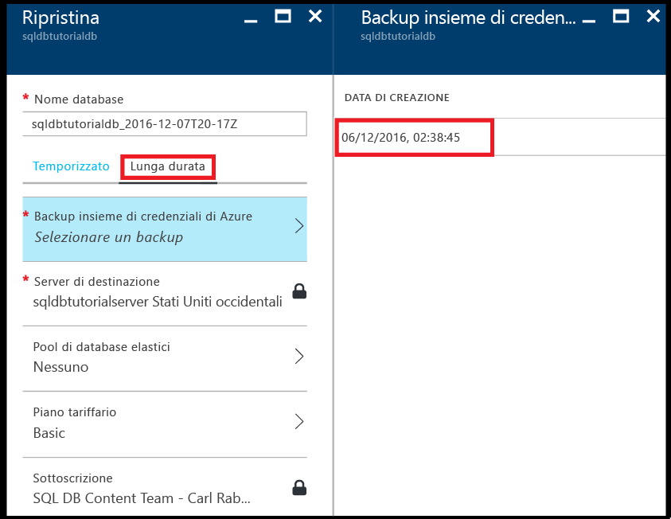

### <a name="restore-a-database-from-a-backup-in-long-term-backup-retention-using-the-azure-portal"></a>Ripristinare un database da un backup nella conservazione backup a lungo termine con il portale di Azure

È possibile ripristinare il database a un nuovo database ricavato da un backup nell'insieme di credenziali di Servizi di ripristino di Azure.

1. Nella pagina **Backup degli insiemi di credenziali di Azure** fare clic sul backup da ripristinare e quindi su **Seleziona**.

   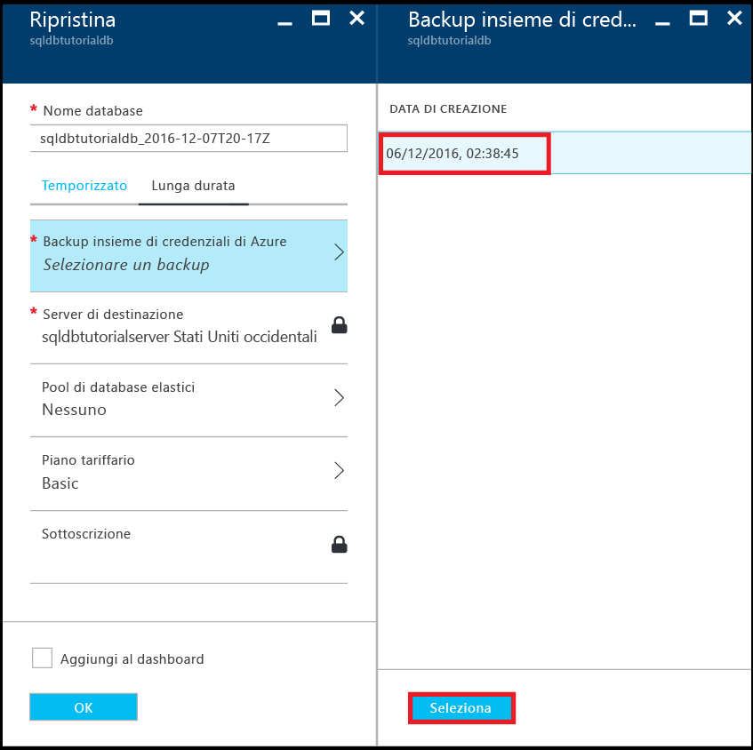

2. Nella casella di testo **Nome database** immettere un nome per il database ripristinato.

   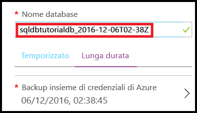

3. Fare clic su **OK** per ripristinare il database dal backup presente nell'insieme di credenziali al nuovo database.

4. Sulla barra degli strumenti fare clic sull'icona di notifica per visualizzare lo stato del processo di ripristino.

   

5. Al termine del processo di ripristino, aprire la pagina **Database SQL** per visualizzare il database appena ripristinato.

   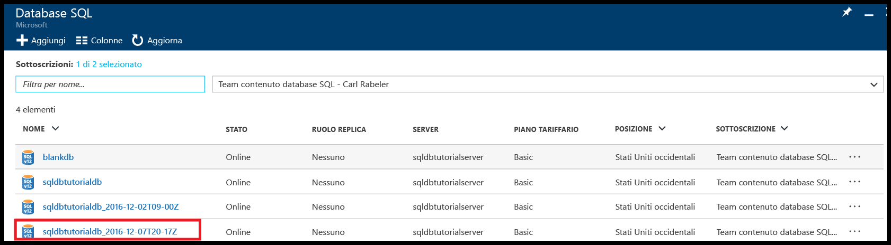

> [!NOTE]
> A questo punto è possibile connettersi al database ripristinato usando SQL Server Management Studio per eseguire le attività necessarie, ad esempio per [estrarre un bit di dati dal database ripristinato da copiare nel database esistente o per eliminare il database esistente e rinominare il database ripristinato con il nome del database esistente](sql-database-recovery-using-backups.md#point-in-time-restore).
>

## <a name="powershell"></a>PowerShell

Nelle sezioni seguenti viene illustrato come usare PowerShell per configurare l'insieme di credenziali di Servizi di ripristino di Azure, visualizzare i backup nell'insieme di credenziali ed eseguire il ripristino dall'insieme di credenziali.

### <a name="create-a-recovery-services-vault"></a>Creare un insieme di credenziali dei servizi di ripristino

Usare [New-AzureRmRecoveryServicesVault](/powershell/module/azurerm.recoveryservices/new-azurermrecoveryservicesvault) per creare un nuovo insieme di credenziali dei servizi di ripristino.

> [!IMPORTANT]
> L'insieme di credenziali deve trovarsi nella stessa area del server logico di Azure SQL e deve usare lo stesso gruppo di risorse del server logico.

```PowerShell
# Create a recovery services vault

#$resourceGroupName = "{resource-group-name}"
#$serverName = "{server-name}"
$serverLocation = (Get-AzureRmSqlServer -ServerName $serverName -ResourceGroupName $resourceGroupName).Location
$recoveryServiceVaultName = "{new-vault-name}"

$vault = New-AzureRmRecoveryServicesVault -Name $recoveryServiceVaultName -ResourceGroupName $ResourceGroupName -Location $serverLocation 
Set-AzureRmRecoveryServicesBackupProperties -BackupStorageRedundancy LocallyRedundant -Vault $vault
```

### <a name="set-your-server-to-use-the-recovery-vault-for-its-long-term-retention-backups"></a>Impostare il server per usare l'insieme di credenziali di ripristino per i backup con conservazione a lungo termine

Usare il cmdlet [Set-AzureRmSqlServerBackupLongTermRetentionVault](/powershell/module/azurerm.sql/set-azurermsqlserverbackuplongtermretentionvault) per associare un insieme di credenziali dei servizi di ripristino creato in precedenza a un server di Azure SQL specifico.

```PowerShell
# Set your server to use the vault to for long-term backup retention 

Set-AzureRmSqlServerBackupLongTermRetentionVault -ResourceGroupName $resourceGroupName -ServerName $serverName -ResourceId $vault.Id
```

### <a name="create-a-retention-policy"></a>Creare un criterio di conservazione

Un criterio di conservazione consente di impostare per quanto tempo mantenere il backup di un database. Usare il cmdlet [Get-AzureRmRecoveryServicesBackupRetentionPolicyObject](https://docs.microsoft.com/powershell/resourcemanager/azurerm.recoveryservices.backup/v2.3.0/get-azurermrecoveryservicesbackupretentionpolicyobject) per ottenere il criterio di conservazione predefinito usato come modello per la creazione di criteri. In questo modello il periodo di conservazione è di 2 anni. Eseguire quindi [New-AzureRmRecoveryServicesBackupProtectionPolicy](/powershell/module/azurerm.recoveryservices.backup/new-azurermrecoveryservicesbackupprotectionpolicy) per creare i criteri. 

> [!NOTE]
> Per alcuni cmdlet è necessario impostare il contesto dell'insieme di credenziali prima dell'esecuzione ([Set-AzureRmRecoveryServicesVaultContext](/powershell/module/azurerm.recoveryservices/set-azurermrecoveryservicesvaultcontext)), pertanto questo cmdlet è presente in alcuni frammenti correlati. Il contesto viene impostato perché i criteri fanno parte dell'insieme di credenziali. È possibile creare più criteri di conservazione per ogni insieme di credenziali e quindi applicare il criterio desiderato a database specifici. 


```PowerShell
# Retrieve the default retention policy for the AzureSQLDatabase workload type
$retentionPolicy = Get-AzureRmRecoveryServicesBackupRetentionPolicyObject -WorkloadType AzureSQLDatabase

# Set the retention value to two years (you can set to any time between 1 week and 10 years)
$retentionPolicy.RetentionDurationType = "Years"
$retentionPolicy.RetentionCount = 2
$retentionPolicyName = "my2YearRetentionPolicy"

# Set the vault context to the vault you are creating the policy for
Set-AzureRmRecoveryServicesVaultContext -Vault $vault

# Create the new policy
$policy = New-AzureRmRecoveryServicesBackupProtectionPolicy -name $retentionPolicyName -WorkloadType AzureSQLDatabase -retentionPolicy $retentionPolicy
$policy
```

### <a name="configure-a-database-to-use-the-previously-defined-retention-policy"></a>Configurare un database per usare il criterio di conservazione definito prima

Usare il cmdlet [Set-AzureRmSqlDatabaseBackupLongTermRetentionPolicy](/powershell/module/azurerm.sql/set-azurermsqldatabasebackuplongtermretentionpolicy) per applicare i nuovi criteri a un database specifico.

```PowerShell
# Enable long-term retention for a specific SQL database
$policyState = "enabled"
Set-AzureRmSqlDatabaseBackupLongTermRetentionPolicy -ResourceGroupName $resourceGroupName -ServerName $serverName -DatabaseName $databaseName -State $policyState -ResourceId $policy.Id
```

### <a name="view-backup-info-and-backups-in-long-term-retention"></a>Visualizzare le informazioni sui backup e i backup nella conservazione a lungo termine

Visualizzare informazioni sui backup del database nella [conservazione backup a lungo termine](sql-database-long-term-retention.md). 

Usare i cmdlet seguenti per visualizzare le informazioni di backup:

- [Get-AzureRmRecoveryServicesBackupContainer](/powershell/module/azurerm.recoveryservices.backup/get-azurermrecoveryservicesbackupcontainer)
- [Get-AzureRmRecoveryServicesBackupItem](/powershell/module/azurerm.recoveryservices.backup/get-azurermrecoveryservicesbackupitem)
- [Get-AzureRmRecoveryServicesBackupRecoveryPoint](/powershell/module/azurerm.recoveryservices.backup/get-azurermrecoveryservicesbackuprecoverypoint)

```PowerShell
#$resourceGroupName = "{resource-group-name}"
#$serverName = "{server-name}"
$databaseNeedingRestore = $databaseName

# Set the vault context to the vault we want to restore from
#$vault = Get-AzureRmRecoveryServicesVault -ResourceGroupName $resourceGroupName
Set-AzureRmRecoveryServicesVaultContext -Vault $vault

# the following commands find the container associated with the server 'myserver' under resource group 'myresourcegroup'
$container = Get-AzureRmRecoveryServicesBackupContainer -ContainerType AzureSQL -FriendlyName $vault.Name

# Get the long-term retention metadata associated with a specific database
$item = Get-AzureRmRecoveryServicesBackupItem -Container $container -WorkloadType AzureSQLDatabase -Name $databaseNeedingRestore

# Get all available backups for the previously indicated database
# Optionally, set the -StartDate and -EndDate parameters to return backups within a specific time period
$availableBackups = Get-AzureRmRecoveryServicesBackupRecoveryPoint -Item $item
$availableBackups
```

### <a name="restore-a-database-from-a-backup-in-long-term-backup-retention"></a>Ripristinare un database da un backup nella conservazione dei backup a lungo termine

Il ripristino dalla conservazione backup a lungo termine usa il cmdlet [Restore-AzureRmSqlDatabase](/powershell/module/azurerm.sql/restore-azurermsqldatabase).

```PowerShell
# Restore the most recent backup: $availableBackups[0]
#$resourceGroupName = "{resource-group-name}"
#$serverName = "{server-name}"
$restoredDatabaseName = "{new-database-name}"
$edition = "Basic"
$performanceLevel = "Basic"

$restoredDb = Restore-AzureRmSqlDatabase -FromLongTermRetentionBackup -ResourceId $availableBackups[0].Id -ResourceGroupName $resourceGroupName `
 -ServerName $serverName -TargetDatabaseName $restoredDatabaseName -Edition $edition -ServiceObjectiveName $performanceLevel
$restoredDb
```


> [!NOTE]
> A questo punto è possibile connettersi al database ripristinato usando SQL Server Management Studio per eseguire le attività necessarie, ad esempio per estrarre un bit di dati dal database ripristinato da copiare nel database esistente o per eliminare il database esistente e rinominare il database ripristinato con il nome del database esistente. Vedere [ripristino temporizzato](sql-database-recovery-using-backups.md#point-in-time-restore).

## <a name="next-steps"></a>Passaggi successivi

- Per informazioni sui backup automatici generati dal servizio, vedere l'articolo relativo ai [backup automatici](sql-database-automated-backups.md)
- Per altre informazioni sulla conservazione dei backup a lungo termine, vedere [conservazione dei backup a lungo termine](sql-database-long-term-retention.md)
- Per altre informazioni sul ripristino da backup, vedere [ripristino dal backup](sql-database-recovery-using-backups.md)
