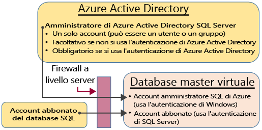
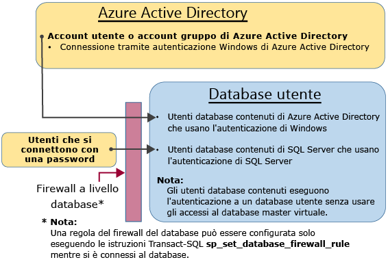

# <a name="controlling-and-granting-database-access"></a>Controllo e concessione dell'accesso al database

È possibile concedere l'accesso agli utenti autenticati usando alcuni meccanismi diversi. 

## <a name="unrestricted-administrative-accounts"></a>Account amministrativi senza restrizioni
Esistono due possibili account amministrativi con autorizzazioni senza restrizioni per l'accesso al database master virtuale e a tutti i database utente. Tali account sono denominati account di entità di livello server.

### <a name="azure-sql-database-subscriber-account"></a>Account sottoscrittore del database SQL di Azure
Il database SQL crea un singolo account di accesso nel database master quando viene creata un'istanza logica di SQL. Questo account viene a volte definito account sottoscrittore del database SQL. Tale account, che effettua la connessione con l'autenticazione di SQL Server (nome utente e password), è un amministratore nell'istanza logica del server e in tutti i database utente collegati a tale istanza. Le autorizzazioni dell'account sottoscrittore non possono essere soggette a restrizioni. Può esistere un solo account di questo tipo.

### <a name="azure-active-directory-administrator"></a>Amministratore di Azure Active Directory
È possibile configurare come amministratore anche un account singolo o di gruppo di Azure Active Directory. La configurazione di un amministratore di Azure AD è facoltativa, ma è necessaria se si vuole usare gli account di Azure AD per la connessione al database SQL. Per altre informazioni sulla configurazione dell'accesso con Azure Active Directory, vedere [Connessione al database SQL oppure a SQL Data Warehouse con l'autenticazione di Azure Active Directory](sql-database-aad-authentication.md) e [Supporto di SSMS per l'autenticazione MFA di Azure AD con database SQL e SQL Data Warehouse](sql-database-ssms-mfa-authentication.md).

### <a name="configuring-the-firewall"></a>Configurazione del firewall
Quando è configurato un firewall a livello di server per un singolo indirizzo IP o per un intervallo di indirizzi IP, l'account sottoscrittore del database SQL di Azure e l'account di Azure Active Directory possono connettersi al database master e a tutti i database utente. Il firewall iniziale a livello di server può essere configurato tramite il [portale di Azure](sql-database-configure-firewall-settings.md), usando [PowerShell](sql-database-configure-firewall-settings-powershell.md) o l'[API REST](sql-database-configure-firewall-settings-rest.md). Dopo che è stata stabilita una connessione, è possibile configurare anche regole aggiuntive del firewall a livello di server con l'istruzione [Transact-SQL](sql-database-configure-firewall-settings-tsql.md).

### <a name="administrator-access-path"></a>Percorso di accesso degli amministratori
Quando il firewall a livello di server è configurato correttamente, l'account sottoscrittore del database SQL e gli amministratori di SQL Server di Azure Active Directory possono connettersi usando strumenti client come SQL Server Management Studio o SQL Server Data Tools. Solo gli strumenti più recenti offrono tutte le caratteristiche e le funzionalità. Il diagramma seguente illustra una configurazione tipica per i due account amministratore.



Quando viene usata una porta aperta nel firewall a livello di server, gli amministratori possono connettersi a qualsiasi database SQL.

### <a name="connecting-to-a-database-by-using-sql-server-management-studio"></a>Connettersi a un database con SQL Server Management Studio
Per una procedura dettagliata sulla creazione di un server, un database, regole del firewall a livello di server e sull'uso di SQL Server Management Studio per eseguire query in un database, vedere [Introduzione ai server del database SQL di Azure, ai database e alle regole del firewall usando il portale di Azure ed SQL Server Management Studio](sql-database-get-started.md).

> [!IMPORTANT]
> È consigliabile usare sempre la versione più aggiornata di Management Studio per restare sincronizzati con gli aggiornamenti di Microsoft Azure e del database SQL. [Aggiornare SQL Server Management Studio](https://msdn.microsoft.com/library/mt238290.aspx).
> 
> 

## <a name="additional-server-level-administrative-roles"></a>Ruoli amministrativi aggiuntivi a livello di server
Oltre ai ruoli amministrativi a livello di server illustrati in precedenza, il database SQL offre due ruoli amministrativi con restrizioni nel database master virtuale, a cui è possibile aggiungere account utente che concedono autorizzazioni per la creazione di database o la gestione degli accessi.

### <a name="database-creators"></a>Autori di database
Uno di questi ruoli amministrativi è il ruolo dbmanager. I membri di questo ruolo possono creare nuovi database. Per usare questo ruolo, creare un utente nel database master e quindi aggiungere l'utente al ruolo **dbmanager** del database. L'utente può essere un utente di database indipendente oppure un utente basato su un account di accesso di SQL Server nel database master virtuale.

1. Connettersi al database master virtuale usando un account amministratore.
2. Passaggio facoltativo: creare un account di accesso con autenticazione di SQL Server con l'istruzione [CREATE LOGIN](https://msdn.microsoft.com/library/ms189751.aspx) . Istruzione di esempio:
   
   ```
   CREATE LOGIN Mary WITH PASSWORD = '<strong_password>';
   ```
   
   > [!NOTE]
   > Quando si crea un account di accesso o un utente di database indipendente, usare una password complessa. Per ulteriori informazioni, vedere [Password complesse](https://msdn.microsoft.com/library/ms161962.aspx).
   > 
   > 
   
   Per migliorare le prestazioni, gli account di accesso (entità a livello di server) vengono temporaneamente memorizzati nella cache a livello di database. Per aggiornare la cache di autenticazione, vedere [DBCC FLUSHAUTHCACHE](https://msdn.microsoft.com/library/mt627793.aspx).
3. Nel database master virtuale creare un utente con l'istruzione [CREATE USER](https://msdn.microsoft.com/library/ms173463.aspx) . L'utente può essere un utente di database indipendente con autenticazione di Azure Active Directory (se l'ambiente è stato configurato per l'autenticazione di Azure AD), un utente di database indipendente con autenticazione di SQL Server oppure un utente con autenticazione di SQL Server basato su un account di accesso con autenticazione di SQL Server (creato nel passaggio precedente). Istruzioni di esempio:
   
   ```
   CREATE USER [mike@contoso.com] FROM EXTERNAL PROVIDER;
   CREATE USER Tran WITH PASSWORD = '<strong_password>';
   CREATE USER Mary FROM LOGIN Mary; 
   ```
4. Aggiungere il nuovo utente al ruolo del database **dbmanager** con l'istruzione [ALTER ROLE](https://msdn.microsoft.com/library/ms189775.aspx) . Istruzioni di esempio:
   
   ```
   ALTER ROLE dbmanager ADD MEMBER Mary; 
   ALTER ROLE dbmanager ADD MEMBER [mike@contoso.com];
   ```
   
   > [!NOTE]
   > Poiché dbmanager è un ruolo del database nel database master virtuale, è possibile aggiungere solo un utente al ruolo dbmanager. Non si può aggiungere un account di accesso a livello di server a un ruolo a livello di database.
   > 
   > 
5. Se necessario, configurare il firewall a livello di server in modo da consentire la connessione del nuovo utente.

L'utente potrà così connettersi al database master virtuale e creare nuovi database. L'account che crea il database ne diventa il proprietario.

### <a name="login-managers"></a>Gestione degli account di accesso
L'altro ruolo amministrativo è il ruolo di gestione degli account di accesso. I membri di questo ruolo possono creare nuovi account di accesso nel database master. Se si vuole, è possibile completare la stessa procedura (ovvero creare un account di accesso e aggiungere un utente al ruolo **loginmanager** ) per consentire a un utente di creare nuovi account di accesso nel master virtuale. Di solito non è necessario, perché è consigliabile usare utenti di database indipendente che eseguono l'autenticazione a livello di database anziché utenti basati su account di accesso. Per altre informazioni, vedere [Utenti di database indipendente: rendere portabile un database](https://msdn.microsoft.com/library/ff929188.aspx).

## <a name="non-administrator-users"></a>Utenti non amministratori
In genere, per gli account non amministratore non è necessario l'accesso al database master virtuale. Creare utenti di database indipendente a livello di database con l'istruzione [CREATE USER (Transact-SQL)](https://msdn.microsoft.com/library/ms173463.aspx) . L'utente può essere un utente di database indipendente con autenticazione di Azure Active Directory (se l'ambiente è stato configurato per l'autenticazione di Azure AD), un utente di database indipendente con autenticazione di SQL Server oppure un utente con autenticazione di SQL Server basato su un account di accesso con autenticazione di SQL Server (creato nel passaggio precedente). Per altre informazioni, vedere [Utenti di database indipendente: rendere portabile un database](https://msdn.microsoft.com/library/ff929188.aspx). 

Per creare utenti, connettersi al database ed eseguire istruzioni simili ai seguenti esempi:

```
CREATE USER Mary FROM LOGIN Mary; 
CREATE USER [mike@contoso.com] FROM EXTERNAL PROVIDER;
```

Inizialmente, solo gli amministratori o il proprietario del database possono creare utenti. Per autorizzare utenti aggiuntivi a creare nuovi utenti, concedere all'utente selezionato l'autorizzazione `ALTER ANY USER` con un'istruzione come la seguente:

```
GRANT ALTER ANY USER TO Mary;
```

Per concedere a utenti aggiuntivi il controllo completo del database, rendere tali utenti membri del ruolo predefinito del database **db_owner** con l'istruzione `ALTER ROLE`.

> [!NOTE]
> Il motivo principale per creare utenti di database basati su account di accesso è la presenza di utenti con autenticazione di SQL Server che devono accedere a più database. Gli utenti basati su account di accesso sono associati all'account di accesso, per il quale viene gestita una sola password. Gli utenti di database indipendente in singoli database sono ognuno una singola entità che gestisce una propria password. Questo può creare confusione se gli utenti di database indipendente non usano password identiche.
> 
> 

### <a name="configuring-the-database-level-firewall"></a>Configurazione del firewall a livello di database
Come procedura consigliata, gli utenti non amministratori dovrebbero avere accesso tramite il firewall solo ai database usati. Invece di autorizzarne gli indirizzi IP tramite il firewall a livello di server e concedere loro l'accesso a tutti i database, usare l'istruzione [sp_set_database_firewall_rule](https://msdn.microsoft.com/library/dn270010.aspx) per configurare il firewall a livello di database. Il firewall a livello di database non può essere configurato usando il portale.

### <a name="non-administrator-access-path"></a>Percorso di accesso degli utenti non amministratori
Quando il firewall a livello di database è configurato correttamente, gli utenti di database possono connettersi usando strumenti client come SQL Server Management Studio o SQL Server Data Tools. Solo gli strumenti più recenti offrono tutte le caratteristiche e le funzionalità. Il diagramma seguente illustra un percorso di accesso tipico degli utenti non amministratori.



## <a name="groups-and-roles"></a>Gruppi e ruoli
In una gestione efficiente degli accessi vengono usate autorizzazioni assegnate a gruppi e ruoli anziché singoli utenti. 

- Quando si usa l'autenticazione di Azure Active Directory, inserire gli utenti di Azure Active Directory in un gruppo di Azure Active Directory. Creare un utente di database indipendente per il gruppo. Inserire uno o più utenti di database in un [ruolo del database](https://msdn.microsoft.com/library/ms189121) e quindi assegnare [autorizzazioni](https://msdn.microsoft.com/library/ms191291.aspx) al ruolo del database.

- Quando si usa l'autenticazione di SQL Server, creare utenti di database indipendenti nel database. Inserire uno o più utenti di database in un [ruolo del database](https://msdn.microsoft.com/library/ms189121) e quindi assegnare [autorizzazioni](https://msdn.microsoft.com/library/ms191291.aspx) al ruolo del database.

I ruoli del database possono essere ruoli predefiniti come **db_owner**, **db_ddladmin**, **db_datawriter**, **db_datareader**, **db_denydatawriter** e **db_denydatareader**. Per concedere autorizzazioni complete a un numero limitato di utenti viene usato comunemente **db_owner**. Gli altri ruoli predefiniti del database sono utili per ottenere rapidamente un database semplice nello sviluppo, ma non sono consigliabili per la maggior parte dei database di produzione. Il ruolo predefinito del database **db_datareader**, ad esempio, concede l'accesso in lettura a tutte le tabelle del database, che in genere è più di quanto strettamente necessario. È preferibile usare l'istruzione [CREATE ROLE](https://msdn.microsoft.com/library/ms187936.aspx) per creare ruoli del database definiti dall'utente e concedere con attenzione a ogni ruolo le autorizzazioni minime necessarie per le esigenze aziendali. Quando un utente è membro di più ruoli, vengono aggregate le autorizzazioni di tutti.

## <a name="permissions"></a>Autorizzazioni
Nel database SQL possono essere concesse o negate singolarmente oltre 100 autorizzazioni. Molte di queste autorizzazioni sono annidate. L'autorizzazione `UPDATE` per uno schema, ad esempio, include l'autorizzazione `UPDATE` per ogni tabella all'interno di tale schema. Come nella maggior parte dei sistemi di autorizzazioni, la negazione di un'autorizzazione determina l'override di una concessione. A causa dell'annidamento e del numero delle autorizzazioni, progettare un sistema di autorizzazioni appropriato per proteggere correttamente il database può richiedere un attento studio. Per iniziare, vedere l'elenco di autorizzazioni in [Autorizzazioni (Motore di database)](https://msdn.microsoft.com/library/ms191291.aspx) e la [grafica in formato di poster](http://go.microsoft.com/fwlink/?LinkId=229142) relativa alle autorizzazioni.


### <a name="considerations-and-restrictions"></a>Considerazioni e restrizioni
Quando si gestiscono gli accessi e gli utenti nel database SQL, prendere in considerazione quanto segue:

* È necessario essere connessi al database **master** durante l'esecuzione delle istruzioni ``CREATE/ALTER/DROP DATABASE``. L'utente del database nel database master corrispondente per l'account di accesso dell'entità di livello server non può essere modificato o eliminato. 
* L'inglese americano è la lingua predefinita dell'account di accesso dell'entità a livello di server.
* Soltanto gli amministratori (accesso dell’entità di livello server o amministratore di Azure AD) e i membri del ruolo di database **dbmanager** nel database **master** sono autorizzati a eseguire le istruzioni ``CREATE DATABASE`` e ``DROP DATABASE``.
* È necessario essere connessi al database master durante l'esecuzione delle istruzioni ``CREATE/ALTER/DROP LOGIN`` . È tuttavia sconsigliato l'uso di account di accesso. Usare invece gli utenti del database indipendente.
* Per connettersi a un database utente è necessario specificare il nome del database nella stringa di connessione.
* Soltanto gli utenti con accesso dell’entità di livello server e i membri del ruolo del database **loginmanager** nel database **master** sono autorizzati a eseguire le istruzioni ``CREATE LOGIN``, ``ALTER LOGIN`` e ``DROP LOGIN``.
* Quando si esegue le istruzioni ``CREATE/ALTER/DROP LOGIN`` e ``CREATE/ALTER/DROP DATABASE`` in un'applicazione ADO.NET, non è consentito utilizzare i comandi con parametri. Per ulteriori informazioni, vedere [Comandi e parametri](https://msdn.microsoft.com/library/ms254953.aspx).
* Quando si esegue le istruzioni ``CREATE/ALTER/DROP DATABASE`` e ``CREATE/ALTER/DROP LOGIN``, ognuna di queste istruzioni deve essere l'unica istruzione in un batch Transact-SQL. In caso contrario, si verifica un errore. Ad esempio, il seguente Transact-SQL controlla se il database esiste. Se esiste, un’istruzione ``DROP DATABASE`` viene chiamata per rimuovere il database. Poiché l’istruzione ``DROP DATABASE`` non è l'unica istruzione nel batch, l'esecuzione della seguente istruzione Transact-SQL genera un errore.

```
IF EXISTS (SELECT [name]
           FROM   [sys].[databases]
           WHERE  [name] = N'database_name')
     DROP DATABASE [database_name];
GO
```

* Quando si esegue l’istruzione ``CREATE USER`` con l’opzione ``FOR/FROM LOGIN``, l’istruzione deve essere l'unica in un batch Transact-SQL.
* Quando si esegue l’istruzione ``ALTER USER`` con l’opzione ``WITH LOGIN``, l’istruzione deve essere l'unica in un batch Transact-SQL.
* Per ``CREATE/ALTER/DROP`` un utente richiede l’autorizzazione ``ALTER ANY USER`` per il database.
* Quando il proprietario di un ruolo del database tenta di aggiungere o rimuovere un altro utente del database in o da tale ruolo del database, potrebbe verificarsi il seguente errore: **L’utente o il ruolo 'Name' non esiste nel database.**  Questo errore si verifica perché l'utente non è visibile al proprietario. Per risolvere questo problema, concedere al proprietario del ruolo l’autorizzazione ``VIEW DEFINITION`` per l'utente. 


## <a name="next-steps"></a>Passaggi successivi

- Per altre informazioni sulle regole del firewall, vedere l'articolo sul [firewall del database SQL di Azure](sql-database-firewall-configure.md).
- Per una panoramica di tutte le funzionalità di sicurezza del database SQL, vedere la [panoramica della sicurezza in SQL](sql-database-security-overview.md).
- Per un'esercitazione, vedere [Introduzione alla sicurezza di SQL](sql-database-get-started-security.md)
- Per informazioni sulle viste e sulle stored procedure, vedere [Creazione di viste e stored procedure](https://msdn.microsoft.com/library/ms365311.aspx)
- Per informazioni sulla concessione di accesso a un oggetto di database, vedere [Concessione dell'accesso a un oggetto di database](https://msdn.microsoft.com/library/ms365327.aspx)


<!--HONumber=Jan17_HO1-->


