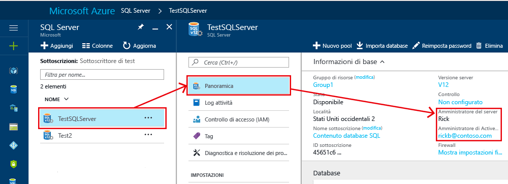

# Autorizzazione dell'accesso al database agli utenti autenticati al database SQL e ad Azure Synapse Analytics tramite account utente e di accesso

In questo articolo vengono fornite informazioni su:In this article, you learn about:

- Opzioni per la configurazione del database SQL di Azure e di Azure Synapse Analytics (in precedenza Azure SQL Data Warehouse) per consentire agli utenti di eseguire attività amministrative e di accedere ai dati archiviati in questi database.
- Configurazione dell'accesso e dell'autorizzazione dopo la creazione iniziale di un nuovo database SQL di AzureThe access and authorization configuration after initially creating a new Azure SQL Database
- Come aggiungere account di accesso e account utente nel database master e gli account utente e quindi concedere a questi account autorizzazioni amministrative
- Come aggiungere account utente nei database utente, associati agli account di accesso o come account utente contenuti
- Configurare gli account utente con autorizzazioni nei database utente utilizzando ruoli del database e autorizzazioni esplicite

> [!IMPORTANT]
> I database nel database SQL di Azure e in Azure Synapse Analytics (in precedenza Azure SQL Data Warehouse) vengono definiti collettivamente nel resto di questo articolo come database o come SQL di Azure (per semplicità).

## Autenticazione e autorizzazione

[**L'autenticazione**](sql-database-security-overview.md#authentication) è il processo di dimostrare all'utente chi dichiara di essere. Un utente si connette a un database utilizzando un account utente.
Quando un utente tenta di connettersi a un database, fornisce un account utente e informazioni di autenticazione. L'utente viene autenticato utilizzando uno dei due metodi di autenticazione seguenti:

- [Autenticazione SQL](https://docs.microsoft.com/sql/relational-databases/security/choose-an-authentication-mode#connecting-through-sql-server-authentication).

  Con questo metodo di autenticazione, l'utente invia un nome di account utente e la password associata per stabilire una connessione. Questa password viene memorizzata nel database master per gli account utente collegati a un account di accesso o archiviata nel database contenente l'account utente per gli account utente non collegati a un account di accesso.
- [Autenticazione di Azure Active Directory](sql-database-aad-authentication.md)

  Con questo metodo di autenticazione, l'utente invia un nome di account utente e richiede che il servizio utilizzi le informazioni sulle credenziali archiviate in Azure Active Directory.With this authentication method, the user submits a user account name and requests that the service use the credential information stored in Azure Active Directory.

**Account di accesso e utenti:** in SQL di Azure, un account utente in un database può essere associato a un account di accesso archiviato nel database master o un nome utente archiviato in un singolo database.

- Un **account di accesso** è un singolo account nel database master, a cui è possibile collegare un account utente in uno o più database. Con un account di accesso, le informazioni sulle credenziali per l'account utente vengono archiviate con l'account di accesso.
- Un **account utente** è un account individuale in qualsiasi database che può essere, ma non deve essere collegato a un login. Con un account utente non collegato a un account di accesso, le informazioni sulle credenziali vengono archiviate con l'account utente.

[**L'autorizzazione**](sql-database-security-overview.md#authorization) per accedere ai dati ed eseguire varie azioni viene gestita utilizzando i ruoli del database e le autorizzazioni esplicite. L'autorizzazione si riferisce alle autorizzazioni assegnate a un utente e determina le operazioni consentite a tale utente. L'autorizzazione è controllata dalle [appartenenze ai ruoli](https://docs.microsoft.com/sql/relational-databases/security/authentication-access/database-level-roles) del database dell'account utente e dalle autorizzazioni a [livello di oggetto.](https://docs.microsoft.com/sql/relational-databases/security/permissions-database-engine) Come procedura consigliata, è opportuno concedere agli utenti i privilegi minimi necessari.

## Account di accesso e account utente esistenti dopo la creazione di un nuovo database

Quando si crea la prima distribuzione sql di Azure, si specifica un account di accesso amministratore e una password associata per tale account di accesso. Questo account amministrativo è denominato **Amministratore server**. Durante la distribuzione si verifica la seguente configurazione di account di accesso e utenti nei database master e utente:

- Viene creato un account di accesso SQL con privilegi amministrativi utilizzando il nome di accesso specificato. Un [account di accesso](https://docs.microsoft.com/sql/relational-databases/security/authentication-access/principals-database-engine#sa-login) è un singolo account utente per l'accesso al database SQL.
- A questo account di accesso vengono concesse autorizzazioni amministrative complete su tutti i database come entità a livello di [server.](https://docs.microsoft.com/sql/relational-databases/security/authentication-access/principals-database-engine) Questo account di accesso dispone di tutte le autorizzazioni disponibili all'interno del database SQL e non può essere limitato. In un'istanza gestita, questo account di accesso viene aggiunto al ruolo predefinito del [server sysadmin](https://docs.microsoft.com/sql/relational-databases/security/authentication-access/server-level-roles) (questo ruolo non esiste con database singoli o in pool).
- Un [account](https://docs.microsoft.com/sql/relational-databases/security/authentication-access/getting-started-with-database-engine-permissions#database-users) `dbo` utente chiamato viene creato per questo account di accesso in ogni database utente. L'utente [dbo](https://docs.microsoft.com/sql/relational-databases/security/authentication-access/principals-database-engine) dispone di tutte le autorizzazioni `db_owner` del database nel database ed è mappato al ruolo predefinito del database. Ulteriori ruoli predefiniti del database vengono illustrati più avanti in questo articolo.

Per identificare gli account amministratore per un database, aprire il portale di Azure e passare alla scheda **Proprietà** del server o dell'istanza gestita.

> [!IMPORTANT]
> Il nome di accesso dell'amministratore non può essere modificato dopo che è stato creato. Per reimpostare la password per l'amministratore del server logico, passare al portale di [Azure](https://portal.azure.com), fare clic su **SQL Server**, selezionare il server dall'elenco e quindi fare clic su **Reimposta password**. Per reimpostare la password per un server di istanze gestite, passare al portale di Azure, fare clic sull'istanza e quindi su **Reimposta password**. È anche possibile usare PowerShell o l'interfaccia della riga di comando di Azure.You can also use PowerShell or the Azure CLI.

## Creare account di accesso e utenti aggiuntivi con autorizzazioni amministrativeCreate additional logins and users having administrative permissions

A questo punto, l'istanza SQL di Azure è configurata per l'accesso solo usando un singolo account di accesso E account utente SQL. Per creare account di accesso aggiuntivi con autorizzazioni amministrative complete o parziali, sono disponibili le opzioni seguenti (a seconda della modalità di distribuzione):

- **Creare un account amministratore di Azure Active Directory con autorizzazioni amministrative completeCreate an Azure Active Directory administrator account having full administrative permissions**

  Abilitare l'autenticazione di Azure Active Directory e creare un account di accesso amministratore di Azure AD. Un account azure Active Directory può essere configurato come amministratore della distribuzione del database SQL con autorizzazioni amministrative complete. Questo account può essere un account individuale o di un gruppo di sicurezza. Un amministratore di Azure AD **deve** essere configurato se si vuole usare gli account di Azure AD per connettersi al database SQL. Per informazioni dettagliate sull'abilitazione dell'autenticazione di Azure AD per tutti i tipi di distribuzione del database SQL, vedere gli articoli seguenti:For detailed information on enabling Azure AD authentication for all SQL Database deployment types, see the following articles:

  - [Usare l'autenticazione di Azure Active Directory per l'autenticazione con SQL](sql-database-aad-authentication.md)
  - [Configurare e gestire l'autenticazione di Azure Active Directory con SQL](sql-database-aad-authentication-configure.md)

- **In una distribuzione di un'istanza gestita creare account di accesso SQL con autorizzazioni amministrative completeIn a managed instance deployment, create SQL logins with full administrative permissions**

  - Creare un account di accesso aggiuntivo di SQL Server nell'istanza gestitaCreate an additional SQL Server login in the managed instance
  - Aggiungere l'account di accesso al ruolo predefinito del [server sysadmin](https://docs.microsoft.com/sql/relational-databases/security/authentication-access/server-level-roles) utilizzando l'istruzione [ALTER SERVER ROLE.](https://docs.microsoft.com/sql/t-sql/statements/alter-server-role-transact-sql) Questo account di accesso disterrà autorizzazioni amministrative complete.
  - In alternativa, creare un account di accesso di [Azure AD](sql-database-aad-authentication-configure.md?tabs=azure-powershell#new-azure-ad-admin-functionality-for-mi) usando la sintassi CREATE <a href="/sql/t-sql/statements/create-login-transact-sql?view=azuresqldb-mi-current">LOGIN.</a>

- **In una distribuzione singola o in pool, creare account di accesso SQL con autorizzazioni amministrative limitateIn a single or pooled deployment, create SQL logins having limited administrative permissions**

  - Creare un account di accesso SQL aggiuntivo nel database master per una distribuzione di database singola o in pool o per una distribuzione di un'istanza gestitaCreate an additional SQL login in the master database for a single or pooled database deployment, or a managed instance deployment
  - Creare un account utente nel database master associato al nuovo account di accessoCreate a user account in the master database associated with this new login
  - Aggiungere l'account `dbmanager`utente `loginmanager` a , al `master` ruolo o a entrambi nel database usando l'istruzione [ALTER SERVER ROLE](https://docs.microsoft.com/sql/t-sql/statements/alter-server-role-transact-sql) (per Azure Synapse Analytics usare l'istruzione [sp_addrolemember).](https://docs.microsoft.com/sql/relational-databases/system-stored-procedures/sp-addrolemember-transact-sql)

  > [!NOTE]
  > `dbmanager`e `loginmanager` i ruoli **non** riguardano le distribuzioni di istanze gestite.

  I membri di questi ruoli speciali del [database master](https://docs.microsoft.com/sql/relational-databases/security/authentication-access/database-level-roles#special-roles-for--and-) per database singoli o in pool consentono agli utenti di creare e gestire database o di creare e gestire account di accesso. Nei database creati da un utente `dbmanager` membro del ruolo, il `db_owner` membro viene mappato al ruolo predefinito `dbo` del database e può accedere al database e gestirlo utilizzando l'account utente. Questi ruoli non dispongono di autorizzazioni esplicite all'esterno del database master.

  > [!IMPORTANT]
  > Non è possibile creare un account di accesso SQL aggiuntivo con autorizzazioni amministrative complete in un database singolo o in pool.

## Creare account per utenti non amministratoriCreate accounts for non-administrator users

È possibile creare account per utenti non amministrativi utilizzando uno dei due metodi seguenti:

- **Creare un account di accessoCreate a login**

  Creare un account di accesso SQL nel database master. Creare quindi un account utente in ogni database a cui l'utente deve accedere e associare l'account utente a tale account di accesso. Questo approccio è preferibile quando l'utente deve accedere a più database e si desidera mantenere sincronizzate le password. Tuttavia, questo approccio presenta complessità quando viene utilizzato con la replica geografica poiché l'account di accesso deve essere creato sia nel server primario che nei server secondari. Per altre informazioni, vedere Configurare e gestire la sicurezza del database SQL di Azure per il [ripristino geografico o](sql-database-geo-replication-security-config.md)il failover.
- **Crea un account utente**

  Creare un account utente nel database a cui un utente deve accedere (denominato anche [utente indipendente).](https://docs.microsoft.com/sql/relational-databases/security/contained-database-users-making-your-database-portable)

  - Con un database singolo o in pool, è sempre possibile creare questo tipo di account utente.
  - Con un database dell'istanza gestita che non supporta le entità server di [Azure AD,](sql-database-aad-authentication-configure.md?tabs=azure-powershell#create-contained-database-users-in-your-database-mapped-to-azure-ad-identities)è possibile creare questo tipo di account utente solo in un [database indipendente.](https://docs.microsoft.com/sql/relational-databases/databases/contained-databases) Con le entità server di Azure AD che supporta [l'istanza](sql-database-aad-authentication-configure.md?tabs=azure-powershell#create-contained-database-users-in-your-database-mapped-to-azure-ad-identities)gestita, è possibile creare account utente per l'autenticazione nell'istanza gestita senza richiedere la creazione di utenti del database come utente del database indipendente.

  Con questo approccio, le informazioni di autenticazione utente vengono archiviate in ogni database e replicate automaticamente nei database con replica geografica. Tuttavia, se lo stesso account esiste in più database e si utilizza l'autenticazione SQL, è necessario mantenere le password sincronizzate manualmente. Inoltre, se un utente dispone di un account in database diversi con password diverse, ricordare tali password può diventare un problema.

> [!IMPORTANT]
> Per creare utenti indipendenti mappati alle identità di Azure AD, è necessario accedere usando un account di Azure AD che sia un amministratore nel database SQL. Nell'istanza gestita, `sysadmin` un account di accesso SQL con autorizzazioni può anche creare un account di accesso o un utente di Azure AD.

Per esempi che illustrano come creare account di accesso e utenti, vedere:For examples showing how to create logins and users, see:

- [Creare l'account di accesso per database singoli o in poolCreate login for single or pooled databases](https://docs.microsoft.com/sql/t-sql/statements/create-login-transact-sql?view=azuresqldb-current#examples-1)
- [Creare l'account di accesso per il database dell'istanza gestitaCreate login for managed instance database](https://docs.microsoft.com/sql/t-sql/statements/create-login-transact-sql?view=azuresqldb-mi-current#examples-2)
- [Creare l'account di accesso per il database di Azure Synapse AnalyticsCreate login for Azure Synapse Analytics database](https://docs.microsoft.com/sql/t-sql/statements/create-login-transact-sql?view=azure-sqldw-latest#examples-3)
- [Create user](https://docs.microsoft.com/sql/t-sql/statements/create-user-transact-sql#examples)
- [Creazione di utenti indipendenti di Azure ADCreating Azure AD contained users](sql-database-aad-authentication-configure.md#create-contained-database-users-in-your-database-mapped-to-azure-ad-identities)

> [!TIP]
> Per un'esercitazione sulla sicurezza che include la creazione di utenti indipendenti di SQL Server in un database singolo o in pool, vedere [Esercitazione: Proteggere un database singolo o in pool.](sql-database-security-tutorial.md)

## Utilizzo di ruoli predefiniti e personalizzati del databaseUsing fixed and custom database roles

Dopo aver creato un account utente in un database, in base a un account di accesso o come utente indipendente, è possibile autorizzare tale utente a eseguire varie azioni e accedere ai dati in un determinato database. È possibile utilizzare i seguenti metodi per autorizzare l'accesso:

- **Ruoli predefiniti del database**

  Aggiungere l'account utente a un ruolo predefinito del [database.](https://docs.microsoft.com/sql/relational-databases/security/authentication-access/database-level-roles) Esistono 9 ruoli predefiniti del database, ognuno con un set definito di autorizzazioni. I ruoli predefiniti del database più comuni sono: **db_owner**, **db_ddladmin**, **db_datawriter**, **db_datareader**, **db_denydatawriter**e **db_denydatareader**. Per concedere autorizzazioni complete a un numero limitato di utenti viene usato comunemente **db_owner**. Gli altri ruoli predefiniti del database sono utili per ottenere rapidamente un database semplice nello sviluppo, ma non sono consigliabili per la maggior parte dei database di produzione. Ad esempio, il **db_datareader** ruolo predefinito del database concede l'accesso in lettura a ogni tabella del database, che è superiore a quanto strettamente necessario.

  - Per aggiungere un utente a un ruolo predefinito del database:

    - In Database SQL di Azure usare l'istruzione [ALTER ROLE.](https://docs.microsoft.com/sql/t-sql/statements/alter-role-transact-sql) Per esempi, vedere [Alter ROLE examples](https://docs.microsoft.com/sql/t-sql/statements/alter-role-transact-sql#examples)
    - Azure Synapse Analytics, usare l'istruzione [sp_addrolemember.](https://docs.microsoft.com/sql/relational-databases/system-stored-procedures/sp-addrolemember-transact-sql) Per alcuni esempi, vedere [esempi di sp_addrolemember](https://docs.microsoft.com/sql/t-sql/statements/alter-role-transact-sql).

- **Ruolo del database personalizzato**

  Creare un ruolo del database personalizzato utilizzando l'istruzione [CREATE ROLE.](https://docs.microsoft.com/sql/t-sql/statements/create-role-transact-sql) Un ruolo personalizzato consente di creare ruoli del database definiti dall'utente e di concedere con attenzione a ogni ruolo le autorizzazioni minime necessarie per le esigenze aziendali. È quindi possibile aggiungere utenti al ruolo personalizzato. Quando un utente è membro di più ruoli, vengono aggregate le autorizzazioni di tutti.
- **Concedere direttamente le autorizzazioni**

  Concedere direttamente [le autorizzazioni](https://docs.microsoft.com/sql/relational-databases/security/permissions-database-engine) all'account utente. Nel database SQL possono essere concesse o negate singolarmente oltre 100 autorizzazioni. Molte di queste autorizzazioni sono annidate. L'autorizzazione `UPDATE` per uno schema, ad esempio, include l'autorizzazione `UPDATE` per ogni tabella all'interno di tale schema. Come nella maggior parte dei sistemi di autorizzazioni, la negazione di un'autorizzazione determina l'override di una concessione. A causa dell'annidamento e del numero delle autorizzazioni, progettare un sistema di autorizzazioni appropriato per proteggere correttamente il database può richiedere un attento studio. Per iniziare, vedere l'elenco di autorizzazioni in [Autorizzazioni (Motore di database)](https://docs.microsoft.com/sql/relational-databases/security/permissions-database-engine) e la [grafica in formato di poster](https://docs.microsoft.com/sql/relational-databases/security/media/database-engine-permissions.png) relativa alle autorizzazioni.

## Uso di gruppi

La gestione efficiente degli accessi utilizza le autorizzazioni assegnate ai gruppi di sicurezza di Active Directory e ai ruoli predefiniti o personalizzati anziché ai singoli utenti.

- Quando si usa l'autenticazione di Azure Active Directory, inserire gli utenti di Azure Active Directory in un gruppo di sicurezza di Azure Active Directory.When using Azure Active Directory authentication, put Azure Active Directory users into an Azure Active Directory security group. Creare un utente di database indipendente per il gruppo. Inserire uno o più utenti del database in un ruolo del database personalizzato con autorizzazioni specifiche appropriate per tale gruppo di utenti.

- Quando si utilizza l'autenticazione SQL, creare utenti di database indipendente nel database. Inserire uno o più utenti del database in un ruolo del database personalizzato con autorizzazioni specifiche appropriate per tale gruppo di utenti.

  > [!NOTE]
  > È inoltre possibile utilizzare i gruppi per gli utenti di database non indipendenti.

È consigliabile acquisire familiarità con le funzionalità seguenti, utili per limitare o elevare le autorizzazioni:

- È possibile usare la [rappresentazione](https://docs.microsoft.com/dotnet/framework/data/adonet/sql/customizing-permissions-with-impersonation-in-sql-server) e la [firma del modulo](https://docs.microsoft.com/dotnet/framework/data/adonet/sql/signing-stored-procedures-in-sql-server) per elevare temporaneamente le autorizzazioni in modo sicuro.
- [Sicurezza a livello di riga](https://docs.microsoft.com/sql/relational-databases/security/row-level-security) può essere utilizzato come limite alle cui righe un utente può accedere.
- [Mascheramento dei dati](sql-database-dynamic-data-masking-get-started.md) per limitare l'esposizione dei dati sensibili
- È possibile usare [stored procedure](https://docs.microsoft.com/sql/relational-databases/stored-procedures/stored-procedures-database-engine) per limitare le operazioni che possono essere eseguite nel database.

## Passaggi successivi

Per una panoramica di tutte le funzionalità di sicurezza del database SQL, vedere la [panoramica della sicurezza in SQL](sql-database-security-overview.md).
