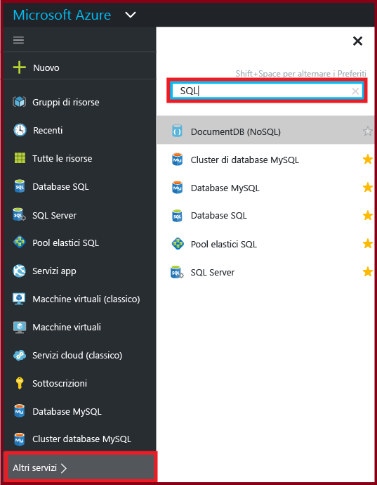
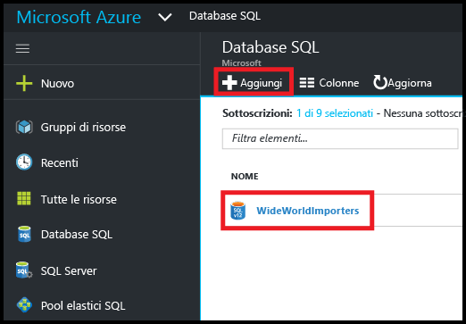
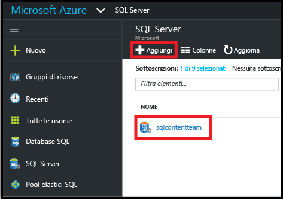
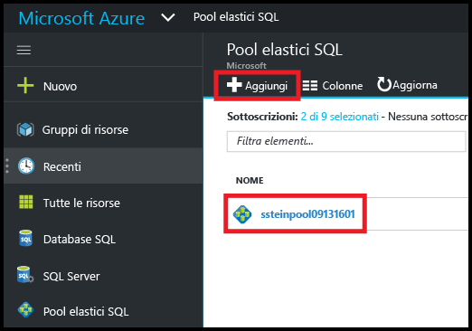
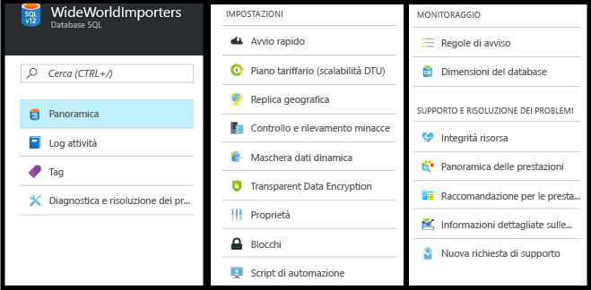
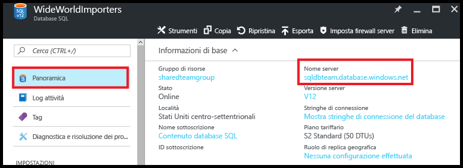
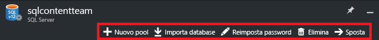

<properties
	pageTitle="Gestire un database SQL di Azure tramite il portale di Azure | Microsoft Azure"
	description="Informazioni su come usare il portale di Azure per gestire un database relazionale nel cloud tramite il portale di Azure."
	services="sql-database"
	documentationCenter=""
	authors="stevestein"
	manager="jhubbard"
	editor=""/>



<tags
	ms.service="sql-database"
	ms.devlang="NA"
	ms.workload="data-management"
	ms.topic="article"
	ms.tgt_pltfrm="NA"
	ms.date="09/14/2016"
	ms.author="sstein"/>



# Gestione dei database SQL di Azure tramite il portale di Azure

> [AZURE.SELECTOR]
- [Portale di Azure](sql-database-manage-portal.md)
- [SSMS](sql-database-manage-azure-ssms.md)
- [PowerShell](sql-database-command-line-tools.md)

Il [portale di Azure](https://portal.azure.com/) consente di creare, monitorare e gestire server e database SQL di Azure. Questo articolo offre una descrizione rapida e collegamenti per i dettagli delle attività più comuni.

## Visualizzare database, server e pool SQL di Azure

Per visualizzare i servizi di database SQL disponibili, fare clic su **More Services** (Altri servizi) e digitare **SQL** nella casella di ricerca:





## Come si creano o visualizzano i database SQL di Azure?

Per aprire il pannello **Database SQL**, fare clic su **Database SQL** e quindi sul database da usare oppure fare clic su **+Aggiungi** per creare un database SQL. Per informazioni dettagliate, vedere [Esercitazione sul database SQL: Creare un database SQL in pochi minuti usando il portale di Azure](sql-database-get-started.md).





## Come si creano o visualizzano i server SQL di Azure?

Per aprire il pannello **SQL Server**, fare clic su **SQL Server** e quindi sul server da usare oppure fare clic su **+Aggiungi** per creare un server SQL. Per informazioni dettagliate, vedere [Esercitazione sul database SQL: Creare un database SQL in pochi minuti usando il portale di Azure](sql-database-get-started.md).





## Come si creano o visualizzano i pool elastici SQL di Azure?

Per aprire il pannello **Pool elastici SQL**, fare clic su **Pool elastici SQL** e quindi sul pool da usare oppure fare clic su **+Aggiungi** per creare un pool. Per informazioni dettagliate, vedere [Creare un nuovo pool di database elastici con il portale di Azure](sql-database-elastic-pool-create-portal.md).





## Come si aggiornano o visualizzano le impostazioni del database SQL?

Per visualizzare o aggiornare le impostazioni del database, fare clic sull'impostazione desiderata nel pannello Database SQL:





## Come si trova il nome completo di un server di database SQL?

Per trovare il nome del server di database, fare clic su **Panoramica** nel pannello **Database SQL** per visualizzare il nome del server:





## Come è possibile gestire le regole del firewall per controllare l'accesso a server e database SQL?

Per visualizzare, creare o aggiornare le regole del firewall, fare clic su **Imposta firewall server** nel pannello **Database SQL**. Per informazioni dettagliate, vedere [Configurare una regola firewall a livello di server per il database SQL di Azure tramite il portale di Azure](sql-database-configure-firewall-settings.md).





## Come è possibile modificare il livello di servizio o il livello di prestazioni del database SQL?

Per aggiornare il livello di servizio o il livello di prestazioni di un database SQL, fare clic su **Piano tariffario (piano DTU)** nel pannello **Database SQL**. Per informazioni dettagliate, vedere [Modificare il livello di servizio e il livello di prestazioni (piano tariffario) di un database SQL](sql-database-scale-up.md).





## Come si configurano il controllo e il rilevamento delle minacce per un database SQL?

Per configurare il controllo e il rilevamento delle minacce per un database SQL, fare clic su **Controllo e rilevamento minacce** nel pannello **Database SQL**. Per informazioni dettagliate, vedere [Introduzione al controllo del database SQL](sql-database-auditing-get-started.md) e [Introduzione al rilevamento delle minacce nel database SQL](sql-database-threat-detection-get-started.md).

## Come si configura la maschera dati dinamica di un database SQL?

Per configurare la maschera dati dinamici per un database SQL, fare clic su **Maschera dati dinamica** nel pannello **Database SQL**. Per informazioni dettagliate, vedere [Introduzione alla maschera dati dinamica del database SQL (portale di Azure)](sql-database-dynamic-data-masking-get-started.md).

## Come si configura Transparent Data Encryption (TDE) per un database SQL?

Per configurare Transparent Data Encryption per un database SQL, fare clic su **Transparent Data Encryption** nel pannello **Database SQL**. Per informazioni dettagliate, vedere [Abilitare TDE in un database con il portale](https://msdn.microsoft.com/library/dn948096#Anchor_1).

## Come si visualizzano o modificano le dimensioni massime di un database SQL?

Per visualizzare o modificare le dimensioni di un database SQL, fare clic su **Dimensioni database** nel pannello **Database SQL**. Aggiornare le dimensioni massime di un database modificando il livello di servizio o il livello di prestazioni. Per informazioni dettagliate, vedere [Modificare il livello di servizio e il livello di prestazioni (piano tariffario) di un database SQL](sql-database-scale-up.md).

## Come è possibile monitorare e migliorare le prestazioni di un database SQL?

Per monitorare e migliorare le prestazioni di un database SQL, fare clic su **Informazioni generali sulle prestazioni** nel pannello **Database SQL**. Per altre informazioni, vedere [Informazioni dettagliate sulle prestazioni del database SQL](sql-database-performance.md).

## Come si configura la replica geografica?

Per configurare la replica geografica per un database SQL, fare clic su **Replica geografica** nel pannello **Database SQL**. Per informazioni dettagliate, vedere [Configurare la replica geografica per il database SQL di Azure con il portale di Azure](sql-database-geo-replication-portal.md).

## Come si esegue il failover a un database SQL con replica geografica?

Per eseguire il failover a un database secondario con replica geografica, fare clic su **Replica geografica** nel pannello **Database SQL**, quindi fare clic su **Failover**. Per informazioni dettagliate, vedere [Avviare un failover pianificato o non pianificato per il database SQL di Azure con il portale di Azure](sql-database-geo-replication-failover-portal.md).

## Come si copia un database SQL?

Per copiare un database SQL, fare clic su **Copia** nel pannello **Database SQL**. Per informazioni dettagliate, vedere [Copiare un database SQL di Azure tramite il portale di Azure](sql-database-copy-portal.md).





## Come si archivia un database SQL di Azure in un file BACPAC?

Per creare un file BACPAC di un database SQL, fare clic su **Esporta** nel pannello **Database SQL**. Per informazioni dettagliate, vedere [Archiviare un database SQL di Azure in un file BACPAC tramite il portale di Azure](sql-database-export.md).





## Come si ripristina un database SQL a un momento precedente?

Per ripristinare un database SQL, fare clic su **Ripristina** nel pannello **Database SQL**. Per informazioni dettagliate, vedere [Ripristinare un database SQL di Azure a un momento precedente con il portale di Azure](sql-database-point-in-time-restore-portal.md).





## Come si crea un database SQL di Azure da un file BACPAC?

Per creare un database SQL da un file BACPAC, fare clic su **Importa database** nel pannello **SQL Server**. Per informazioni dettagliate, vedere [Importare un file BACPAC per creare un nuovo database SQL di Azure](sql-database-import.md).





## Come si ripristina un database SQL eliminato?

Per ripristinare un database SQL eliminato, fare clic su **Database eliminati** nel pannello **SQL server**. Si tratta del server SQL contenente il database che è stato eliminato. Per informazioni dettagliate, vedere [Ripristinare un database SQL di Azure con il portale di Azure](sql-database-restore-deleted-database-portal.md).

## Come si elimina un database SQL?

Per eliminare un database SQL, fare clic su **Elimina** nel pannello **Database SQL**.





## Risorse aggiuntive

- [Database SQL](sql-database-technical-overview.md)
- [Monitorare e gestire un pool di database elastici con il portale di Azure](sql-database-elastic-pool-manage-portal.md)

<!---HONumber=AcomDC_0914_2016-->