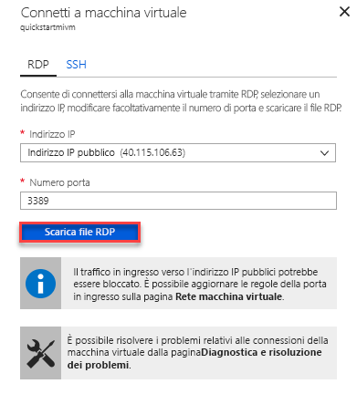

# Avvio rapido: Configurare una macchina virtuale di Azure per la connessione a un'istanza gestita di database SQL di Azure

Questo argomento di avvio rapido illustra come configurare una macchina virtuale di Azure per la connessione a un'istanza gestita di database SQL di Azure tramite SQL Server Management Studio (SSMS). Per una guida introduttiva che illustra come connettersi tramite un computer client locale usando una connessione da punto a sito, vedere [Configurare una connessione da punto a sito](sql-database-managed-instance-configure-p2s.md)

## Prerequisiti

Come punto di partenza, questo argomento di avvio rapido usa le risorse create in [Creare un'istanza gestita](sql-database-managed-instance-get-started.md).

## Accedere al portale di Azure

Accedere al [portale di Azure](https://portal.azure.com/).

## Creare una nuova subnet nella rete virtuale dell'istanza gestita

La procedura seguente illustra come creare una nuova subnet nella rete virtuale dell'istanza gestita per consentire a una macchina virtuale di Azure di connettersi all'istanza gestita. La subnet è dedicata alle istanze gestite. Non è possibile creare altre risorse, ad esempio macchine virtuali di Azure, in tale subnet.

1. Aprire il gruppo di risorse per l'istanza gestita che è stata creata nell'argomento di avvio rapido [Creare un'istanza gestita](sql-database-managed-instance-get-started.md). Selezionare la rete virtuale per l'istanza gestita.

   

2. Selezionare **Subnet** e quindi **+ Subnet** per creare una nuova subnet.

   

3. Compilare il modulo usando le informazioni riportate nella tabella seguente:

   | Impostazione| Valore consigliato | Descrizione |
   | ---------------- | ----------------- | ----------- |
   | **Nome** | Qualsiasi nome valido|Per informazioni sui nomi validi, vedere [Regole di denominazione e restrizioni](https://docs.microsoft.com/azure/architecture/best-practices/naming-conventions).|
   | **Intervallo di indirizzi (blocco CIDR)** | Un intervallo valido | Il valore predefinito è appropriato per questa guida introduttiva.|
   | **Gruppo di sicurezza di rete** | Nessuna | Il valore predefinito è appropriato per questa guida introduttiva.|
   | **Tabella di route** | Nessuna | Il valore predefinito è appropriato per questa guida introduttiva.|
   | **Endpoint servizio** | 0 selezionato | Il valore predefinito è appropriato per questa guida introduttiva.|
   | **Delega subnet** | Nessuna | Il valore predefinito è appropriato per questa guida introduttiva.|

   

4. Selezionare **OK** per creare questa subnet aggiuntiva nella rete virtuale dell'istanza gestita.

## Creare una macchina virtuale nella nuova subnet della rete virtuale

La procedura seguente illustra come creare una macchina virtuale nella nuova subnet per la connessione all'istanza gestita.

## Preparare la macchina virtuale di Azure

Poiché l'istanza gestita di SQL viene inserita nella rete virtuale privata, è necessario creare una macchina virtuale di Azure con alcuni strumenti client SQL installati, ad esempio SQL Server Management Studio o Azure Data Studio. Questo strumento consente di connettersi all'istanza gestita ed eseguire query. In questa guida introduttiva viene usato SQL Server Management Studio.

Il modo più semplice per creare una macchina virtuale client con tutti gli strumenti necessari è usare i modelli di Azure Resource Manager.

1. Verificare di essere connessi al portale di Azure in un'altra scheda del browser. Selezionare quindi il pulsante seguente per creare una macchina virtuale client e installare SQL Server Management Studio:

    

2. Compilare il modulo usando le informazioni riportate nella tabella seguente:

   | Impostazione| Valore consigliato | Descrizione |
   | ---------------- | ----------------- | ----------- |
   | **Sottoscrizione** | Una sottoscrizione valida | Deve trattarsi di una sottoscrizione in cui si dispone dell'autorizzazione per creare nuove risorse. |
   | **Gruppo di risorse** |Il gruppo di risorse specificato nella guida introduttiva [Creare un'istanza gestita](sql-database-managed-instance-get-started.md).|Deve essere il gruppo di risorse in cui si trova la rete virtuale.|
   | **Location** | Posizione per il gruppo di risorse | Questo valore viene popolato in base al gruppo di risorse selezionato. |
   | **Nome macchina virtuale**  | Qualsiasi nome valido | Per informazioni sui nomi validi, vedere [Regole di denominazione e restrizioni](https://docs.microsoft.com/azure/architecture/best-practices/naming-conventions).|
   |**Nome utente amministratore**|Qualsiasi nome utente valido|Per informazioni sui nomi validi, vedere [Regole di denominazione e restrizioni](https://docs.microsoft.com/azure/architecture/best-practices/naming-conventions). Non usare "serveradmin" perché è un ruolo a livello di server riservato. Questo nome utente viene usato ogni volta che ci si [connette alla macchina virtuale](#connect-to-virtual-machine).|
   |**Password**|Qualsiasi password valida|La password deve contenere almeno 12 caratteri e soddisfare i [requisiti di complessità definiti](../virtual-machines/windows/faq.md#what-are-the-password-requirements-when-creating-a-vm). Questa password viene usata ogni volta che ci si [connette alla macchina virtuale](#connect-to-virtual-machine).|
   | **Dimensioni macchina virtuale** | Qualsiasi dimensione valida | Il valore predefinito in questo modello, **Standard_B2s**, è sufficiente per questo argomento di avvio rapido. |
   | **Location**|[resourceGroup().location].| Non modificare questo valore. |
   | **Nome rete virtuale**|Rete virtuale in cui è stato creato il Istanza gestita.|
   | **Nome della subnet**|Nome della subnet creata nella procedura precedente| Non scegliere la subnet in cui è stata creata l'istanza gestita.|
   | **artifacts Location** (Posizione elementi) | [deployment().properties.templateLink.uri] | Non modificare questo valore. |
   | **artifacts location SAS token** (Token di firma di accesso condiviso posizione elementi) | lasciare vuoto | Non modificare questo valore. |

   

   Se sono stati usati il nome della rete virtuale suggerito e la subnet predefinita durante la [creazione dell'istanza gestita](sql-database-managed-instance-get-started.md), non è necessario modificare gli ultimi due parametri. In caso contrario, è necessario modificare questi valori in base ai valori immessi durante la configurazione dell'ambiente di rete.

3. Selezionare la casella di controllo **Accetto le condizioni riportate sopra**.
4. Selezionare **Acquista** per distribuire la macchina virtuale di Azure nella rete.
5. Selezionare l'icona **Notifiche** per visualizzare lo stato della distribuzione.

> [!IMPORTANT]
> Non continuare finché non sono trascorsi circa 15 minuti dalla creazione della macchina virtuale per dare agli script di post-creazione il tempo di installare SQL Server Management Studio.

## Connetti alla macchina virtuale in corso

La procedura seguente illustra come connettersi alla macchina virtuale appena creata con una connessione Desktop remoto.

1. Al termine della distribuzione, passare alla risorsa macchina virtuale.

      

2. Selezionare **Connessione**.

   Verrà visualizzato un file con estensione RDP (Remote Desktop Protocol) con l'indirizzo IP pubblico e il numero di porta per la macchina virtuale.

     

3. Selezionare **Scarica file RDP**.

   > [!NOTE]
   > È anche possibile usare SSH per connettersi alla macchina virtuale.

4. Chiudere il modulo **Connettere la macchina virtuale**.
5. Per connettersi alla VM, aprire il file RDP scaricato.
6. Quando richiesto, selezionare **Connect** (Connetti). In Mac, è necessario un client RDP come questo [client Desktop remoto](https://itunes.apple.com/us/app/microsoft-remote-desktop/id715768417?mt=12) disponibile nel Mac App Store.

7. Immettere il nome utente e la password specificati al momento della creazione della macchina virtuale e quindi scegliere **OK**.

8. Durante il processo di accesso potrebbe essere visualizzato un avviso relativo al certificato. Scegliere **Sì** o **Continua** per procedere con la connessione.

Nel dashboard di Server Manager viene stabilita la connessione alla macchina virtuale.

## Usare SSMS per connettersi all'istanza gestita

1. Nella macchina virtuale aprire SQL Server Management Studio (SSMS).

   L'apertura richiede alcuni istanti poiché è necessario il completamento della configurazione per il primo avvio di SQL Server Management Studio.
2. Nella finestra di dialogo **Connetti al server** immettere il **nome host** completo per l'istanza gestita nella casella **Nome server**. Selezionare **Autenticazione di SQL Server**, specificare il nome utente e la password e quindi selezionare **Connetti**.

      

Dopo aver stabilito la connessione, è possibile visualizzare i database di sistema e utente nel nodo Database e vari oggetti nei nodi Sicurezza, Oggetti server, Replica, Gestione, SQL Server Agent e Profiler XEvent.

## Passaggi successivi

- Per una guida introduttiva che illustra come connettersi tramite un computer client locale usando una connessione da punto a sito, vedere [Configurare una connessione da punto a sito](sql-database-managed-instance-configure-p2s.md).
- Per una panoramica delle opzioni di connessione delle applicazioni, consultare [Connessione delle applicazioni a un'Istanza gestita](sql-database-managed-instance-connect-app.md).
- Per ripristinare un database SQL Server esistente dal sistema locale a un'istanza gestita, è possibile usare il [Servizio Migrazione del database di Azure (DMS) per la migrazione](../dms/tutorial-sql-server-to-managed-instance.md) o il [comando T-SQL RESTORE](sql-database-managed-instance-get-started-restore.md) per il ripristino da un file di backup del database.
