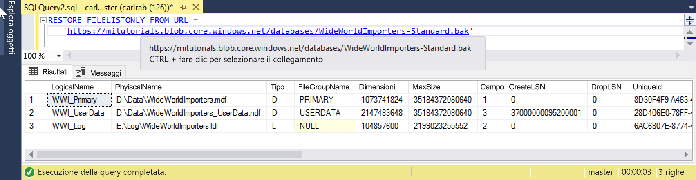

# <a name="quickstart-restore-a-database-to-a-managed-instance"></a>Guida introduttiva: Ripristinare un database in un'istanza gestita

In questa guida introduttiva si userà SQL Server Management Studio (SSMS) per ripristinare un database (file di backup standard di Wide World Importers) dall'archivio BLOB di Azure a [Istanza gestita](sql-database-managed-instance.md) di database SQL di Azure.

> [!VIDEO https://www.youtube.com/embed/RxWYojo_Y3Q]

> [!NOTE]
> Per altre informazioni sulla migrazione tramite Servizio Migrazione del database di Azure, vedere [Migrazione in un'Istanza gestita con Servizio Migrazione del database](../dms/tutorial-sql-server-to-managed-instance.md).
> Per altre informazioni sui vari metodi di migrazione, vedere [Migrazione di un'istanza di SQL Server in Istanza gestita di database SQL di Azure](sql-database-managed-instance-migrate.md).

## <a name="prerequisites"></a>Prerequisiti

La guida introduttiva:

- Usa le risorse della Guida introduttiva [Creare un'istanza gestita](sql-database-managed-instance-get-started.md).
- Richiede che nel computer in uso sia installata la versione più recente di [SQL Server Management Studio](https://docs.microsoft.com/sql/ssms/sql-server-management-studio-ssms).
- Richiede l'uso di SSMS per connettersi all'istanza gestita. Per informazioni su come effettuare la connessione, vedere queste guide introduttive:
  - [Connessione a un'Istanza gestita di database SQL di Azure da una macchina virtuale di Azure](sql-database-managed-instance-configure-vm.md)
  - [Configurare una connessione da punto a sito a un'Istanza gestita di database SQL di Azure da un computer locale](sql-database-managed-instance-configure-p2s.md).
- Richiede un account di Archiviazione BLOB di Azure, ad esempio Standard_LRS V2, su un **indirizzo IP pubblico** protetto con **credenziali SAS** con autorizzazione `rw`. Gli [indirizzi IP privati per l'archiviazione BLOB protetti da firewall](https://docs.microsoft.com/azure/storage/common/storage-network-security) e gli endpoint del servizio Archiviazione BLOB di Azure non sono attualmente supportati.

> [!NOTE]
> Per altre informazioni sul backup e sul ripristino di un database di SQL Server con l'archivio BLOB di Azure e una [chiave di firma di accesso condiviso](https://docs.microsoft.com/azure/storage/common/storage-dotnet-shared-access-signature-part-1), vedere l'articolo relativo al [backup di SQL Server in un URL](sql-database-managed-instance-get-started-restore.md).

## <a name="restore-the-database-from-a-backup-file"></a>Ripristinare il database da un file di backup

In SSMS seguire questa procedura per ripristinare il database Wide World Importers nell'istanza gestita. Il file di backup del database è archiviato in un account di archiviazione BLOB di Azure preconfigurato.

1. Aprire SMSS e connettersi all'istanza gestita.
2. Nel menu a sinistra fare clic con il pulsante destro del mouse sull'istanza gestita e selezionare **Nuova query** per aprire una nuova finestra di query.
3. Eseguire lo script SQL seguente, che usa un account di archiviazione preconfigurato e una chiave di firma di accesso condiviso per [creare le credenziali](https://docs.microsoft.com/sql/t-sql/statements/create-credential-transact-sql) nell'istanza gestita.

   ```sql
   CREATE CREDENTIAL [https://mitutorials.blob.core.windows.net/databases]
   WITH IDENTITY = 'SHARED ACCESS SIGNATURE'
   , SECRET = 'sv=2017-11-09&ss=bfqt&srt=sco&sp=rwdlacup&se=2028-09-06T02:52:55Z&st=2018-09-04T18:52:55Z&spr=https&sig=WOTiM%2FS4GVF%2FEEs9DGQR9Im0W%2BwndxW2CQ7%2B5fHd7Is%3D'
   ```

    

4. Per controllare le credenziali, eseguire lo script seguente, che usa un URL [contenitore](https://azure.microsoft.com/services/container-instances/) per ottenere un elenco file di backup.

   ```sql
   RESTORE FILELISTONLY FROM URL =
      'https://mitutorials.blob.core.windows.net/databases/WideWorldImporters-Standard.bak'
   ```

    

5. Eseguire lo script seguente per ripristinare il database Wide World Importers.

   ```sql
   RESTORE DATABASE [Wide World Importers] FROM URL =
     'https://mitutorials.blob.core.windows.net/databases/WideWorldImporters-Standard.bak'
   ```

    

6. Eseguire lo script seguente per tenere traccia dello stato del ripristino.

   ```sql
   SELECT session_id as SPID, command, a.text AS Query, start_time, percent_complete
      , dateadd(second,estimated_completion_time/1000, getdate()) as estimated_completion_time
   FROM sys.dm_exec_requests r
   CROSS APPLY sys.dm_exec_sql_text(r.sql_handle) a
   WHERE r.command in ('BACKUP DATABASE','RESTORE DATABASE')
   ```

7. Al termine del ripristino, visualizzarlo in Esplora oggetti.

## <a name="next-steps"></a>Passaggi successivi

- Per la risoluzione dei problemi di backup in un URL, vedere [Procedure consigliate e risoluzione dei problemi per il backup di SQL Server nell'URL](https://docs.microsoft.com/sql/relational-databases/backup-restore/sql-server-backup-to-url-best-practices-and-troubleshooting).
- Per una panoramica delle opzioni di connessione delle app, vedere [Connettere le applicazioni a un'Istanza gestita](sql-database-managed-instance-connect-app.md).
- Per eseguire query usando gli strumenti o i linguaggi preferiti, vedere [Guide introduttive: connessione ed esecuzione di query sui database SQL di Azure](sql-database-connect-query.md).
