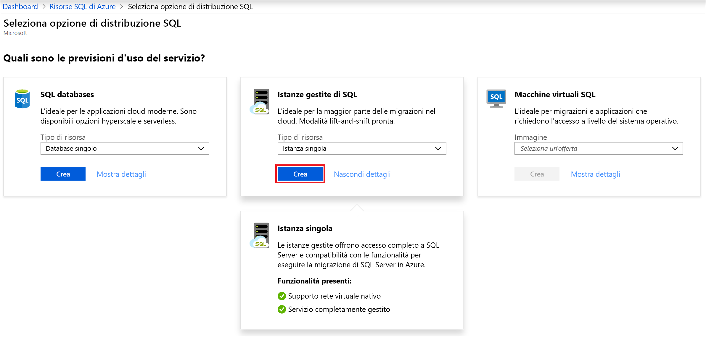
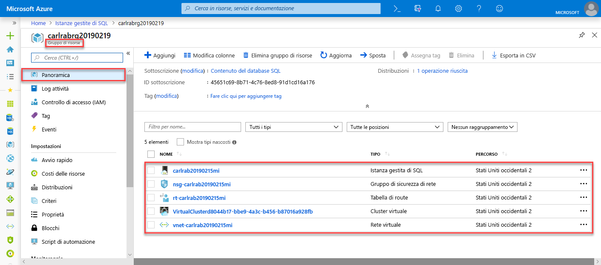
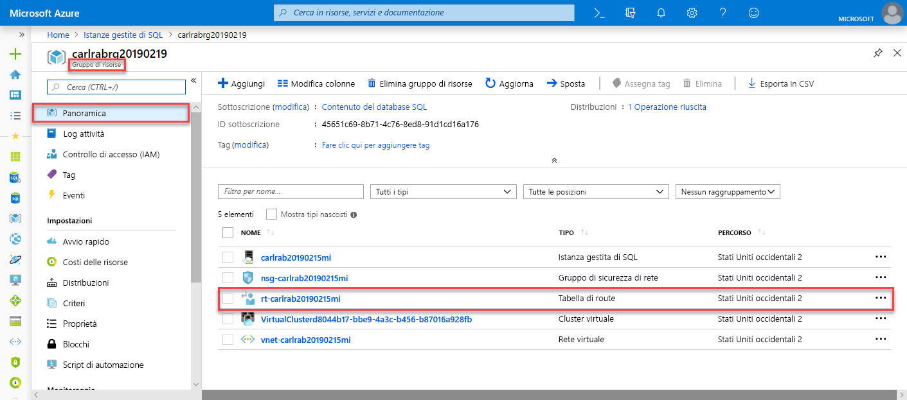
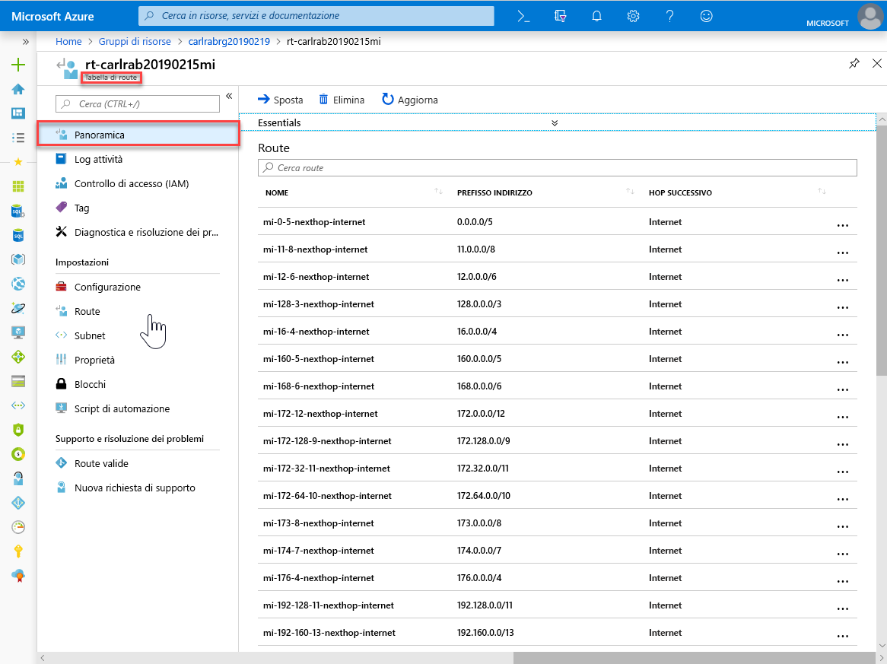
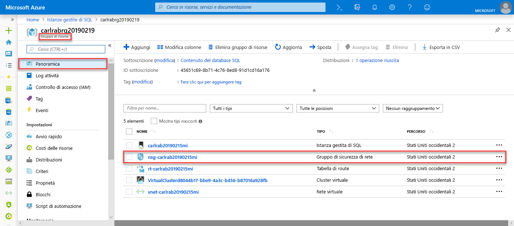
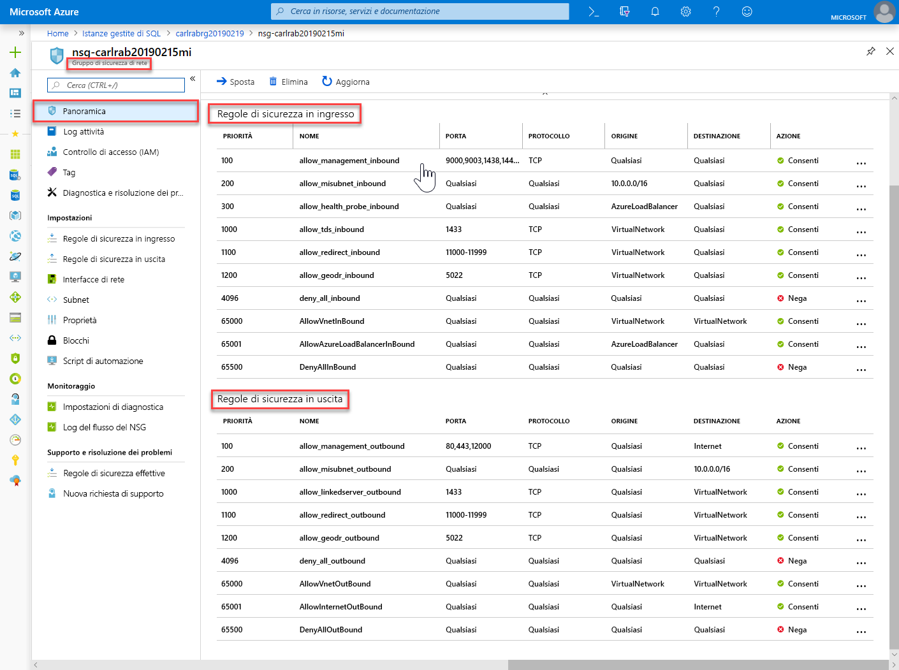
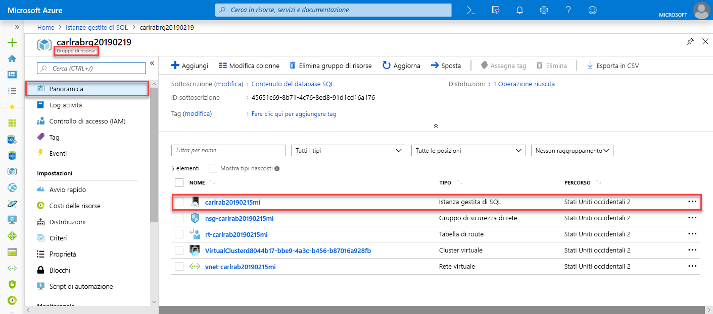
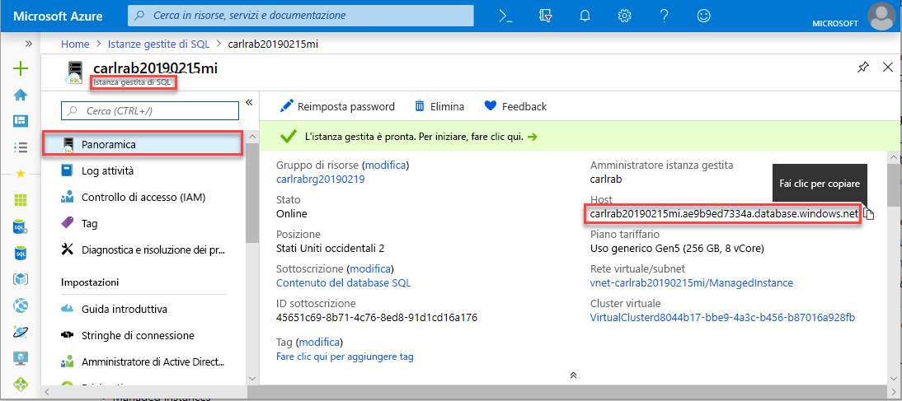

# Guida introduttiva: Creare un'istanza gestita di database SQL di Azure

Questo argomento di avvio rapido illustra come creare un'[istanza gestita](sql-database-managed-instance.md) di database SQL di Azure nel portale di Azure.

> [!IMPORTANT]
> Per le limitazioni, vedere [Aree supportate](sql-database-managed-instance-resource-limits.md#supported-regions) e [Tipi di sottoscrizione supportati](sql-database-managed-instance-resource-limits.md#supported-subscription-types).

## Accedere al portale di Azure

Se non si ha una sottoscrizione di Azure, [creare un account gratuito](https://azure.microsoft.com/free/).

Accedere al [portale di Azure](https://portal.azure.com/).

## Creare un'istanza gestita

I passaggi seguenti mostrano come creare un'istanza gestita.

1. Selezionare **Azure SQL** nel menu a sinistra nel portale di Azure. Se Azure SQL non è presente nell'elenco, selezionare **Tutti i servizi** e quindi digitare *Azure SQL* nella casella di ricerca.
2. Selezionare **+Aggiungi** per aprire la pagina **Selezionare l'opzione di distribuzione SQL**. È possibile visualizzare informazioni aggiuntive sull'istanza gestita di database SQL di Azure selezionando **Mostra dettagli** nel riquadro **Istanze gestite**.
3. Selezionare **Crea**:

   

4. Compilare il modulo **Istanza gestita di SQL** con le informazioni richieste, riportate nella tabella seguente.

   | Impostazione| Valore consigliato | DESCRIZIONE |
   | ------ | --------------- | ----------- |
   | **Sottoscrizione** | Sottoscrizione in uso. | Una sottoscrizione che fornisce l'autorizzazione per creare nuove risorse. |
   |**Nome istanza gestita**|Qualsiasi nome valido.|Per informazioni sui nomi validi, vedere [Regole di denominazione e restrizioni](https://docs.microsoft.com/azure/architecture/best-practices/naming-conventions).|
   |**Account di accesso amministratore istanza gestita**|Qualsiasi nome utente valido.|Per informazioni sui nomi validi, vedere [Regole di denominazione e restrizioni](https://docs.microsoft.com/azure/architecture/best-practices/naming-conventions). Non usare "serveradmin" perché è un ruolo a livello di server riservato.|
   |**Password**|Qualsiasi password valida.|La password deve contenere almeno 16 caratteri e soddisfare i [requisiti di complessità definiti](../virtual-machines/windows/faq.md#what-are-the-password-requirements-when-creating-a-vm).|
   |**Fuso orario**|Il fuso orario che verrà osservato dall'istanza gestita.|Per altre informazioni, vedere [Fusi orari](sql-database-managed-instance-timezone.md).|
   |**Regole di confronto**|Le regole di confronto da usare per l'istanza gestita.|In caso di migrazione di database da SQL Server, controllare le regole di confronto di origine con `SELECT SERVERPROPERTY(N'Collation')` e usare tale valore. Per informazioni sulle regole di confronto, vedere [Impostare o modificare le regole di confronto del server](https://docs.microsoft.com/sql/relational-databases/collations/set-or-change-the-server-collation).|
   |**Posizione**|La località in cui creare l'istanza gestita.|Per informazioni sulle aree, vedere [Aree di Azure](https://azure.microsoft.com/regions/).|
   |**Rete virtuale**|Selezionare **Crea nuova rete virtuale** o una rete virtuale valida e una subnet.| Se una rete o una subnet non è disponibile, prima di selezionarla come destinazione per la nuova istanza gestita, è necessario [modificarla per soddisfare i requisiti di rete](sql-database-managed-instance-configure-vnet-subnet.md). Per informazioni sui requisiti per la configurazione dell'ambiente di rete per un'istanza gestita, vedere [Configurare una rete virtuale per un'istanza gestita](sql-database-managed-instance-connectivity-architecture.md). |
   |**Abilita endpoint pubblico**   |Selezionare questa opzione per abilitare l'endpoint pubblico   |Perché l'istanza gestita sia accessibile tramite l'endpoint di dati pubblico, è necessario selezionare **Abilita endpoint pubblico**.| 
   |**Consenti l'accesso da**   |Selezionare una delle opzioni disponibili: <ul> <li>**Servizi di Azure**</li> <li>**Internet**</li> <li>**Nessun accesso**</li></ul>   |L'esperienza del portale consente di configurare il gruppo di sicurezza con l'endpoint pubblico.     A seconda dello scenario, selezionare una delle opzioni seguenti:   <ul> <li>Servizi di Azure: consigliata per la connessione da Power BI o da un altro servizio multi-tenant. </li> <li> Internet: usare questa opzione a scopo di test quando si vuole creare un'istanza gestita rapidamente. Non è consigliabile usarla negli ambienti di produzione. </li> <li> Nessun accesso: questa opzione crea una regola di sicurezza di rifiuto. Sarà necessario modificare questa regola per rendere accessibile tramite l'endpoint pubblico l'istanza gestita. </li> </ul>   Per altre informazioni sulla sicurezza dell'endpoint pubblico, vedere [Uso sicuro dell'istanza gestita di database SQL di Azure con l'endpoint pubblico](sql-database-managed-instance-public-endpoint-securely.md).|
   |**Tipo di connessione**|Scegliere tra un tipo di connessione Proxy e Reindirizzamento.|Per altre informazioni sui tipi di connessione, vedere [Criteri di connessione del database SQL di Azure](sql-database-connectivity-architecture.md#connection-policy).|
   |**Gruppo di risorse**|Gruppo di risorse nuovo o esistente.|Per i nomi di gruppi di risorse validi, vedere [Regole di denominazione e restrizioni](https://docs.microsoft.com/azure/architecture/best-practices/naming-conventions).|

   

5. Per usare l'istanza gestita come gruppo di failover dell'istanza secondario, selezionare il checkout e specificare l'istanza gestita DnsAzurePartner. 
6. Selezionare **Piano tariffario** per definire le dimensioni delle risorse di calcolo e di archiviazione ed esaminare le opzioni del piano tariffario. Il piano tariffario di utilizzo generico con 32 GB di memoria e 16 vCore è il valore predefinito.
7. Usare i dispositivi di scorrimento o le caselle di testo per specificare la quantità di spazio di archiviazione e il numero di core virtuali.
8. Al termine, selezionare **Applica** per salvare la selezione. 
9. Selezionare **Crea** per distribuire l'istanza gestita.
10. Selezionare l'icona **Notifiche** per visualizzare lo stato della distribuzione.

    

11. Selezionare **Distribuzione in corso** per aprire la finestra dell'istanza gestita e monitorare ulteriormente lo stato di avanzamento della distribuzione. 

> [!IMPORTANT]
> Per la prima istanza in una subnet, i tempi di distribuzione sono in genere molto più lunghi rispetto alle istanze successive. Non annullare l'operazione di distribuzione perché la durata è superiore al previsto.

## Esaminare le risorse e recuperare il nome completo del server

Dopo aver completato la distribuzione, esaminare le risorse create e recuperare il nome completo del server per l'uso in argomenti di avvio rapido successivi.

1. Aprire il gruppo di risorse per l'istanza gestita. Visualizzare le relative risorse che sono state create automaticamente nell'argomento di avvio rapido [Creare un'istanza gestita](#create-a-managed-instance).

   

2. Selezionare la tabella di route per esaminare la tabella di route definita dall'utente creata automaticamente.

   

3. Nella tabella di route esaminare le voci per instradare il traffico da e all'interno della rete virtuale dell'istanza gestita. Se la tabella di route viene creata o configurata manualmente, è necessario assicurarsi di includere queste voci.

   

4. Tornare nel gruppo di risorse e selezionare il gruppo di sicurezza di rete per esaminare le regole di sicurezza.

   

5. Esaminare le regole di sicurezza in ingresso e in uscita. Se sono stati configurati endpoint pubblici per l'istanza gestita, vedere l'articolo [Configurare un endpoint pubblico](sql-database-managed-instance-public-endpoint-configure.md#allow-public-endpoint-traffic-on-the-network-security-group) per altre informazioni.

   

6. Tornare nel gruppo di risorse e selezionare l'istanza gestita.

   

7. Nella scheda **Panoramica** individuare la proprietà **Host**. Copiare l'indirizzo completo dell'host completo per l'istanza gestita da usare nell'argomento di avvio rapido successivo.

   

   Il nome sarà simile a **nome_computer.a1b2c3d4e5f6.database.windows.net**.

## Passaggi successivi

- Per informazioni su come connettersi a un'istanza gestita, vedere:
  - Per una panoramica delle opzioni di connessione delle applicazioni, vedere [Connettere le applicazioni a un'istanza gestita](sql-database-managed-instance-connect-app.md).
  - Per un argomento di avvio rapido che illustra come connettersi a un'istanza gestita tramite una macchina virtuale di Azure, vedere [Configurare una connessione tramite macchina virtuale di Azure](sql-database-managed-instance-configure-vm.md).
  - Per un argomento di avvio rapido che illustra come connettersi a un'istanza gestita tramite un computer client locale usando una connessione da punto a sito, vedere [Configurare una connessione da punto a sito](sql-database-managed-instance-configure-p2s.md).
- Per ripristinare un database di SQL Server esistente da locale a un'istanza gestita: 
    - Usare il [Servizio Migrazione del database di Azure per la migrazione](../dms/tutorial-sql-server-to-managed-instance.md) per eseguire il ripristino da un file di backup del database. 
    - Usare il [comando T-SQL RESTORE](sql-database-managed-instance-get-started-restore.md) per eseguire il ripristino da un file di backup del database.
- Per informazioni sul monitoraggio avanzato delle prestazioni del database dell'istanza gestita con intelligence predefinita per la risoluzione dei problemi, vedere [Monitorare il database SQL di Azure usando Analisi SQL di Azure](../azure-monitor/insights/azure-sql.md).
