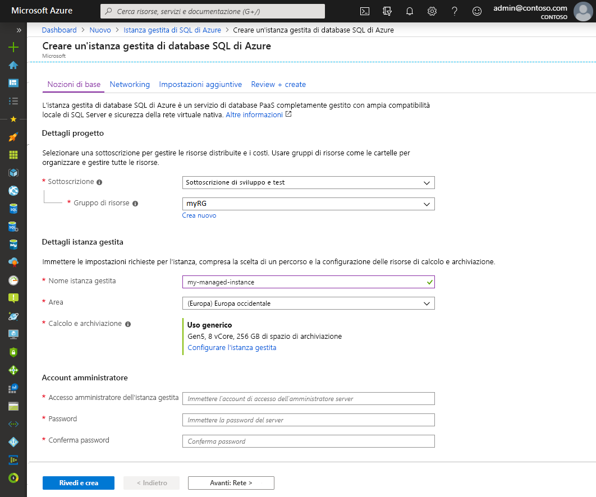
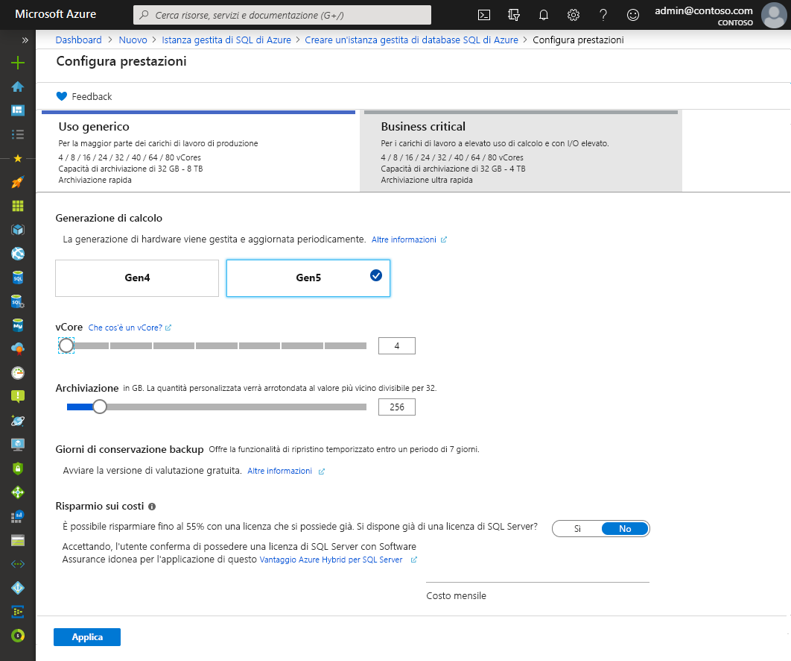
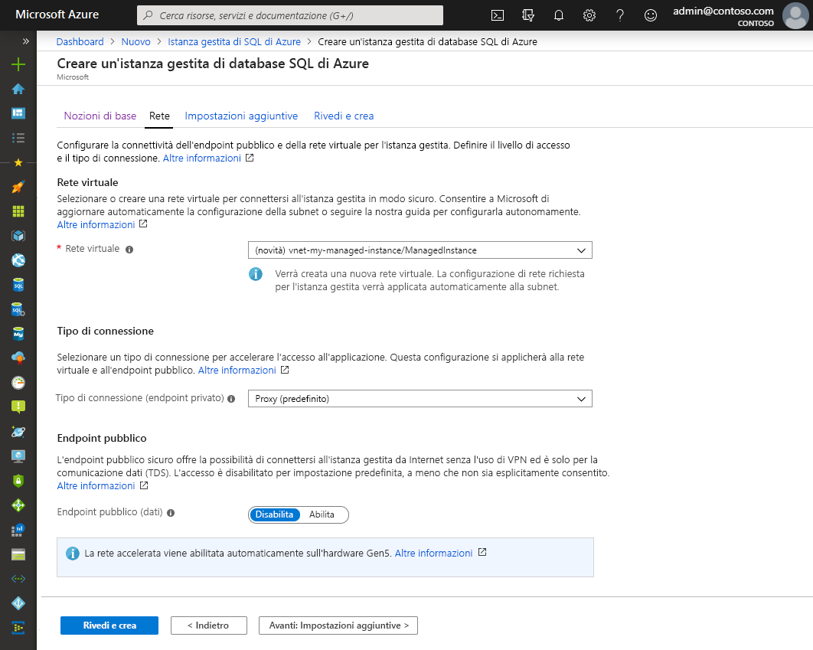
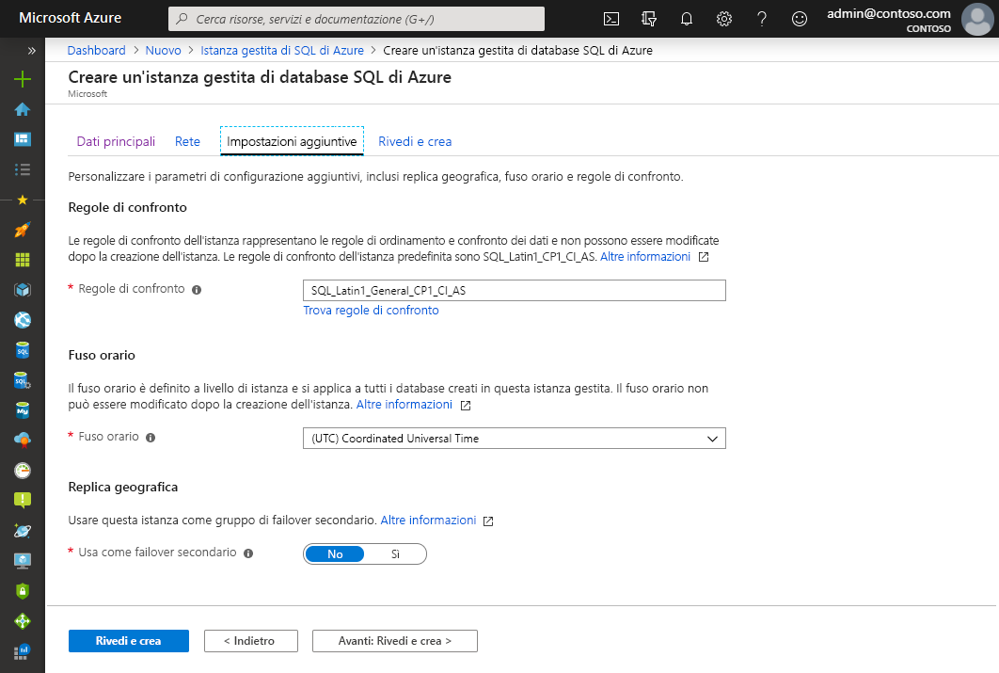
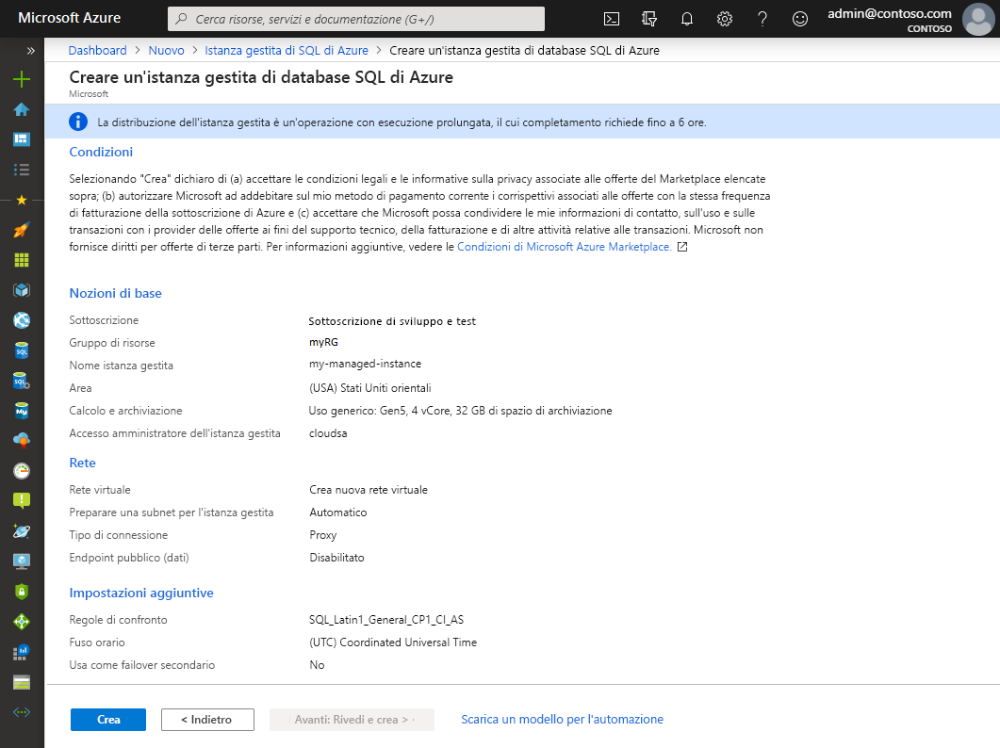
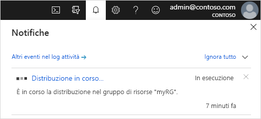

# Guida introduttiva: Creare un'istanza gestita di database SQL di Azure

Questo argomento di avvio rapido illustra come creare un'[istanza gestita](sql-database-managed-instance.md) di database SQL di Azure nel portale di Azure.

> [!IMPORTANT]
> Per le limitazioni, vedere [Aree supportate](sql-database-managed-instance-resource-limits.md#supported-regions) e [Tipi di sottoscrizione supportati](sql-database-managed-instance-resource-limits.md#supported-subscription-types).

## Accedere al portale di Azure

Se non si ha una sottoscrizione di Azure, [creare un account gratuito](https://azure.microsoft.com/free/).

Accedere al [portale di Azure](https://portal.azure.com/).

## Creare un'istanza gestita

I passaggi seguenti illustrano come creare un'istanza gestita:

1. Selezionare **Azure SQL** nel menu a sinistra del portale di Azure. Se **Azure SQL** non è presente nell'elenco, selezionare **Tutti i servizi** e quindi immettere **Azure SQL** nella casella di ricerca.
2. Selezionare **+Aggiungi** per aprire la pagina **Selezionare l'opzione di distribuzione SQL**. È possibile visualizzare informazioni aggiuntive su un'istanza gestita di database SQL di Azure selezionando **Mostra dettagli** nel riquadro **Istanze gestite**.
3. Selezionare **Create** (Crea).

   

4. Usare le schede nel modulo di provisioning **Crea Istanza gestita di database SQL di Azure** per aggiungere le informazioni obbligatorie e quelle facoltative. Le sezioni seguenti descrivono queste schede.

### Nozioni di base

- Compilare le informazioni nella scheda **Informazioni di base**. Contiene un set minimo di informazioni necessarie per effettuare il provisioning di un'istanza gestita.

   

   Usare la tabella seguente come riferimento per le informazioni necessarie in questa scheda.

   | Impostazione| Valore consigliato | DESCRIZIONE |
   | ------ | --------------- | ----------- |
   | **Sottoscrizione** | Sottoscrizione in uso. | Una sottoscrizione che fornisce l'autorizzazione per creare nuove risorse. |
   | **Gruppo di risorse** | Gruppo di risorse nuovo o esistente.|Per i nomi di gruppi di risorse validi, vedere [Regole di denominazione e restrizioni](https://docs.microsoft.com/azure/architecture/best-practices/naming-conventions).|
   | **Nome istanza gestita** | Qualsiasi nome valido.|Per informazioni sui nomi validi, vedere [Regole di denominazione e restrizioni](https://docs.microsoft.com/azure/architecture/best-practices/naming-conventions).|
   | **Area** |Area in cui si vuole creare l'istanza gestita.|Per informazioni sulle aree, vedere [Aree di Azure](https://azure.microsoft.com/regions/).|
   | **Account di accesso amministratore istanza gestita** | Qualsiasi nome utente valido. | Per informazioni sui nomi validi, vedere [Regole di denominazione e restrizioni](https://docs.microsoft.com/azure/architecture/best-practices/naming-conventions). Non usare "serveradmin" perché è un ruolo a livello di server riservato.|
   | **Password** | Qualsiasi password valida.| La password deve contenere almeno 16 caratteri e soddisfare i [requisiti di complessità definiti](../virtual-machines/windows/faq.md#what-are-the-password-requirements-when-creating-a-vm).|

- Selezionare **Configura istanza gestita** per definire le dimensioni delle risorse di calcolo e di archiviazione ed esaminare i piani tariffari. Usare i dispositivi di scorrimento o le caselle di testo per specificare la quantità di spazio di archiviazione e il numero di core virtuali. Al termine, selezionare **Applica** per salvare la selezione. 

   

- Per rivedere le scelte effettuate prima di creare un'istanza gestita, è possibile selezionare **Rivedi e crea**. In alternativa, configurare le opzioni di rete selezionando **Avanti: Rete**.

### Rete

- Compilare le informazioni facoltative nella scheda **Rete**. Se si omettono queste informazioni, il portale applicherà le impostazioni predefinite.

   

   Usare la tabella seguente come riferimento per le informazioni necessarie in questa scheda.

   | Impostazione| Valore consigliato | DESCRIZIONE |
   | ------ | --------------- | ----------- |
   | **Rete virtuale** | Selezionare **Crea nuova rete virtuale** o una rete virtuale valida e una subnet.| Se una rete o una subnet non è disponibile, prima di selezionarla come destinazione per la nuova istanza gestita, è necessario [modificarla per soddisfare i requisiti di rete](sql-database-managed-instance-configure-vnet-subnet.md). Per informazioni sui requisiti per la configurazione dell'ambiente di rete per un'istanza gestita, vedere [Configurare una rete virtuale per un'istanza gestita](sql-database-managed-instance-connectivity-architecture.md). |
   | **Tipo di connessione** | Scegliere tra un tipo di connessione proxy e uno con reindirizzamento.|Per altre informazioni sui tipi di connessione, vedere [Criteri di connessione del database SQL di Azure](sql-database-connectivity-architecture.md#connection-policy).|
   | **Endpoint pubblico**  | Selezionare **Abilita**. | Affinché l'istanza gestita sia accessibile tramite l'endpoint dati pubblico, è necessario abilitare questa opzione. | 
   | **Consenti l'accesso da** (se è abilitata l'opzione **Endpoint pubblico**) | Selezionare una delle opzioni disponibili.   |L'esperienza del portale consente di configurare un gruppo di sicurezza con un endpoint pubblico.     A seconda dello scenario, selezionare una delle opzioni seguenti:   <ul> <li>**Servizi di Azure**: questa opzione è consigliabile in caso di connessione da Power BI o un altro servizio multi-tenant. </li> <li> **Internet**: usare questa opzione a scopo di test quando si vuole creare rapidamente un'istanza gestita. Non è consigliabile per ambienti di produzione. </li> <li> **Nessun accesso**: questa opzione crea una regola di sicurezza **Nega**. Modificare questa regola per rendere un'istanza gestita accessibile tramite un endpoint pubblico. </li> </ul>   Per altre informazioni sulla sicurezza dell'endpoint pubblico, vedere [Uso sicuro di un'istanza gestita di database SQL di Azure con un endpoint pubblico](sql-database-managed-instance-public-endpoint-securely.md).|

- Selezionare **Rivedi e crea** per rivedere le scelte effettuate prima di creare un'istanza gestita. In alternativa, configurare altre impostazioni personalizzate selezionando **Avanti: Impostazioni aggiuntive**.

### Impostazioni aggiuntive

- Compilare le informazioni facoltative nella scheda **Impostazioni aggiuntive**. Se si omettono queste informazioni, il portale applicherà le impostazioni predefinite.

   

   Usare la tabella seguente come riferimento per le informazioni necessarie in questa scheda.

   | Impostazione| Valore consigliato | DESCRIZIONE |
   | ------ | --------------- | ----------- |
   | **Regole di confronto** | Scegliere le regole di confronto da usare per l'istanza gestita. In caso di migrazione di database da SQL Server, controllare le regole di confronto di origine con `SELECT SERVERPROPERTY(N'Collation')` e usare tale valore.| Per informazioni sulle regole di confronto, vedere [Impostare o modificare le regole di confronto del server](https://docs.microsoft.com/sql/relational-databases/collations/set-or-change-the-server-collation).|   
   | **Fuso orario** | Selezionare il fuso orario osservato dall'istanza gestita.|Per altre informazioni, vedere [Fusi orari](sql-database-managed-instance-timezone.md).|
   | **Usa come failover secondario** | Selezionare **Sì**. | Abilitare questa opzione per usare l'istanza gestita come istanza secondaria del gruppo di failover.|
   | **Istanza gestita primaria** (se l'opzione **Usa come failover secondario** è impostata su **Sì**) | Scegliere un'istanza gestita primaria esistente che verrà aggiunta alla stessa zona DNS dell'istanza gestita che si sta creando. | Questo passaggio consentirà la configurazione del gruppo di failover dopo la creazione. Per altre informazioni, vedere [Esercitazione: Aggiungere un'istanza gestita di database SQL a un gruppo di failover](sql-database-managed-instance-failover-group-tutorial.md).|

### Rivedi e crea

5. Selezionare la scheda **Rivedi e crea** per rivedere le scelte effettuate prima di creare l'istanza gestita.

   

6. Selezionare **Crea** per avviare il provisioning dell'istanza gestita.

> [!IMPORTANT]
> La distribuzione di un'istanza gestita è un'operazione di lunga durata. La distribuzione della prima istanza nella subnet richiede in genere molto più tempo rispetto alla distribuzione in una subnet contenente istanze gestite esistenti. Per informazioni sui tempi medi di provisioning, vedere [Operazioni di gestione di istanze gestite](sql-database-managed-instance.md#managed-instance-management-operations).

### Monitorare lo stato di avanzamento della distribuzione

7. Selezionare l'icona **Notifiche** per visualizzare lo stato della distribuzione.

   

8. Selezionare **Distribuzione in corso** nella notifica per aprire la finestra dell'istanza gestita e monitorare ulteriormente lo stato di avanzamento della distribuzione. 

> [!TIP]
> Se si è chiuso il Web browser o si è passati a un'altra schermata, seguire questa procedura per tornare alla schermata dello stato di avanzamento della distribuzione:
> 1. Nel portale di Azure aprire il gruppo di risorse in cui si sta distribuendo un'istanza gestita (specificato nella scheda **Informazioni di base**).
> 2. Selezionare **Distribuzioni**.
> 3. Selezionare l'operazione di distribuzione di istanza gestita in corso.

## Operazioni post-distribuzione

Per esaminare le risorse create, ottimizzare le impostazioni di rete e recuperare i dettagli della connessione host (FQDN) seguire la procedura descritta in questa sezione.

### Visualizzare le risorse create

Al completamento della distribuzione dell'istanza gestita, per visualizzare le risorse create:

1. Aprire il gruppo di risorse per l'istanza gestita. Visualizzare le risorse che sono state create automaticamente nella sezione di avvio rapido [Creare un'istanza gestita](#create-a-managed-instance).

   

### Visualizzare e ottimizzare le impostazioni di rete

Per ottimizzare facoltativamente le impostazioni di rete, controllare quanto segue:

1. Selezionare la tabella di route per esaminare la route definita dall'utente creata automaticamente.

   

2. Nella tabella di route esaminare le voci per indirizzare il traffico dalla rete virtuale dell'istanza gestita e all'interno di tale rete. Se la tabella di route viene creata o configurata manualmente, assicurarsi di creare queste voci nella tabella di route dell'istanza gestita.

   

3. Tornare al gruppo di risorse e selezionare il gruppo di sicurezza di rete.

   

4. Esaminare le regole di sicurezza in ingresso e in uscita. 

   

> [!IMPORTANT]
> Se è stato configurato un endpoint pubblico per l'istanza gestita, è necessario aprire le porte per autorizzare il traffico di rete che consente le connessioni all'istanza gestita dalla rete Internet pubblica. Per altre informazioni, vedere [Configurare un endpoint pubblico per l'istanza gestita](sql-database-managed-instance-public-endpoint-configure.md#allow-public-endpoint-traffic-on-the-network-security-group).
>

### Recuperare i dettagli della connessione all'istanza gestita

Per connettersi all'istanza gestita, seguire questa procedura per recuperare il nome host e il nome di dominio completo (FQDN):

1. Tornare nel gruppo di risorse e selezionare l'istanza gestita.

   

2. Nella scheda **Panoramica** individuare la proprietà **Host**. Copiare il nome host per l'istanza gestita da usare nel successivo argomento di avvio rapido.

   

   Il valore copiato rappresenta un nome di dominio completo (FQDN) che può essere usato per connettersi all'istanza gestita. È simile all'esempio di indirizzo seguente: *your_host_name.a1b2c3d4e5f6.database.windows.net*.

## Passaggi successivi

Per informazioni su come connettersi a un'istanza gestita, vedere:
- Per una panoramica delle opzioni di connessione delle applicazioni, vedere [Connettere le applicazioni a un'istanza gestita](sql-database-managed-instance-connect-app.md).
- Per un argomento di avvio rapido che illustra come connettersi a un'istanza gestita tramite una macchina virtuale di Azure, vedere [Configurare una connessione tramite macchina virtuale di Azure](sql-database-managed-instance-configure-vm.md).
- Per un argomento di avvio rapido che illustra come connettersi a un'istanza gestita tramite un computer client locale usando una connessione da punto a sito, vedere [Configurare una connessione da punto a sito](sql-database-managed-instance-configure-p2s.md).

Per ripristinare un database di SQL Server esistente da locale a un'istanza gestita: 
- Usare il [Servizio Migrazione del database di Azure per la migrazione](../dms/tutorial-sql-server-to-managed-instance.md) per eseguire il ripristino da un file di backup del database. 
- Usare il [comando T-SQL RESTORE](sql-database-managed-instance-get-started-restore.md) per eseguire il ripristino da un file di backup del database.

Per informazioni sul monitoraggio avanzato delle prestazioni del database dell'istanza gestita con intelligence predefinita per la risoluzione dei problemi, vedere [Monitorare il database SQL di Azure usando Analisi SQL di Azure](../azure-monitor/insights/azure-sql.md).
