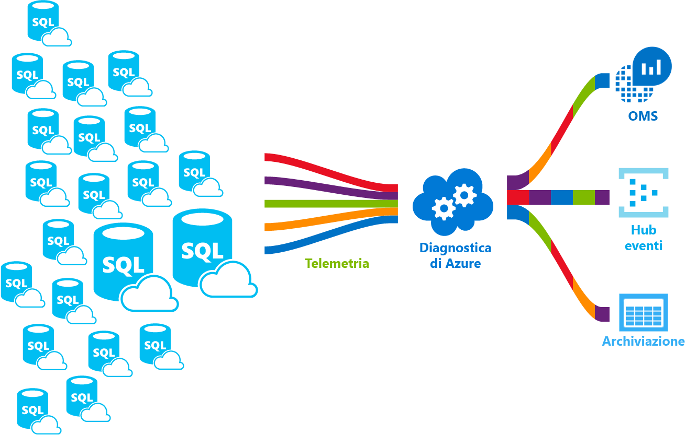

# <a name="azure-sql-database-metrics-and-diagnostics-logging"></a>Metriche del database SQL di Azure e registrazione diagnostica 
Il database SQL di Azure può generare metriche e log di diagnostica per facilitare il monitoraggio. È possibile configurare il database SQL di Azure per archiviare l'utilizzo delle risorse, i ruoli di lavoro e sessioni e la connettività in una delle risorse di Azure seguenti:
- **Archiviazione di Azure**: per l'archiviazione di enormi quantità di dati di telemetria a un costo conveniente
- **Hub eventi di Azure**: per l'integrazione dei dati di telemetria del database SQL di Azure con soluzioni di monitoraggio personalizzate o pipeline attive
- **Log Analytics di Azure**: per usare una soluzione di monitoraggio già pronta con funzionalità di reporting, avviso e mitigazione 

    

## <a name="enable-logging"></a>Abilitazione della registrazione

Le metriche e la registrazione diagnostica non sono abilitate per impostazione predefinita. È possibile abilitare e gestire le metriche e la gestione diagnostica usando uno dei metodi seguenti:
- Portale di Azure
- PowerShell
- Interfaccia della riga di comando di Azure
- API REST 
- Modello di Resource Manager

Quando si abilitano le metriche e la registrazione diagnostica, è necessario specificare la risorsa di Azure in cui vengono raccolti i dati selezionati. Opzioni disponibili:
- Log Analytics
- Hub eventi
- Archiviazione di Azure 

È possibile eseguire il provisioning di una nuova risorsa di Azure o selezionare una risorsa esistente. Dopo aver selezionato la risorsa di archiviazione, è necessario specificare quali dati raccogliere. Le opzioni disponibili includono:

- **[Metriche 1 minuto](sql-database-metrics-diag-logging.md#1-minute-metrics)**: contiene percentuale DTU, limite DTU, percentuale CPU, percentuale lettura dati fisici, percentuale scrittura log, riuscito/non riuscito/bloccato dalle connessioni firewall, percentuale sessioni, percentuale ruoli di lavoro, risorsa di archiviazione, percentuale di archiviazione, percentuale di archiviazione XTP

Se si specifica l'hub eventi o un account di archiviazione di Azure, è possibile indicare un criterio di conservazione per specificare che vengano eliminati i dati che superano un periodo di tempo selezionato. Se si specifica Log Analytics, i criteri di conservazione dipendono dal piano tariffario selezionato. Per altre informazioni, vedere [Prezzi di Log Analytics](https://azure.microsoft.com/pricing/details/log-analytics/). 

È consigliabile leggere fino in fondo gli articoli [Panoramica delle metriche in Microsoft Azure](../monitoring-and-diagnostics/monitoring-overview-metrics.md) e [Panoramica dei log di diagnostica di Azure](../monitoring-and-diagnostics/monitoring-overview-of-diagnostic-logs.md) per comprendere non solo come abilitare la registrazione, ma anche le metriche e le categorie di log supportate dai vari servizi di Azure.

### <a name="azure-portal"></a>Portale di Azure

Per abilitare le metriche e la raccolta di log di diagnostica nel portale di Azure, passare alla pagina del pool elastico o del database SQL di Azure e fare clic su **Impostazioni di diagnostica**.

   

### <a name="powershell"></a>PowerShell

Per abilitare le metriche e la registrazione diagnostica tramite PowerShell, usare i comandi seguenti:

- Per abilitare la memorizzazione dei log di diagnostica in un account di archiviazione, usare questo comando:

   ```powershell
   Set-AzureRmDiagnosticSetting -ResourceId [your resource id] -StorageAccountId [your storage account id] -Enabled $true
   ```

   L'ID account di archiviazione è l'ID risorsa per l'account di archiviazione a cui devono essere inviati i log.

- Per abilitare la trasmissione dei log di diagnostica a un hub eventi, usare questo comando:

   ```powershell
   Set-AzureRmDiagnosticSetting -ResourceId [your resource id] -ServiceBusRuleId [your service bus rule id] -Enabled $true
   ```

   L'ID regola del bus di servizio è una stringa nel formato seguente:

   ```powershell
   {service bus resource ID}/authorizationrules/{key name}
   ``` 

- Per consentire l'invio dei log di diagnostica all'area di lavoro di Log Analytics , usare questo comando:

   ```powershell
   Set-AzureRmDiagnosticSetting -ResourceId [your resource id] -WorkspaceId [resource id of the log analytics workspace] -Enabled $true
   ```

- È possibile ottenere l'ID risorsa dell'area di lavoro di Log Analytics usando il comando seguente:

   ```powershell
   (Get-AzureRmOperationalInsightsWorkspace).ResourceId
   ```

È possibile combinare questi parametri per abilitare più opzioni di output.

### <a name="cli"></a>CLI

Per abilitare le metriche e la registrazione diagnostica tramite l'interfaccia della riga di comando di Azure, usare i comandi seguenti:

- Per abilitare la memorizzazione dei log di diagnostica in un account di archiviazione, usare questo comando:

   ```azurecli-interactive
   azure insights diagnostic set --resourceId <resourceId> --storageId <storageAccountId> --enabled true
   ```

   L'ID account di archiviazione è l'ID risorsa per l'account di archiviazione a cui devono essere inviati i log.

- Per abilitare la trasmissione dei log di diagnostica a un hub eventi, usare questo comando:

   ```azurecli-interactive
   azure insights diagnostic set --resourceId <resourceId> --serviceBusRuleId <serviceBusRuleId> --enabled true
   ```

   L'ID regola del bus di servizio è una stringa nel formato seguente:

   ```azurecli-interactive
   {service bus resource ID}/authorizationrules/{key name}
   ```

- Per consentire l'invio dei log di diagnostica all'area di lavoro di Log Analytics , usare questo comando:

   ```azurecli-interactive
   azure insights diagnostic set --resourceId <resourceId> --workspaceId <resource id of the log analytics workspace> --enabled true
   ```

È possibile combinare questi parametri per abilitare più opzioni di output.

### <a name="rest-api"></a>API REST

Informazioni su come [modificare le impostazioni di diagnostica usando l'API REST di Monitoraggio di Azure](https://msdn.microsoft.com/library/azure/dn931931.aspx). 

### <a name="resource-manager-template"></a>Modello di Resource Manager

Informazioni su come [abilitare automaticamente le impostazioni di diagnostica durante la creazione di risorse con un modello di Resource Manager](../monitoring-and-diagnostics/monitoring-enable-diagnostic-logs-using-template.md). 

## <a name="stream-into-log-analytics"></a>Eseguire lo streaming in Log Analytics 
Le metriche del database SQL Azure e i log di diagnostica possono essere trasmessi in Log Analytics usando l'opzione "Invia a Log Analytics" presente nel portale oppure abilitando Log Analytics in un'impostazione di diagnostica tramite cmdlet di PowerShell di Azure, l'interfaccia della riga di comando di Azure o l'API REST di Monitoraggio di Azure.

### <a name="installation-overview"></a>Panoramica dell'installazione

Monitorare la flotta del database SQL di Azure è semplice con Log Analytics. Sono necessari tre passaggi:

1.  Creare la risorsa Log Analytics
2.  Configurare i database per registrare le metriche e i log di diagnostica nella risorsa Log Analytics creata
3.  Installare la soluzione **Analisi SQL di Azure** dalla raccolta in Log Analytics

### <a name="create-log-analytics-resource"></a>Creare la risorsa Log Analytics

1. Fare clic su **Nuovo** nel menu a sinistra.
2. Fare clic su **Monitoraggio e gestione**
3. Fare clic su **Log Analytics**
4. Compilare il modulo Log Analytics con le informazioni aggiuntive necessarie: nome dell'area di lavoro, sottoscrizione, gruppo di risorse, posizione e livello di prezzo.

   

### <a name="configure-databases-to-record-metrics-and-diagnostic-logs"></a>Configurare i database per registrare le metriche e i log di diagnostica

Il modo più semplice per configurare la posizione in cui i database registrano le metriche è tramite il portale di Azure. Nel portale di Azure passare alla risorsa database SQL di Azure e fare clic su **Impostazioni di diagnostica**. 

### <a name="install-the-azure-sql-analytics-solution-from-gallery"></a>Installare la soluzione Analisi SQL di Azure dalla raccolta  

1. Quando la risorsa Log Analytics è stata creata e i dati vengono trasmessi a essa, installare una soluzione Analisi SQL di Azure. Questa operazione può essere eseguita tramite la **raccolta soluzioni** disponibile nella home page di OMS e nel menu laterale. Nella raccolta, trovare e fare clic sulla soluzione **Analisi SQL di Azure** e fare clic su **Aggiungi**.

   

2. Nella home page di OMS viene visualizzato un nuovo riquadro chiamato **Analisi SQL di Azure**. Se si seleziona questo riquadro viene aperto il dashboard di Analisi SQL di Azure.

### <a name="using-azure-sql-analytics-solution"></a>Uso della soluzione Analisi SQL di Azure

Analisi SQL di Azure è un dashboard gerarchico che consente di spostarsi nella gerarchia di risorse del database SQL di Azure. Questa funzionalità consente di eseguire un monitoraggio di alto livello ma consente anche di definire l'ambito del monitoraggio esattamente per il set di risorse corretto.
Il dashboard contiene gli elenchi delle diverse risorse sotto la risorsa selezionata. Ad esempio, per una sottoscrizione selezionata è possibile vedere tutti i server, i pool elastici e i database che appartengono alla sottoscrizione. Inoltre, per i pool elastici e i database, è possibile vedere metriche di utilizzo delle risorse per quella risorsa. Sono inclusi grafici per DTU, CPU, IO, LOG, sessioni, processi di lavoro, connessioni e archiviazione in GB.

## <a name="stream-into-azure-event-hub"></a>Eseguire lo streaming nell'hub eventi di Azure

Le metriche del database SQL Azure e i log di diagnostica possono essere trasmessi nell'hub eventi usando l'opzione "Stream to an event hub" (Esegui streaming in un Hub eventi) presente nel portale oppure abilitando l'ID regola del bus di servizio in un'impostazione di diagnostica tramite cmdlet di PowerShell di Azure, l'interfaccia della riga di comando di Azure o l'API REST di Monitoraggio di Azure. 

### <a name="what-to-do-with-metrics-and-diagnostic-logs-in-event-hub"></a>Cosa fare con le metriche e i log di diagnostica nell'hub eventi?
Una volta eseguito lo streaming dei dati selezionati nell'hub eventi, si è un passo più vicini all'abilitazione di scenari di monitoraggio avanzati. Hub eventi funge da "porta principale" per una pipeline di eventi. Dopo aver raccolto i dati in un hub eventi, è possibile trasformarli e archiviarli tramite qualsiasi provider di analisi in tempo reale o adattatore di invio in batch/archiviazione. Gli hub di eventi separano la produzione di un flusso di eventi dal consumo di questi eventi, in modo che i consumer di eventi può accedere agli eventi in base a una pianificazione. Per altre informazioni sull'hub eventi, vedere:

- [Cosa sono gli hub eventi di Azure](../event-hubs/event-hubs-what-is-event-hubs.md)?
- [Introduzione all'Hub eventi](../event-hubs/event-hubs-csharp-ephcs-getstarted.md)


Ecco alcuni esempi di come è possibile usare la funzionalità di trasmissione:

-   Visualizzare lo stato di integrità del servizio mediante la trasmissione di dati sul "percorso critico" a Power BI: hub eventi, analisi di flusso e Power BI permettono di trasformare facilmente i dati di metriche e diagnostica in informazioni quasi in tempo reale sui servizi di Azure. Per una panoramica della configurazione dell'hub eventi, dell'elaborazione dei dati con analisi di flusso e dell'uso di Power BI come output, vedere [Analisi di flusso e Power BI](../stream-analytics/stream-analytics-power-bi-dashboard.md).
-   Eseguire lo streaming dei log in stream di registrazione e telemetria di terze parti: usando lo streaming degli hub eventi è possibile trasmettere le metriche e i log di diagnostica a diverse soluzioni di monitoraggio e analisi di log di terze parti. 
-   Compilare una piattaforma di registrazione e telemetria personalizzata: se è disponibile una piattaforma di telemetria personalizzata o si intende crearne una, le caratteristiche di pubblicazione-sottoscrizione altamente scalabili dell'hub eventi offrono grande flessibilità per l'inserimento dei log di diagnostica. [Vedere la guida all'uso dell'hub eventi in una piattaforma di telemetria su scala globale di Dan Rosanova](https://azure.microsoft.com/documentation/videos/build-2015-designing-and-sizing-a-global-scale-telemetry-platform-on-azure-event-Hubs/).

## <a name="stream-into-azure-storage"></a>Eseguire lo streaming in Archiviazione di Azure

Le metriche del database SQL Azure e i log di diagnostica possono essere archiviati in Archiviazione di Azure usando l'opzione "Archive to a storage account" (Archivia in un account di archiviazione) presente nel portale di Azure oppure abilitando Archiviazione di Azure in un'impostazione di diagnostica tramite cmdlet di PowerShell di Azure, l'interfaccia della riga di comando di Azure o l'API REST di Monitoraggio di Azure.

### <a name="schema-of-metrics-and-diagnostic-logs-in-the-storage-account"></a>Schema delle metriche e dei log di diagnostica nell'account di archiviazione

Dopo aver configurato la raccolta delle metriche e dei log di diagnostica, viene creato un contenitore di archiviazione nell'account di archiviazione selezionato quando sono disponibili le prime righe di dati. La struttura di questi BLOB è:

```powershell
insights-{metrics|logs}-{category name}/resourceId=/SUBSCRIPTIONS/{subscription ID}/ RESOURCEGROUPS/{resource group name}/PROVIDERS/Microsoft.SQL/servers/{resource_server}/ databases/{database_name}/y={four-digit numeric year}/m={two-digit numeric month}/d={two-digit numeric day}/h={two-digit 24-hour clock hour}/m=00/PT1H.json
```
    
O, più semplicemente:

```powershell
insights-{metrics|logs}-{category name}/resourceId=/{resource Id}/y={four-digit numeric year}/m={two-digit numeric month}/d={two-digit numeric day}/h={two-digit 24-hour clock hour}/m=00/PT1H.json
```

Ad esempio, un nome del BLOB per la metrica 1 minuto potrebbe essere:

```powershell
insights-metrics-minute/resourceId=/SUBSCRIPTIONS/s1id1234-5679-0123-4567-890123456789/RESOURCEGROUPS/TESTRESOURCEGROUP/PROVIDERS/MICROSOFT.SQL/ servers/Server1/databases/database1/y=2016/m=08/d=22/h=18/m=00/PT1H.json
```

Se si vuole registrare i dati dal pool elastico, il nome del BLOB è leggermente diverso:

```powershell
insights-{metrics|logs}-{category name}/resourceId=/SUBSCRIPTIONS/{subscription ID}/ RESOURCEGROUPS/{resource group name}/PROVIDERS/Microsoft.SQL/servers/{resource_server}/ elasticPools/{elastic_pool_name}/y={four-digit numeric year}/m={two-digit numeric month}/d={two-digit numeric day}/h={two-digit 24-hour clock hour}/m=00/PT1H.json
```

### <a name="download-metrics-and-logs-from-azure-storage"></a>Scaricare le metriche e i log da Archiviazione di Azure

Vedere [Scaricare le metriche e i log di diagnostica da Archiviazione di Azure](../storage/storage-dotnet-how-to-use-blobs.md#download-blobs)

## <a name="1-minute-metrics"></a>metriche 1 minuto

| |  |
|---|---|
|**Risorsa**|**Metriche**|
|Database|Percentuale DTU, DTU utilizzata, limite DTU, percentuale CPU, percentuale lettura dati fisici, percentuale scrittura log, riuscito/non riuscito/bloccato dalle connessioni firewall, percentuale sessioni, percentuale ruoli di lavoro, risorsa di archiviazione, percentuale di archiviazione, percentuale di archiviazione XTP, deadlock |
|Pool elastico|Percentuale eDTU, eDTU utilizzata, limite eDTU, percentuale CPU, percentuale lettura dati fisici, percentuale scrittura log, percentuale sessioni, percentuale ruoli di lavoro, risorsa di archiviazione, percentuale di archiviazione, limite di archiviazione, percentuale di archiviazione XTP |
|||

## <a name="next-steps"></a>Passaggi successivi

- Leggere fino in fondo gli articoli [Panoramica delle metriche in Microsoft Azure](../monitoring-and-diagnostics/monitoring-overview-metrics.md) e [Panoramica dei log di diagnostica di Azure](../monitoring-and-diagnostics/monitoring-overview-of-diagnostic-logs.md) per comprendere non solo come abilitare la registrazione, ma anche le metriche e le categorie di log supportate dai vari servizi di Azure.
- Per informazioni sugli hub eventi, leggere gli articoli seguenti:
   - [Cosa sono gli hub eventi di Azure](../event-hubs/event-hubs-what-is-event-hubs.md)?
   - [Introduzione all'Hub eventi](../event-hubs/event-hubs-csharp-ephcs-getstarted.md)
- Vedere [Scaricare le metriche e i log di diagnostica da Archiviazione di Azure](../storage/storage-dotnet-how-to-use-blobs.md#download-blobs)

