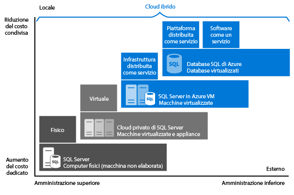

<properties
	pageTitle="Confronto tra il database SQL (PaaS) e SQL Server nel cloud in VM (IaaS) | Microsoft Azure"
	description="Informazioni su come trovare l'opzione di SQL Server cloud ottimale per l'applicazione, ovvero database SQL di Azure (PaaS) o SQL Server nel cloud su macchine virtuali di Azure."
	services="sql-database, virtual-machines"
	keywords="SQL Server cloud, SQL Server nel cloud, database PaaS, cloud SQL Server, DBaaS"
	documentationCenter=""
	authors="CarlRabeler"
	manager="jhubbard"
	editor="cjgronlund"/>



<tags
	ms.service="sql-database"
	ms.workload="data-management"
	ms.tgt_pltfrm="vm-windows-sql-server"
	ms.devlang="na"
	ms.topic="get-started-article"
	ms.date="09/06/2016"
	ms.author="carlrab"/>



# Scegliere un'opzione di SQL Server cloud: database SQL di Azure (PaaS) o SQL Server in VM di Azure (IaaS)

Azure offre due opzioni per l'hosting dei carichi di lavoro di SQL Server in Microsoft Azure:

* [Database SQL di azure](https://azure.microsoft.com/services/sql-database/): database SQL nativo nel cloud, noto anche come database di piattaforma distribuita come servizio (PaaS) o database distribuito come servizio (DBaaS) ottimizzato per lo sviluppo di app software come un servizio (SaaS). Offre la compatibilità con la maggior parte delle funzionalità di SQL Server. Per altre informazioni su PaaS, vedere [Cos'è il modello PaaS?](https://azure.microsoft.com/overview/what-is-paas/)
* [SQL Server in macchine virtuali di Azure](https://azure.microsoft.com/services/virtual-machines/sql-server/): SQL Server installato e ospitato nel cloud in macchine virtuali (VM) Windows Server in esecuzione in Azure, una configurazione nota anche come infrastruttura distribuita come servizio (IaaS). SQL Server in macchine virtuali di Azure è ottimizzato per la migrazione delle applicazioni SQL Server esistenti. Sono disponibili tutte le versioni ed edizioni di SQL Server. Offre la compatibilità completa con SQL Server, che permette di ospitare tutti i database necessari e di eseguire transazioni tra database, oltre al pieno controllo su SQL Server e Windows.

Informazioni sul modo in cui ogni opzione si inserisce nella piattaforma dati Microsoft e come ottenere assistenza per far coincidere l'opzione giusta con le esigenze aziendali. Indipendentemente dai fattori che determinano la scelta, ad esempio i costi o la gestione ridotta, questo articolo può aiutare a decidere l'approccio ottimale rispetto alle esigenze aziendali più importanti.

## Piattaforma dati Microsoft

Una delle prime cose da comprendere in una discussione in cui Azure viene confrontato con i database SQL Server locali è che è possibile usare tutte le soluzioni. La piattaforma dei dati Microsoft si basa sulla tecnologia SQL Server e la rende disponibile nei computer fisici locali, negli ambienti cloud privati, negli ambienti cloud privati ospitati da terze parti e nel cloud pubblico. SQL Server in macchine virtuali di Azure permette di soddisfare numerose esigenze aziendali specifiche grazie a una combinazione di distribuzioni locali e ospitate su cloud usando lo stesso set di prodotti server, strumenti di sviluppo ed esperienza in tutti gli ambienti.

   



Come mostrato nel diagramma, ogni offerta può essere caratterizzata dal livello di amministrazione che si ha sull'infrastruttura (asse X) e dal grado di efficienza nei costi raggiunto dal consolidamento e automazione a livello di database (asse Y).

Quando si progetta un'applicazione sono disponibili quattro opzioni di base per l'hosting della parte SQL Server dell'applicazione:

- SQL Server in computer fisici non virtualizzati
- SQL Server in macchine virtualizzate locali (cloud privato)
- SQL Server in una macchina virtuale di Azure (cloud Microsoft pubblico)
- Database SQL di Azure (cloud Microsoft pubblico)

Le sezioni seguenti contengono informazioni su SQL Server nel cloud Microsoft pubblico, ovvero sul database SQL di Azure e SQL Server in macchine virtuali di Azure. L'articolo illustra anche i vantaggi aziendali più diffusi che permettono di determinare l'opzione ottimale per l'applicazione.

## Informazioni dettagliate sul database SQL di Azure e su SQL Server in macchine virtuali di Azure

Il **database SQL di Azure** è un database relazionale distribuito come servizio (DBaaS) ospitato nel cloud di Azure, che rientra nella categorie di settore *SaaS (Software-as-a-Service)* e *PaaS (Platform-as-a-Service)*. Il [database SQL](sql-database-technical-overview.md) si basa su hardware e software standardizzati appartenenti, ospitati e gestiti da Microsoft. Con il database SQL è possibile eseguire operazioni di sviluppo direttamente nel servizio con le funzioni e le funzionalità predefinite. Il database SQL prevede un pagamento in base al consumo con la possibilità di aumentare o diminuire il numero di istanze per una maggiore efficienza e senza interruzioni.

**SQL Server nelle macchine virtuali di Azure (VM)** rientra nella categoria di settore *IaaS (Infrastructure-as-a-Service)* e consente di eseguire SQL Server in una macchina virtuale nel cloud. Analogamente al database SQL di Azure, si basa su hardware standardizzato appartenente, ospitato e gestito da Microsoft. Quando si usa SQL Server in una macchina virtuale, è possibile scegliere una licenza di SQL Server con pagamento in base al consumo già inclusa in un'immagine di SQL Server oppure una licenza esistente. È anche possibile aumentare o ridurre le prestazioni e sospendere o riavviare la macchina virtuale in base alle esigenze.

In generale, queste due opzioni SQL sono ottimizzate per scopi diversi:

- Il **database SQL** è ottimizzato per ridurre al minimo i costi complessivi per il provisioning e la gestione di molti database. Riduce i costi amministrativi correnti perché non è necessario gestire le macchine virtuali, il sistema operativo o il software del database, E non è neanche necessario gestire gli aggiornamenti, la disponibilità elevata o i [backup](sql-database-automated-backups.md). In generale, il database SQL di Azure può aumentare significativamente il numero di database gestiti da una singola risorsa IT o di sviluppo.
- **SQL Server in macchine virtuali di Azure** è ottimizzato per eseguire la migrazione di applicazioni esistenti in Azure o per estendere nel cloud le applicazioni locali esistenti in distribuzioni ibride. SQL Server in esecuzione in una macchina virtuale può essere usato anche per sviluppare e testare applicazioni SQL Server tradizionali. SQL Server nelle VM di Azure fornisce diritti amministrativi completi per un'istanza di SQL Server dedicata e una macchina virtuale basata sul cloud. È la scelta ideale quando un'organizzazione ha già delle risorse IT disponibili per mantenere le macchine virtuali. Queste funzionalità permettono di creare un sistema altamente personalizzato per soddisfare i requisiti specifici dell'applicazione in termini di prestazioni e disponibilità.

La tabella seguente riepiloga le caratteristiche principali del database SQL di Azure e di SQL Server nelle macchine virtuali di Azure:

| | Database SQL | SQL Server in una macchina virtuale di Azure|
| -------------- | ------------ | ---------------------- |
| **Ideale per:** | Nuove applicazioni progettate per il cloud con vincoli di tempo per lo sviluppo e il marketing. |Applicazioni esistenti che richiedono una migrazione rapida al cloud con poche modifiche. Scenari di sviluppo e test rapidi quando non si vuole acquistare hardware SQL Server locale non di produzione. |
|| Team che richiedono funzionalità incorporate di disponibilità elevata, ripristino di emergenza e aggiornamento per il database. |Team che possono configurare e gestire la disponibilità elevata, il ripristino di emergenza e l'applicazione di patch per SQL Server. Alcune funzionalità automatiche fornite semplifica notevolmente queste operazioni. |
||Team che preferiscono non gestire il le impostazioni del sistema operativo e di configurazione sottostanti.| Casi in cui è necessario un ambiente personalizzato con diritti amministrativi completi.|
||Database con dimensioni fino a 1 TB o database di dimensioni superiori che possono essere [partizionati orizzontalmente o verticalmente](sql-database-elastic-scale-introduction.md#horizontal-and-vertical-scaling) in base a un modello di aumento del numero di istanze.|Istanze di SQL Server con un massimo di 64 TB di spazio di archiviazione. L'istanza può supportare tutti i database necessari. |
||[Compilazione di applicazioni software come un servizio (SaaS)](sql-database-design-patterns-multi-tenancy-saas-applications.md).| Migrazione e compilazione di applicazioni aziendali e ibride.|
|||||
|**Risorse:**|Non si vogliono usare risorse IT per la configurazione e la gestione dell'infrastruttura sottostante, ma ci si vuole concentrare sul livello dell'applicazione.|Sono disponibili alcune risorse IT per la configurazione e la gestione. Alcune funzionalità automatiche fornite semplifica notevolmente queste operazioni.|
|**Costo totale di proprietà:**|Elimina i costi associati all'hardware e riduce i costi amministrativi.|Elimina i costi associati all'hardware.|
|**Continuità aziendale:**|Oltre alle funzionalità di tolleranza di errore predefinite dell'infrastruttura, il database SQL di Azure offre funzionalità come [backup automatici](sql-database-automated-backups.md), [ripristino temporizzato](sql-database-recovery-using-backups.md#point-in-time-restore), [ripristino geografico](sql-database-recovery-using-backups.md#geo-restore) e [replica geografica attiva](sql-database-geo-replication-overview.md) per incrementare la continuità aziendale. Per altre informazioni, vedere [Panoramica: Continuità aziendale del cloud e ripristino di emergenza del database con database SQL](sql-database-business-continuity.md).|SQL Server in macchine virtuali di Azure consente di configurare una soluzione con disponibilità elevata e ripristino di emergenza per le esigenze specifiche del database. È quindi possibile avere un sistema altamente ottimizzato per la propria applicazione. È possibile testare ed eseguire i failover autonomamente quando necessario. Per altre informazioni, vedere [Disponibilità elevata e ripristino di emergenza per SQL Server nelle macchine virtuali di Azure](../virtual-machines/virtual-machines-windows-sql-high-availability-dr.md).|
|**Cloud ibrido:**|L'applicazione locale può accedere ai dati nel database SQL di Azure.|Con SQL Server nelle macchine virtuali di Azure è possibile eseguire le applicazioni in parte nel cloud e in parte in locale. Ad esempio, è possibile estendere la rete locale e un dominio di Active Directory nel cloud tramite la [rete virtuale di Azure](../virtual-network/virtual-networks-overview.md). È anche possibile archiviare i file di dati locali nell'archiviazione di Azure usando [File di dati di SQL Server in Azure](http://msdn.microsoft.com/library/dn385720.aspx). Per altre informazioni, vedere [Introduzione al cloud ibrido di SQL Server 2014](http://msdn.microsoft.com/library/dn606154.aspx).|
||Supporta la [replica transazionale di SQL Server](https://msdn.microsoft.com/library/mt589530.aspx) come sottoscrittore per la replica dei dati.|Supporta pienamente la [replica transazionale di SQL Server](https://msdn.microsoft.com/library/mt589530.aspx), i [gruppi di disponibilità AlwaysOn](../virtual-machines/virtual-machines-windows-sql-high-availability-dr.md), Integration Services e il log shipping per la replica dei dati. Supporta pienamente anche i backup di SQL Server tradizionali.|
|||||
|||||

## Motivazioni aziendali alla base della scelta del database SQL di Azure o di SQL Server nelle macchine virtuali di Azure

### Costi

Una startup con pochi fondi o un team di un'azienda consolidata con vincoli di budget: due esempi in cui la limitata disponibilità economica rappresenta un fattore primario nella scelta dell'hosting dei database. Questa sezione fornisce le nozioni di base relative a fatturazione e licenze in Azure per le due opzioni di database relazionali: database SQL di Azure e SQL Server in macchine virtuali di Azure, oltre a informazioni su come calcolare il costo totale dell'applicazione.

#### Nozioni di base su fatturazione e licenze

Il **database SQL** viene venduto ai clienti come servizio e non con una licenza. [SQL Server in macchine virtuali di Azure](../virtual-machines/virtual-machines-windows-sql-server-iaas-overview.md) viene venduto con una licenza inclusa, pagata al minuto. È anche possibile usare una licenza esistente, se disponibile.

Attualmente il **database SQL** è disponibile i livelli di servizio la cui fatturazione vien applicata su base oraria a una tariffa fissa, a seconda dei livelli di servizio e delle prestazioni scelti. Viene inoltre fatturato il traffico Internet in uscita a una [velocità di trasferimento dati](https://azure.microsoft.com/pricing/details/data-transfers/) normale. I livelli di servizio Basic, Standard e Premium sono progettati per offrire prestazioni prevedibili con più livelli di prestazioni in modo da soddisfare i requisiti massimi dell'applicazione. È possibile modificare i livelli di servizio e i livelli di prestazioni per soddisfare le diverse esigenze di velocità effettiva dell'applicazione. Se il database ha un volume di transazioni elevato e deve supportare molti utenti simultanei, è consigliabile il livello di servizio Premium. Per le informazioni più recenti sui livelli di servizio attualmente supportati, vedere [Livelli di servizio del database SQL di Azure](sql-database-service-tiers.md). È anche possibile creare [pool di database elastici](sql-database-elastic-pool.md) per condividere le risorse delle prestazioni tra le istanze del database.

Con il **database SQL**, Microsoft configura automaticamente il software del database, applica le patch ed esegue l'aggiornamento, riducendo quindi i costi amministrativi. Le funzionalità di [backup predefinite](sql-database-automated-backups.md) consentono anche di ottenere una significativa riduzione dei costi, specialmente per un numero elevato di database.

Con **SQL Server in macchine virtuali di Azure** è possibile usare un'immagine di SQL Server fornita dalla piattaforma, che include una licenza, oppure la propria licenza di SQL Server. Sono disponibili tutte le versioni (2008 R2, 2012, 2014, 2016) e le edizioni (Developer, Express, Web, Standard, Enterprise) supportate di SQL Server. Sono anche disponibili le versioni BYOL (Bring Your Own License) delle immagini. Quando si usano le immagini fornite da Azure, il costo operativo dipende dalle dimensioni della macchina virtuale e dalla versione di SQL Server scelta. Indipendentemente dalle dimensioni della macchina virtuale o dall'edizione di SQL Server, si paga il costo al minuto della licenza di SQL Server e Windows Server, insieme al costo di archiviazione di Azure per i dischi delle VM. L'opzione di fatturazione al minuto consente di usare SQL Server per tutto il tempo necessario, senza dover acquistare licenze di SQL Server aggiuntive. Se si usa la funzionalità Bring Your Own License per SQL Server in Azure, vengono addebitati solo i costi per Windows Server e l'archiviazione. Per altre informazioni sulla funzionalità Bring Your Own License, vedere [Mobilità delle licenze tramite Software Assurance in Azure](https://azure.microsoft.com/pricing/license-mobility/).

#### Calcolo del costo totale dell'applicazione

Quando si inizia a usare una piattaforma cloud, il costo per l'esecuzione dell'applicazione include lo sviluppo e i costi amministrativi, oltre ai costi del servizio della piattaforma cloud pubblica.

Ecco il calcolo dettagliato dei costi per l'applicazione eseguita nel database SQL di Azure e in SQL Server nelle macchine virtuali di Azure:

**Quando si usa il database SQL di Azure:**

*Costo totale dell'applicazione = Costi amministrativi molto ridotti + costi di sviluppo del software + costi del servizio per il database SQL*

**Quando si usa SQL Server nelle macchine virtuali di Azure:**

*Costo totale dell'applicazione = Costi di sviluppo del software molto ridotti + costi amministrativi + costi di licenza per SQL Server e Windows Server + costi di archiviazione di Azure*

Per altre informazioni sui prezzi, vedere le seguenti risorse:

- [Database SQL - Prezzi](https://azure.microsoft.com/pricing/details/sql-database/)
- [Prezzi per le macchine virtuali](https://azure.microsoft.com/pricing/details/virtual-machines/) per [SQL](https://azure.microsoft.com/pricing/details/virtual-machines/#sql) e per [Windows](https://azure.microsoft.com/pricing/details/virtual-machines/#windows)
- [Calcolatore dei prezzi di Azure](https://azure.microsoft.com/pricing/calculator/)

> [AZURE.NOTE] In SQL Server è presente un piccolo subset di funzionalità non applicabili o non disponibili con il database SQL. Per altre informazioni, vedere [Limitazioni e linee guida generali per il database SQL di Azure](sql-database-general-limitations.md) e [Informazioni su Transact-SQL del database SQL di Azure](sql-database-transact-sql-information.md). Se si sta trasferendo una soluzione esistente di SQL Server nel cloud, vedere [Migrazione di un database SQL Server nel database SQL di Azure](sql-database-cloud-migrate.md). Quando si esegue la migrazione di un'applicazione di SQL Server locale esistente al database SQL, considerare la possibilità di aggiornare l'applicazione per sfruttare le funzionalità offerte dai servizi cloud. Ad esempio, è possibile provare a usare [Servizio App Web di Azure](https://azure.microsoft.com/services/app-service/web/) o [Servizi cloud di Azure](https://azure.microsoft.com/services/cloud-services/) per ospitare il livello dell'applicazione per aumentare i vantaggi in termini di costo.

### Amministrazione

Per molte aziende, la decisione di passare a un servizio cloud riguarda sia la possibilità di ridurre la complessità dell'amministrazione sia i costi. Con il **database SQL**, Microsoft amministra l'hardware sottostante, replica automaticamente tutti i dati per fornire la disponibilità elevata, configura e aggiorna il software del database, gestisce il servizio di bilanciamento del carico ed esegue un failover trasparente in caso di errore del server. È possibile continuare a gestire il database, ma non è più necessario gestire il motore di database, il sistema operativo del server o l'hardware. Gli esempi di elementi che è possibile continuare a gestire includono i database e gli account di accesso, l'ottimizzazione dell'indice e delle query, nonché il controllo e la sicurezza.

Con **SQL Server in macchine virtuali di Azure** si ha il pieno controllo del sistema operativo e della configurazione dell'istanza di SQL Server. Con una macchina virtuale l'utente può decidere quando aggiornare il sistema operativo e il software del database e quando installare eventuale software aggiuntivo, come l'antivirus. Sono disponibili alcune funzionalità automatizzate che semplificano notevolmente la disponibilità elevata, il backup e l'applicazione di patch. Inoltre, è possibile controllare le dimensioni della macchina virtuale, il numero di dischi e le relative configurazioni di archiviazione. Azure consente di modificare le dimensioni di una macchina virtuale in base alle esigenze. Per informazioni, vedere [Dimensioni delle macchine virtuali e del servizio cloud per Azure](../virtual-machines/virtual-machines-linux-sizes.md).

### Contratto di servizio (SLA)

Per molti reparti IT rispettare gli obblighi relativi al tempo di attività di un contratto di servizio è della massima priorità. Questa sezione spiega le condizioni applicate dal contratto di servizio per ogni opzione di hosting del database.

Per i livelli di servizio Basic, Standard e Premium del **database SQL** Microsoft fornisce un contratto di servizio con disponibilità del 99,99%. Per le informazioni più recenti, vedere [Contratto di servizio](https://azure.microsoft.com/support/legal/sla/sql-database/). Per le informazioni più recenti sui livelli di servizio del database SQL e sui piani di continuità aziendale supportati, vedere [Livelli di servizio](sql-database-service-tiers.md).

Per **SQL Server in esecuzione nelle macchine virtuali di Azure** Microsoft fornisce un contratto di servizio con disponibilità del 99,95% che copre solo alla macchina virtuale. Questo contratto di servizio non comprende i processi, ad esempio SQL Server, in esecuzione nella macchina virtuale e richiede che siano ospitate almeno due istanze di VM in un set di disponibilità. Per le informazioni più recenti, vedere il [Contratto di servizio per macchine virtuali](https://azure.microsoft.com/support/legal/sla/virtual-machines/). Per la disponibilità elevata del database all'interno delle macchine virtuali, è necessario configurare una delle opzioni di disponibilità elevata supportate in SQL Server, ad esempio [Gruppi di disponibilità AlwaysOn](http://blogs.technet.com/b/dataplatforminsider/archive/2014/08/25/sql-server-alwayson-offering-in-microsoft-azure-portal-gallery.aspx). L'uso di un'opzione di disponibilità elevata supportata non fornisce un contratto di servizio aggiuntivo, ma permette di ottenere una disponibilità del database superiore al 99,99%.

### Time-to-market

Il **database SQL** è la soluzione ideale per le applicazioni progettate per il cloud quando i fattori critici sono la produttività degli sviluppatori e un time-to-market rapido. Con la funzionalità di tipo DBA programmatica, è lo strumento ideale per gli architetti e gli sviluppatori cloud perché riduce la gestione del sistema operativo e del database sottostanti. Ad esempio, è possibile usare le [API REST](http://msdn.microsoft.com/library/azure/dn505719.aspx) e i [cmdlet di PowerShell](http://msdn.microsoft.com/library/azure/dn546726.aspx) per automatizzare e gestire le operazioni amministrative di migliaia di database. Le funzionalità come i [pool di database elastici](sql-database-elastic-pool.md) consentono di concentrarsi sul livello dell'applicazione e accelerare i tempi di introduzione della soluzione sul mercato.

**SQL Server in macchine virtuali di Azure** è la scelta ideale se le applicazioni nuove o esistenti richiedono database di grandi dimensioni, database correlati o l'accesso a tutte le funzionalità in SQL Server o in Windows. È anche una scelta appropriata quando si vuole eseguire la migrazione delle applicazioni e dei database locali esistenti in Azure così come sono. Poiché non è necessario modificare la presentazione, l'applicazione e i livelli dati, si risparmia il tempo e i costi legati a una nuova progettazione dell'architettura della soluzione esistente. È invece possibile concentrarsi sulla migrazione di tutte le soluzioni in Azure e sulle ottimizzazioni delle prestazioni eventualmente richieste dalla piattaforma Azure. Per altre informazioni, vedere [Procedure consigliate per le prestazioni di SQL Server nelle macchine virtuali di Azure](../virtual-machines/virtual-machines-windows-sql-performance.md).

## Riepilogo

Questo articolo ha illustrato il database SQL e SQL Server nelle macchine virtuali (VM) di Azure, nonché i vantaggi aziendali comuni che possono influire sulla decisione. Ecco un riepilogo dei suggerimenti da tenere presenti:

Scegliere il **database SQL di Azure** se:

- Si compilano nuove applicazioni basate sul cloud per approfittare della riduzione dei costi e dell'ottimizzazione delle prestazioni offerte dai servizi cloud. Questo approccio offre i vantaggi di un servizio cloud completamente gestito, consente di ridurre il time-to-market iniziale e permette di ottimizzare i costi a lungo termine.

- Si vuole che Microsoft si occupi di operazioni di gestione comuni sui database e si richiedono contratti di servizio con disponibilità più elevata per i database.

Scegliere **SQL Server nelle macchine virtuali di Azure** se:

- Sono disponibili applicazioni locali esistenti da estendere nel cloud o di cui si vuole eseguire la migrazione nel cloud oppure si intende compilare applicazioni aziendali di dimensioni superiori a 1 TB. Questo approccio offre il vantaggio di una compatibilità completa con SQL, capacità del database elevata, pieno controllo su SQL Server e Windows e tunneling protetto in locale, oltre a ridurre al minimo i costi per lo sviluppo e la modifica delle applicazioni esistenti.

- Sono disponibili risorse IT esistenti ed è possibile essere il proprietario di operazioni relative ad applicazione di patch, backup e disponibilità elevata del database. Alcune funzionalità automatizzate semplificano notevolmente queste operazioni.

## Passaggi successivi
- Per un'introduzione al database SQL, vedere [Esercitazione sul database SQL: Creare un database SQL in pochi minuti usando il portale di Azure](sql-database-get-started.md).
- Vedere [Prezzi di Database SQL](https://azure.microsoft.com/pricing/details/sql-database/).
- Per un'introduzione a SQL Server nelle macchine virtuali di Azure, vedere [Effettuare il provisioning di una macchina virtuale di SQL Server nel portale di Azure](../virtual-machines/virtual-machines-windows-portal-sql-server-provision.md).
- Vedere [SQL Server in Macchine virtuali di Azure: percorso di apprendimento](https://azure.microsoft.com/documentation/learning-paths/sql-azure-vm/).

<!---HONumber=AcomDC_1005_2016-->