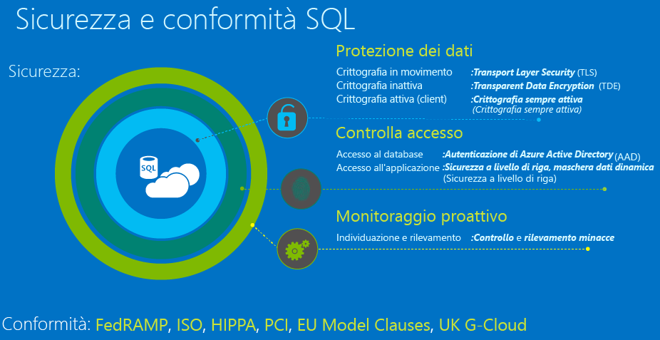

# Protezione del Database SQL

In questo articolo vengono esaminate le informazioni di base relative alla protezione del livello dati di un'applicazione in cui viene utilizzato il database SQL di Azure. In particolare, questo articolo consente di iniziare a usare le risorse per la protezione dei dati, il controllo dell'accesso e il monitoraggio proattivo. Il diagramma seguente illustra i livelli di sicurezza forniti dal database SQL.

Per una panoramica completa delle funzionalità di sicurezza disponibili in tutte le versioni di SQL, vedere il [Centro sicurezza PC per il motore di database di SQL Server e per il database SQL di Azure](https://msdn.microsoft.com/library/bb510589). Ulteriori informazioni sono inoltre disponibili nel [white paper tecnico di protezione e del Database di SQL Azure](https://download.microsoft.com/download/A/C/3/AC305059-2B3F-4B08-9952-34CDCA8115A9/Security_and_Azure_SQL_Database_White_paper.pdf) (PDF).

## Proteggere i dati
Il database SQL protegge i dati in movimento con la crittografia [Transport Layer Security](https://support.microsoft.com/en-us/kb/3135244), i dati inattivi con la crittografia [Transparent Data Encryption](http://go.microsoft.com/fwlink/?LinkId=526242) e i dati in uso con la crittografia [Always Encrypted](https://msdn.microsoft.com/library/mt163865.aspx). Per informazioni sull'uso di queste funzionalità di protezione dei dati nel database SQL, vedere [Data protection and security](sql-database-protect-data.md) (Protezione e sicurezza dei dati).

> [!IMPORTANT]
>Tutte le connessioni al database SQL di Azure richiedono la crittografia SSL/TLS (SSL/TLS) in qualsiasi caso quando i dati sono "in transito" da e verso il database in qualsiasi momento. Nella stringa di connessione dell'applicazione, è necessario specificare parametri per crittografare la connessione e *non* considerare attendibile il certificato del server (ciò viene eseguito automaticamente se si copia la stringa di connessione dal portale di Azure classico), in caso contrario durante le connessioni non verrà verificata l'identità del server e saranno possibili attacchi "man-in-the-middle". Per il driver ADO.NET, ad esempio, questi parametri della stringa di connessione sono **Encrypt=True** e **TrustServerCertificate=False**. 

Per altri modi di crittografare i dati, considerare quanto segue:

* [Crittografia a livello di cella](https://msdn.microsoft.com/library/ms179331.aspx) per crittografare colonne specifiche o anche celle di dati con chiavi di crittografia diverse.
* Se è necessario un modulo di sicurezza Hardware o la gestione centralizzata della gerarchia di chiavi di crittografia, è consigliabile utilizzare l' [insieme di credenziali chiave di Azure con SQL Server in una relativa macchina virtuale](http://blogs.technet.com/b/kv/archive/2015/01/12/using-the-key-vault-for-sql-server-encryption.aspx).

## Controllare l'accesso
Il database SQL protegge i dati limitando l'accesso al database usando regole del firewall, i meccanismi di autenticazione che richiedono agli utenti di dimostrare la propria identità e l'autorizzazione per i dati tramite le appartenenze basate sui ruoli e le autorizzazioni, oltre che tramite la sicurezza a livello di riga e la maschera dati dinamica. Per informazioni sull'uso delle funzionalità di controllo dell'accesso nel database SQL, vedere [Control access](sql-database-control-access.md) (Controllare l'accesso).

> [!IMPORTANT]
> La gestione dei database e dei server logici in Azure è controllata dalle assegnazioni di ruolo dell'account del portale utenti. Per ulteriori informazioni su questo argomento, vedere [Controllo di accesso basato sui ruoli nel portale di Azure](../active-directory/role-based-access-control-configure.md).
>

### Firewall e regole del firewall
Per proteggere i dati, il firewall impedisce qualsiasi accesso al server di database finché non vengono specificati i computer autorizzati usando le [regole del firewall](sql-database-firewall-configure.md). Il firewall concede l'accesso ai database in base all'indirizzo IP di origine di ogni richiesta.

### Autenticazione
Per autenticazione del database SQL si intende il modo in cui viene dimostrata la propria identità durante la connessione al database. Il database SQL supporta due tipi di autenticazione:

* **Autenticazione SQL**, che usa nome utente e password. Durante la creazione del server logico per il database, è stato specificato un account di accesso "amministratore del server" con un nome utente e una password. Utilizzando queste credenziali, è possibile essere autenticati in qualsiasi database di tale server in qualità di proprietario del database o "dbo". 
* **Autenticazione di Azure Active Directory**, che usa identità gestite da Azure Active Directory ed è supportata per domini gestiti e integrati. [Quando possibile](https://msdn.microsoft.com/library/ms144284.aspx), usare l'autenticazione di Active Directory (sicurezza integrata). Se si desidera utilizzare l'autenticazione di Azure Active Directory, è necessario creare un altro amministratore del server denominato "admin Azure AD," che è autorizzato ad amministrare utenti e gruppi di Azure AD. Questo amministratore può inoltre eseguire tutte le operazioni che un amministratore del server regolare può fare. Vedere [Connessione al Database SQL utilizzando l'autenticazione di Azure Active Directory](sql-database-aad-authentication.md) per una procedura dettagliata di come creare un amministratore di Azure AD per abilitare l'autenticazione di Azure Active Directory.

### Authorization
Per autorizzazione si intendono le operazioni che l'utente può eseguire in un database SQL di Azure, che sono controllate dalle appartenenze ai ruoli del database e dalle autorizzazioni a livello di oggetto dell'account utente. Come procedura consigliata, è opportuno concedere agli utenti i privilegi minimi necessari. L'account di amministrazione del server a cui ci si sta connettendo è un membro del ruolo db_owner, che è autorizzato a eseguire qualsiasi operazione all'interno del database. Salvare questo account per la distribuzione degli aggiornamenti allo schema e altre operazioni di gestione. Utilizzare l'account "ApplicationUser" con autorizzazioni più limitate per la connessione dall'applicazione al database con i privilegi minimi richiesti dall'applicazione.

### Sicurezza a livello di riga
La sicurezza a livello di riga consente ai clienti di controllare l'accesso alle righe in una tabella di database in base alle caratteristiche dell'utente che esegue una query, ad esempio l'appartenenza a un gruppo o il contesto di esecuzione. Per altre informazioni, vedere [Sicurezza a livello di riga](https://msdn.microsoft.com/library/dn765131).

### Maschera dati 
Il mascheramento dei dati dinamici del database SQL limita l'esposizione dei dati sensibili, nascondendoli agli utenti senza privilegi. La maschera dati dinamica individua automaticamente dati potenzialmente sensibili nel database SQL di Azure e fornisce indicazioni pratiche per il mascheramento di questi campi, con un impatto minimo sul livello applicazione. Questa funzionalità si basa sull'offuscamento dei dati sensibili nel set dei risultati di una query su campi designati del database, mentre i dati del database non subiscono modifiche. Per altre informazioni sull'uso di questa funzionalità per limitare l'esposizione di dati sensibili, vedere [Introduzione alla Maschera dati dinamica del database SQL](sql-database-dynamic-data-masking-get-started.md).

## Monitoraggio proattivo
Il database SQL protegge i dati fornendo funzionalità di controllo e di rilevamento delle minacce. 

### Controllo
Il servizio di controllo del database SQL tiene traccia delle attività del database e consente di gestire la conformità alle normative, registrando gli eventi del database in un log di controllo nell'account di archiviazione di Azure. Il servizio di controllo consente di conoscere le attività del database in corso e di analizzare ed esaminare l'attività cronologica per identificare potenziali minacce o uso improprio sospetto e violazioni della sicurezza. Per altre informazioni, vedere [Introduzione al controllo del database SQL](sql-database-auditing-get-started.md).  

### Servizio di controllo e rilevamento delle minacce 
Il servizio di controllo del database SQL tiene traccia delle attività del database e consente di gestire la conformità alle normative, registrando gli eventi del database in un log di controllo nell'account di archiviazione di Azure. Il servizio di controllo consente di conoscere le attività del database in corso e di analizzare ed esaminare l'attività cronologica per identificare potenziali minacce o uso improprio sospetto e violazioni della sicurezza. Per altre informazioni, vedere [Introduzione al controllo del database SQL](sql-database-auditing-get-started.md).  
 
Il rilevamento delle minacce è complementare al controllo perché offre un livello aggiuntivo di informazioni sulla sicurezza integrato nel servizio del database SQL di Azure, oltre a riconoscere, profilare e rilevare attività anomale del database. L'utente verrà avvisato di attività sospette, vulnerabilità potenziali, attacchi SQL injection e modelli di accesso al database anomali. È possibile rispondere agli avvisi seguendo le informazioni fornite e le istruzioni operative. Per altre informazioni, vedere l' [Introduzione al rilevamento delle minacce nel database SQL](sql-database-threat-detection-get-started.md).  
 
### Maschera dati 
Il mascheramento dei dati dinamici del database SQL limita l'esposizione dei dati sensibili, nascondendoli agli utenti senza privilegi. La maschera dati dinamica individua automaticamente dati potenzialmente sensibili nel database SQL di Azure e fornisce indicazioni pratiche per il mascheramento di questi campi, con un impatto minimo sul livello applicazione. Questa funzionalità si basa sull'offuscamento dei dati sensibili nel set dei risultati di una query su campi designati del database, mentre i dati del database non subiscono modifiche. Per altre informazioni, vedere [Introduzione alla maschera dati dinamica del database SQL](sql-database-dynamic-data-masking-get-started.md)
 
## Conformità
Oltre alle caratteristiche e alle funzionalità che consentono all'applicazione di soddisfare i diversi requisiti di conformità di sicurezza, il database SQL di Azure prende parte inoltre a controlli regolari ed ha ottenuto la certificazione per diversi standard di conformità. Per ulteriori informazioni, vedere il [Centro protezione di Microsoft Azure](https://azure.microsoft.com/support/trust-center/), dove è possibile trovare l'elenco più recente di [certificazioni di conformità del database SQL](https://azure.microsoft.com/support/trust-center/services/).

## Passaggi successivi

- Per informazioni sull'uso delle funzionalità di protezione dei dati nel database SQL, vedere l'articolo su [protezione e sicurezza dei dati](sql-database-protect-data.md).
- Per informazioni sull'uso delle funzionalità di controllo dell'accesso nel database SQL, vedere [Control access](sql-database-control-access.md) (Controllare l'accesso).
- Per informazioni sul monitoraggio proattivo, vedere [Introduzione al controllo del database SQL](sql-database-auditing-get-started.md) e [Introduzione al rilevamento delle minacce nel database SQL](sql-database-threat-detection-get-started.md).

<!--HONumber=Jan17_HO2-->

