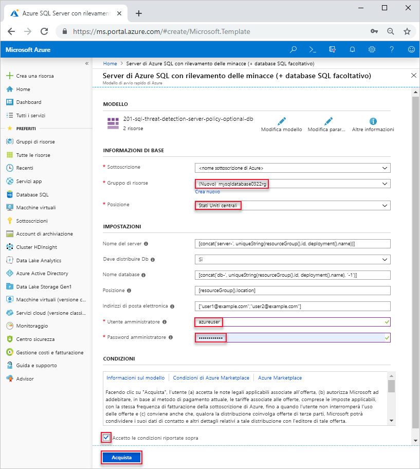

# <a name="quickstart-create-a-single-database-in-azure-sql-database-using-the-azure-resource-manager-template"></a>Avvio rapido: Creare un database singolo nel database SQL di Azure usando il modello di Azure Resource Manager

La creazione di un [database singolo](sql-database-single-database.md) è l'opzione di distribuzione più semplice e rapida per la creazione di database nel database SQL di Azure. Questo argomento di avvio rapido descrive come creare un database singolo usando il modello di Azure Resource Manager. Per altre informazioni, vedere la [documentazione di Azure Resource Manager](/azure/azure-resource-manager/).

Se non si ha una sottoscrizione di Azure, [creare un account gratuito](https://azure.microsoft.com/free/).

## <a name="create-a-single-database"></a>Creare un database singolo

Un database singolo include un set definito di risorse di calcolo, memoria, I/O e archiviazione basate su uno dei due [modelli di acquisto](sql-database-purchase-models.md). Quando si crea un database singolo, si definisce anche un [server di database SQL](sql-database-servers.md) per gestirlo e lo si inserisce all'interno di un [gruppo di risorse di Azure](../azure-resource-manager/resource-group-overview.md) in un'area geografica specificata.

Il file JSON seguente è il modello usato in questo articolo. Il modello viene archiviato in un account di archiviazione di Azure. Altri esempi di modelli di database SQL di Azure sono disponibili [qui](https://azure.microsoft.com/resources/templates/?resourceType=Microsoft.Sql&pageNumber=1&sort=Popular).

```json
{
  "$schema": "https://schema.management.azure.com/schemas/2015-01-01/deploymentTemplate.json#",
  "contentVersion": "1.0.0.0",
  "parameters": {
    "serverName": {
      "type": "string",
      "defaultValue": "[concat('server-', uniqueString(resourceGroup().id, deployment().name))]",
      "metadata": {
        "description": "Name for the SQL server"
      }
    },
    "shouldDeployDb": {
      "type": "string",
      "allowedValues": [
        "Yes",
        "No"
      ],
      "defaultValue": "Yes",
      "metadata": {
        "description": "Whether an Azure SQL Database should be deployed under the server"
      }
    },
    "databaseName": {
      "type": "string",
      "defaultValue": "[concat('db-', uniqueString(resourceGroup().id, deployment().name), '-1')]",
      "metadata": {
        "description": "Name for the SQL database under the SQL server"
      }
    },
    "location": {
      "type": "string",
      "defaultValue": "[resourceGroup().location]",
      "metadata": {
        "description": "Location for server and optional DB"
      }
    },
    "emailAddresses": {
      "type": "array",
      "defaultValue": [
        "user1@example.com",
        "user2@example.com"
      ],
      "metadata": {
        "description": "Email addresses for receiving alerts"
      }
    },
    "adminUser": {
      "type": "string",
      "metadata": {
        "description": "Username for admin"
      }
    },
    "adminPassword": {
      "type": "securestring",
      "metadata": {
        "description": "Password for admin"
      }
    }
  },
  "variables": {
    "databaseServerName": "[toLower(parameters('serverName'))]",
    "databaseName": "[parameters('databaseName')]",
    "shouldDeployDb": "[parameters('shouldDeployDb')]",
    "databaseServerLocation": "[parameters('location')]",
    "databaseServerAdminLogin": "[parameters('adminUser')]",
    "databaseServerAdminLoginPassword": "[parameters('adminPassword')]",
    "emailAddresses": "[parameters('emailAddresses')]"
  },
  "resources": [
    {
      "type": "Microsoft.Sql/servers",
      "name": "[variables('databaseServerName')]",
      "location": "[variables('databaseServerLocation')]",
      "apiVersion": "2015-05-01-preview",
      "properties": {
        "administratorLogin": "[variables('databaseServerAdminLogin')]",
        "administratorLoginPassword": "[variables('databaseServerAdminLoginPassword')]",
        "version": "12.0"
      },
      "tags": {
        "DisplayName": "[variables('databaseServerName')]"
      },
      "resources": [
        {
          "type": "securityAlertPolicies",
          "name": "DefaultSecurityAlert",
          "apiVersion": "2017-03-01-preview",
          "dependsOn": [
            "[variables('databaseServerName')]"
          ],
          "properties": {
            "state": "Enabled",
            "emailAddresses": "[variables('emailAddresses')]",
            "emailAccountAdmins": true
          }
        }
      ]
    },
    {
      "condition": "[equals(variables('shouldDeployDb'), 'Yes')]",
      "type": "Microsoft.Sql/servers/databases",
      "name": "[concat(string(variables('databaseServerName')), '/', string(variables('databaseName')))]",
      "location": "[variables('databaseServerLocation')]",
      "apiVersion": "2017-10-01-preview",
      "dependsOn": [
        "[concat('Microsoft.Sql/servers/', variables('databaseServerName'))]"
      ],
      "properties": {},
      "tags": {
        "DisplayName": "[variables('databaseServerName')]"
      }
    }
  ]
}
```

1. Selezionare l'immagine seguente per accedere ad Azure e aprire un modello.

    <a href="https://portal.azure.com/#create/Microsoft.Template/uri/https%3A%2F%2Farmtutorials.blob.core.windows.net%2Fcreatesql%2Fazuredeploy.json"></a>

2. Selezionare o immettere i valori seguenti.  

    

    Se non diversamente specificato, usare i valori predefiniti.

    * **Sottoscrizione**: selezionare una sottoscrizione di Azure.
    * **Gruppo di risorse**: selezionare **Crea nuovo**, immettere un nome univoco per il gruppo di risorse e quindi fare clic su **OK**. 
    * **Località**: selezionare una località.  Ad esempio **Stati Uniti centrali**.
    * **Utente amministratore**: specificare il nome utente di un amministratore del server di database SQL.
    * **Password amministratore**: specificare la password dell'amministratore. 
    * **Accetto le condizioni riportate sopra**: selezionare questa casella.
3. Selezionare **Acquisto**.

## <a name="query-the-database"></a>Eseguire query sul database

Per eseguire query sul database, vedere [Eseguire query sul database](./sql-database-single-database-get-started.md#query-the-database).

## <a name="clean-up-resources"></a>Pulire le risorse

Se si vuole procedere con i [Passaggi successivi](#next-steps), conservare il gruppo di risorse, il server di database e il database singolo. I passaggi successivi illustrano come connettersi al database ed eseguire query con diversi metodi.

Per eliminare il gruppo di risorse mediante l'interfaccia della riga di comando di Azure oppure Azure PowerShell:

```azurecli-interactive
echo "Enter the Resource Group name:" &&
read resourceGroupName &&
az group delete --name $resourceGroupName 
```

```azurepowershell-interactive
$resourceGroupName = Read-Host -Prompt "Enter the Resource Group name"
Remove-AzResourceGroup -Name $resourceGroupName 
```

## <a name="next-steps"></a>Passaggi successivi

- Creare una regola del firewall a livello di server per connettersi al database singolo da strumenti locali o remoti. Per altre informazioni, vedere [Creare una regola di firewall a livello di server](sql-database-server-level-firewall-rule.md).
- Dopo aver creato una regola del firewall a livello di server, [connettersi al database ed eseguire query](sql-database-connect-query.md) usando diversi strumenti e linguaggi.
  - [Connettersi ed eseguire query usando SQL Server Management Studio](sql-database-connect-query-ssms.md)
  - [Connettersi ed eseguire query usando Azure Data Studio](https://docs.microsoft.com/sql/azure-data-studio/quickstart-sql-database?toc=/azure/sql-database/toc.json)
- Per creare un database singolo usando l'interfaccia della riga di comando di Azure, vedere [Esempi di interfaccia della riga di comando di Azure](sql-database-cli-samples.md).
- Per creare un database singolo usando Azure PowerShell, vedere [Esempi di Azure PowerShell](sql-database-powershell-samples.md).
