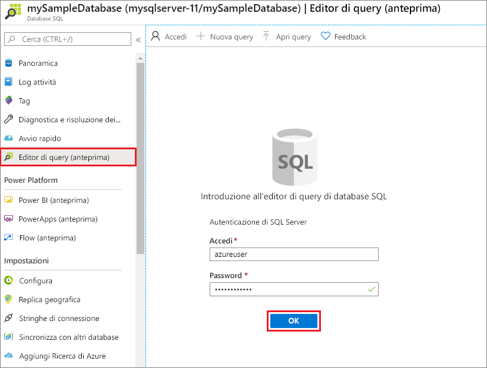
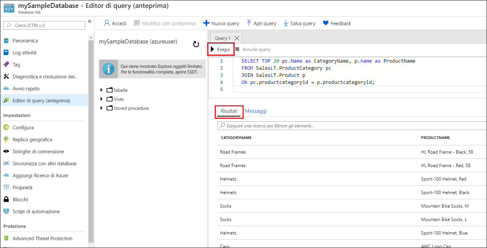

# <a name="quickstart-create-an-azure-sql-database-single-database"></a>Guida introduttiva: Crea un database SQL di Azure singolo

In questo argomento di avvio rapido si usa il portale di Azure, uno script di Azure PowerShell o uno script dell'interfaccia della riga di comando di Azure per creare un database SQL di Azure singolo. È quindi possibile eseguire query sul database con l'**editor di query** nel portale di Azure. 

Un [database singolo](sql-database-single-database.md) è l'opzione di distribuzione più semplice e rapida per Database SQL di Azure. È possibile gestire un database singolo all'interno di un [server di database SQL](sql-database-servers.md), che si trova in un [gruppo di risorse di Azure ](../azure-resource-manager/management/overview.md) in un'area di Azure specificata. In questo argomento di avvio rapido vengono creati un nuovo gruppo di risorse e un server SQL per il nuovo database.

È quindi possibile creare un database singolo nel livello di calcolo *con provisioning* o *serverless*. Per un database con provisioning viene preallocata una quantità fissa di risorse di calcolo, tra cui CPU e memoria, e viene usato uno dei due [modelli di acquisto](sql-database-purchase-models.md) disponibili. In questo argomento di avvio rapido viene creato un database con provisioning usando il modello di acquisto [basato su vCore](sql-database-service-tiers-vcore.md), ma è anche possibile scegliere un modello [basato su unità di elaborazione di database](sql-database-service-tiers-DTU.md). 

Il livello di calcolo serverless è disponibile solo nel modello di acquisto basato su vCore e include una gamma di risorse di calcolo ridimensionate automaticamente, tra cui CPU e memoria. Per creare un database singolo nel livello di calcolo serverless, vedere [Creare database serverless](sql-database-serverless.md#create-new-database-in-serverless-compute-tier).

## <a name="prerequisite"></a>Prerequisito

- Una sottoscrizione di Azure attiva. Se non se ne ha una, [creare un account gratuito](https://azure.microsoft.com/free/). 

## <a name="create-a-single-database"></a>Creare un database singolo

[!INCLUDE [sql-database-create-single-database](includes/sql-database-create-single-database.md)]

## <a name="query-the-database"></a>Eseguire query sul database

Dopo aver creato il database, è possibile usare l'**editor di query** predefinito per portale di Azure per connettersi ed eseguire query sui dati.

1. Nel portale cercare e selezionare **Database SQL**, quindi selezionare il database nell'elenco.
1. Nella pagina **Database SQL** del database selezionare **Editor di query (anteprima)** nel menu a sinistra.
1. Immettere le credenziali di accesso di amministratore server e selezionare **OK**.
   
   

1. Immettere la query seguente nel riquadro **Editor di query**.

   ```sql
   SELECT TOP 20 pc.Name as CategoryName, p.name as ProductName
   FROM SalesLT.ProductCategory pc
   JOIN SalesLT.Product p
   ON pc.productcategoryid = p.productcategoryid;
   ```

1. Selezionare **Esegui** e quindi esaminare i risultati della query nel riquadro **Risultati**.

   

1. Chiudere la pagina **Editor di query** e selezionare **OK** quando richiesto per rimuovere le modifiche non salvate.

## <a name="clean-up-resources"></a>Pulire le risorse

Mantenere il gruppo di risorse, il server e il database singolo per procedere con i passaggi successivi e acquisire informazioni su come connettersi al database ed eseguire query con metodi diversi.

Dopo aver finito di usare queste risorse, è possibile eliminare il gruppo di risorse creato, eliminando in questo modo anche il server e il database singolo al suo interno.

### <a name="portal"></a>[Portale](#tab/azure-portal)

Per eliminare **myResourceGroup** e tutte le relative risorse con il portale di Azure:

1. Nel portale cercare e selezionare **Gruppi di risorse** e quindi selezionare **myResourceGroup** nell'elenco.
1. Nella pagina del gruppo di risorse selezionare **Elimina gruppo di risorse**.
1. In **Digitare il nome del gruppo di risorse** immettere *myResourceGroup* e quindi selezionare **Elimina**.

### <a name="azure-cli"></a>[Interfaccia della riga di comando di Azure](#tab/azure-cli)

Per eliminare il gruppo di risorse e tutte le relative risorse, eseguire il comando dell'interfaccia della riga di comando di Azure seguente usando il nome del gruppo di risorse:

```azurecli-interactive
az group delete --name <your resource group>
```

### <a name="powershell"></a>[PowerShell](#tab/azure-powershell)

Per eliminare il gruppo di risorse e tutte le relative risorse, eseguire il cmdlet di PowerShell seguente, usando il nome del gruppo di risorse:

```azurepowershell-interactive
Remove-AzResourceGroup -Name <your resource group>
```

---

## <a name="next-steps"></a>Passaggi successivi

[Connettersi ed eseguire query](sql-database-connect-query.md) sul database con strumenti e linguaggi diversi:
> [!div class="nextstepaction"]
> [Connettersi ed eseguire query usando SQL Server Management Studio](sql-database-connect-query-ssms.md)
> 
> [Connettersi ed eseguire query usando Azure Data Studio](/sql/azure-data-studio/quickstart-sql-database?toc=/azure/sql-database/toc.json)
