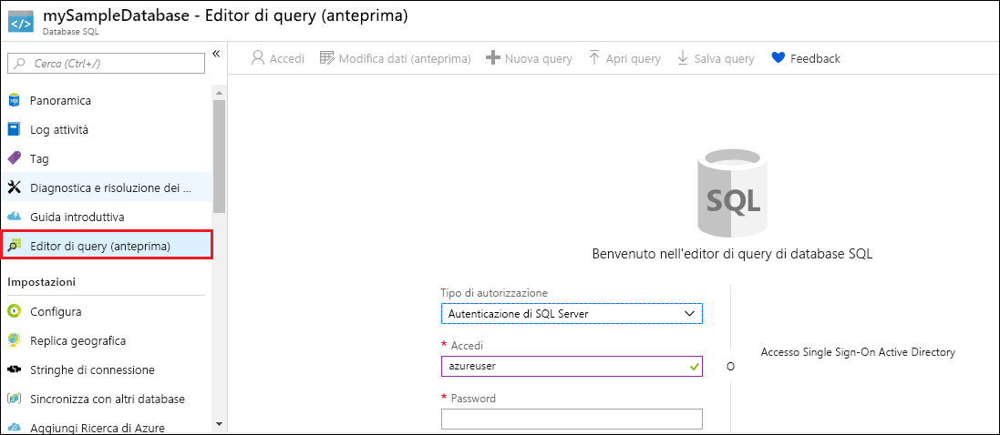

# <a name="quickstart-create-a-single-database-in-azure-sql-database-using-the-azure-portal"></a>Guida introduttiva: Creare un database singolo del database SQL di Azure usando il portale di Azure

La creazione di un [database singolo](sql-database-single-database.md) è l'opzione di distribuzione più semplice e rapida per la creazione di database nel database SQL di Azure. Questa guida introduttiva mostra come creare un database singolo e quindi eseguire query usando il portale di Azure.

Se non si ha una sottoscrizione di Azure, [creare un account gratuito](https://azure.microsoft.com/free/).

Per tutti i passaggi di questa guida introduttiva, accedere al [portale di Azure](https://portal.azure.com/).

## <a name="create-a-single-database"></a>Creare un database singolo

Un database singolo include un set definito di risorse di calcolo, memoria, I/O e archiviazione basate su uno dei due [modelli di acquisto](sql-database-purchase-models.md). Quando si crea un database singolo, si definisce anche un [server di database SQL](sql-database-servers.md) per gestirlo e lo si inserisce all'interno di un [gruppo di risorse di Azure](../azure-resource-manager/resource-group-overview.md) in un'area geografica specificata.

Per creare un database singolo contenente i dati di esempio di AdventureWorksLT:

1. Selezionare **Crea risorsa** nell'angolo superiore sinistro del portale di Azure.
2. Selezionare **Database** e quindi **Database SQL**.
3. Nel modulo **Crea database SQL** digitare o selezionare i valori riportati di seguito.

   - **Nome database**: immettere *mySampleDatabase*.
   - **Sottoscrizione** se non è già visualizzata, selezionare la sottoscrizione corretta nell'elenco a discesa.
   - **Gruppo di risorse**: selezionare **Crea nuovo**, digitare *myResourceGroup* e selezionare **OK**.
   - **Selezionare l'origine**: selezionare **Sample (AdventureWorksLT)** nell'elenco a discesa.

     > [!IMPORTANT]
     > Assicurarsi di selezionare i dati di **Sample (AdventureWorksLT)** per poter seguire questa e le altre guide introduttive per il database SQL di Azure in cui vengono usati tali dati.
  
   

4. In **Server** selezionare **Crea nuovo**.
5. Nel modulo **Nuovo server** digitare o selezionare i valori riportati di seguito.

   - **Nome server**: immettere *mysqlserver*.
   - **Account di accesso amministratore server**: digitare *azureuser*.
   - **Password**: immettere *Azure1234567*.
   - **Conferma password**: digitare nuovamente la password.
   - **Località**: selezionare qualsiasi località valida nell'elenco a discesa.  

   > [!IMPORTANT]
   > Ricordarsi di prendere nota dell'account di accesso amministratore del server e della password per poter accedere al server e ai database per questa e le altre guide introduttive. Se si dimentica l'account di accesso o la password, è possibile recuperare il nome di accesso o reimpostare la password nella pagina **SQL Server**. Per aprire la pagina **SQL Server**, selezionare il nome del server nella pagina **Panoramica** del database dopo che questo è stato creato.

    

6. Scegliere **Seleziona**.
7. Nel modulo **Database SQL** selezionare **Piano tariffario**. Esaminare la quantità di DTU e spazio di archiviazione disponibile per ogni livello di servizio.

   > [!NOTE]
   > Questa guida introduttiva usa il [modello di acquisto basato su DTU](sql-database-service-tiers-dtu.md), ma è disponibile anche il [modello di acquisto basato su vCore](sql-database-service-tiers-vcore.md).
   > [!IMPORTANT]
   > Nel livello Premium è attualmente disponibile uno spazio di archiviazione superiore a 1 TB in tutte le aree tranne Cina orientale, Cina settentrionale, Germania centrale, Germania nord-orientale, Stati Uniti centro-occidentali, aree US DoD e US Government (area centrale). In queste aree la quantità massima di spazio di archiviazione nel livello Premium è limitata a 1 TB.  Per altre informazioni, vedere le [limitazioni correnti di P11 e P15](sql-database-single-database-scale.md#dtu-based-purchasing-model-limitations-of-p11-and-p15-when-the-maximum-size-greater-than-1-tb).  

8. Per questa guida introduttiva selezionare il livello di servizio **Standard** e quindi usare il dispositivo di scorrimento per selezionare **10 DTU (S0)** e **1** GB di spazio di archiviazione.
9. Selezionare **Applica**.  

   

10. Nel modulo **Database SQL** selezionare **Crea** per distribuire il gruppo di risorse, il server e il database ed effettuarne il provisioning.

    La distribuzione richiede alcuni minuti. È possibile selezionare **Notifiche** sulla barra degli strumenti per monitorare lo stato di avanzamento della distribuzione.

    

## <a name="query-the-database"></a>Eseguire query sul database

Dopo aver creato il database, usare lo strumento di query predefinito nel portale di Azure per connettersi ed eseguire query sui dati.

1. Nella pagina **Database SQL** del database selezionare **Editor di query (anteprima)** nel menu a sinistra.

   

2. Immettere le informazioni di accesso e selezionare **OK**.
3. Immettere la query seguente nel riquadro **Editor di query**.

   ```sql
   SELECT TOP 20 pc.Name as CategoryName, p.name as ProductName
   FROM SalesLT.ProductCategory pc
   JOIN SalesLT.Product p
   ON pc.productcategoryid = p.productcategoryid;
   ```

4. Selezionare **Esegui** e quindi esaminare i risultati della query nel riquadro **Risultati**.

   

5. Chiudere la pagina **Editor di query** e selezionare **OK** quando richiesto per rimuovere le modifiche non salvate.

## <a name="clean-up-resources"></a>Pulire le risorse

Se si vuole procedere con i [Passaggi successivi](#next-steps), conservare il gruppo di risorse, il server di database e il database singolo. I passaggi successivi illustrano come connettersi al database ed eseguire query con diversi metodi.

Al termine, sarà possibile eliminare queste risorse come segue:

1. Nel menu a sinistra nel portale di Azure selezionare **Gruppi di risorse** e quindi **myResourceGroup**.
2. Nella pagina del gruppo di risorse selezionare **Elimina gruppo di risorse**.
3. Immettere *myResourceGroup* nel campo e quindi selezionare **Elimina**.

## <a name="next-steps"></a>Passaggi successivi

- Creare una regola del firewall a livello di server per connettersi al database singolo da strumenti locali o remoti. Per altre informazioni, vedere [Creare una regola di firewall a livello di server](sql-database-server-level-firewall-rule.md).
- Dopo aver creato una regola del firewall a livello di server, [connettersi al database ed eseguire query](sql-database-connect-query.md) usando diversi strumenti e linguaggi.
  - [Connettersi ed eseguire query usando SQL Server Management Studio](sql-database-connect-query-ssms.md)
  - [Connettersi ed eseguire query usando Azure Data Studio](https://docs.microsoft.com/sql/azure-data-studio/quickstart-sql-database?toc=/azure/sql-database/toc.json)
- Per creare un database singolo usando l'interfaccia della riga di comando di Azure, vedere [Esempi di interfaccia della riga di comando di Azure](sql-database-cli-samples.md).
- Per creare un database singolo usando Azure PowerShell, vedere [Esempi di Azure PowerShell](sql-database-powershell-samples.md).
