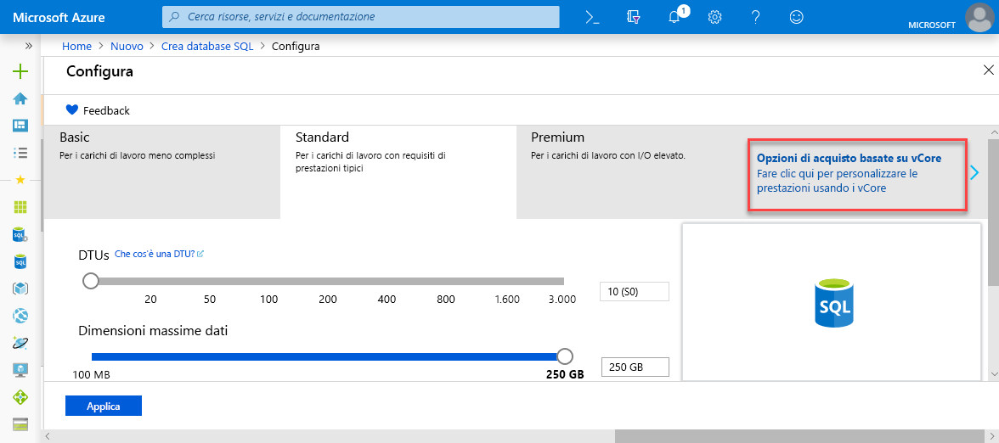
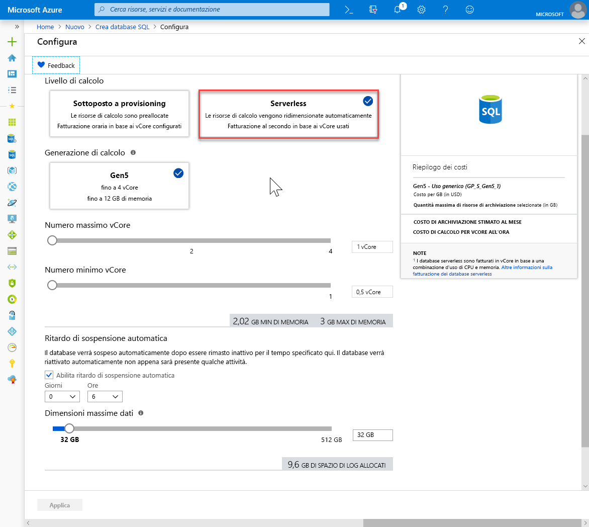

# <a name="quickstart-create-a-single-database-in-azure-sql-database-using-the-azure-portal"></a>Guida introduttiva: Creare un database singolo del database SQL di Azure usando il portale di Azure

La creazione di un [database singolo](sql-database-single-database.md) è l'opzione di distribuzione più semplice e rapida per la creazione di database nel database SQL di Azure. Questa guida introduttiva mostra come creare un database singolo e quindi eseguire query usando il portale di Azure.

Se non si ha una sottoscrizione di Azure, [creare un account gratuito](https://azure.microsoft.com/free/).

Per tutti i passaggi di questa guida introduttiva, accedere al [portale di Azure](https://portal.azure.com/).

## <a name="create-a-single-database"></a>Creare un database singolo

Un database singolo può essere creato al livello di elaborazione con provisioning o serverless (anteprima).

- Un database singolo nel livello di elaborazione con provisioning dispone di una quantità definita di risorse di elaborazione preassegnate, oltre a un set di memoria e a risorse di archiviazione che usano uno dei due [modelli di acquisto](sql-database-purchase-models.md).
- Un database singolo nel livello di elaborazione serverless dispone di una gamma di risorse di elaborazione che vengono ridimensionate automaticamente, oltre a una quantità specifica di memoria per core e a una quantità specifica di risorse di archiviazione, ed è disponibile solo nei [modelli di acquisto basati su vCore](sql-database-service-tiers-vcore.md).

Quando si crea un database singolo, si definisce anche un [server di database SQL](sql-database-servers.md) per gestirlo e lo si inserisce all'interno di un [gruppo di risorse di Azure](../azure-resource-manager/resource-group-overview.md) in un'area geografica specificata.

> [!NOTE]
> Questo argomento di avvio rapido usa il [modello di acquisto basato su vCore](sql-database-service-tiers-vcore.md) e il livello di elaborazione [serverless](sql-database-serverless.md), ma è disponibile anche il [modello di acquisto basato su DTU](sql-database-service-tiers-DTU.md).

Per creare un database singolo contenente i dati di esempio di AdventureWorksLT:

1. Selezionare **Crea risorsa** nell'angolo superiore sinistro del portale di Azure.
2. Selezionare **Database** e quindi **Database SQL** per aprire la pagina **Crea database SQL**.

   

3. Nella sezione **Dettagli del progetto** della scheda **Generale** digitare o selezionare i valori seguenti:

   - **Sottoscrizione** se non è già visualizzata, selezionare la sottoscrizione corretta nell'elenco a discesa.
   - **Gruppo di risorse**: selezionare **Crea nuovo**, digitare `myResourceGroup` e selezionare **OK**.

     

4. Nella sezione **Dettagli del database** digitare o selezionare i valori seguenti:

   - **Nome database**: Immettere `mySampleDatabase`.
   - **Server**: selezionare **Crea nuovo** e immettere i valori seguenti, quindi scegliere **Selezionare**.
       - **Nome server**: digitare `mysqlserver`, oltre ad alcuni numeri per garantire l'univocità.
       - **Account di accesso amministratore server**: Digitare `azureuser`.
       - **Password**: Digitare una password complessa che soddisfi i corrispondenti requisiti.
       - **Località**: scegliere una località dall'elenco a discesa, ad esempio `West US 2`.

         

      > [!IMPORTANT]
      > Ricordarsi di prendere nota dell'account di accesso amministratore del server e della password per poter accedere al server e ai database per questa e le altre guide introduttive. Se si dimentica l'account di accesso o la password, è possibile recuperare il nome di accesso o reimpostare la password nella pagina **SQL Server**. Per aprire la pagina **SQL Server**, selezionare il nome del server nella pagina **Panoramica** del database dopo che questo è stato creato.

        

   - **Usare il pool elastico SQL?** : selezionare l'opzione **No**.
   - **Calcolo e archiviazione**: Selezionare **Configura database** e, per questo argomento di avvio rapido, selezionare **Opzioni di acquisto basate su vCore**

     

   - Selezionare **Serverless**.

     

   - Rivedere le impostazioni per **Numero massimo vCore**, **Numero minimo vCore**, **Ritardo di sospensione automatica** e **Dimensioni massime dati**. Modificare tali impostazioni in base alle esigenze.
   - Accettare le condizioni preliminari e fare clic su **OK**.
   - Selezionare **Applica**.

5. Selezionare la scheda **Impostazioni aggiuntive**. 
6. Nella sezione **Origine dati**, in **Usa dati esistenti**, selezionare `Sample`. 

   

   > [!IMPORTANT]
   > Assicurarsi di selezionare i dati di **Sample (AdventureWorksLT)** per poter seguire questa e le altre guide introduttive per il database SQL di Azure in cui vengono usati tali dati.

7. Lasciare i restanti valori predefiniti e selezionare **Rivedi e crea** in basso nel modulo.
8. Rivedere le impostazioni finali e selezionare **Crea**.

9. Nel modulo **Database SQL** selezionare **Crea** per distribuire il gruppo di risorse, il server e il database ed effettuarne il provisioning.

## <a name="query-the-database"></a>Eseguire query sul database

Dopo aver creato il database, usare lo strumento di query predefinito nel portale di Azure per connettersi ed eseguire query sui dati.

1. Nella pagina **Database SQL** del database selezionare **Editor di query (anteprima)** nel menu a sinistra.

   

2. Immettere le informazioni di accesso e selezionare **OK**.
3. Immettere la query seguente nel riquadro **Editor di query**.

   ```sql
   SELECT TOP 20 pc.Name as CategoryName, p.name as ProductName
   FROM SalesLT.ProductCategory pc
   JOIN SalesLT.Product p
   ON pc.productcategoryid = p.productcategoryid;
   ```

4. Selezionare **Esegui** e quindi esaminare i risultati della query nel riquadro **Risultati**.

   

5. Chiudere la pagina **Editor di query** e selezionare **OK** quando richiesto per rimuovere le modifiche non salvate.

## <a name="clean-up-resources"></a>Pulire le risorse

Se si vuole procedere con i [Passaggi successivi](#next-steps), conservare il gruppo di risorse, il server di database e il database singolo. I passaggi successivi illustrano come connettersi al database ed eseguire query con diversi metodi.

Al termine, sarà possibile eliminare queste risorse come segue:

1. Nel menu a sinistra nel portale di Azure selezionare **Gruppi di risorse** e quindi **myResourceGroup**.
2. Nella pagina del gruppo di risorse selezionare **Elimina gruppo di risorse**.
3. Immettere *myResourceGroup* nel campo e quindi selezionare **Elimina**.

## <a name="next-steps"></a>Passaggi successivi

- Creare una regola del firewall a livello di server per connettersi al database singolo da strumenti locali o remoti. Per altre informazioni, vedere [Creare una regola di firewall a livello di server](sql-database-server-level-firewall-rule.md).
- Dopo aver creato una regola del firewall a livello di server, [connettersi al database ed eseguire query](sql-database-connect-query.md) usando diversi strumenti e linguaggi.
  - [Connettersi ed eseguire query usando SQL Server Management Studio](sql-database-connect-query-ssms.md)
  - [Connettersi ed eseguire query usando Azure Data Studio](https://docs.microsoft.com/sql/azure-data-studio/quickstart-sql-database?toc=/azure/sql-database/toc.json)
- Per creare un database singolo nel livello di elaborazione con provisioning usando l'interfaccia della riga di comando di Azure, vedere [Esempi di interfaccia della riga di comando di Azure](sql-database-cli-samples.md).
- Per creare un database singolo nel livello di elaborazione con provisioning usando Azure PowerShell, vedere [Esempi di Azure PowerShell](sql-database-powershell-samples.md).
- Per creare un database singolo nel livello di elaborazione serverless con Azure PowerShell, vedere [Creare database serverless con PowerShell](sql-database-serverless.md#create-new-database-in-serverless-compute-tier-using-powershell)