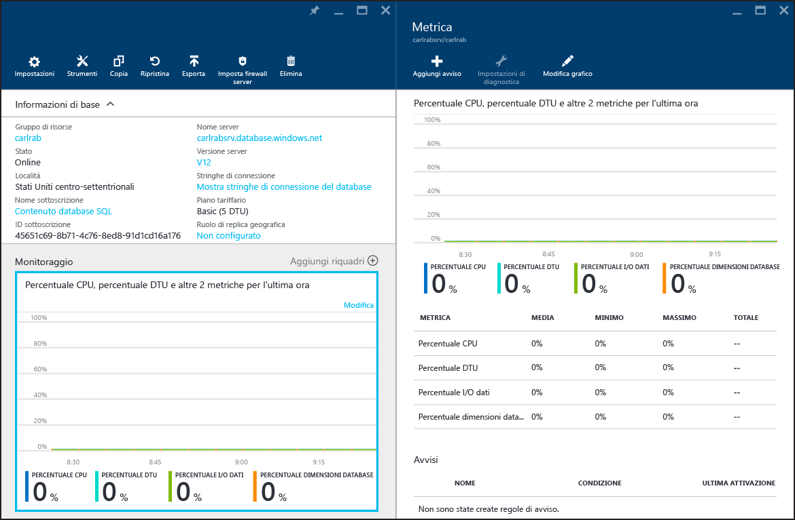

# Monitoraggio delle prestazioni del database nel database SQL di Azure
Il monitoraggio delle prestazioni di un database SQL in Azure inizia con il monitoraggio dell'utilizzo delle risorse rispetto al livello di prestazioni scelto per il database. Il monitoraggio consente di determinare se il database ha capacità in eccesso o se presenta problemi perché è stato superato il limite massimo di risorse e quindi decidere se è opportuno modificare il livello di prestazioni e il [livello di servizio](sql-database-service-tiers.md) del database. È possibile monitorare il database con strumenti grafici nel [portale di Azure](https://portal.azure.com) o con le [viste a gestione dinamica](https://msdn.microsoft.com/library/ms188754.aspx) di SQL.

## Monitorare i database tramite il portale di Azure
Nel [portale di Azure](https://portal.azure.com/) è possibile monitorare l'utilizzo di un database singolo selezionandolo e facendo clic sul grafico **Monitoraggio**. Verrà visualizzata una finestra della **metrica** in cui è possibile apportare modifiche facendo clic su l pulsante **Modifica grafico**. Aggiungere le metriche seguenti

* Percentuale CPU
* Percentuale di DTU
* Percentuale di I/O di dati
* Percentuale di dimensioni del database

Dopo aver aggiunto queste metriche, è possibile continuare a visualizzarle nel grafico di **monitoraggio** con ulteriori dettagli sulla finestra della **metrica**. Tutte le quattro metriche mostrano la percentuale media di utilizzo relativa alla **DTU** del database. Per informazioni dettagliate sulle DTU, vedere i [livelli di servizio](sql-database-service-tiers.md).

È inoltre possibile configurare gli avvisi sulle metriche delle prestazioni. Scegliere il pulsante **Aggiungi avviso** nella finestra **Metrica**. Seguire la procedura guidata per configurare l'avviso. È possibile scegliere di ricevere un avviso se la metrica supera una determinata soglia o scende al di sotto di una determinata soglia.

Ad esempio, se si prevede un aumento del carico di lavoro sul database, è possibile scegliere di configurare un avviso di posta elettronica ogni volta che il database raggiunge l'80% per una qualsiasi delle metriche delle prestazioni. È possibile utilizzarlo come un preavviso per capire quando potrebbe essere necessario passare a livello di prestazioni superiore.

Le metriche delle prestazioni consentono inoltre di determinare se è possibile effettuare il downgrade a un livello di prestazioni inferiore. Presupporre di utilizzare un database Standard S2 e tutte le metriche delle prestazioni mostrano che il database in media non utilizza più del 10% in un dato momento. È probabile che il database funzioni bene in Standard S1. Tuttavia, prestare attenzione ai picchi o alle fluttuazioni dei carichi di lavoro prima di decidere di passare a un livello di prestazioni inferiore.

## Monitorare i database con le viste a gestione dinamica
Le stesse metriche esposte nel portale sono disponibili anche tramite le viste di sistema: [sys.resource\_stats](https://msdn.microsoft.com/library/dn269979.aspx) nel database **master** logico del server e [sys.dm\_db\_resource\_stats](https://msdn.microsoft.com/library/dn800981.aspx) nel database utente. Utilizzare **sys. resource\_stats** se è necessario monitorare meno dati granulari in un periodo di tempo più lungo. Utilizzare **sys.dm\_db\_resource\_stats** se è necessario monitorare più dati granulari in un periodo di tempo più breve. Per ulteriori informazioni, vedere la [Guida alle prestazioni del database SQL di Azure](sql-database-performance-guidance.md#monitoring-resource-use-with-sysresourcestats).

> [!NOTE]
> **sys.dm\_db\_resource\_stats** restituisce un set di risultati vuoto quando viene usato nei database Web e Business Edition, che sono stati ritirati.
> 
> 

Per i pool di database elastici, è possibile monitorare i singoli database nel pool con le tecniche descritte in questa sezione. Tuttavia, è anche possibile monitorare il pool nel complesso. Per informazioni, vedere [Monitorare e gestire un pool di database elastici](sql-database-elastic-pool-manage-portal.md).

<!---HONumber=AcomDC_0928_2016-->