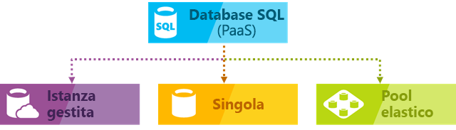

# Informazioni sul servizio database SQL di Azure

Il database SQL di Azure è un servizio gestito di database relazionale per utilizzo generico che consente di creare un livello di archiviazione dei dati a disponibilità elevata e a elevate prestazioni per le applicazioni e le soluzioni in Microsoft Azure cloud. Il database SQL può essere la scelta ideale per un'ampia gamma di applicazioni cloud moderne, perché consente di usare potenti funzionalità per l'elaborazione di dati relazionali e [strutture non relazionali](sql-database-multi-model-features.md) , ad esempio grafici, JSON, spaziali e XML. Si basa sull'ultima versione stabile del [motore di database di Microsoft SQL Server](https://docs.microsoft.com/sql/sql-server/sql-server-technical-documentation?toc=/azure/sql-database/toc.json) e consente di usare un set completo di funzionalità avanzate di elaborazione delle query, ad esempio le [tecnologie in memoria a prestazioni elevate](sql-database-in-memory.md) e l' [elaborazione intelligente delle query ](https://docs.microsoft.com/sql/relational-databases/performance/intelligent-query-processing?toc=/azure/sql-database/toc.json).
In linea con la strategia Microsoft incentrata sul cloud, le funzionalità più recenti di SQL Server vengono rilasciate prima al database SQL e poi a SQL Server. Questo approccio significa avere la possibilità di usare le funzionalità di SQL Server più nuove senza sovraccarico per l'applicazione di patch o gli aggiornamenti, oltre al vantaggio che le nuove funzionalità sono testate in milioni di database. Il database SQL consente di definire e ridimensionare facilmente le prestazioni in due diversi modelli di acquisto: un [modello di acquisto basato su vCore](sql-database-service-tiers-vcore.md) e un [modello di acquisto basato su DTU](sql-database-service-tiers-dtu.md). Il database SQL è un servizio completamente gestito che include disponibilità, backup e altre operazioni di manutenzione comuni incorporati. Microsoft gestisce senza difficoltà l'applicazione di patch e l'aggiornamento del codice SQL e del sistema operativo e sottrae tutta la gestione dell'infrastruttura sottostante.

> [!NOTE]
> Per un glossario di termini relativi al database SQL di Azure, vedere [Glossario dei termini relativi al database SQL](sql-database-glossary-terms.md)

Per la distribuzione di un database SQL di Azure sono disponibili le opzioni seguenti:

- Il [database singolo](sql-database-single-database.md) rappresenta un database isolato completamente gestito, ideale per le applicazioni cloud moderne e i microservizi che necessitano di una singola origine dati affidabile. Un singolo database è simile a un database [indipendente](https://docs.microsoft.com/sql/relational-databases/databases/contained-databases?toc=/azure/sql-database/toc.json) nel [motore di database Microsoft SQL Server](https://docs.microsoft.com/sql/sql-server/sql-server-technical-documentation?toc=/azure/sql-database/toc.json).
- [Istanza gestita](sql-database-managed-instance.md) è un'istanza completamente gestita del motore di [database Microsoft SQL Server](https://docs.microsoft.com/sql/sql-server/sql-server-technical-documentation?toc=/azure/sql-database/toc.json) contenente un set di database che possono essere utilizzati insieme. Si tratta di una scelta ideale per semplificare la migrazione dei database SQL Server locali al cloud di Azure e per le applicazioni che devono sfruttare potenti funzionalità di database fornite da SQL Server motore di database.
- Il [pool elastico](sql-database-elastic-pool.md) è una raccolta di [database singoli](sql-database-single-database.md) con un set condiviso di risorse, ad esempio CPU o memoria. I database singoli possono essere spostati all'interno e all'esterno di un pool elastico.

> [!IMPORTANT]
> Per informazioni sulle differenze tra le funzionalità del database SQL e di SQL Server, oltre che tra le diverse opzioni di distribuzione del database SQL di Azure, vedere [Funzionalità di SQL](sql-database-features.md).

Il database SQL offre prestazioni prevedibili con più tipi di risorse, livelli di servizio e dimensioni di calcolo, garantendo scalabilità dinamica senza tempi di inattività, ottimizzazione intelligente incorporata, scalabilità e disponibilità globali e opzioni di sicurezza avanzate, il tutto con esigenze di amministrazione quasi nulle. Queste funzionalità consentono di concentrarsi sullo sviluppo rapido di app e accelerare i tempi di mercato, piuttosto che allocare tempo e risorse preziose alla gestione delle macchine virtuali e dell'infrastruttura. Il servizio database SQL è attualmente gestito in 38 data center in tutto il mondo e ne vengono attivati altri regolarmente. È quindi possibile eseguire il database in un data center vicino alla propria località.

## Prestazioni e pool scalabili

Tutte le versioni del database SQL consentono di definire la quantità di risorse che verranno assegnate. 
- I database singoli sono database isolati dagli altri e portatili, ognuno con una quantità garantita di risorse di calcolo, memoria e archiviazione. La quantità di risorse assegnata al database è dedicata a tale database e non verrà condivisa con altri database nel cloud di Azure. Offre inoltre la possibilità di ridimensionare in modo dinamico [le risorse di un database singolo](sql-database-single-database-scale.md) . Database singolo offre risorse di calcolo, memoria e archiviazione diverse per esigenze diverse che variano da 1 a 80 Vcore, da 32GB a 4 TB e così via. Il [livello di servizio](sql-database-service-tier-hyperscale.md) con scalabilità elevata per database singolo consente di scalare fino a 100 TB, con funzionalità di backup e ripristino rapide.
- Con i pool elastici è possibile assegnare le risorse che verranno condivise da tutti i database nel pool. È possibile creare un nuovo database o spostare i database singoli esistenti in un pool di risorse per massimizzare l'uso delle risorse e risparmiare denaro e la possibilità di ridimensionare in modo dinamico le [risorse del pool elastico](sql-database-elastic-pool-scale.md) .
- Con le istanze gestite, ogni istanza è isolata dalle altre con risorse garantite. In un'istanza gestita i database dell'istanza condividono un set di risorse e la possibilità di [ridimensionare le risorse dell'istanza gestita](sql-database-managed-instance-resource-limits.md) aumentando e riducendo le prestazioni in modo dinamico.

È possibile creare la prima app in un database singolo di piccole dimensioni a un costo mensile contenuto nel livello di servizio per utilizzo generico e quindi modificare il livello di servizio manualmente o a livello di codice in qualsiasi momento passando al livello di servizio business critical per soddisfare le proprie esigenze. È possibile regolare le prestazioni senza tempi di inattività per l'app o per i clienti. La scalabilità dinamica consente al database di rispettare i requisiti in continua evoluzione relativi alle risorse e di pagare solo le risorse necessarie quando necessario.

La scalabilità dinamica è diversa dalla scalabilità automatica. Con la scalabilità automatica, un servizio viene ridimensionato automaticamente in base a vari criteri, mentre la scalabilità dinamica consente di gestire manualmente il ridimensionamento senza tempi di inattività. Un singolo database supporta la scalabilità dinamica manuale, ma non la scalabilità automatica. Per un'esperienza più *automatica*, valutare la possibilità di usare i pool elastici, che consentono ai database di condividere le risorse in un pool in base alle esigenze dei singoli database. Esistono comunque script utili per automatizzare la scalabilità per un database singolo. Per un esempio, vedere [Usare PowerShell per monitorare e ridimensionare un database singolo SQL](scripts/sql-database-monitor-and-scale-database-powershell.md).

### Modelli di acquisto, livelli di servizio, dimensioni di calcolo e spazi di archiviazione

Il database SQL offre due modelli di acquisto:
- Il [modello di acquisto basato su vCore](sql-database-service-tiers-vcore.md) consente di scegliere il numero di vCore, la quantità di memoria e la quantità e la velocità della risorsa di archiviazione. Il modello di acquisto basato su vCore offre inoltre la possibilità di usare [Vantaggio Azure Hybrid per SQL Server](https://azure.microsoft.com/pricing/hybrid-benefit/) per un risparmio in termini di costi. Per altre informazioni su Vantaggio Azure Hybrid, vedere le [domande frequenti](#sql-database-frequently-asked-questions-faq).
- Il [modello di acquisto basato su DTU](sql-database-service-tiers-dtu.md) offre un insieme di risorse di calcolo, memoria e risorse di I/O in tre livelli di servizio per supportare carichi di lavoro di database da leggeri a pesanti. Le dimensioni di calcolo di ogni livello forniscono una diversa combinazione di queste risorse, a cui è possibile aggiungere altre risorse di archiviazione.

### I pool elastici ottimizzano l'utilizzo delle risorse

Per molte aziende e applicazioni, la possibilità di creare singoli database e aumentare o ridurre le prestazioni all'occorrenza è sufficiente, specialmente se i modelli d'utilizzo sono relativamente prevedibili. Ma se si dispone di modelli di utilizzo imprevedibili, può risultare difficile gestire i costi e il modello aziendale. I [pool elastici](sql-database-elastic-pool.md) sono stati progettati per risolvere questo problema. Il concetto è semplice. Si allocano le risorse relative alle prestazioni a un pool invece che a un database singolo e quindi si pagano le risorse relative alle prestazioni collettive del pool invece di pagare le prestazioni del database singolo.

   

Con i pool elastici non è necessario concentrarsi sul ridimensionamento delle prestazioni del database in base alla fluttuazione della richiesta delle risorse. I database in pool utilizzano le risorse relative alle prestazioni del pool elastico in base alla necessità. I database in pool utilizzano ma non superano i limiti del pool, quindi il costo rimane prevedibile, indipendentemente dall'utilizzo dei singoli database. Inoltre, è possibile [aggiungere e rimuovere i database al pool](sql-database-elastic-pool-manage-portal.md), con la scalabilità dell’app da un numero limitato di database a migliaia, tutto all'interno di un budget che è possibile controllare. È anche possibile controllare le risorse minime e massime disponibili per i database del pool per assicurarsi che nessun database del pool usi tutte le risorse del pool e che a ogni database in pool sia garantita una quantità minima di risorse. Per altre informazioni sui modelli di progettazione per applicazioni SaaS con pool elastici, vedere [Modelli di progettazione per applicazioni SaaS multi-tenant con database SQL di Azure](sql-database-design-patterns-multi-tenancy-saas-applications.md).

Gli script possono essere utili per il monitoraggio e il ridimensionamento dei pool elastici. Per un esempio, vedere [Usare PowerShell per il monitoraggio e il ridimensionamento di un pool elastico SQL nel database SQL di Azure](scripts/sql-database-monitor-and-scale-pool-powershell.md).

> [!IMPORTANT]
> Un'istanza gestita non supporta i pool elastici. Un'istanza gestita è invece una raccolta di database dell'istanza che condividono le risorse dell'istanza gestita.

### Unire database singoli e database in pool

È possibile usare database singoli insieme a pool elastici e cambiare i livelli di servizio dei database singoli e dei pool elastici in modo semplice e rapido per adattarli alle proprie esigenze. Con la potenza e la portata di Azure, è possibile combinare e integrare altri servizi di Azure con il database SQL per soddisfare le esigenze esclusive di progettazione delle app, promuovere l'efficienza in termini di costi e di risorse, nonché sfruttare nuove opportunità commerciali.

## Funzionalità complete di monitoraggio e avviso

Il database SQL di Azure offre un set di funzionalità avanzate di monitoraggio e risoluzione dei problemi che consentono di ottenere informazioni complete sulle caratteristiche del carico di lavoro. Le funzionalità e gli strumenti potrebbero essere categorizzati come segue:
 - Le funzionalità di monitoraggio predefinite fornite dalla versione più recente di SQL Server motore di database che consentono di trovare informazioni dettagliate sulle prestazioni in tempo reale. 
 - Funzionalità di monitoraggio PaaS fornite dalla piattaforma Azure che consentono di monitorare con facilità un numero elevato di istanze di database e forniscono anche suggerimenti per la risoluzione dei problemi che consentono di risolvere i problemi di prestazioni.

La funzionalità di monitoraggio del motore di database più importante che è necessario sfruttare è [query Store](sql-database-operate-query-store.md) componente che registra le prestazioni delle query in tempo reale e consente di identificare i potenziali problemi di prestazioni e i primi consumer di risorse. Le indicazioni e l'ottimizzazione automatica forniscono consigli per le query con prestazioni regressioni e indici mancanti o duplicati. L'ottimizzazione automatica nel database SQL di Azure consente di applicare manualmente gli script che possono risolvere i problemi o lasciare che il database SQL di Azure applichi la correzione, il test e la verifica, in quanto offre alcuni vantaggi e mantiene o Annulla la modifica a seconda del risultato. Oltre a Query Store e alle funzionalità di ottimizzazione automatica, è anche possibile usare [DMV e XEvent](sql-database-monitoring-with-dmvs.md) standard per monitorare le prestazioni del carico di lavoro.

La piattaforma Azure offre strumenti [integrati di monitoraggio delle prestazioni](sql-database-performance.md) e [avvisi](sql-database-insights-alerts-portal.md) , combinati con le valutazioni delle prestazioni, che consentono di monitorare facilmente lo stato di migliaia di database. Usando questi strumenti, è possibile valutare rapidamente l'impatto dell'aumento o della riduzione delle prestazioni in base alle esigenze correnti o previste relative alle prestazioni. Database SQL può anche [generare log di metrica e diagnostica](sql-database-metrics-diag-logging.md) per facilitare il monitoraggio. È possibile configurare il database SQL per archiviare l'utilizzo delle risorse, ruoli di lavoro, sessioni e connettività in una delle risorse di Azure seguenti:

- **Archiviazione di Azure**: per l'archiviazione di enormi quantità di dati di telemetria a un costo conveniente
- **Hub eventi di Azure**: per l'integrazione dei dati di telemetria di database SQL con soluzioni di monitoraggio personalizzate o pipeline attive
- **Log di Monitoraggio di Azure**: per usare una soluzione di monitoraggio incorporata con funzionalità di report, avviso e mitigazione.

    

## Funzionalità per la disponibilità

In un ambiente di SQL Server tradizionale, in genere sono presenti (almeno) 2 computer impostati localmente con copie esatte (gestite in modo sincrono) dei dati (usando funzionalità come gruppi di disponibilità AlwaysOn o istanze del cluster di failover) per la protezione da un errore di un singolo computer/componente. Questo garantisce una disponibilità elevata, ma non protegge da un'emergenza naturale che distrugge i data center.

Il ripristino di emergenza presuppone che un evento irreversibile sia geograficamente localizzato abbastanza da avere un altro computer/set di computer con una copia dei dati lontani.  In SQL Server, è possibile usare Always On i gruppi di disponibilità in esecuzione in modalità asincrona per ottenere questa funzionalità.  La velocità dei problemi di luce in genere significa che gli utenti non desiderano attendere che la replica venga eseguita lontano prima di eseguire il commit di una transazione, quindi è possibile che si verifichi una perdita di dati quando si eseguono failover non pianificati.

I database nei livelli di servizio Premium e business critical eseguono già un'operazione [molto simile](sql-database-high-availability.md#premium-and-business-critical-service-tier-availability) alla sincronizzazione di un gruppo di disponibilità. I database in livelli di servizio inferiori forniscono ridondanza tramite l'archiviazione usando un [meccanismo diverso ma equivalente](sql-database-high-availability.md#basic-standard-and-general-purpose-service-tier-availability). Esiste una logica che protegge da un singolo errore del computer.  La funzionalità di replica geografica attiva offre la possibilità di proteggersi da situazioni di emergenza in cui viene distrutta un'intera area.

Zone di disponibilità di Azure è una riproduzione del problema di disponibilità elevata.  Tenta di proteggersi da un'interruzione di una singola data center edificio all'interno di una singola area.  Quindi, vuole proteggersi dalla perdita di energia elettrica o rete a un edificio. In SQL Azure, questo funzionerà posizionando le diverse repliche in zone di disponibilità diverse (edifici diversi, in modo efficace) e altrimenti funzionando come prima.

In realtà, [il contratto di](https://azure.microsoft.com/support/legal/sla/)servizio con disponibilità del 99,99% del settore di Azure, basato su una rete globale di data center gestiti da Microsoft, consente di garantire l'esecuzione dell'app 24/7. La piattaforma Azure gestisce completamente ogni database e garantisce l'assenza di perdita di dati e una percentuale elevata di disponibilità dei dati. Azure gestisce automaticamente l'applicazione di patch, i backup, la replica, il rilevamento degli errori, i possibili errori hardware, software o di rete sottostanti, la distribuzione di correzioni di bug, i failover, gli aggiornamenti del database e altre attività di manutenzione. La disponibilità standard viene ottenuta separando i livelli di calcolo e archiviazione. La disponibilità Premium viene ottenuta integrando le risorse di calcolo e archiviazione in un singolo nodo per le prestazioni e quindi implementando una tecnologia simile ai gruppi di disponibilità AlwaysOn a livello sottostante. Per una descrizione completa delle funzionalità a disponibilità elevata del database SQL di Azure, vedere la [disponibilità del database SQL](sql-database-high-availability.md). Il database SQL offre anche funzionalità di [continuità aziendale e scalabilità globale](sql-database-business-continuity.md) incorporate, tra le quali:

- **[Backup automatici](sql-database-automated-backups.md)** :

  Il database SQL esegue automaticamente i backup del log delle transazioni completi differenziali dei database SQL di Azure, che consentono di eseguire il ripristino temporizzato. Per i database singoli e i database in pool, è possibile configurare il database SQL per archiviare i backup dei database completi in Archiviazione di Azure per la conservazione a lungo termine. Per le istanza gestite, è anche possibile eseguire backup solo di copia per la conservazione a lungo termine.

- **[Ripristini temporizzati](sql-database-recovery-using-backups.md)** :

  Tutte le opzioni di distribuzione del database SQL supportano il recupero in qualsiasi momento entro il periodo di conservazione automatico del backup per qualsiasi database SQL di Azure.
- **[Replica geografica attiva](sql-database-active-geo-replication.md)** :

  Il database singolo e i database in pool consentono di configurare fino a quattro database secondari leggibili nello stesso data center o in data center di Azure distribuiti a livello globale.  Nel caso di un'applicazione SaaS che usa un database catalogo con volumi elevati di transazioni di sola lettura concorrenti, ad esempio, è possibile usare la replica geografica attiva per il potenziamento della lettura su scala globale ed evitare i colli di bottiglia nel database primario causati dai carichi di lavoro di lettura. Per le istanze gestite, usare gruppi di failover automatico.
- **[Gruppi di failover automatico](sql-database-auto-failover-group.md)** :

  Tutte le opzioni di distribuzione del database SQL consentono di usare gruppi di failover per abilitare soluzioni di disponibilità elevata e bilanciamento del carico su scala globale, inclusi la replica geografica trasparente e il failover di set di database, pool elastici e istanze gestite di grandi dimensioni. I gruppi di failover consentono la creazione di applicazioni SaaS distribuite a livello globale con un sovraccarico amministrativo minimo, grazie alla possibilità di delegare l'orchestrazione complessa di monitoraggio, routing e failover al database SQL.
- **[Database con ridondanza della zona](sql-database-high-availability.md)** :

  Il database SQL consente di effettuare il provisioning di database o pool elastici Premium o business critical in più zone di disponibilità. Poiché questi database e pool elastici hanno più repliche ridondanti per garantire disponibilità elevata, l'inserimento di tali repliche in più zone di disponibilità assicura resilienza superiore, nonché la possibilità di eseguire automaticamente il ripristino in caso di errori a livello di data center senza perdita di dati.

## Intelligenza incorporata

Con il database SQL si ottengono funzionalità di intelligenza incorporate che consentono di ridurre drasticamente i costi di esecuzione e gestione dei database, oltre a ottimizzare sia le prestazioni che la sicurezza delle applicazioni. Il database SQL esegue milioni di carichi di lavoro dei clienti continuamente e pertanto raccoglie ed elabora enormi quantità di dati di telemetria, rispettando al tempo stesso totalmente la privacy dei clienti. Vari algoritmi valutano continuamente i dati di telemetria, in modo che il servizio possa apprendere e adattarsi alle applicazioni. Sulla base di questa analisi, il servizio propone raccomandazioni per migliorare le prestazioni, su misura per i carichi di lavoro specifici.

### Monitoraggio e ottimizzazione automatici delle prestazioni

Il database SQL offre informazioni dettagliate per le query che richiedono monitoraggio. Il database SQL apprende dai modelli di database e consente di adattare lo schema dei database ai carichi di lavoro. Il database SQL offre [raccomandazioni per ottimizzare le prestazioni](sql-database-advisor.md), nelle quali è possibile verificare le azioni di ottimizzazione e applicarle.

Il monitoraggio costante dei database è tuttavia un'attività complessa e tediosa, in particolare quando sono coinvolti molti database. [Intelligent Insights](sql-database-intelligent-insights.md) esegue questo processo per l'utente controllando automaticamente le prestazioni di Database SQL a livello di scalabilità e notifica i problemi di riduzione delle prestazioni, identifica la causa principale del problema e propone consigli per migliorare le prestazioni, qualora possibile.

Potrebbe essere impossibile gestire in modo efficiente un numero enorme di database anche con tutti gli strumenti e i report resi disponibili dal database SQL e nel portale di Azure. Invece di gestire manualmente il monitoraggio e l'ottimizzazione del database, è possibile prendere in considerazione la possibilità di delegare alcune delle azioni di monitoraggio e ottimizzazione al database SQL, tramite l'[ottimizzazione automatica](sql-database-automatic-tuning.md). Il database SQL applica automaticamente le raccomandazioni, i test e la verifica di ogni azione di ottimizzazione per garantire un miglioramento delle prestazioni. In questo modo, il database SQL si adatta automaticamente ai carichi di lavoro in modo controllato e sicuro. Ottimizzazione automatica significa che le prestazioni del database vengono attentamente monitorate e confrontate prima e dopo ogni azione di ottimizzazione, con annullamento dell'azione di ottimizzazione nel caso le prestazioni non risultino migliorate.

A tutt'oggi, molti dei partner Microsoft che eseguono [app multi-tenant SaaS](sql-database-design-patterns-multi-tenancy-saas-applications.md) sul database SQL si affidano all'ottimizzazione automatica delle prestazioni per assicurarsi che le loro applicazioni garantiscano sempre prestazioni stabili e prevedibili. Questa funzionalità consente loro di ridurre notevolmente il rischio di problemi di prestazioni durante la notte. Dato che anche parte della loro base clienti usa SQL Server, inoltre, questi partner usano le stesse raccomandazioni di indicizzazione proposte dal database SQL ai clienti di SQL Server.

Nel [database SQL sono disponibili](sql-database-automatic-tuning.md) due contesti di ottimizzazione automatica:

- **Gestione automatica degli indici**: consente di identificare gli indici da aggiungere al database e quelli che è consigliabile rimuovere.
- **Correzione automatica dei piani**: consente di identificare i piani problematici e correggere i problemi di prestazioni dei piani SQL (presto disponibile, già presente in SQL Server 2017).

### Elaborazione di query adattiva

Al database SQL è stato aggiunto anche il gruppo di funzionalità di [elaborazione di query adattiva](/sql/relational-databases/performance/intelligent-query-processing), inclusi l'esecuzione interleaved per le funzioni con valori di tabella con più istruzioni, i commenti della concessione di memoria in modalità batch e i join adattivi in modalità batch. Ognuna di queste funzionalità di elaborazione di query adattiva applica tecniche di "apprendimento e adattamento" simili e consente di agevolare ulteriormente la risoluzione dei problemi di prestazioni correlati a problemi di ottimizzazione delle query storicamente difficili da gestire.

## Sicurezza e conformità avanzate

Il database SQL offre un'ampia gamma di [funzionalità predefinite per sicurezza e conformità](sql-database-security-overview.md) utili per fare in modo che le applicazioni possano soddisfare svariati requisiti di sicurezza e conformità.

> [!IMPORTANT]
> Il database SQL di Azure (tutte le opzioni di distribuzione) è stato certificato rispetto a una serie di standard di conformità. Per ulteriori informazioni, vedere la [Microsoft Azure Centro protezione](https://gallery.technet.microsoft.com/Overview-of-Azure-c1be3942) in cui è possibile trovare l'elenco più aggiornato delle certificazioni di conformità del database SQL.

### Advanced Threat Protection

Sicurezza dei dati avanzata è un pacchetto unificato che include le funzionalità di sicurezza avanzate SQL. Include funzionalità per l'individuazione e la classificazione di dati sensibili, per la gestione delle vulnerabilità dei database e per il rilevamento di attività anomale che potrebbero indicare una minaccia al database. Offre una posizione unica per l'abilitazione e la gestione di queste funzionalità.

- [Individuazione e classificazione dei dati](sql-database-data-discovery-and-classification.md):

  Questa funzionalità (attualmente in anteprima) offre capacità integrate nel database SQL di Azure per l'individuazione, la classificazione, l'aggiunta di etichette e la protezione dei dati sensibili presenti nei database. Consente di visualizzare lo stato di classificazione del database e di tenere traccia dell'accesso ai dati sensibili all'interno del database e all'esterno di questo ambito.
- [Valutazione delle vulnerabilità](sql-vulnerability-assessment.md):

  Questo servizio consente di individuare, monitorare e risolvere potenziali vulnerabilità del database. Consente di visualizzare lo stato di sicurezza e prevede passaggi utili per risolvere i problemi di sicurezza e migliorare la protezione del database.
- [Rilevamento delle minacce](sql-database-threat-detection.md):

  Questa funzionalità rileva attività anomale che indicano tentativi insoliti e potenzialmente dannosi di accedere o sfruttare i database. Monitora in modo continuo il database in caso di attività sospette e fornisce avvisi di sicurezza immediati su potenziali vulnerabilità, attacchi SQL injection e in caso di modelli di accesso ai database anomali. Gli avvisi della funzionalità di rilevamento delle minacce includono dettagli sulle attività sospette e consigliano azioni per l'analisi e la mitigazione della minaccia.

### Controllo per conformità e sicurezza

Il servizio di [controllo](sql-database-auditing.md) tiene traccia degli eventi che si verificano nel database e li registra in un log di controllo nell'account di archiviazione di Azure. Il controllo consente di agevolare la conformità alle normative, comprendere le attività del database e ottenere informazioni su eventuali discrepanze e anomalie che potrebbero indicare problemi aziendali o sospette violazioni della sicurezza.

### Crittografia dei dati

Il database SQL protegge i dati in movimento con la crittografia [Transport Layer Security](https://support.microsoft.com/kb/3135244), i dati inattivi con la crittografia [Transparent Data Encryption](https://docs.microsoft.com/sql/relational-databases/security/encryption/transparent-data-encryption-azure-sql) e i dati in uso con la crittografia [Always Encrypted](https://docs.microsoft.com/sql/relational-databases/security/encryption/always-encrypted-database-engine).

### Integrazione in Azure Active Directory e autenticazione a più fattori

Il database SQL consente di gestire a livello centralizzato le identità degli utenti di database e altri servizi Microsoft grazie all'[integrazione in Azure Active Directory](sql-database-aad-authentication.md). Questa funzionalità semplifica la gestione delle autorizzazioni e ottimizza la sicurezza. Azure Active Directory supporta l'[autenticazione a più fattori](sql-database-ssms-mfa-authentication.md) (MFA) per una maggiore sicurezza dei dati e delle applicazioni, supportando al tempo stesso un processo Single Sign-On.

### Certificazione di conformità

Il database SQL è sottoposto a regolari controlli e ha ottenuto la certificazione per vari standard di conformità. Per ulteriori informazioni, vedere la [Microsoft Azure Centro protezione](https://gallery.technet.microsoft.com/Overview-of-Azure-c1be3942) in cui è possibile trovare l'elenco più aggiornato delle certificazioni di conformità del database SQL.

## Strumenti facili da usare

Il database SQL consente di creare e gestire le applicazioni in modo più facile e produttivo. Con il database SQL è possibile concentrarsi sull'attività principale, ovvero creare app straordinarie. Per la gestione e lo sviluppo nel database SQL è possibile usare strumenti e competenze già disponibili.

- **[Portale di Azure](https://portal.azure.com/)** :

  Applicazione Web per la gestione di tutti i servizi di Azure.
- **[SQL Server Management Studio](https://docs.microsoft.com/sql/ssms/download-sql-server-management-studio-ssms)** :

  Applicazione client gratuita e scaricabile per la gestione di qualsiasi infrastruttura SQL, da SQL Server al database SQL.
- **[SQL Server Data Tools in Visual Studio](https://docs.microsoft.com/sql/ssdt/download-sql-server-data-tools-ssdt)** :

  Applicazione client gratuita e scaricabile per lo sviluppo di database relazionali di SQL Server, database SQL di Azure, pacchetti di Integration Services, modelli di dati di Analysis Services e report di Reporting Services.
- **[Visual Studio Code](https://code.visualstudio.com/docs)** :

  Editor di codice open source, gratuito e scaricabile per Windows, macOS e Linux che supporta le estensioni, tra cui l'[estensione mssql](https://aka.ms/mssql-marketplace), per eseguire query in Microsoft SQL Server, database SQL di Azure e SQL Data Warehouse.

Il database SQL supporta lo sviluppo di applicazioni con Python, Java, Node.js, PHP, Ruby e .NET per le piattaforme MacOS, Linux e Windows. Il database SQL supporta le stesse [librerie di connessione](sql-database-libraries.md) di SQL Server.

## Domande frequenti sul database SQL

### Qual è la versione corrente del database SQL?

La versione corrente del database SQL è V12. La versione V11 è stata ritirata.

### È possibile controllare quando si verificano i tempi di inattività per l'applicazione di patch

No. L'impatto dell'applicazione di patch non è in genere rilevante se si [impiega la logica di ripetizione dei tentativi](sql-database-develop-overview.md#resiliency) nell'app. Per altre informazioni sulle attività preliminari per gli eventi di manutenzione pianificata nel database SQL di Azure, vedere [Pianificazione di eventi di manutenzione di Azure nel database SQL di Azure](sql-database-planned-maintenance.md).

### Domande relative a Vantaggio Azure Hybrid

#### Il Vantaggio Azure Hybrid per SQL Server include diritti di doppio uso della licenza?

Si può disporre dei diritti di doppio uso della licenza per 180 giorni, per garantire che le migrazioni vengano eseguite senza problemi. Al termine di questo periodo, la licenza di SQL Server può essere usata solo nel database SQL sul cloud e non prevede diritti di doppio uso in locale e nel cloud.

#### Qual è la differenza tra il Vantaggio Azure Hybrid per SQL Server e la mobilità delle licenze?

Microsoft offre oggi ai clienti di SQL Server con Software Assurance vantaggi relativi alla mobilità delle licenze che consentono di riassegnare le licenze a server condivisi di terze parti. Questi vantaggi possono essere usati in IaaS di Azure e EC2 di AWS.
Il Vantaggio Azure Hybrid per SQL Server differisce dalla mobilità delle licenze per due aspetti principali:

- Offre vantaggi economici per lo spostamento di carichi di lavoro altamente virtualizzati in Azure. I clienti di SQL EE possono ottenere 4 core in Azure nello SKU del livello Utilizzo generico per ogni core posseduto in locale per le applicazioni altamente virtualizzate. La mobilità delle licenze non offre particolari vantaggi economici per lo spostamento di carichi di lavoro virtualizzati nel cloud.
- Offre una destinazione PaaS in Azure (Istanza gestita di database SQL) altamente compatibile con SQL Server in locale

#### Quali sono i diritti specifici inclusi nel Vantaggio Azure Hybrid per SQL Server?

I clienti di database SQL possono beneficiare dei diritti seguenti associati al Vantaggio Azure Hybrid per SQL Server:

|Footprint di licenza|Che cosa si ottiene con il Vantaggio Azure Hybrid per SQL Server?|
|---|---|
|Clienti di SQL Server Enterprise Edition con Software Assurance|<li>Possono pagare la tariffa di base per lo SKU del livello Utilizzo generico o del livello Business Critical</li> <li>1 core in locale = 4 core nello SKU del livello Utilizzo generico</li> <li>1 core in locale = 1 core nello SKU del livello Business Critical</li>|
|Clienti di SQL Server Standard Edition con Software Assurance|<li>Possono pagare la tariffa di base solo per lo SKU del livello Utilizzo generico</li> <li>1 core in locale = 1 core nello SKU del livello Utilizzo generico</li>|
|||

## Comunicare con il team di progettazione di SQL Server

- [DBA Stack Exchange](https://dba.stackexchange.com/questions/tagged/sql-server): per domande relative all'amministrazione dei database
- [Stack Overflow](https://stackoverflow.com/questions/tagged/sql-server): per domande relative allo sviluppo
- [Forum MSDN](https://social.msdn.microsoft.com/Forums/home?category=sqlserver): per domande tecniche
- [Commenti e suggerimenti](https://aka.ms/sqlfeedback): per segnalare bug e richiedere funzionalità
- [Reddit](https://www.reddit.com/r/SQLServer/): per comunicazioni su SQL Server

## Passaggi successivi

- Vedere la [pagina relativa ai prezzi](https://azure.microsoft.com/pricing/details/sql-database/) per informazioni sui prezzi e per confrontare e calcolare il prezzo per database singoli e per pool elastici.
- Per iniziare, vedere queste guide introduttive:

  - [Creare un database SQL nel portale di Azure](sql-database-single-database-get-started.md)  
  - [Creare un database SQL con l'interfaccia della riga di comando di Azure](sql-database-get-started-cli.md)
  - [Creare un database SQL usando PowerShell](sql-database-get-started-powershell.md)

- Per un set di esempi dell'interfaccia della riga di comando di Azure e di PowerShell, vedere:
  - [Esempi dell'interfaccia della riga di comando di Azure per database SQL](sql-database-cli-samples.md)
  - [Esempi di Azure PowerShell per database SQL](sql-database-powershell-samples.md)

 - Per informazioni sulle nuove funzionalità non appena annunciate, vedere 
   - **[Roadmap per Azure per il database SQL](https://azure.microsoft.com/roadmap/?category=databases)** : un posto per scoprire le novità e le prossime novità.
  - **[Blog del database SQL di Azure](https://azure.microsoft.com/blog/topics/database)** : un posto in cui SQL Server Blog dei membri del team del prodotto sulle novità e sulle funzionalità del database SQL.

