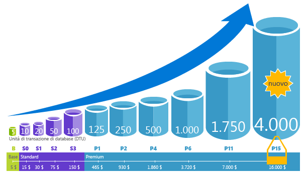
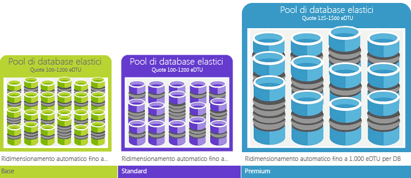

# Informazioni sul servizio database SQL di Azure 

Il database SQL è un servizio gestito di database relazionale per utilizzo generico in Microsoft Azure che supporta strutture come dati relazionali, JSON, dati spaziali e XML. Il database SQL offre [database SQL singoli](sql-database-servers-databases.md) gestiti, database SQL gestiti in un [pool elastico](sql-database-elastic-pool.md) e istanze gestite di SQL, denominate [Istanza gestita di database SQL](sql-database-managed-instance.md) (in anteprima pubblica). Questo servizio offre [prestazioni con scalabilità dinamica](sql-database-service-tiers.md) e opzioni come gli [indici columnstore](https://docs.microsoft.com/sql/relational-databases/indexes/columnstore-indexes-overview) per funzionalità di analisi e report avanzatissime e [OLTP in memoria](sql-database-in-memory.md) per l'elaborazione XTP (Extreme Transaction Processing). Microsoft gestisce agevolmente tutte le operazioni di applicazione di patch e aggiornamento della base di codice SQL, rimuovendo tutte le attività di gestione dell'infrastruttura sottostante. 

Il database SQL condivide la base di codice con il [motore di database di Microsoft SQL Server](https://docs.microsoft.com/sql/sql-server/sql-server-technical-documentation). In linea con la strategia Microsoft incentrata sul cloud, le funzionalità più recenti di SQL Server vengono rilasciate prima al database SQL e poi a SQL Server. Questo approccio significa avere la possibilità di usare le funzionalità di SQL Server più nuove senza sovraccarico per l'applicazione di patch o gli aggiornamenti, oltre al vantaggio che le nuove funzionalità sono testate in milioni di database. Per informazioni sulle nuove funzionalità annunciate, vedere:

- **[Roadmap per Azure per database SQL](https://azure.microsoft.com/roadmap/?category=databases)**: il posto ideale per scoprire le novità recenti e quelle presto disponibili. 
- **[Blog di database SQL di Azure](https://azure.microsoft.com/blog/topics/database)**: raccoglitore dei post dei membri del team di prodotto SQL Server sulle novità e le funzionalità di database SQL. 

> [!IMPORTANT]
> Per informazioni sulle differenze nelle funzionalità tra il database SQL e SQL Server, vedere [Funzionalità di SQL](sql-database-features.md). 

Il database SQL offre prestazioni prevedibili a più livelli di servizio garantendo scalabilità dinamica senza tempi di inattività, ottimizzazione intelligente incorporata, scalabilità e disponibilità globali e opzioni di sicurezza avanzate, il tutto con esigenze di amministrazione quasi nulle. Queste funzionalità consentono di concentrarsi sullo sviluppo rapido di app e accelerare i tempi di mercato, piuttosto che allocare tempo e risorse preziose alla gestione delle macchine virtuali e dell'infrastruttura. Il servizio database SQL è attualmente gestito in 38 data center in tutto il mondo e ne vengono attivati altri regolarmente. È quindi possibile eseguire il database in un data center vicino alla propria località.

> [!IMPORTANT]
> Istanza gestita di database SQL è attualmente in anteprima ed è disponibile in un unico livello di servizio. Per altre informazioni, vedere l'articolo relativo a [Istanza gestita di database SQL](sql-database-managed-instance.md).
>

## Prestazioni e pool scalabili

Con database SQL, ogni database è isolato dagli altri e portabile e a ognuno viene assegnato un [livello di servizio](sql-database-service-tiers.md) proprio con un livello di prestazioni garantito. Il database SQL offre diversi livelli di prestazioni per esigenze diverse e consente di creare pool di database per ottimizzare l'uso delle risorse e risparmiare.

Con Istanza gestita di database SQL, ogni istanza è isolata dalle altre con risorse garantite. Per altre informazioni, vedere l'articolo relativo a [Istanza gestita di database SQL](sql-database-managed-instance.md). 

### Regolare le prestazioni e scalabilità senza tempi di inattività

Per il database SQL sono disponibili tre livelli di servizio che supportano carichi di lavoro da leggeri a pesanti: Basic, Standard e Premium. È possibile creare la prima app in un singolo database di piccole dimensioni per un costo mensile conveniente e quindi modificare il livello di servizio manualmente o a livello di codice in qualsiasi momento per soddisfare le esigenze della soluzione. È possibile regolare le prestazioni senza tempi di inattività per l'app o per i clienti. La scalabilità dinamica consente al database di rispettare i requisiti in continua evoluzione relativi alle risorse e di pagare solo le risorse necessarie quando necessario.

   

Istanza gestita di database SQL è in anteprima e offre un unico livello di servizio. Per altre informazioni, vedere l'articolo relativo a [Istanza gestita di database SQL](sql-database-managed-instance.md).

### I pool elastici ottimizzano l'utilizzo delle risorse

Per molte aziende e applicazioni, la possibilità di creare singoli database e aumentare o ridurre le prestazioni all'occorrenza è sufficiente, specialmente se i modelli d'utilizzo sono relativamente prevedibili. Ma se si dispone di modelli di utilizzo imprevedibili, può risultare difficile gestire i costi e il modello aziendale. I [pool elastici](sql-database-elastic-pool.md) sono stati progettati per risolvere questo problema. Il concetto è semplice. È possibile allocare le risorse relative alle prestazioni a un pool invece che a un database singolo e quindi pagare le risorse relative alle prestazioni collettive del pool invece di pagare le prestazioni del database singolo. 

   

Con i pool elastici non è necessario concentrarsi sul ridimensionamento delle prestazioni del database in base alla fluttuazione della richiesta delle risorse. I database nel pool utilizzano le risorse relative alle prestazioni del pool elastico in base alla necessità. I database nel pool utilizzano ma non superano i limiti del pool, quindi il costo rimane prevedibile, indipendentemente dall'utilizzo dei singoli database. Inoltre, è possibile [aggiungere e rimuovere i database al pool](sql-database-elastic-pool-manage-portal.md), con la scalabilità dell’app da un numero limitato di database a migliaia, tutto all'interno di un budget che è possibile controllare. È anche possibile controllare le risorse minime e massime disponibili per i database del pool per assicurarsi che nessun database del pool usi tutte le risorse del pool e che a ogni database nel pool sia garantita una quantità minima di risorse. Per altre informazioni sui modelli di progettazione per applicazioni SaaS con pool elastici, vedere [Modelli di progettazione per applicazioni SaaS multi-tenant con database SQL di Azure](sql-database-design-patterns-multi-tenancy-saas-applications.md).

> [!IMPORTANT]
> Istanza gestita di database SQL non supporta pool elastici.

### Unire database singoli e database nel pool

In entrambi i casi, ovvero database singoli o database nel pool, sono disponibili molte opzioni. È possibile usare database singoli e pool elastici e modificare i livelli di servizio dei database singoli e dei pool elastici in modo semplice e rapido per adattarli alle proprie esigenze. Con la potenza e la portata di Azure, è possibile combinare e integrare altri servizi di Azure con il database SQL per soddisfare le esigenze esclusive di progettazione delle app, promuovere l'efficienza in termini di costi e di risorse, nonché sfruttare nuove opportunità commerciali.

### Funzionalità complete di monitoraggio e avviso

In che modo è possibile confrontare le prestazioni relative dei database singoli e dei pool elastici? Come si conosce il giusto arresto quando si connette e si disconnette? È possibile usare il [monitoraggio predefinito delle prestazioni](sql-database-performance.md) e gli strumenti relativi agli [avvisi](sql-database-insights-alerts-portal.md), insieme alle valutazioni delle prestazioni in base a [Unità di transazione di database (DTU) per database singoli e unità di transazione di database elastico (eDTU) per pool elastici](sql-database-what-is-a-dtu.md). Usando questi strumenti, è possibile valutare rapidamente l'impatto dell'aumento o della riduzione delle prestazioni in base alle esigenze correnti o previste relative alle prestazioni. Per altre informazioni, vedere [Opzioni e prestazioni disponibili in ogni livello di servizio del database SQL](sql-database-service-tiers.md) .

Database SQL può anche [generare log di metrica e diagnostica](sql-database-metrics-diag-logging.md) per facilitare il monitoraggio. È possibile configurare il database SQL per archiviare l'utilizzo delle risorse, ruoli di lavoro, sessioni e connettività in una delle risorse di Azure seguenti:

- **Archiviazione di Azure**: per l'archiviazione di enormi quantità di dati di telemetria a un costo conveniente
- **Hub eventi di Azure**: per l'integrazione dei dati di telemetria di database SQL con soluzioni di monitoraggio personalizzate o pipeline attive
- **Log Analytics di Azure**: per usare una soluzione di monitoraggio incorporata con funzionalità di report, avviso e mitigazione

    

## Funzionalità per la disponibilità

Il settore di Azure che ha una accordo sul livello di disponibilità del servizio del 99,99% [(SLA)](http://azure.microsoft.com/support/legal/sla/), fornito da una rete globale di datacenter gestiti da Microsoft, consente di mantenere l'applicazione in esecuzione 24 ore su 24, 7 giorni su 7. Il database SQL offre anche funzionalità di [continuità aziendale e scalabilità globale](sql-database-business-continuity.md) incorporate, tra le quali:

- **[Backup automatici](sql-database-automated-backups.md)**: il database SQL esegue automaticamente backup completi, differenziali e del log delle transazioni.
- **[Ripristini temporizzati](sql-database-recovery-using-backups.md)**: il database SQL supporta il recupero in qualsiasi momento entro il periodo di conservazione automatico del backup.
- **[Replica geografica attiva](sql-database-geo-replication-overview.md)**: il database SQL consente di configurare fino a quattro database secondari leggibili nello stesso data center o in data center di Azure distribuiti a livello globale.  Nel caso di un'applicazione SaaS che usa un database catalogo con volumi elevati di transazioni di sola lettura concorrenti, ad esempio, è possibile usare la replica geografica attiva per il potenziamento della lettura su scala globale ed evitare i colli di bottiglia nel database primario causati dai carichi di lavoro di lettura. 
- **[Gruppi di failover](sql-database-geo-replication-overview.md)**: il database SQL consente di abilitare soluzioni di disponibilità elevata e bilanciamento del carico su scala globale, inclusi la replica geografica trasparente e il failover di set di database e pool elastici di grandi dimensioni. I gruppi di failover e la replica geografica attiva consentono la creazione di applicazioni SaaS distribuite a livello globale con un sovraccarico amministrativo minimo, grazie alla possibilità di delegare l'orchestrazione complessa di monitoraggio, routing e failover al database SQL.
- **[Database con ridondanza della zona](sql-database-high-availability.md)**: il database SQL consente di effettuare il provisioning di database o pool elastici Premium in più zone di disponibilità. Dato che i database e i pool elastici Premium hanno più repliche ridondanti per garantire disponibilità elevata, l'inserimento di tali repliche in più zone di disponibilità assicura resilienza superiore, nonché la possibilità di eseguire automaticamente il ripristino in caso di errori a livello di data center senza perdita di dati. Questa funzionalità è attualmente in anteprima. 

## Intelligenza incorporata

Con il database SQL si ottengono funzionalità di intelligenza incorporate che consentono di ridurre drasticamente i costi di esecuzione e gestione dei database, oltre a ottimizzare sia le prestazioni che la sicurezza delle applicazioni. Il database SQL esegue milioni di carichi di lavoro dei clienti continuamente e pertanto raccoglie ed elabora enormi quantità di dati di telemetria, rispettando al tempo stesso totalmente la privacy dei clienti. Vari algoritmi valutano continuamente i dati di telemetria, in modo che il servizio possa apprendere e adattarsi alle applicazioni. Sulla base di questa analisi, il servizio propone raccomandazioni per migliorare le prestazioni, su misura per i carichi di lavoro specifici. 

### Monitoraggio e ottimizzazione automatici delle prestazioni

Il database SQL offre informazioni dettagliate per le query che richiedono monitoraggio. Il database SQL apprende dai modelli di database e consente di adattare lo schema dei database ai carichi di lavoro. Il database SQL offre [raccomandazioni per ottimizzare le prestazioni](sql-database-advisor.md), nelle quali è possibile verificare le azioni di ottimizzazione e applicarle. 

Il monitoraggio costante dei database è tuttavia un'attività complessa e tediosa, in particolare quando sono coinvolti molti database. [Intelligent Insights](sql-database-intelligent-insights.md) esegue questo processo per l'utente controllando automaticamente le prestazioni di Database SQL a livello di scalabilità e notifica i problemi di riduzione delle prestazioni, identifica la causa principale del problema e propone consigli per migliorare le prestazioni, qualora possibile.

Potrebbe essere impossibile gestire in modo efficiente un numero enorme di database anche con tutti gli strumenti e i report resi disponibili dal database SQL e nel portale di Azure. Invece di gestire manualmente il monitoraggio e l'ottimizzazione del database, è possibile prendere in considerazione la possibilità di delegare alcune delle azioni di monitoraggio e ottimizzazione al database SQL, tramite l'[ottimizzazione automatica](sql-database-automatic-tuning.md). Il database SQL applica automaticamente le raccomandazioni, esegue test e verifica ogni azione di ottimizzazione per assicurarsi che le prestazioni continuino a migliorare. In questo modo, il database SQL si adatta automaticamente ai carichi di lavoro in modo controllato e sicuro. Ottimizzazione automatica significa che le prestazioni del database vengono attentamente monitorate e confrontate prima e dopo ogni azione di ottimizzazione, con annullamento dell'azione di ottimizzazione nel caso le prestazioni non risultino migliorate.

A tutt'oggi, molti dei partner Microsoft che eseguono [app multi-tenant SaaS](sql-database-design-patterns-multi-tenancy-saas-applications.md) sul database SQL si affidano all'ottimizzazione automatica delle prestazioni per assicurarsi che le loro applicazioni garantiscano sempre prestazioni stabili e prevedibili. Questa funzionalità consente loro di ridurre notevolmente il rischio di problemi di prestazioni durante la notte. Dato che anche parte della loro base clienti usa SQL Server, inoltre, questi partner usano le stesse raccomandazioni di indicizzazione proposte dal database SQL ai clienti di SQL Server.

Nel [database SQL sono disponibili](sql-database-automatic-tuning.md) due contesti di ottimizzazione automatica:

- **Gestione automatica degli indici**: consente di identificare gli indici da aggiungere al database e quelli che è consigliabile rimuovere.
- **Correzione automatica dei piani**: consente di identificare i piani problematici e correggere i problemi di prestazioni dei piani SQL (presto disponibile, già presente in SQL Server 2017).

### Elaborazione di query adattiva

Al database SQL è stato aggiunto anche il gruppo di funzionalità di [elaborazione di query adattiva](/sql/relational-databases/performance/adaptive-query-processing), inclusi l'esecuzione interleaved per le funzioni con valori di tabella con più istruzioni, i commenti della concessione di memoria in modalità batch e i join adattivi in modalità batch. Ognuna di queste funzionalità di elaborazione di query adattiva applica tecniche di "apprendimento e adattamento" simili e consente di agevolare ulteriormente la risoluzione dei problemi di prestazioni correlati a problemi di ottimizzazione delle query storicamente difficili da gestire.

### Rilevamento delle minacce intelligente

 La [funzionalità di rilevamento minacce di SQL](sql-database-threat-detection.md) sfrutta le funzionalità del [controllo di database SQL](sql-database-auditing.md) per il monitoraggio continuo dei database SQL di Azure per intercettare tentativi potenzialmente dannosi di accesso a dati sensibili. Il rilevamento minacce di SQL offre un nuovo livello di sicurezza, che consente ai clienti di rilevare e rispondere alle minacce potenziali non appena si verificano, fornendo avvisi di sicurezza sulle attività anomale. Gli utenti ricevono avvisi in caso di attività di database sospette, potenziali vulnerabilità e attacchi SQL injection, nonché in caso di modelli di accesso ai database anomali. Gli avvisi della funzionalità di rilevamento minacce di SQL includono dettagli sulle attività sospette e consigliano azioni per l'analisi e la mitigazione della minaccia. Gli utenti possono esaminare gli eventi sospetti per determinare se sono il risultato di un tentativo di accesso, una violazione o un exploit dei dati del database. Il rilevamento delle minacce rende più semplice affrontare le minacce potenziali al database, senza dover essere esperti della sicurezza o gestire sistemi di controllo di sicurezza avanzati.

## Sicurezza e conformità avanzate

Il database SQL offre un'ampia gamma di [funzionalità predefinite per sicurezza e conformità](sql-database-security-overview.md) utili per fare in modo che le applicazioni possano soddisfare svariati requisiti di sicurezza e conformità. 

### Controllo per conformità e sicurezza

Il [controllo del database SQL](sql-database-auditing.md) tiene traccia degli eventi che si verificano nel database e li registra in un log di controllo nell'account di Archiviazione di Azure dell'utente. Il controllo consente di agevolare la conformità alle normative, comprendere le attività del database e ottenere informazioni su eventuali discrepanze e anomalie che potrebbero indicare problemi aziendali o sospette violazioni della sicurezza.

### Crittografia di dati inattivi

La funzionalità [Transparent Data Encryption](/sql/relational-databases/security/encryption/transparent-data-encryption-azure-sql) (TDE) del database SQL consente di proteggere il sistema da attività dannose eseguendo in tempo reale la crittografia e la decrittografia dei database, dei backup associati e dei file di log delle transazioni inattivi, senza dover apportare modifiche all'applicazione. A partire da maggio 2017, tutti i nuovi database SQL di Azure creati vengono protetti automaticamente con Transparent Data Encryption (TDE). TDE è la tecnologia di crittografia dei dati inattivi collaudata di SQL, richiesta da molti standard di conformità per la protezione in caso di furto di supporti di archiviazione. I clienti possono gestire le chiavi di crittografia TDE e altri segreti in modo sicuro e conforme tramite Azure Key Vault.

### Crittografia dei dati in movimento

Il database SQL è l'unico sistema di database che offre protezione per i dati sensibili in movimento, inattivi e durante l'elaborazione di query con [Always Encrypted](https://docs.microsoft.com/sql/relational-databases/security/encryption/always-encrypted-database-engine). Always Encrypted è una tecnologia leader del settore che offre un livello di sicurezza dei dati senza uguali, per la protezione da violazioni che implicano il furto di dati critici. Con Always Encrypted, ad esempio, i numeri delle carte di credito sono sempre archiviati in forma crittografata nel database, anche durante l'elaborazione di query, e la decrittografia è consentita nella posizione di utilizzo da parte di personale o applicazioni autorizzati che devono elaborare tali dati.

### Maschera dati dinamica

La funzionalità [Maschera dati dinamica del database SQL](sql-database-dynamic-data-masking-get-started.md) limita l'esposizione dei dati sensibili, nascondendoli agli utenti senza privilegi. Il mascheramento dei dati dinamici impedisce l'accesso non autorizzato ai dati sensibili consentendo agli utenti di definire la quantità di dati sensibili da rivelare, con un impatto minimo sul livello dell'applicazione. Si tratta di una funzionalità di sicurezza basata su criteri che consente di nascondere i dati sensibili nel set di risultati di una query in campi del database designati, senza alcuna modifica dei dati contenuti nel database.

### Sicurezza a livello di riga

La [sicurezza a livello di riga](https://docs.microsoft.com/sql/relational-databases/security/row-level-security) consente ai clienti di controllare l'accesso alle righe in una tabella di database in base alle caratteristiche dell'utente che esegue una query, ad esempio l'appartenenza a un gruppo o il contesto di esecuzione. La sicurezza a livello di riga semplifica la progettazione e la codifica della sicurezza nell'applicazione. Consente di implementare limitazioni per l'accesso alle righe di dati, assicurando ad esempio che i collaboratori possano accedere solo alle righe di dati pertinenti per il proprio reparto o limitando l'accesso ai dati di un cliente ai soli dati di interesse per l'azienda.

### Integrazione in Azure Active Directory e autenticazione a più fattori

Il database SQL consente di gestire a livello centralizzato le identità degli utenti di database e altri servizi Microsoft grazie all'[integrazione in Azure Active Directory](sql-database-aad-authentication.md). Questa funzionalità semplifica la gestione delle autorizzazioni e ottimizza la sicurezza. Azure Active Directory supporta l'[autenticazione a più fattori](sql-database-ssms-mfa-authentication.md) (MFA) per una maggiore sicurezza dei dati e delle applicazioni, supportando al tempo stesso un processo Single Sign-On.

### Certificazione di conformità

Il database SQL è sottoposto a regolari controlli e ha ottenuto la certificazione per vari standard di conformità. Per ulteriori informazioni, vedere il [Centro protezione di Microsoft Azure](https://azure.microsoft.com/support/trust-center/), dove è possibile trovare l'elenco più recente di [certificazioni di conformità del database SQL](https://azure.microsoft.com/support/trust-center/services/).

## Strumenti facili da usare

Il database SQL consente di creare e gestire le applicazioni in modo più facile e produttivo. Con il database SQL è possibile concentrarsi sull'attività principale, ovvero creare app straordinarie. Per la gestione e lo sviluppo nel database SQL è possibile usare strumenti e competenze già disponibili.

- **[Portale di Azure](https://portal.azure.com/)**: applicazione Web per la gestione di tutti i servizi di Azure. 
- **[SQL Server Management Studio](https://docs.microsoft.com/sql/ssms/download-sql-server-management-studio-ssms)**: un applicazione client gratuita e scaricabile per la gestione di qualsiasi infrastruttura SQL, da SQL Server al database SQL.
- **[SQL Server Data Tools in Visual Studio](https://docs.microsoft.com/sql/ssdt/download-sql-server-data-tools-ssdt)**: applicazione client gratuita e scaricabile per lo sviluppo di database relazionali di SQL Server, database SQL di Azure, pacchetti di Integration Services, modelli di dati di Analysis Services e report di Reporting Services.
- **[Visual Studio Code](https://code.visualstudio.com/docs)**: un editor di codice open source, gratuito e scaricabile per Windows, macOS e Linux che supporta le estensioni, tra cui l'[estensione mssql](https://aka.ms/mssql-marketplace), per eseguire query in Microsoft SQL Server, database SQL di Azure e SQL Data Warehouse.

Il database SQL supporta lo sviluppo di applicazioni con Python, Java, Node.js, PHP, Ruby e .NET per le piattaforme MacOS, Linux e Windows. Il database SQL supporta le stesse [librerie di connessione](sql-database-libraries.md) di SQL Server.

## Comunicare con il team di progettazione di SQL Server

- [DBA Stack Exchange](https://dba.stackexchange.com/questions/tagged/sql-server): per domande relative all'amministrazione dei database
- [Stack Overflow](http://stackoverflow.com/questions/tagged/sql-server): per domande relative allo sviluppo
- [Forum MSDN](https://social.msdn.microsoft.com/Forums/home?category=sqlserver): per domande tecniche
- [Commenti e suggerimenti](http://aka.ms/sqlfeedback): per segnalare bug e richiedere funzionalità
- [Reddit](https://www.reddit.com/r/SQLServer/): per comunicazioni su SQL Server

## Passaggi successivi

- Vedere la [pagina relativa ai prezzi](https://azure.microsoft.com/pricing/details/sql-database/) per informazioni sui prezzi e per confrontare e calcolare il prezzo per database singoli e per pool elastici.

- Per iniziare, vedere queste guide introduttive:

  - [Creare un database SQL nel portale di Azure](sql-database-get-started-portal.md)  
  - [Creare un database SQL con l'interfaccia della riga di comando di Azure](sql-database-get-started-cli.md)
  - [Creare un database SQL usando PowerShell](sql-database-get-started-powershell.md)

- Per un set di esempi dell'interfaccia della riga di comando di Azure e di PowerShell, vedere:
  - [Esempi dell'interfaccia della riga di comando di Azure per database SQL](sql-database-cli-samples.md)
  - [Esempi di Azure PowerShell per database SQL](sql-database-powershell-samples.md)
