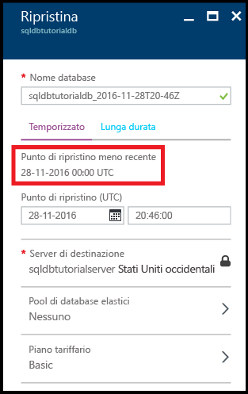

# Visualizzare il punto di ripristino meno recente dai backup generati dal servizio di un database SQL di Azure SQL

In questo argomento viene illustrato come visualizzare il punto di ripristino meno recente dai backup generati dal servizio di un database SQL di Azure.

## Visualizzare il punto di ripristino meno recente usando il portale di Azure

1. Aprire il pannello **Database SQL** per il database.

    

2. Sulla barra degli strumenti fare clic su **Ripristina**.

    

3. Nel pannello Ripristina individuare il punto di ripristino meno recente.

    

> [!TIP]
> Per un'esercitazione, vedere [Introduzione al backup e ripristino per la protezione dei dati e il ripristino](sql-database-get-started-backup-recovery.md)
>

## Passaggi successivi

- Per altre informazioni sui backup automatici generati dal servizio, vedere [backup automatici](: https://azure.microsoft.com/en-us/documentation/articles/)sql-database-automated-backups.MD)
- Per altre informazioni sulla conservazione dei backup a lungo termine, vedere [conservazione dei backup a lungo termine](sql-database-long-term-retention.md)
- Per altre informazioni sul ripristino da backup, vedere [ripristino dal backup](sql-database-recovery-using-backups.md)

<!--HONumber=Dec16_HO2-->

