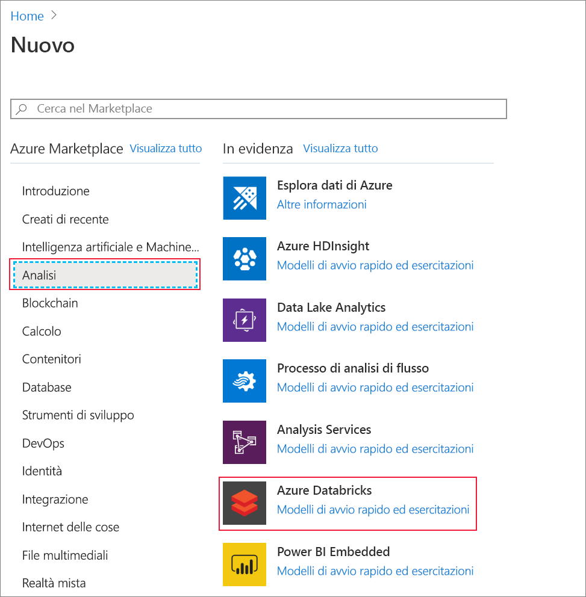
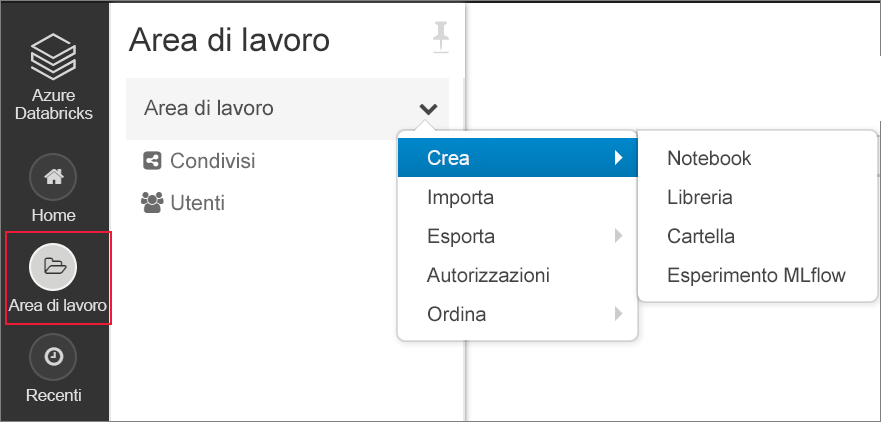

# <a name="tutorial-use-azure-data-lake-storage-gen2-events-to-update-a-databricks-delta-table"></a>Esercitazione: Usare eventi di Azure Data Lake Storage Gen2 per aggiornare una tabella di Databricks Delta

Questa esercitazione descrive come gestire eventi in un account di archiviazione che include uno spazio dei nomi gerarchico.

Verrà compilata una piccola soluzione che permette a un utente di popolare una tabella di Databricks Delta caricando un file con valori delimitati da virgole (CSV) che descrive un ordine di vendita. Questa soluzione verrà compilata connettendo una sottoscrizione di Griglia di eventi, una funzione di Azure e un [processo](https://docs.azuredatabricks.net/user-guide/jobs.html) in Azure Databricks.

In questa esercitazione si apprenderà come:

> [!div class="checklist"]
> * Creare una sottoscrizione di Griglia di eventi che chiama una funzione di Azure.
> * Creare una funzione di Azure che riceve una notifica da un evento e quindi esegue il processo in Azure Databricks.
> * Creare un processo di Azure Databricks che inserisce un ordine cliente in una tabella di Databricks Delta che si trova nell'account di archiviazione.

Questa soluzione verrà compilata in ordine inverso, a partire dall'area di lavoro di Azure Databricks.

## <a name="prerequisites"></a>Prerequisiti

* Se non si ha una sottoscrizione di Azure, creare un [account gratuito](https://azure.microsoft.com/free/?WT.mc_id=A261C142F) prima di iniziare.

* Creare un account di archiviazione con uno spazio dei nomi gerarchico (Azure Data Lake Storage Gen2). Questa esercitazione usa un account di archiviazione denominato `contosoorders`. Verificare che all'account utente sia assegnato il [ruolo di collaboratore ai dati del BLOB di archiviazione](https://docs.microsoft.com/azure/storage/common/storage-auth-aad-rbac).

  Vedere [Creare un account di Azure Data Lake Storage Gen2](data-lake-storage-quickstart-create-account.md).

* Creare un'entità servizio. Vedere [Procedura: Usare il portale per creare un'entità servizio e applicazione di Azure AD che possano accedere alle risorse](https://docs.microsoft.com/azure/active-directory/develop/howto-create-service-principal-portal).

  Mentre si completano le procedure descritte in tale articolo è necessario eseguire alcune operazioni specifiche.

  :heavy_check_mark: Quando si esegue la procedura descritta nella sezione [Assegnare l'applicazione a un ruolo](https://docs.microsoft.com/azure/active-directory/develop/howto-create-service-principal-portal#assign-the-application-to-a-role) dell'articolo, assicurarsi di assegnare il ruolo **Collaboratore ai dati del BLOB di archiviazione** all'entità servizio.

  > [!IMPORTANT]
  > Assicurarsi di assegnare il ruolo nell'ambito dell'account di archiviazione Data Lake Storage Gen2. È possibile assegnare un ruolo al gruppo di risorse padre o alla sottoscrizione, ma si riceveranno errori relativi alle autorizzazioni fino a quando tali assegnazioni di ruolo non si propagheranno all'account di archiviazione.

  :heavy_check_mark: Quando si esegue la procedura descritta nella sezione [Ottenere i valori per l'accesso](https://docs.microsoft.com/azure/active-directory/develop/howto-create-service-principal-portal#get-values-for-signing-in) dell'articolo, incollare i valori di ID tenant, ID app e password in un file di testo. Questi valori saranno necessari più avanti.

## <a name="create-a-sales-order"></a>Creare un ordine di vendita

Prima di tutto, creare un file CSV che descrive un ordine di vendita e quindi caricarlo nell'account di archiviazione. Successivamente, i dati contenuti in questo file verranno usati per popolare la prima riga nella tabella di Databricks Delta.

1. Aprire Azure Storage Explorer. Passare quindi all'account di archiviazione e nella sezione **Contenitori BLOB** creare un nuovo contenitore denominato **data**.

   

   Per altre informazioni su come usare Storage Explorer, vedere [Usare Azure Storage Explorer per gestire i dati in un account di Azure Data Lake Storage Gen2](data-lake-storage-explorer.md).

2. Nel contenitore **data** creare una cartella denominata **input**.

3. Incollare il testo seguente in un editor di testo.

   ```
   InvoiceNo,StockCode,Description,Quantity,InvoiceDate,UnitPrice,CustomerID,Country
   536365,85123A,WHITE HANGING HEART T-LIGHT HOLDER,6,12/1/2010 8:26,2.55,17850,United Kingdom
   ```

4. Salvare il file nel computer locale con il nome **data.csv**.

5. In Storage Explorer caricare questo file nella cartella **input**.  

## <a name="create-a-job-in-azure-databricks"></a>Creare un processo in Azure Databricks

In questa sezione verranno eseguite le attività seguenti:

* Creare un'area di lavoro di Azure Databricks.
* Creare un notebook.
* Creare e popolare una tabella di Databricks Delta.
* Aggiungere codice per l'inserimento di righe nella tabella di Databricks Delta.
* Creare un processo.

### <a name="create-an-azure-databricks-workspace"></a>Creare un'area di lavoro di Azure Databricks

In questa sezione viene creata un'area di lavoro di Azure Databricks usando il portale di Azure.

1. Nel portale di Azure selezionare **Crea una risorsa** > **Analisi** > **Azure Databricks**.

    

2. Nella pagina **Servizio Azure Databricks** specificare i valori per creare un'area di lavoro di Databricks.

    

    La creazione dell'area di lavoro richiede alcuni minuti, Per monitorare lo stato dell'operazione, visualizzare l'indicatore di stato nella parte superiore.

### <a name="create-a-spark-cluster-in-databricks"></a>Creare un cluster Spark in Databricks

1. Nel [portale di Azure](https://portal.azure.com) passare all'area di lavoro di Azure Databricks creata e quindi selezionare **Avvia l'area di lavoro**.

2. Si verrà reindirizzati al portale di Azure Databricks. Nel portale selezionare **Nuovo** > **Cluster**.

    

3. Nella pagina **New cluster** (Nuovo cluster) specificare i valori per creare un cluster.

    

    Accettare tutti gli altri valori predefiniti tranne i seguenti:

    * Immettere un nome per il cluster.
    * Assicurarsi di selezionare la casella di controllo **Terminate after 120 minutes of inactivity** (Termina dopo 120 minuti di inattività). Specificare una durata in minuti per terminare il cluster, se questo non viene usato.

4. Selezionare **Crea cluster**. Quando il cluster è in esecuzione, è possibile collegare blocchi appunti al cluster ed eseguire processi Spark.

Per altre informazioni sulla creazione di cluster, vedere [Create a Spark cluster in Azure Databricks](https://docs.azuredatabricks.net/user-guide/clusters/create.html) (Creare un cluster Spark in Azure Databricks).

### <a name="create-a-notebook"></a>Creare un notebook

1. Nel riquadro a sinistra selezionare **Workspace** (Area di lavoro). Nell'elenco a discesa **Workspace** (Area di lavoro) selezionare **Create (Crea)**  > **Notebook**.

    

2. Nella finestra di dialogo **Create Notebook** (Crea un notebook) immettere un nome per il notebook. Selezionare **Python** come linguaggio e quindi il cluster Spark creato in precedenza.

    

    Selezionare **Create** (Crea).

### <a name="create-and-populate-a-databricks-delta-table"></a>Creare e popolare una tabella di Databricks Delta

1. Nel notebook creato copiare e incollare il blocco di codice seguente nella prima cella, ma non eseguire ancora il codice.  

   Sostituire i valori segnaposto `appId`, `password` e `tenant` in questo blocco di codice con quelli raccolti durante il completamento dei prerequisiti di questa esercitazione.

    ```Python
    dbutils.widgets.text('source_file', "", "Source File")

    spark.conf.set("fs.azure.account.auth.type", "OAuth")
    spark.conf.set("fs.azure.account.oauth.provider.type", "org.apache.hadoop.fs.azurebfs.oauth2.ClientCredsTokenProvider")
    spark.conf.set("fs.azure.account.oauth2.client.id", "<appId>")
    spark.conf.set("fs.azure.account.oauth2.client.secret", "<password>")
    spark.conf.set("fs.azure.account.oauth2.client.endpoint", "https://login.microsoftonline.com/<tenant>/oauth2/token")

    adlsPath = 'abfss://data@contosoorders.dfs.core.windows.net/'
    inputPath = adlsPath + dbutils.widgets.get('source_file')
    customerTablePath = adlsPath + 'delta-tables/customers'
    ```

    Questo codice crea un widget denominato **source_file**. Più avanti si creerà una funzione di Azure che chiama questo codice e passa un percorso di file al widget.  Questo codice autentica anche l'entità servizio con l'account di archiviazione e crea alcune variabili da usare in altre celle.

    > [!NOTE]
    > In un ambiente di produzione è consigliabile archiviare la chiave di autenticazione in Azure Databricks. Aggiungere quindi una chiave di ricerca al blocco di codice invece della chiave di autenticazione. <br><br>Ad esempio, invece di usare la riga di codice `spark.conf.set("fs.azure.account.oauth2.client.secret", "<password>")`, si userà la riga di codice seguente: `spark.conf.set("fs.azure.account.oauth2.client.secret", dbutils.secrets.get(scope = "<scope-name>", key = "<key-name-for-service-credential>"))`. <br><br>Dopo aver completato questa esercitazione, vedere l'articolo [Azure Data Lake Storage Gen2](https://docs.azuredatabricks.net/spark/latest/data-sources/azure/azure-datalake-gen2.html) nel sito Web di Azure Databricks per alcuni esempi di questo approccio.

2. Premere **MAIUSC + INVIO** per eseguire il codice in questo blocco.

3. Copiare e incollare il blocco di codice seguente in una cella diversa e quindi premere **MAIUSC+INVIO** per eseguire il codice in questo blocco.

   ```Python
   from pyspark.sql.types import StructType, StructField, DoubleType, IntegerType, StringType


   inputSchema = StructType([
   StructField("InvoiceNo", IntegerType(), True),
   StructField("StockCode", StringType(), True),
   StructField("Description", StringType(), True),
   StructField("Quantity", IntegerType(), True),
   StructField("InvoiceDate", StringType(), True),
   StructField("UnitPrice", DoubleType(), True),
   StructField("CustomerID", IntegerType(), True),
   StructField("Country", StringType(), True)
   ])

   rawDataDF = (spark.read
    .option("header", "true")
    .schema(inputSchema)
    .csv(adlsPath + 'input')
   )

   (rawDataDF.write
     .mode("overwrite")
     .format("delta")
     .saveAsTable("customer_data", path=customerTablePath))
   ```

   Questo codice crea la tabella di Databricks Delta nell'account di archiviazione e quindi carica alcuni dati iniziali dal file CSV caricato in precedenza.

4. Al termine dell'esecuzione di questo blocco di codice, rimuoverlo dal notebook.

### <a name="add-code-that-inserts-rows-into-the-databricks-delta-table"></a>Aggiungere codice per l'inserimento di righe nella tabella di Databricks Delta

1. Copiare e incollare il blocco di codice seguente in una cella diversa, ma non eseguire ancora la cella.

   ```Python
   upsertDataDF = (spark
     .read
     .option("header", "true")
     .csv(inputPath)
   )
   upsertDataDF.createOrReplaceTempView("customer_data_to_upsert")
   ```

   Questo codice inserisce dati in una visualizzazione tabella temporanea usando i dati di un file CSV. Il percorso del file CSV deriva dal widget di input creato in un passaggio precedente.

2. Aggiungere il codice seguente per unire il contenuto della visualizzazione tabella temporanea alla tabella di Databricks Delta.

   ```
   %sql
   MERGE INTO customer_data cd
   USING customer_data_to_upsert cu
   ON cd.CustomerID = cu.CustomerID
   WHEN MATCHED THEN
     UPDATE SET
       cd.StockCode = cu.StockCode,
       cd.Description = cu.Description,
       cd.InvoiceNo = cu.InvoiceNo,
       cd.Quantity = cu.Quantity,
       cd.InvoiceDate = cu.InvoiceDate,
       cd.UnitPrice = cu.UnitPrice,
       cd.Country = cu.Country
   WHEN NOT MATCHED
     THEN INSERT (InvoiceNo, StockCode, Description, Quantity, InvoiceDate, UnitPrice, CustomerID, Country)
     VALUES (
       cu.InvoiceNo,
       cu.StockCode,
       cu.Description,
       cu.Quantity,
       cu.InvoiceDate,
       cu.UnitPrice,
       cu.CustomerID,
       cu.Country)
   ```

### <a name="create-a-job"></a>Creare un processo

Creare un processo per l'esecuzione del notebook creato in precedenza. Più avanti si creerà una funzione di Azure che esegue questo processo quando viene generato un evento.

1. Fare clic su **Processi**.

2. Nella pagina **Processi** fare clic su **Crea processo**.

3. Assegnare un nome al progetto e quindi scegliere la cartella di lavoro `upsert-order-data`.

   

## <a name="create-an-azure-function"></a>Creare una funzione di Azure

Creare una funzione di Azure che esegue il processo.

1. Nell'angolo superiore dell'area di lavoro di Databricks scegliere l'icona Persone, quindi scegliere **Impostazioni utente**.

   

2. Fare clic sul pulsante **Genera nuovo token** e quindi sul pulsante **Genera**.

   Assicurarsi di copiare il token in una posizione sicura. La funzione di Azure richiede questo token per l'autenticazione con Databricks, in modo da poter eseguire il processo.
  
3. Selezionare il pulsante **Crea una risorsa** nell'angolo superiore sinistro del portale di Azure e quindi selezionare **Calcolo > App per le funzioni**.

   

4. Nella pagina **Crea** dell'app per le funzioni assicurarsi di selezionare **.NET Core** per lo stack di runtime e configurare un'istanza di Application Insights.

   

5. Nella pagina **Panoramica** dell'app per le funzioni fare clic su **Configurazione**.

   

6. Nella pagina **Impostazioni applicazione** scegliere il pulsante **Nuova impostazione applicazione** per aggiungere ogni impostazione.

   

   Usare le impostazioni seguenti:

   |Nome impostazione | Valore |
   |----|----|
   |**DBX_INSTANCE**| Area dell'area di lavoro di Databricks. Ad esempio: `westus2.azuredatabricks.net`|
   |**DBX_PAT**| Token di accesso personale generato in precedenza. |
   |**DBX_JOB_ID**|Identificatore del processo in esecuzione. In questo caso, il valore è `1`.|
7. Nella pagina Panoramica dell'app per le funzioni fare clic sul pulsante **Nuova funzione**.

   

8. Scegliere **Trigger griglia di eventi**.

   Installare l'estensione **Microsoft.Azure.WebJobs.Extensions.EventGrid**, se viene chiesto di farlo. Se è necessario installarla, scegliere di nuovo **Trigger griglia di eventi** per creare la funzione.

   Viene visualizzato il riquadro **Nuova funzione**.

9. Nel riquadro **Nuova funzione** assegnare alla funzione il nome **UpsertOrder** e quindi fare clic sul pulsante **Crea**.

10. Sostituire il contenuto del file di codice con questo codice e quindi fare clic sul pulsante **Salva**:

    ```cs
    using "Microsoft.Azure.EventGrid"
    using "Newtonsoft.Json"
    using Microsoft.Azure.EventGrid.Models;
    using Newtonsoft.Json;
    using Newtonsoft.Json.Linq;

    private static HttpClient httpClient = new HttpClient();

    public static async Task Run(EventGridEvent eventGridEvent, ILogger log)
    {
        log.LogInformation("Event Subject: " + eventGridEvent.Subject);
        log.LogInformation("Event Topic: " + eventGridEvent.Topic);
        log.LogInformation("Event Type: " + eventGridEvent.EventType);
        log.LogInformation(eventGridEvent.Data.ToString());

        if (eventGridEvent.EventType == "Microsoft.Storage.BlobCreated" | | eventGridEvent.EventType == "Microsoft.Storage.FileRenamed") {
            var fileData = ((JObject)(eventGridEvent.Data)).ToObject<StorageBlobCreatedEventData>();
            if (fileData.Api == "FlushWithClose") {
                log.LogInformation("Triggering Databricks Job for file: " + fileData.Url);
                var fileUrl = new Uri(fileData.Url);
                var httpRequestMessage = new HttpRequestMessage {
                    Method = HttpMethod.Post,
                    RequestUri = new Uri(String.Format("https://{0}/api/2.0/jobs/run-now", System.Environment.GetEnvironmentVariable("DBX_INSTANCE", EnvironmentVariableTarget.Process))),
                    Headers = {
                        { System.Net.HttpRequestHeader.Authorization.ToString(), "Bearer " +  System.Environment.GetEnvironmentVariable ("DBX_PAT", EnvironmentVariableTarget.Process)},
                        { System.Net.HttpRequestHeader.ContentType.ToString (), "application/json" }
                    },
                    Content = new StringContent(JsonConvert.SerializeObject(new {
                        job_id = System.Environment.GetEnvironmentVariable ("DBX_JOB_ID", EnvironmentVariableTarget.Process) ,
                        notebook_params = new {
                            source_file = String.Join("", fileUrl.Segments.Skip(2))
                        }
                    }))
                 };
                var response = await httpClient.SendAsync(httpRequestMessage);
                response.EnsureSuccessStatusCode();
            }
        }
    }
    ```

   Questo codice analizza le informazioni sull'evento di archiviazione generato e quindi crea un messaggio di richiesta con l'URL del file che ha generato l'evento. Come parte del messaggio, la funzione passa un valore al widget **source_file** creato in precedenza. Il codice della funzione invia il messaggio al processo di Databricks e usa il token ottenuto in precedenza come autenticazione.

## <a name="create-an-event-grid-subscription"></a>Creare una sottoscrizione di Griglia di eventi

In questa sezione si creerà una sottoscrizione di Griglia di eventi che chiama la funzione di Azure quando vengono caricati file nell'account di archiviazione.

1. Nella tabella codici della funzione fare clic sul pulsante **Aggiungi sottoscrizione di Griglia di eventi**.

   

2. Nella pagina **Crea sottoscrizione di eventi** assegnare un nome alla sottoscrizione e quindi usare i campi nella pagina per selezionare l'account di archiviazione.

   

3. Nell'elenco a discesa **Filtra per tipi di evento** selezionare gli eventi **Blob Created** (BLOB creato) e **Blob Deleted** (BLOB eliminato) e quindi fare clic sul pulsante **Crea**.

## <a name="test-the-event-grid-subscription"></a>Testare la sottoscrizione di Griglia di eventi

1. Creare un file denominato `customer-order.csv`, incollare le informazioni seguenti nel file e salvarlo nel computer locale.

   ```
   InvoiceNo,StockCode,Description,Quantity,InvoiceDate,UnitPrice,CustomerID,Country
   536371,99999,EverGlow Single,228,1/1/2018 9:01,33.85,20993,Sierra Leone
   ```

2. In Storage Explorer caricare questo file nella cartella **input** dell'account di archiviazione.

   Il caricamento di un file genera l'evento **Microsoft.Storage.BlobCreated**. Griglia di eventi invia una notifica a tutti i sottoscrittori dell'evento. In questo caso, la funzione di Azure è l'unico sottoscrittore. La funzione di Azure analizza i parametri dell'evento per determinare l'evento che si è verificato. Passa quindi l'URL del file al processo di Databricks. Il processo di Databricks legge il file e aggiunge una riga alla tabella di Databricks Delta che si trova nell'account di archiviazione.

3. Per verificare se il processo è riuscito, aprire l'area di lavoro di Databricks, fare clic sul pulsante **Processi** e quindi aprire il processo.

4. Selezionare il processo per aprirne la pagina.

   

   Al termine del processo, verrà visualizzato lo stato di completamento.

   

5. In una nuova cella della cartella di lavoro eseguire questa query per visualizzare la tabella di Databricks Delta aggiornata.

   ```
   %sql select * from customer_data
   ```

   La tabella restituita mostra il record più recente.

   

6. Per aggiornare questo record, creare un file denominato `customer-order-update.csv`, incollare le informazioni seguenti nel file e salvarlo nel computer locale.

   ```
   InvoiceNo,StockCode,Description,Quantity,InvoiceDate,UnitPrice,CustomerID,Country
   536371,99999,EverGlow Single,22,1/1/2018 9:01,33.85,20993,Sierra Leone
   ```

   Questo file CSV è quasi identico a quello precedente, ad eccezione del fatto che la quantità dell'ordine è stata modificata da `228` a `22`.

7. In Storage Explorer caricare questo file nella cartella **input** dell'account di archiviazione.

8. Eseguire di nuovo la query `select` per visualizzare la tabella Delta aggiornata.

   ```
   %sql select * from customer_data
   ```

   La tabella restituita mostra il record aggiornato.

   

## <a name="clean-up-resources"></a>Pulire le risorse

Quando non sono più necessari, eliminare il gruppo di risorse e tutte le risorse correlate. A questo scopo, selezionare il gruppo di risorse per l'account di archiviazione e quindi fare clic su **Elimina**.

## <a name="next-steps"></a>Passaggi successivi

> [!div class="nextstepaction"]
> [Reazione agli eventi di archiviazione BLOB](storage-blob-event-overview.md)
