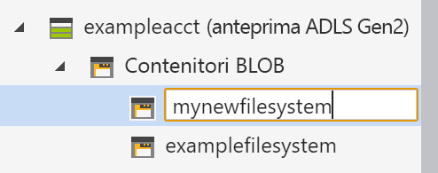

# Avvio rapido: Usare Azure Storage Explorer per gestire i dati in un account di Azure Data Lake Storage Gen2

In questa guida introduttiva si descrive come usare [Azure Storage Explorer](https://azure.microsoft.com/features/storage-explorer/) per creare una directory e un BLOB. Verrà successivamente illustrato come scaricare il BLOB nel computer locale e come visualizzare tutti i BLOB in una directory. Verranno fornite informazioni anche su come creare lo snapshot di un BLOB, come gestire i criteri d'accesso alla directory e come creare una firma di accesso condiviso.

## Prerequisiti

[!INCLUDE [storage-quickstart-prereq-include](../../../includes/storage-quickstart-prereq-include.md)]

Questa guida introduttiva richiede l'installazione di Azure Storage Explorer. Per installare Azure Storage Explorer per Windows, Macintosh o Linux, vedere [Azure Storage Explorer](https://azure.microsoft.com/features/storage-explorer/).

## Accedere a Storage Explorer

Al primo avvio viene visualizzata la finestra **Microsoft Azure Storage Explorer - Connetti**. Sebbene Storage Explorer offra numerosi modi per connettersi agli account di archiviazione, per la gestione degli elenchi di controllo di accesso è attualmente supportata una sola modalità.

|Attività|Scopo|
|---|---|
|Aggiungere un account Azure | Consente il reindirizzamento alla pagina di accesso dell'organizzazione per l'autenticazione in Azure. Attualmente questo è l'unico metodo di autenticazione supportato per la gestione e l'impostazione degli elenchi di controllo di accesso. |

Selezionare **Add an Azure Account** (Aggiungi un account Azure) e fare clic su **Accedi**. Attenersi alle richiesta visualizzate per accedere all'account Azure.

Al termine della connessione, Azure Storage Explorer viene caricato con la scheda **Explorer** visualizzata. Questa visualizzazione include informazioni dettagliate per tutti gli account di archiviazione di Azure e per le risorse di archiviazione locali configurate tramite gli account di [Azure Storage Emulator](../common/storage-use-emulator.md?toc=%2fazure%2fstorage%2fblobs%2ftoc.json), [Cosmos DB](../../cosmos-db/storage-explorer.md?toc=%2fazure%2fstorage%2fblobs%2ftoc.json) o gli ambienti di [Azure Stack](../../azure-stack/user/azure-stack-storage-connect-se.md?toc=%2fazure%2fstorage%2fblobs%2ftoc.json).

## Creare un file system

Gli elementi BLOB vengono sempre caricati in una directory. Ciò consente di organizzare i gruppi di BLOB come si organizzano i file in cartelle sul computer.

Per creare una directory, espandere l'account di archiviazione creato nel passaggio precedente. Selezionare **Contenitore BLOB**, fare clic con il pulsante destro del mouse e scegliere **Crea contenitore BLOB**. Immettere il nome per il file system. Al termine, premere **INVIO** per creare il file system. Dopo la creazione, la directory del BLOB viene visualizzata nella cartella **Contenitore BLOB** per l'account di archiviazione selezionato.

## Caricare i BLOB nella directory

L'archiviazione BLOB supporta BLOB in blocchi, BLOB di aggiunta e BLOB di pagine. I file VHD usati per il backup di macchine virtuali IaaS sono BLOB di pagine. I BLOB di accodamento sono usati per la registrazione, ad esempio quando si vuole scrivere in un file e poi continuare ad aggiungere altre informazioni. La maggior parte dei file presenti nell'archiviazione BLOB è costituita da BLOB in blocchi.

Sulla barra multifunzione della directory selezionare **Carica**. Questa operazione consente di caricare una cartella o un file.

Scegliere i file o le cartelle da caricare. Selezionare il **Tipo BLOB**. Le opzioni accettabili sono BLOB **Aggiunta**, **Pagina** o **Blocchi**.

Se si carica un file con estensione vhd o vhdx, scegliere **Carica i file vhd/vhdx come BLOB di pagine (scelta consigliata)**.

Nel campo **Carica nella cartella (facoltativo)**, specificare un nome di cartella per l'archiviazione di file o cartelle in una cartella nella directory. Se non viene selezionata alcuna cartella, i file vengono caricati direttamente nella directory.

Quando si seleziona **OK**, i file selezionati vengono accodati per il caricamento e viene caricato ogni file. Al termine del caricamento, i risultati vengono visualizzati nella finestra **Attività**.

## Visualizzare BLOB in una directory

Nell'applicazione **Azure Storage Explorer**, selezionare una directory in un account di archiviazione. Il riquadro principale mostra un elenco dei BLOB disponibili nella directory selezionata.

## Scaricare BLOB

Per scaricare i BLOB tramite **Azure Storage Explorer**, con un BLOB selezionato, scegliere **Download** dalla barra multifunzione. Viene visualizzata una finestra di dialogo File, che consente di immettere un nome di file. Selezionare **Salva** per avviare il download di un BLOB nella posizione locale.

## Passaggi successivi

In questa guida introduttiva è stato descritto il trasferimento di file tra il disco locale e Archiviazione BLOB di Azure con **Azure Storage Explorer**. Per altre informazioni su come impostare gli elenchi di controllo di accesso per file e directory, continuare con la procedura sull'argomento.

> [!div class="nextstepaction"]
> [Come impostare gli ACL su file e directory](data-lake-storage-how-to-set-permissions-storage-explorer.md)
