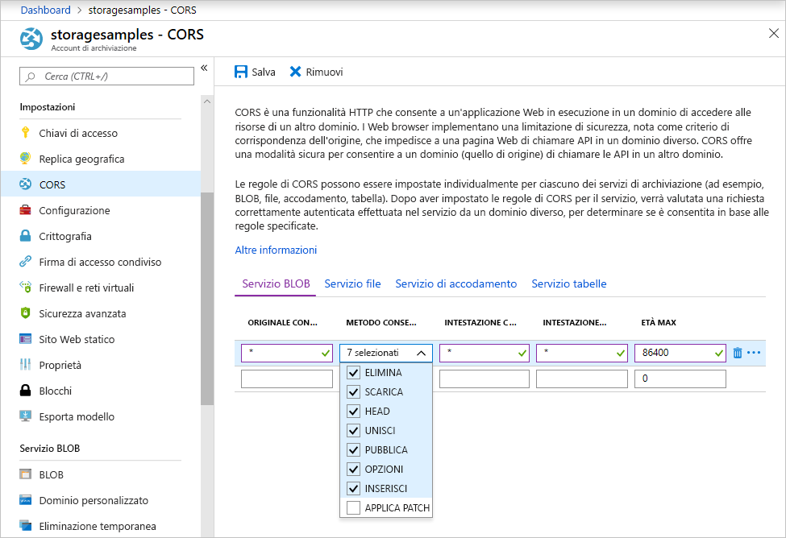

<!-- Customer intent: As a web application developer I want to interface with Azure Blob storage entirely on the client so that I can build a SPA application that is able to upload and delete files on blob storage. -->

# <a name="quickstart-manage-blobs-with-javascript-v12-sdk-in-a-browser"></a>Guida introduttiva: Gestire i BLOB con JavaScript v12 SDK in un browser

Il servizio Archiviazione BLOB di Azure è ottimizzato per archiviare grandi quantità di dati non strutturati. I BLOB sono oggetti che possono contenere dati di testo o binari, tra cui immagini, documenti, flussi multimediali in streaming e dati di archivio. In questo argomento di avvio rapido viene illustrato come gestire i BLOB usando JavaScript in un browser. Verranno caricati ed elencati i BLOB e verranno creati ed eliminati i contenitori.

[Documentazione di riferimento sull'API](/javascript/api/@azure/storage-blob) | [Codice sorgente della libreria](https://github.com/Azure/azure-sdk-for-js/tree/master/sdk/storage/storage-blob) | [Pacchetto (npm)](https://www.npmjs.com/package/@azure/storage-blob) | [Esempi](https://docs.microsoft.com/azure/storage/common/storage-samples-javascript?toc=%2fazure%2fstorage%2fblobs%2ftoc.json#blob-samples)

> [!NOTE]
> Per iniziare a usare la versione precedente dell'SDK, vedere [Avvio rapido: Gestire i BLOB con JavaScript v10 SDK in Node.js](storage-quickstart-blobs-nodejs-legacy.md).

## <a name="prerequisites"></a>Prerequisiti

* [Un account Azure con una sottoscrizione attiva](https://azure.microsoft.com/free/?ref=microsoft.com&utm_source=microsoft.com&utm_medium=docs&utm_campaign=visualstudio)
* [Un account di Archiviazione di Azure](../common/storage-account-create.md)
* [Node.js](https://nodejs.org)
* [Microsoft Visual Studio Code](https://code.visualstudio.com)
* Estensione Visual Studio Code per il debug del browser, ad esempio:
    * [Debugger per Microsoft Edge](https://marketplace.visualstudio.com/items?itemName=msjsdiag.debugger-for-edge)
    * [Debugger per Chrome](https://marketplace.visualstudio.com/items?itemName=msjsdiag.debugger-for-chrome)
    * [Debugger per Firefox](https://marketplace.visualstudio.com/items?itemName=firefox-devtools.vscode-firefox-debug)


[!INCLUDE [storage-multi-protocol-access-preview](../../../includes/storage-multi-protocol-access-preview.md)]

## <a name="object-model"></a>Modello a oggetti

L’archiviazione BLOB offre tre tipi di risorse:

* L'account di archiviazione
* Un contenitore nell'account di archiviazione
* Un oggetto BLOB in un contenitore

Il diagramma seguente mostra la relazione tra queste risorse.


In questa guida di avvio rapido verranno usate le classi JavaScript seguenti per interagire con queste risorse:

* [BlobServiceClient](/javascript/api/@azure/storage-blob/blobserviceclient): la classe `BlobServiceClient` consente di modificare le risorse di Archiviazione di Azure e i contenitori BLOB.
* [ContainerClient](/javascript/api/@azure/storage-blob/containerclient): la classe `ContainerClient` consente di modificare i contenitori di Archiviazione di Azure e i relativi oggetti BLOB.
* [BlockBlobClient](/javascript/api/@azure/storage-blob/blockblobclient): la classe `BlockBlobClient` consente di modificare gli oggetti BLOB di Archiviazione di Azure.

## <a name="setting-up"></a>Configurazione

Questa sezione illustra come preparare un progetto da usare con la libreria client di Archiviazione BLOB di Azure v12 per JavaScript.

### <a name="create-a-cors-rule"></a>Creare una regola CORS

Prima che l'applicazione Web possa accedere a un archivio BLOB dal client, l'account deve essere configurato per abilitare la [condivisione di risorse tra le origini](https://docs.microsoft.com/rest/api/storageservices/cross-origin-resource-sharing--cors--support-for-the-azure-storage-services) (CORS).

Selezionare l'account di archiviazione nel portale di Azure. Per definire una nuova regola CORS, passare alla sezione **Impostazioni** e selezionare **CORS**. Per questa guida introduttiva viene creata una regola CORS aperta:



La tabella seguente descrive ogni impostazione CORS e spiega i valori usati per definire la regola.

|Impostazione  |valore  | Descrizione |
|---------|---------|---------|
| **ORIGINI CONSENTITE** | **\*** | Accetta un elenco delimitato da virgole dei domini impostati come origini accettabili. Impostando il valore su `*`, tutti i domini potranno accedere all'account di archiviazione. |
| **METODI CONSENTITI** | **DELETE**, **GET**, **HEAD**, **MERGE**, **POST**, **OPTIONS** e **PUT** | Elenca i verbi HTTP che possono essere eseguiti sull'account di archiviazione. Ai fini di questa guida introduttiva, selezionare tutte le opzioni disponibili. |
| **INTESTAZIONI CONSENTITE** | **\*** | Definisce un elenco di intestazioni della richiesta (comprese le intestazioni con prefisso) consentite per l'account di archiviazione. Impostando il valore su `*`, tutte le intestazioni potranno accedere. |
| **INTESTAZIONI ESPOSTE** | **\*** | Elenca le intestazioni di risposta consentite dall'account. Impostando il valore su `*`, l'account potrà inviare qualsiasi intestazione. |
| **VALIDITÀ MASSIMA** | **86400** | Periodo massimo di memorizzazione in secondi della richiesta OPTIONS preliminare nella cache di un browser. Il valore *86400* consente la conservazione della cache per un giorno intero. |

Dopo aver compilato i campi con i valori di questa tabella, fare clic sul pulsante **Salva**.

> [!IMPORTANT]
> Verificare che le impostazioni usate nell'ambiente di produzione espongano l'accesso minimo necessario all'account di archiviazione per mantenere un accesso sicuro. Le impostazioni CORS descritte in questo documento sono appropriate per una guida introduttiva perché definiscono criteri di sicurezza flessibili. Queste impostazioni, tuttavia, non sono consigliate per un contesto reale.

### <a name="create-a-shared-access-signature"></a>Creare una firma di accesso condiviso

La firma di accesso condiviso viene usata dal codice in esecuzione nel browser per autorizzare le richieste dell'archivio BLOB di Azure. Tramite la firma di accesso condiviso, il client può autorizzare l'accesso alle risorse di archiviazione senza la chiave di accesso dell'account o la stringa di connessione. Per altre informazioni sulla firma di accesso condiviso, vedere [Uso delle firme di accesso condiviso](../common/storage-sas-overview.md).

Per ottenere l'URL di firma di accesso condiviso del servizio BLOB, seguire questa procedura:

1. Selezionare l'account di archiviazione nel portale di Azure.
2. Passare alla sezione **Impostazioni** e selezionare **Firma di accesso condiviso**.
3. Scorrere verso il basso e fare clic sul pulsante **Genera firma di accesso condiviso e stringa di connessione**.
4. Scorrere ulteriormente verso il basso e individuare il campo **URL di firma di accesso condiviso del servizio BLOB**
5. Fare clic sul pulsante **Copia negli Appunti** all'estremità destra del campo **URL di firma di accesso condiviso del servizio BLOB**.
6. Salvare l'URL copiato nella posizione desiderata perché sarà necessario in un passaggio successivo.

### <a name="add-the-azure-blob-storage-client-library"></a>Aggiungere la libreria client di Archiviazione BLOB di Azure

Nel computer locale creare una nuova cartella denominata *azure-blobs-js-browser* e aprirla in Visual Studio Code.

Selezionare **Visualizza > Terminale** per aprire una finestra della console all'interno di Visual Studio Code. Eseguire il comando di Gestione pacchetti Node.js (npm) nella finestra del terminale per creare un file [package.json](https://docs.npmjs.com/files/package.json).

```console
npm init -y
```

Azure SDK è costituito da molti pacchetti distinti. È possibile scegliere i pacchetti necessari in base ai servizi che si intende usare. Eseguire il comando `npm` seguente nella finestra del terminale per installare il pacchetto `@azure/storage-blob`.

```console
npm install --save @azure/storage-blob
```

#### <a name="bundle-the-azure-blob-storage-client-library"></a>Creare un bundle della libreria client di Archiviazione BLOB di Azure

Per usare le librerie di Azure SDK in un sito Web, convertire il codice in modo che funzioni all'interno del browser. Questa operazione viene eseguita usando uno strumento denominato bundler. La creazione di bundle accetta il codice JavaScript scritto usando le convenzioni di [Node.js](https://nodejs.org) e lo converte in un formato riconosciuto dai browser. Questo articolo di avvio rapido usa il bundler [Parcel](https://parceljs.org/).

Per installare Parcel eseguire il comando `npm` seguente nella finestra del terminale:

```console
npm install -g parcel-bundler
```

In Visual Studio Code aprire il file *package.json* e aggiungere un elemento `browserlist` tra le voci `license` e `dependencies`. Questo elemento `browserlist` è destinato alla versione più recente di tre browser tra quelli più diffusi. Il file *package.json* completo avrà un aspetto simile al seguente:

:::code language="json" source="~/azure-storage-snippets/blobs/quickstarts/JavaScript/V12/azure-blobs-js-browser/package.json" highlight="12-16":::

Salvare il file *package.json*.

### <a name="import-the-azure-blob-storage-client-library"></a>Importare la libreria client di Archiviazione BLOB di Azure

Per usare le librerie di Azure SDK all'interno di JavaScript, importare il pacchetto `@azure/storage-blob`. Creare un nuovo file in Visual Studio Code contenente il codice JavaScript seguente.

:::code language="javascript" source="~/azure-storage-snippets/blobs/quickstarts/JavaScript/V12/azure-blobs-js-browser/index.js" id="snippet_ImportLibrary":::

Salvare il file come *index.js* nella directory *azure-blobs-js-browser*.

### <a name="implement-the-html-page"></a>Implementare la pagina HTML

Creare un nuovo file in Visual Studio Code e aggiungere il codice HTML seguente.

:::code language="html" source="~/azure-storage-snippets/blobs/quickstarts/JavaScript/V12/azure-blobs-js-browser/index.html":::

Salvare il file come *index.html* nella cartella *azure-blobs-js-browser*.

## <a name="code-examples"></a>Esempi di codice

L'esempio di codice illustra come eseguire le attività seguenti con la libreria client di Archiviazione BLOB di Azure per JavaScript:

* [Dichiarare i campi per gli elementi dell'interfaccia utente](#declare-fields-for-ui-elements)
* [Aggiungere le informazioni sull'account di archiviazione](#add-your-storage-account-info)
* [Creare gli oggetti client](#create-client-objects)
* [Creare ed eliminare un contenitore di archiviazione](#create-and-delete-a-storage-container)
* [Elencare i BLOB](#list-blobs)
* [Caricare i BLOB](#upload-blobs)
* [Eliminare i BLOB](#delete-blobs)

Il codice verrà eseguito dopo aver aggiunto tutti i frammenti al file *index.js*.

### <a name="declare-fields-for-ui-elements"></a>Dichiarare i campi per gli elementi dell'interfaccia utente

Aggiungere il codice seguente alla fine del file *index.js*.

:::code language="JavaScript" source="~/azure-storage-snippets/blobs/quickstarts/JavaScript/V12/azure-blobs-js-browser/index.js" id="snippet_DeclareVariables":::

Salvare il file *index.js*.

Questo codice dichiara i campi per ogni elemento HTML e implementa una funzione `reportStatus` per visualizzare l'output.

Nelle sezioni seguenti aggiungere ogni nuovo blocco di codice JavaScript dopo il blocco precedente.

### <a name="add-your-storage-account-info"></a>Aggiungere le informazioni sull'account di archiviazione

Aggiungere il codice per accedere all'account di archiviazione. Sostituire il segnaposto con l'URL di firma di accesso condiviso del servizio BLOB generato in precedenza. Aggiungere il codice seguente alla fine del file *index.js*.

:::code language="javascript" source="~/azure-storage-snippets/blobs/quickstarts/JavaScript/V12/azure-blobs-js-browser/index.js" id="snippet_StorageAcctInfo":::

Salvare il file *index.js*.

### <a name="create-client-objects"></a>Creare oggetti client

Creare gli oggetti [BlobServiceClient](/javascript/api/@azure/storage-blob/blobserviceclient) e [ContainerClient](/javascript/api/@azure/storage-blob/containerclient) per interagire con il servizio di archiviazione BLOB di Azure. Aggiungere il codice seguente alla fine del file *index.js*.

:::code language="javascript" source="~/azure-storage-snippets/blobs/quickstarts/JavaScript/V12/azure-blobs-js-browser/index.js" id="snippet_CreateClientObjects":::

Salvare il file *index.js*.

### <a name="create-and-delete-a-storage-container"></a>Creare ed eliminare un contenitore di archiviazione

Creare ed eliminare il contenitore di archiviazione facendo clic sul pulsante corrispondente sulla pagina Web. Aggiungere il codice seguente alla fine del file *index.js*.

:::code language="javascript" source="~/azure-storage-snippets/blobs/quickstarts/JavaScript/V12/azure-blobs-js-browser/index.js" id="snippet_CreateDeleteContainer":::

Salvare il file *index.js*.

### <a name="list-blobs"></a>Elencare i BLOB

Elencare il contenuto del contenitore di archiviazione facendo clic sul pulsante **Elenca file**. Aggiungere il codice seguente alla fine del file *index.js*.

:::code language="javascript" source="~/azure-storage-snippets/blobs/quickstarts/JavaScript/V12/azure-blobs-js-browser/index.js" id="snippet_ListBlobs":::

Salvare il file *index.js*.

Questo codice chiama la funzione [ContainerClient.listBlobsFlat](/javascript/api/@azure/storage-blob/containerclient#listblobsflat-containerlistblobsoptions-), quindi usa un iteratore per recuperare il nome di ogni elemento [BlobItem](/javascript/api/@azure/storage-blob/blobitem) restituito. Per ogni elemento `BlobItem`, aggiorna l'elenco di **File** con il valore della proprietà [name](/javascript/api/@azure/storage-blob/blobitem#name).

### <a name="upload-blobs"></a>Caricare i BLOB

Caricare i file nel contenitore di archiviazione facendo clic sul pulsante **Select and upload files** (Seleziona e carica file). Aggiungere il codice seguente alla fine del file *index.js*.

:::code language="javascript" source="~/azure-storage-snippets/blobs/quickstarts/JavaScript/V12/azure-blobs-js-browser/index.js" id="snippet_UploadBlobs":::

Salvare il file *index.js*.

Questo codice connette il pulsante **Select and upload files** (Seleziona e carica file) all'elemento `file-input` nascosto. L'evento `click` del pulsante attiva l'evento `click` di input file e visualizza la selezione file. Dopo aver selezionato i file e chiuso la finestra di dialogo, si verifica l'evento `input` e viene chiamata la funzione `uploadFiles`. Questa funzione crea un oggetto [BlockBlobClient](/javascript/api/@azure/storage-blob/blockblobclient), quindi chiama la funzione specifica del browser [uploadBrowserData](/javascript/api/@azure/storage-blob/blockblobclient#uploadbrowserdata-blob---arraybuffer---arraybufferview--blockblobparalleluploadoptions-) per ogni file selezionato. Ogni chiamata restituisce un elemento `Promise`. Ogni elemento `Promise` viene aggiunto a un elenco per un'attesa comune, determinando così il caricamento dei file in parallelo.

### <a name="delete-blobs"></a>Eliminare BLOB

Eliminare i file dal contenitore di archiviazione facendo clic sul pulsante **Delete selected files** (Elimina file selezionati ). Aggiungere il codice seguente alla fine del file *index.js*.

:::code language="javascript" source="~/azure-storage-snippets/blobs/quickstarts/JavaScript/V12/azure-blobs-js-browser/index.js" id="snippet_DeleteBlobs":::

Salvare il file *index.js*.

Questo codice chiama la funzione [ContainerClient.deleteBlob](/javascript/api/@azure/storage-blob/containerclient#deleteblob-string--blobdeleteoptions-) per rimuovere ogni file selezionato nell'elenco. Chiama quindi la funzione `listFiles` mostrata in precedenza per aggiornare il contenuto dell'elenco **File**.

## <a name="run-the-code"></a>Eseguire il codice

Per eseguire il codice all'interno del debugger di Visual Studio Code, configurare il file *launch.json* per il browser.

### <a name="configure-the-debugger"></a>Configurare il debugger

Per configurare l'estensione del debugger in Visual Studio Code:

1. Selezionare **Esegui > Aggiungi configurazione**
2. Selezionare **Microsoft Edge**, **Chrome** o **Firefox**, a seconda dell'estensione installata nella sezione [Prerequisiti](#prerequisites) precedente.

L'aggiunta di una nuova configurazione crea un file *launch.json* e lo apre nell'editor. Modificare quindi il file *launch.json* in modo che il valore `url` corrisponda a `http://localhost:1234/index.html`, come mostrato di seguito:

:::code language="json" source="~/azure-storage-snippets/blobs/quickstarts/JavaScript/V12/azure-blobs-js-browser/.vscode/launch.json" highlight="11":::

Dopo l'aggiornamento, salvare il file *launch.json*. Questa configurazione indica a Visual Studio Code quale browser aprire e quale URL caricare.

### <a name="launch-the-web-server"></a>Avviare il server Web

Per avviare il server Web di sviluppo locale, selezionare **Visualizza > Terminale** per aprire una finestra della console all'interno di Visual Studio Code, quindi immettere il comando seguente.

```console
parcel index.html
```

Parcel aggrega il codice e avvia un server di sviluppo locale per la pagina all'indirizzo `http://localhost:1234/index.html`. Le modifiche apportate a *index.js* verranno automaticamente compilate e si rifletteranno nel server di sviluppo ogni volta che si salva il file.

Se viene visualizzato un messaggio che indica che **non è stato possibile usare la porta 1234 configurata**, è possibile modificare la porta eseguendo il comando `parcel -p <port#> index.html`. Nel file *launch.json* aggiornare la porta nel percorso URL in modo che corrisponda.

### <a name="start-debugging"></a>Consente di iniziare il debug

Eseguire la pagina nel debugger e ottenere un'idea del funzionamento dell'archiviazione BLOB. Se si verificano errori, nel riquadro **Stato** della pagina Web verrà visualizzato il messaggio di errore ricevuto.

Per aprire il file *index.html* nel browser con il debugger di Visual Studio Code collegato, selezionare **Debug > Avvia debug** o premere F5 in Visual Studio Code.

### <a name="use-the-web-app"></a>Usare l'app Web

Per verificare i risultati delle chiamate API nel [portale di Azure](https://portal.azure.com), seguire questa procedura.

#### <a name="step-1---create-a-container"></a>Passaggio 1: Creare un contenitore

1. Nell'app Web selezionare **Crea contenitore**. Lo stato indica che è stato creato un contenitore.
2. Per verificare nel portale di Azure, selezionare l'account di archiviazione. In **Servizio BLOB** selezionare **Contenitori**. Verificare che venga visualizzato il nuovo contenitore. Potrebbe essere necessario fare clic su **Aggiorna**.

#### <a name="step-2---upload-a-blob-to-the-container"></a>Passaggio 2: Caricare un BLOB nel contenitore

1. Nel computer locale creare e salvare un file di test, ad esempio *test.txt*.
2. Nell'app Web fare clic su **Select and upload files** (Seleziona e carica file).
3. Passare al file di test e quindi selezionare **Apri**. Lo stato indica che il file è stato caricato e che è stato recuperato l'elenco dei file.
4. Nel portale di Azure selezionare il nome del nuovo contenitore creato in precedenza. Verificare che venga visualizzato il file di test.

#### <a name="step-3---delete-the-blob"></a>Passaggio 3: Eliminare il BLOB

1. Nell'app Web selezionare il file di test in **File**.
2. Selezionare **Delete selected files** (Elimina file selezionati). Lo stato indica che il file è stato eliminato e che il contenitore non contiene file.
3. Selezionare **Aggiorna** nel portale di Azure. Verificare che venga visualizzato il messaggio **Non sono stati trovati BLOB**.

#### <a name="step-4---delete-the-container"></a>Passaggio 4: Eliminare il contenitore

1. Nell'app Web selezionare **Elimina contenitore**. Questo stato indica che il contenitore è stato eliminato.
2. Nel portale di Azure selezionare il collegamento **\<nome-account\> | Contenitori** nella parte superiore sinistra del riquadro del portale.
3. Selezionare **Aggiorna**. Il nuovo contenitore non sarà più visualizzato.
4. Chiudere l'app Web.

### <a name="clean-up-resources"></a>Pulire le risorse

Fare clic sulla console **Terminale** in Visual Studio Code e premere CTRL + C per arrestare il server Web.

Per pulire le risorse create durante questa guida di avvio rapido, passare al [portale di Azure](https://portal.azure.com) ed eliminare il gruppo di risorse creato nella sezione [Prerequisiti](#prerequisites).

## <a name="next-steps"></a>Passaggi successivi

In questa guida di avvio rapido si è appreso come caricare, elencare ed eliminare i BLOB con JavaScript. È stato anche illustrato come creare ed eliminare un contenitore di archiviazione BLOB.

Per esercitazioni, esempi, guide di avvio rapido e altra documentazione, vedere:

> [!div class="nextstepaction"]
> [Documentazione di Azure per JavaScript](/azure/javascript/)

* Per altre informazioni, vedere la [libreria client di Archiviazione BLOB di Azure per JavaScript](https://github.com/Azure/azure-sdk-for-js/blob/master/sdk/storage/storage-blob).
* Per altre app di esempio su Archiviazione BLOB di Azure, continuare con gli [esempi della libreria client di Archiviazione BLOB di Azure v12 per JavaScript](https://github.com/Azure/azure-sdk-for-js/tree/master/sdk/storage/storage-blob/samples).
