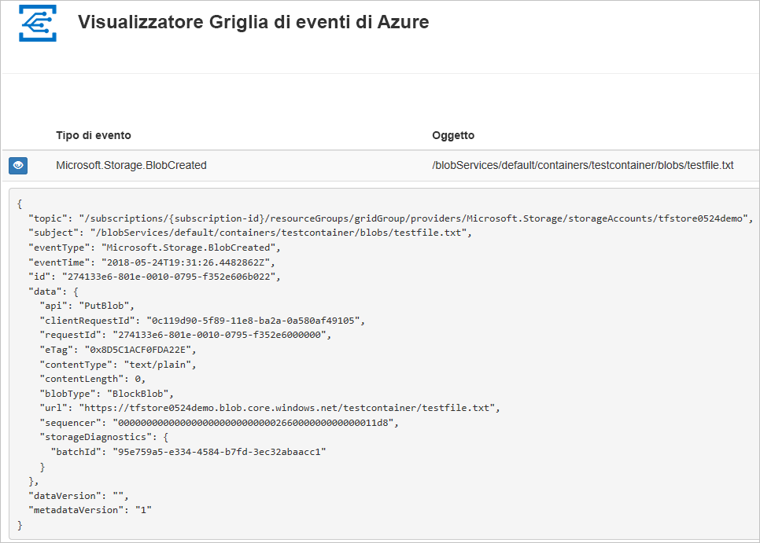
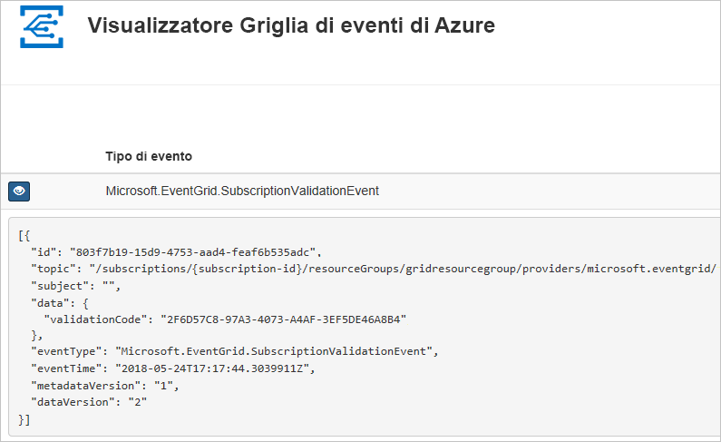

# <a name="quickstart-route-storage-events-to-web-endpoint-with-azure-cli"></a>Avvio rapido: Instradare gli eventi di archiviazione a un endpoint Web con l'interfaccia della riga di comando di Azure

La griglia di eventi di Azure è un servizio di gestione degli eventi per il cloud. Questo articolo illustra come usare l'interfaccia della riga di comando di Azure per sottoscrivere eventi di archiviazione BLOB e attivare l'evento per visualizzare il risultato.

In genere, si inviano eventi a un endpoint che elabora i dati dell'evento e intraprende azioni. Per maggiore semplicità, tuttavia, in questo articolo gli eventi vengono inviati a un'app Web che raccoglie e visualizza i messaggi.

Al termine della procedura descritta in questo articolo, si potrà notare che i dati dell'evento sono stati inviati all'app Web.




[!INCLUDE [quickstarts-free-trial-note.md](../../../includes/quickstarts-free-trial-note.md)]

[!INCLUDE [cloud-shell-try-it.md](../../../includes/cloud-shell-try-it.md)]

Se si sceglie di installare e usare l'interfaccia della riga di comando in locale, per questo articolo è necessario che sia in esecuzione la versione più recente dell'interfaccia della riga di comando di Azure (2.0.24 o versione successiva). Per trovare la versione, eseguire `az --version`. Se è necessario eseguire l'installazione o l'aggiornamento, vedere [Installare l'interfaccia della riga di comando di Azure](/cli/azure/install-azure-cli).

Se non si usa Cloud Shell, prima è necessario accedere usando `az login`.

## <a name="create-a-resource-group"></a>Creare un gruppo di risorse

Gli argomenti della griglia di eventi sono risorse di Azure e devono essere inseriti in un gruppo di risorse di Azure. Un gruppo di risorse è una raccolta logica in cui le risorse di Azure vengono distribuite e gestite.

Creare un gruppo di risorse con il comando [az group create](/cli/azure/group#az_group_create). 

L'esempio seguente crea un gruppo di risorse denominato `<resource_group_name>` nella località *westcentralus*.  Sostituire `<resource_group_name>` con un nome univoco per il gruppo di risorse.

```azurecli-interactive
az group create --name <resource_group_name> --location westcentralus
```

## <a name="create-a-storage-account"></a>Creare un account di archiviazione

Gli eventi di archiviazione BLOB sono disponibili negli account di archiviazione BLOB e negli account di archiviazione per utilizzo generico v2. Gli account di archiviazione per **utilizzo generico v2** supportano tutte le funzionalità di tutti i servizi di archiviazione, inclusi quelli relativi a BLOB, file, code e tabelle. Gli **account di archiviazione BLOB** sono account specializzati per l'archiviazione di dati non strutturati come BLOB (oggetti) in Archiviazione di Azure. Gli account di archiviazione BLOB sono simili agli account di archiviazione di uso generico e includono tutte le straordinarie caratteristiche di durabilità, disponibilità, scalabilità e prestazioni che si usano già normalmente, inclusa la coerenza API al 100% per i BLOB in blocchi e i BLOB di aggiunta. Per altre informazioni, vedere [Panoramica dell'account di archiviazione di Azure](../common/storage-account-overview.md).

Sostituire `<storage_account_name>` con un nome univoco per l'account di archiviazione e `<resource_group_name>` con il gruppo di risorse creato in precedenza.

```azurecli-interactive
az storage account create \
  --name <storage_account_name> \
  --location westcentralus \
  --resource-group <resource_group_name> \
  --sku Standard_LRS \
  --kind BlobStorage \
  --access-tier Hot
```

## <a name="create-a-message-endpoint"></a>Creare un endpoint del messaggio

Prima di sottoscrivere l'argomento, creare l'endpoint per il messaggio dell'evento. L'endpoint richiede in genere azioni basate sui dati degli eventi. Per semplificare questa guida introduttiva, si distribuisce un'[app Web preesistente](https://github.com/Azure-Samples/azure-event-grid-viewer) che visualizza i messaggi di evento. La soluzione distribuita include un piano di servizio app, un'app Web del servizio app e codice sorgente da GitHub.

Sostituire `<your-site-name>` con un nome univoco per l'app Web. Il nome dell'app Web deve essere univoco perché fa parte della voce DNS.

```azurecli-interactive
sitename=<your-site-name>

az group deployment create \
  --resource-group <resource_group_name> \
  --template-uri "https://raw.githubusercontent.com/Azure-Samples/azure-event-grid-viewer/master/azuredeploy.json" \
  --parameters siteName=$sitename hostingPlanName=viewerhost
```

Per il completamento della distribuzione possono essere necessari alcuni minuti. Dopo il completamento della distribuzione, visualizzare l'app Web per assicurarsi che sia in esecuzione. In un Web browser passare a: `https://<your-site-name>.azurewebsites.net`

Il sito dovrebbe essere visibile senza messaggi attualmente visualizzati.

[!INCLUDE [event-grid-register-provider-cli.md](../../../includes/event-grid-register-provider-cli.md)]

## <a name="subscribe-to-your-storage-account"></a>Sottoscrivere l'account di archiviazione

Si sottoscrive un argomento per indicare a Griglia di eventi gli eventi di cui si vuole tenere traccia e dove inviare tali eventi. L'esempio seguente sottoscrive l'account di archiviazione creato e passa l'URL dell'app Web come endpoint per la notifica degli eventi. Sostituire `<event_subscription_name>` con un nome per la sottoscrizione di eventi. Per `<resource_group_name>` e `<storage_account_name>` usare i valori creati in precedenza.

L'endpoint per l'app Web deve includere il suffisso `/api/updates/`.

```azurecli-interactive
storageid=$(az storage account show --name <storage_account_name> --resource-group <resource_group_name> --query id --output tsv)
endpoint=https://$sitename.azurewebsites.net/api/updates

az eventgrid event-subscription create \
  --resource-id $storageid \
  --name <event_subscription_name> \
  --endpoint $endpoint
```

Visualizzare nuovamente l'app Web e notare che all'app è stato inviato un evento di convalida della sottoscrizione. Selezionare l'icona a forma di occhio per espandere i dati dell'evento. Griglia di eventi invia l'evento di convalida in modo che l'endpoint possa verificare che voglia ricevere i dati dell'evento. L'app Web include il codice per convalidare la sottoscrizione.



## <a name="trigger-an-event-from-blob-storage"></a>Attivare un evento dall'archiviazione BLOB

A questo punto, attivare un evento per vedere come la griglia di eventi distribuisce il messaggio nell'endpoint. Configurare prima di tutto il nome e la chiave per l'account di archiviazione, quindi creare un contenitore e infine creare e caricare un file. Anche in questo caso, usare i valori per `<storage_account_name>` e `<resource_group_name>` creati in precedenza.

```azurecli-interactive
export AZURE_STORAGE_ACCOUNT=<storage_account_name>
export AZURE_STORAGE_ACCESS_KEY="$(az storage account keys list --account-name <storage_account_name> --resource-group <resource_group_name> --query "[0].value" --output tsv)"

az storage container create --name testcontainer

touch testfile.txt
az storage blob upload --file testfile.txt --container-name testcontainer --name testfile.txt
```

È stato attivato l'evento e Griglia di eventi ha inviato il messaggio all'endpoint configurato al momento della sottoscrizione. Visualizzare l'app Web per vedere l'evento appena inviato.


```json
[{
  "topic": "/subscriptions/xxxxxxxx-xxxx-xxxx-xxxx-xxxxxxxxxxxx/resourceGroups/myrg/providers/Microsoft.Storage/storageAccounts/myblobstorageaccount",
  "subject": "/blobServices/default/containers/testcontainer/blobs/testfile.txt",
  "eventType": "Microsoft.Storage.BlobCreated",
  "eventTime": "2017-08-16T20:33:51.0595757Z",
  "id": "4d96b1d4-0001-00b3-58ce-16568c064fab",
  "data": {
    "api": "PutBlockList",
    "clientRequestId": "d65ca2e2-a168-4155-b7a4-2c925c18902f",
    "requestId": "4d96b1d4-0001-00b3-58ce-16568c000000",
    "eTag": "0x8D4E4E61AE038AD",
    "contentType": "text/plain",
    "contentLength": 0,
    "blobType": "BlockBlob",
    "url": "https://myblobstorageaccount.blob.core.windows.net/testcontainer/testblob1.txt",
    "sequencer": "00000000000000EB0000000000046199",
    "storageDiagnostics": {
      "batchId": "dffea416-b46e-4613-ac19-0371c0c5e352"
    }
  },
  "dataVersion": "",
  "metadataVersion": "1"
}]

```

## <a name="clean-up-resources"></a>Pulire le risorse
Se si intende continuare a usare questo account di archiviazione e questa sottoscrizione di eventi, non è necessario pulire le risorse create in questo articolo. Se non si intende continuare, usare il comando seguente per eliminare le risorse create con questo articolo.

Sostituire `<resource_group_name>` con il gruppo di risorse creato in precedenza.

```azurecli-interactive
az group delete --name <resource_group_name>
```

## <a name="next-steps"></a>Passaggi successivi

Ora che si è appreso come creare argomenti e sottoscrizioni di eventi, è possibile approfondire le operazioni possibili con gli eventi di archiviazione BLOB e con la Griglia di eventi:

- [Reazione agli eventi di archiviazione BLOB](storage-blob-event-overview.md)
- [Informazioni sulla griglia di eventi](../../event-grid/overview.md)
