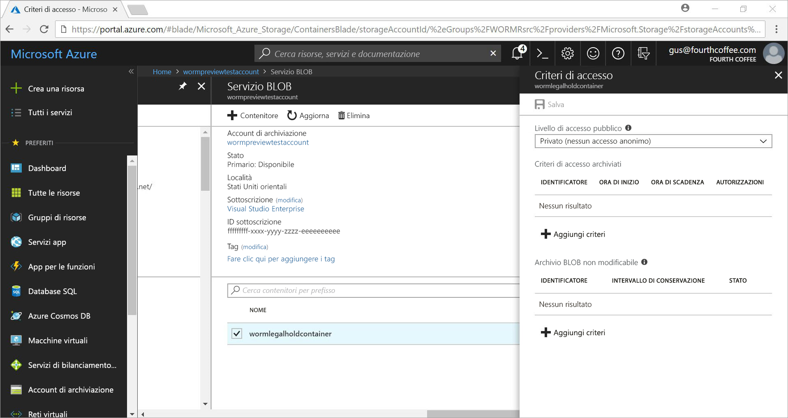
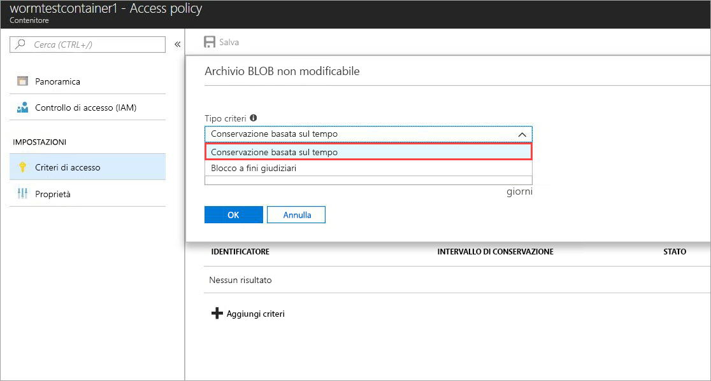
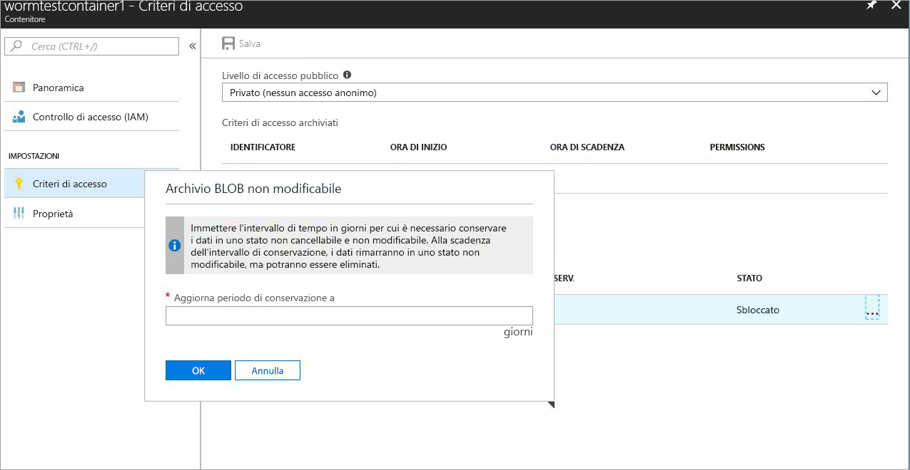
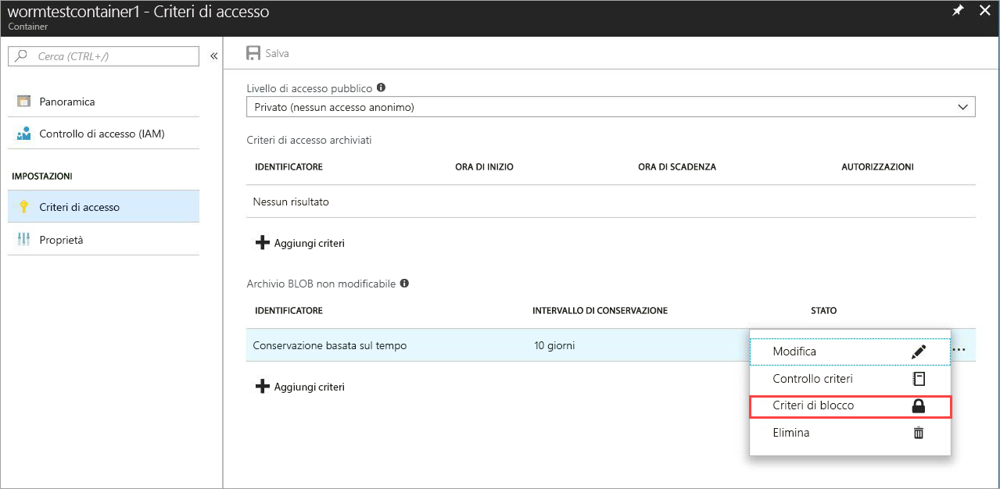
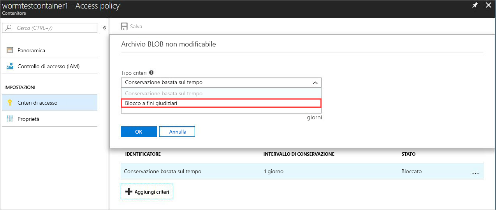
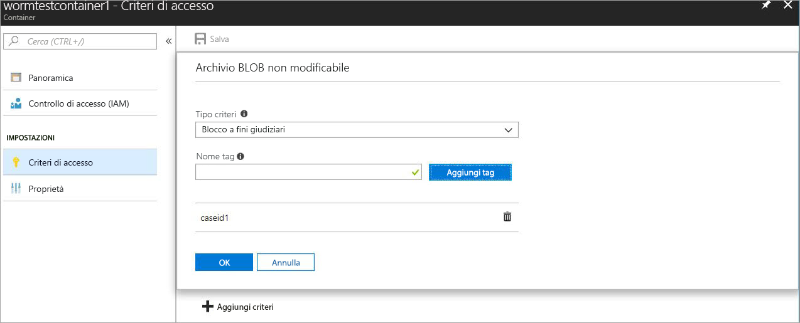

# <a name="store-business-critical-data-in-azure-blob-storage-immutably"></a>Archiviare dati critici per l'azienda in archiviazione BLOB di Azure immutabilmente 

L'archiviazione non modificabile per l'archiviazione BLOB di Azure consente agli utenti di archiviare oggetti dati cruciali per l'azienda in un WORM (scrivere una sola volta, leggere molti) stato. Questo stato rende i dati non cancellabili e non modificabili per un intervallo di tempo specificato dall'utente. È possibile creare e leggere oggetti BLOB, ma non modificarli o eliminarli, per la durata dell'intervallo di conservazione. L'archiviazione non modificabile è abilitata per gli account di archiviazione BLOB e di per utilizzo generico V2 in tutte le aree di Azure.

## <a name="overview"></a>Panoramica

L'archiviazione non modificabile aiuta l'organizzazione sanitaria, le istituzioni finanziarie e i settori correlati, in particolare le organizzazioni broker-dealer, per archiviare i dati in modo sicuro. Può anche essere sfruttato in qualsiasi scenario per proteggere i dati critici da modifiche o eliminazioni. 

Le applicazioni tipiche includono:

- **Conformità alle normative**: l'archiviazione non modificabile per l'Archiviazione BLOB di Azure aiuta le organizzazioni a soddisfare i requisiti di SEC 17a-4(f), CFTC 1.31(d), FINRA e altre normative. Un white paper tecnico di Cohasset associa informazioni dettagliate su come gli indirizzi di archiviazione non modificabili questi requisiti normativi sono scaricabili tramite il [Microsoft Service Trust Portal](https://aka.ms/AzureWormStorage). Il [Centro protezione di Azure](https://www.microsoft.com/trustcenter/compliance/compliance-overview) contiene informazioni dettagliate sulle certificazioni di conformità.

- **Conservazione sicura dei documenti**: L'archiviazione non modificabile per l'archiviazione BLOB di Azure garantisce che i dati non possano essere modificati o eliminati da alcun utente, inclusi gli utenti con privilegi amministrativi dell'account.

- **Blocco a fini giudiziari**: L'archiviazione non modificabile per l'archiviazione BLOB di Azure consente agli utenti di archiviare informazioni riservate cruciali per la controversia o l'uso aziendale in uno stato di prova di manomissione per la durata desiderata fino a quando non viene rimossa l'attesa. Questa funzionalità non è limitata solo ai casi d'uso legali, ma può anche essere considerata come un blocco basato su eventi o un blocco aziendale, in cui è necessario proteggere i dati in base ai trigger di evento o ai criteri aziendali.

L'archiviazione non modificabile supporta gli elementi seguenti:

- **[Supporto dei criteri di conservazione basati sul tempo](#time-based-retention)** : Gli utenti possono impostare criteri per archiviare i dati per un intervallo specificato. Quando viene impostato un criterio di conservazione basato sul tempo, è possibile creare e leggere i BLOB, ma non modificarli o eliminarli. Una volta scaduto il periodo di conservazione, i BLOB possono essere eliminati, ma non sovrascritti.

- **[Supporto dei criteri di mantenimento legale](#legal-holds)** : Se l'intervallo di conservazione non è noto, gli utenti possono impostare le esenzioni legali per archiviare i dati immutabilmente fino a quando non viene cancellata la tenuta legale.  Quando viene impostato un criterio di tenuta legale, è possibile creare e leggere i BLOB, ma non modificarli o eliminarli. Ogni tenuta legale è associata a un tag alfanumerico definito dall'utente, ad esempio un ID del case, un nome di evento e così via, usato come stringa di identificazione. 

- **Supporto per tutti i livelli di BLOB**: i criteri WORM sono indipendenti dal livello di Archiviazione BLOB di Azure e si applicano a tutti i livelli (ad accesso frequente, ad accesso sporadico e archivio). Gli utenti possono trasferire i dati nel livello con i costi ottimali per i carichi di lavoro, mantenendo al tempo stesso la non modificabilità dei dati.

- **Configurazione a livello di contenitore**: gli utenti possono configurare criteri di conservazione basati sul tempo e tag di blocco a fini giudiziari a livello di contenitore. Grazie alle semplici impostazioni a livello di contenitore, gli utenti possono creare e bloccare i criteri di conservazione basati sul tempo, estendere gli intervalli di conservazione, impostare e deselezionare le esenzioni legali e altro ancora. Questi criteri si applicano a tutti i BLOB nel contenitore, nuovi ed esistenti.

- **Supporto per la registrazione di controllo**: Ogni contenitore include un log di controllo dei criteri. Mostra fino a sette comandi di conservazione basati sul tempo per i criteri di conservazione basati sul tempo bloccati e contiene l'ID utente, il tipo di comando, i timestamp e l'intervallo di conservazione. Per i blocchi a fini giudiziari, il log contiene l'ID utente, il tipo di comando, i timestamp e i tag di blocco a fini giudiziari. Questo log viene mantenuto per la durata del criterio, in conformità con le linee guida per le normative SEC 17a-4 (f). Il [log attività di Azure](../../azure-monitor/platform/activity-logs-overview.md) Mostra un log più completo di tutte le attività del piano di controllo; Quando si abilitano i [log di diagnostica di Azure](../../azure-monitor/platform/resource-logs-overview.md) , le operazioni del piano dati vengono mantenute. È responsabilità dell'utente archiviare questi log in modo permanente, come potrebbe essere richiesto per scopi legali o di altro tipo.

## <a name="how-it-works"></a>Come funziona

L'archiviazione non modificabile per Archiviazione BLOB di Azure supporta due tipi di criteri non modificabili o WORM: conservazione basata sul tempo e blocchi a fini giudiziari. Quando si applica un criterio di conservazione basato sul tempo o un periodo di attesa legale a un contenitore, tutti i BLOB esistenti vengono spostati in uno stato non modificabile di un WORM in meno di 30 secondi. Anche tutti i nuovi BLOB caricati in tale contenitore verranno spostati nello stato non modificabile. Una volta che tutti i BLOB sono stati spostati nello stato non modificabile, i criteri non modificabili vengono confermati e non sono consentite tutte le operazioni di sovrascrittura o eliminazione per oggetti esistenti e nuovi nel contenitore non modificabile.

Anche l'eliminazione di contenitori e account non è consentita se sono presenti BLOB protetti da criteri non modificabili. L'operazione di eliminazione del contenitore avrà esito negativo se esiste almeno un BLOB con criteri di conservazione basati sul tempo bloccati o un blocco a fini giudiziari. L'eliminazione dell'account di archiviazione avrà esito negativo se è presente almeno un contenitore WORM con un blocco a fini giudiziari o un BLOB con un intervallo di conservazione attivo. 

### <a name="time-based-retention"></a>Conservazione basata sul tempo

> [!IMPORTANT]
> Un criterio di conservazione basato sul tempo deve essere *bloccato* affinché il BLOB sia in uno stato non modificabile conforme (scrittura ed eliminazione protetta) per i secondi 17a-4 (f) e altre normative di conformità. Si consiglia di bloccare il criterio in un periodo di tempo ragionevole, in genere inferiore a 24 ore. Lo stato iniziale di un criterio di conservazione basato sul tempo applicato viene *sbloccato*, consentendo di testare la funzionalità e apportare modifiche ai criteri prima di bloccarlo. Sebbene lo stato *sbloccato* fornisca la protezione dell'immutabilità, non è consigliabile usare lo stato *sbloccato* per qualsiasi scopo, ad eccezione delle versioni di valutazione a breve termine delle funzionalità. 

Quando vengono applicati criteri di conservazione basati sul tempo a un contenitore, tutti i BLOB nel contenitore rimangono nello stato non modificabile per la durata del periodo di conservazione *effettivo*. Il periodo di conservazione effettivo per i BLOB esistenti è uguale alla differenza tra l'ora di creazione del BLOB e il periodo di conservazione specificato dall'utente.

Per i nuovi BLOB, il periodo di conservazione effettivo è uguale all'intervallo di conservazione specificato dall'utente. Poiché gli utenti possono estendere l'intervallo di conservazione, l'archiviazione non modificabile usa il valore più recente dell'intervallo di conservazione specificato dall'utente per calcolare il periodo di conservazione effettivo.

> [!TIP]
> **Esempio:** Un utente crea criteri di conservazione basati sul tempo con un intervallo di conservazione di cinque anni.
>
> Il BLOB esistente in tale contenitore, _testblob1_, è stato creato un anno fa. Il periodo di conservazione effettivo per _testblob1_ è di quattro anni.
>
> Un nuovo BLOB, _testblob2_, viene ora caricato nel contenitore. Il periodo di conservazione effettivo per il nuovo BLOB è di cinque anni.

Un criterio di conservazione basato sul tempo sbloccato è consigliato solo per i test delle funzionalità e i criteri devono essere bloccati per essere conformi ai secondi 17a-4 (f) e ad altri requisiti normativi. Quando un criterio di conservazione basato sul tempo è bloccato, non è possibile rimuovere il criterio e un massimo di 5 aumenti al periodo di conservazione effettivo è consentito. Per ulteriori informazioni su come impostare e bloccare i criteri di conservazione basati sul tempo, vedere la sezione [Guida introduttiva](#getting-started) .

### <a name="legal-holds"></a>Blocchi a fini giudiziari

Quando si imposta un blocco a fini giudiziari, tutti i BLOB nuovi ed esistenti rimangono nello stato non modificabile finché il blocco a fini giudiziari non viene rimosso. Per altre informazioni su come impostare e rimuovere blocchi a fini giudiziari, vedere la sezione [Introduzione](#getting-started).

A un contenitore possono essere applicati contemporaneamente sia criteri di conservazione basati sul tempo che un blocco a fini giudiziari. Tutti i BLOB nel contenitore rimangono nello stato non modificabile finché non vengono rimossi tutti i blocchi a fini giudiziari, anche se il relativo periodo di conservazione effettivo è scaduto. Viceversa, un BLOB rimane in uno stato non modificabile fino alla scadenza del periodo di conservazione effettivo anche se sono stati rimossi tutti i blocchi a fini giudiziari.

La tabella seguente illustra i tipi di operazioni BLOB che vengono disabilitate per i diversi scenari di archiviazione non modificabile. Per altre informazioni, vedere la documentazione dell'[API del servizio BLOB di Azure](https://docs.microsoft.com/rest/api/storageservices/blob-service-rest-api).

|Scenario  |Stato BLOB  |Operazioni BLOB non consentite  |
|---------|---------|---------|
|L'intervallo di conservazione effettivo nel BLOB non è ancora scaduto e/o è impostato un blocco a fini giudiziari     |Non modificabile: protetto da eliminazione e scrittura         | Inserire il BLOB<sup>1</sup>, inserire il blocco<sup>1</sup>, inserire l'elenco dei blocchi<sup>1</sup>, eliminare il contenitore, eliminare il BLOB, impostare i metadati dei BLOB, inserire la pagina, impostare le proprietà del BLOB, il BLOB di snapshot, il BLOB di copia incrementale, il blocco         |
|L'intervallo di conservazione effettivo nel BLOB è scaduto     |Solo protetto da scrittura (le operazioni di eliminazione sono consentite)         |Put Blob<sup>1</sup>, Put Block<sup>1</sup>, Put Block List<sup>1</sup>, Set Blob Metadata, Put Page, Set Blob Properties,  Snapshot Blob, Incremental Copy Blob, Append Block         |
|Tutti i blocchi a fini giudiziari sono stati rimossi e non sono impostati criteri di conservazione basati sul tempo nel contenitore     |Modificabile         |Nessuna         |
|Non sono stati creati criteri WORM (conservazione basata sul tempo o blocco a fini giudiziari)     |Modificabile         |Nessuna         |

<sup>1</sup> l'applicazione consente a queste operazioni di creare un nuovo BLOB una sola volta. Non sono consentite tutte le operazioni di sovrascrittura successive in un percorso BLOB esistente in un contenitore non modificabile.

## <a name="supported-values"></a>Valori supportati

### <a name="time-based-retention"></a>Conservazione basata sul tempo
- Per un account di archiviazione, il numero massimo di contenitori con criteri non modificabili basati sul tempo bloccati è 1.000.
- L'intervallo di conservazione minimo è di 1 giorno. Il valore massimo è 146.000 giorni (400 anni).
- Per un contenitore, il numero massimo di modifiche per estendere un intervallo di conservazione per i criteri non modificabili basati sul tempo bloccato è 5.
- Per un contenitore, vengono conservati al massimo 7 log di controllo dei criteri di conservazione basati sul tempo per un criterio bloccato.

### <a name="legal-hold"></a>Blocco a fini giudiziari
- Per un account di archiviazione, il numero massimo di contenitori con un'impostazione di blocco a fini giudiziari è 1.000.
- Per un contenitore, il numero massimo di tag di blocco a fini giudiziari è 10.
- La lunghezza minima di un tag di tenuta legale è di 3 caratteri alfanumerici. La lunghezza massima è di 23 caratteri alfanumerici.
- Per un contenitore, vengono conservati al massimo 10 log di controllo dei criteri di conservazione per la durata dei criteri.

## <a name="pricing"></a>Prezzi

Per l'uso di questa funzionalità non sono previsti costi aggiuntivi. Il prezzo dei dati non modificabili è lo stesso dei normali dati modificabili. Per informazioni sui prezzi di Archiviazione BLOB di Azure, vedere la [pagina dei prezzi di Archiviazione di Azure](https://azure.microsoft.com/pricing/details/storage/blobs/).

## <a name="getting-started"></a>Introduzione
L'archiviazione non modificabile è disponibile solo per gli account di archiviazione BLOB e per utilizzo generico V2. Questi account devono essere gestiti tramite [Azure Resource Manager](https://docs.microsoft.com/azure/azure-resource-manager/resource-group-overview). Per informazioni sull'aggiornamento di un account di archiviazione per utilizzo generico V1 esistente, vedere [aggiornare un account di archiviazione](../common/storage-account-upgrade.md).

Le versioni più recenti del [portale di Azure](https://portal.azure.com), dell' [interfaccia](https://docs.microsoft.com/cli/azure/install-azure-cli?view=azure-cli-latest)della riga di comando di Azure e [Azure PowerShell](https://github.com/Azure/azure-powershell/releases) supportano l'archiviazione non modificabile per l'archiviazione BLOB di Azure. Viene inoltre fornito il [supporto della libreria client](#client-libraries) .

### <a name="azure-portal"></a>Portale di Azure

1. Creare un nuovo contenitore o selezionare un contenitore esistente per archiviare i BLOB che devono essere mantenuti nello stato non modificabile.
 Il contenitore deve essere in un account di archiviazione per utilizzo generico v2 o BLOB.
2. Selezionare **Criteri di accesso** nelle impostazioni del contenitore. Selezionare quindi **+ Aggiungi criteri** in **Archivio BLOB non modificabile**.

    

3. Per abilitare la conservazione basata sul tempo, scegliere **Conservazione basata su tempo** dal menu a discesa.

    

4. Immettere l'intervallo di conservazione in giorni (valori accettabili da 1 a 146000 giorni).

    

    Lo stato iniziale del criterio è sbloccato, che consente di testare la funzionalità e apportare modifiche ai criteri prima di bloccarlo. Il blocco del criterio è essenziale per la conformità a normative come SEC 17a-4.

5. Bloccare i criteri. Fare clic con il pulsante destro del mouse sui puntini di sospensione ( **...** ) e il menu seguente viene visualizzato con azioni aggiuntive:

    

6. Selezionare **blocca criterio** e confermare il blocco. Il criterio è ora bloccato e non può essere eliminato. saranno consentite solo le estensioni dell'intervallo di conservazione. Le eliminazioni BLOB e le sostituzioni non sono consentite. 

    

7. Per abilitare i blocchi a fini giudiziari, selezionare **+ Aggiungi criteri**. Scegliere **Blocco a fini giudiziari** dal menu a discesa.

    

8. Creare un blocco a fini giudiziari con uno o più tag.

    

9. Per cancellare una tenuta legale, è sufficiente rimuovere il tag dell'identificatore di esenzione legale applicato.

### <a name="azure-cli"></a>Interfaccia della riga di comando di Azure

La funzionalità è inclusa nei gruppi di comandi seguenti: `az storage container immutability-policy` e `az storage container legal-hold`. Eseguire `-h` per visualizzare i comandi.

### <a name="powershell"></a>PowerShell

Il modulo AZ. Storage supporta l'archiviazione non modificabile.  Per abilitare la funzionalità, seguire questa procedura:

1. Assicurarsi di avere la versione più recente di PowerShellGet installata: `Install-Module PowerShellGet –Repository PSGallery –Force`.
2. Rimuovere eventuali installazioni precedenti di Azure PowerShell.
3. Installare Azure PowerShell: `Install-Module Az –Repository PSGallery –AllowClobber`.

La sezione [Codice PowerShell di esempio](#sample-powershell-code) più avanti in questo articolo illustra l'utilizzo della funzionalità.

## <a name="client-libraries"></a>Librerie client

Le librerie client seguenti supportano l'archiviazione non modificabile per Archiviazione BLOB di Azure:

- [Libreria client .NET versione 7.2.0-preview e versioni successive](https://www.nuget.org/packages/Microsoft.Azure.Management.Storage/7.2.0-preview)
- [Libreria client Node.js versione 4.0.0 e versioni successive](https://www.npmjs.com/package/azure-arm-storage)
- [Libreria client Python versione 2.0.0 versione finale candidata 2 e versioni successive](https://pypi.org/project/azure-mgmt-storage/2.0.0rc2/)
- [Libreria client Java](https://github.com/Azure/azure-rest-api-specs/tree/master/specification/storage/resource-manager/Microsoft.Storage/preview/2018-03-01-preview)

## <a name="faq"></a>Domande frequenti

**È possibile fornire la documentazione della conformità del WORM?**

Sì. Per documentare la conformità, Microsoft ha mantenuto una società di valutazione indipendente leader specializzata nella gestione dei record e nella governance delle informazioni, Cohasset Associates, per valutare l'archiviazione BLOB non modificabile di Azure e la rispettiva conformità ai requisiti specifici per il settore dei servizi finanziari. Cohasset convalidato che l'archiviazione BLOB non modificabile di Azure, quando usata per conservare i BLOB basati sul tempo in uno stato di WORM, soddisfa i requisiti di archiviazione rilevanti della regola CFTC 1.31 (c)-(d), regola FINRA 4511 e regola SEC 17a-4. Microsoft ha mirato a questo set di regole, in quanto rappresentano le linee guida più prescritte a livello globale per la conservazione dei record per gli istituti finanziari. Il report Cohasset è disponibile nel [Centro protezione dei servizi Microsoft](https://aka.ms/AzureWormStorage). Per richiedere una lettera di attestazione da Microsoft relativa alla conformità del WORM, contattare il supporto tecnico di Azure.

**La funzionalità si applica solo ai BLOB in blocchi o anche ai BLOB di pagine e di aggiunta?**

L'archiviazione non modificabile può essere usata con qualsiasi tipo di BLOB perché è impostata a livello di contenitore, ma è consigliabile usare WORM per i contenitori che prevedono principalmente l'archiviazione di BLOB in blocchi. A differenza dei BLOB in blocchi, è necessario creare eventuali nuovi BLOB di pagine e BLOB di Accodamento all'esterno di un contenitore di WORM, quindi copiarli in. Dopo aver copiato questi BLOB in un contenitore WORM, non sono consentiti altri *accodamenti* a un BLOB di accodamento o modifiche a un BLOB di pagine. L'impostazione di un criterio WORM in un contenitore che archivia dischi rigidi virtuali (BLOB di pagine) per le macchine virtuali attive è pertanto fortemente sconsigliata perché bloccherà il disco della VM.

**È necessario creare un nuovo account di archiviazione per usare questa funzionalità?**

No, è possibile usare l'archiviazione non modificabile con gli account di archiviazione BLOB o esistenti per utilizzo generico v2 o appena creati. Questa funzionalità è destinata all'uso con BLOB in blocchi negli account di archiviazione BLOB e GPv2. Gli account di archiviazione per utilizzo generico V1 non sono supportati, ma possono essere facilmente aggiornati a per utilizzo generico V2. Per informazioni sull'aggiornamento di un account di archiviazione per utilizzo generico V1 esistente, vedere [aggiornare un account di archiviazione](../common/storage-account-upgrade.md).

**È possibile applicare un criterio di conservazione legale e basato sul tempo?**

Sì, un contenitore può avere contemporaneamente un criterio di conservazione e un criterio di conservazione basato sul tempo. Tutti i BLOB nel contenitore rimangono nello stato non modificabile finché non vengono rimossi tutti i blocchi a fini giudiziari, anche se il relativo periodo di conservazione effettivo è scaduto. Viceversa, un BLOB rimane in uno stato non modificabile fino alla scadenza del periodo di conservazione effettivo anche se sono stati rimossi tutti i blocchi a fini giudiziari.

**I criteri di mantenimento sono validi solo per le procedure legali o esistono altri scenari di utilizzo?**

No, l'esenzione legale è solo il termine generico usato per un criterio di conservazione non basato sul tempo. Non è necessario usarlo solo per le procedure correlate ai contenziosi. I criteri di conservazione validi sono utili per disabilitare la sovrascrittura e le eliminazioni per la protezione di importanti dati WORM aziendali, in cui il periodo di conservazione è sconosciuto. È possibile usarlo come criterio aziendale per proteggere i carichi di lavoro di un WORM cruciale o usarlo come criterio di gestione temporanea prima che un trigger di evento personalizzato richieda l'uso di un criterio di conservazione basato sul tempo. 

**È possibile rimuovere un criterio di conservazione basato sul tempo _bloccato_ o un blocco legale?**

Solo i criteri di conservazione basati sul tempo sbloccati possono essere rimossi da un contenitore. Quando un criterio di conservazione basato sul tempo è bloccato, non può essere rimosso. sono consentite solo le estensioni del periodo di memorizzazione effettivo. I tag di esenzione legali possono essere eliminati. Quando vengono eliminati tutti i tag legali, viene rimossa la tenuta legale.

**Che cosa accade se si tenta di eliminare un contenitore con un criterio di conservazione basato sul tempo *bloccato* o un blocco a fini giudiziari?**

L'operazione di eliminazione del contenitore avrà esito negativo se esiste almeno un BLOB con criteri di conservazione basati sul tempo bloccati o un blocco a fini giudiziari. L'operazione di eliminazione del contenitore verrà completata solo se non esistono BLOB con un intervallo di conservazione attivo e non sono impostati blocchi a fini giudiziari. È necessario eliminare i BLOB prima di poter eliminare il contenitore.

**Che cosa accade se si tenta di eliminare un account di archiviazione con un contenitore WORM che dispone di un criterio di conservazione basato sul tempo *bloccato* o un blocco a fini giudiziari?**

L'eliminazione dell'account di archiviazione avrà esito negativo se è presente almeno un contenitore WORM con un blocco a fini giudiziari o un BLOB con un intervallo di conservazione attivo. È necessario eliminare tutti i contenitori WORM prima di poter eliminare l'account di archiviazione. Per informazioni sull'eliminazione di contenitori, vedere la domanda precedente.

**È possibile spostare i dati tra i diversi livelli BLOB (ad accesso frequente, ad accesso sporadico e archivio) quando il BLOB è in stato non modificabile?**

Sì, è possibile usare il comando Imposta livello BLOB per spostare i dati tra i livelli BLOB mantenendo i dati nello stato non modificabile conforme. L'archiviazione non modificabile è supportata nei livelli BLOB ad accesso frequente, ad accesso sporadico e archivio.

**Che cosa accade se non si effettua il pagamento e il periodo di conservazione non è scaduto?**

In caso di mancato pagamento, verranno applicati i normali criteri di conservazione dati previsti nei termini e nelle condizioni del contratto stipulato con Microsoft.

**È disponibile una versione di valutazione o un periodo di tolleranza per provare la funzionalità?**

Sì. Quando un criterio di conservazione basato sul tempo viene creato per la prima volta, è in uno stato *sbloccato* . In questo stato è possibile apportare qualsiasi modifica all'intervallo di conservazione, ad esempio aumentandolo o riducendolo, ed è anche possibile eliminare i criteri. Dopo che sono stati bloccati, i criteri rimangono bloccati fino alla scadenza dell'intervallo di conservazione. Questo criterio bloccato impedisce l'eliminazione e la modifica dell'intervallo di conservazione. È consigliabile usare lo stato *sbloccato* solo per scopi di valutazione e bloccare i criteri entro un periodo di 24 ore. Ciò consente la conformità a SEC 17a-4(f) e altre normative.

**È possibile usare l'eliminazione temporanea insieme ai criteri BLOB non modificabili?**

Sì. L' [eliminazione temporanea per l'archiviazione BLOB di Azure](storage-blob-soft-delete.md) si applica a tutti i contenitori in un account di archiviazione indipendentemente da un criterio di conservazione legale o basato sul tempo. È consigliabile abilitare l'eliminazione temporanea per una protezione aggiuntiva prima di applicare e confermare eventuali criteri WORM non modificabili. 

**Dove è disponibile la funzionalità?**

L'archiviazione non modificabile è disponibile nelle aree pubbliche di Azure, in Cina e per gli enti pubblici. Se l'archiviazione non modificabile non è disponibile nella propria area, contattare il supporto azurestoragefeedback@microsoft.comtecnico e il messaggio di posta elettronica.

## <a name="sample-powershell-code"></a>Codice PowerShell di esempio

[!INCLUDE [updated-for-az](../../../includes/updated-for-az.md)]

Lo script di PowerShell di esempio seguente viene fornito a scopo di riferimento. Questo script crea un nuovo account di archiviazione e un nuovo contenitore. Viene quindi illustrato come impostare e rimuovere i blocchi a fini giudiziari, creare e bloccare i criteri di conservazione basati sul tempo (noti anche come criteri di immutabilità) ed estendere l'intervallo di conservazione.

Configurare e testare l'account di archiviazione di Azure:

```powershell
$ResourceGroup = "<Enter your resource group>”
$StorageAccount = "<Enter your storage account name>"
$container = "<Enter your container name>"
$container2 = "<Enter another container name>”
$location = "<Enter the storage account location>"

# Log in to the Azure Resource Manager account
Login-AzAccount
Register-AzResourceProvider -ProviderNamespace "Microsoft.Storage"

# Create your Azure resource group
New-AzResourceGroup -Name $ResourceGroup -Location $location

# Create your Azure storage account
New-AzStorageAccount -ResourceGroupName $ResourceGroup -StorageAccountName `
    $StorageAccount -SkuName Standard_LRS -Location $location -Kind StorageV2

# Create a new container
New-AzStorageContainer -ResourceGroupName $ResourceGroup `
    -StorageAccountName $StorageAccount -Name $container

# Create Container 2 with a storage account object
$accountObject = Get-AzStorageAccount -ResourceGroupName $ResourceGroup `
    -StorageAccountName $StorageAccount
New-AzStorageContainer -StorageAccount $accountObject -Name $container2

# Get a container
Get-AzStorageContainer -ResourceGroupName $ResourceGroup `
    -StorageAccountName $StorageAccount -Name $container

# Get a container with an account object
$containerObject = Get-AzStorageContainer -StorageAccount $accountObject -Name $container

# List containers
Get-AzStorageContainer -ResourceGroupName $ResourceGroup `
    -StorageAccountName $StorageAccount

# Remove a container (add -Force to dismiss the prompt)
Remove-AzStorageContainer -ResourceGroupName $ResourceGroup `
    -StorageAccountName $StorageAccount -Name $container2

# Remove a container with an account object
Remove-AzStorageContainer -StorageAccount $accountObject -Name $container2

# Remove a container with a container object
$containerObject2 = Get-AzStorageContainer -StorageAccount $accountObject -Name $container2
Remove-AzStorageContainer -InputObject $containerObject2
```

Impostare e cancellare i blocchi a fini giudiziari:

```powershell
# Set a legal hold
Add-AzRmStorageContainerLegalHold -ResourceGroupName $ResourceGroup `
    -StorageAccountName $StorageAccount -Name $container -Tag <tag1>,<tag2>,...

# with an account object
Add-AzRmStorageContainerLegalHold -StorageAccount $accountObject -Name $container -Tag <tag3>

# with a container object
Add-AzRmStorageContainerLegalHold -Container $containerObject -Tag <tag4>,<tag5>,...

# Clear a legal hold
Remove-AzRmStorageContainerLegalHold -ResourceGroupName $ResourceGroup `
    -StorageAccountName $StorageAccount -Name $container -Tag <tag2>

# with an account object
Remove-AzRmStorageContainerLegalHold -StorageAccount $accountObject -Name $container -Tag <tag3>,<tag5>

# with a container object
Remove-AzRmStorageContainerLegalHold -Container $containerObject -Tag <tag4>
```

Creare o aggiornare i criteri di immutabilità:
```powershell
# with an account name or container name
Set-AzRmStorageContainerImmutabilityPolicy -ResourceGroupName $ResourceGroup `
    -StorageAccountName $StorageAccount -ContainerName $container -ImmutabilityPeriod 10

# with an account object
Set-AzRmStorageContainerImmutabilityPolicy -StorageAccount $accountObject `
    -ContainerName $container -ImmutabilityPeriod 1 -Etag $policy.Etag

# with a container object
$policy = Set-AzRmStorageContainerImmutabilityPolicy -Container `
    $containerObject -ImmutabilityPeriod 7

# with an immutability policy object
Set-AzRmStorageContainerImmutabilityPolicy -ImmutabilityPolicy $policy -ImmutabilityPeriod 5
```

Recuperare i criteri di immutabilità:
```powershell
# Get an immutability policy
Get-AzRmStorageContainerImmutabilityPolicy -ResourceGroupName $ResourceGroup `
    -StorageAccountName $StorageAccount -ContainerName $container

# with an account object
Get-AzRmStorageContainerImmutabilityPolicy -StorageAccount $accountObject `
    -ContainerName $container

# with a container object
Get-AzRmStorageContainerImmutabilityPolicy -Container $containerObject
```

Bloccare i criteri di immutabilità (aggiungere -Force per ignorare il prompt):
```powershell
# with an immutability policy object
$policy = Get-AzRmStorageContainerImmutabilityPolicy -ResourceGroupName `
    $ResourceGroup -StorageAccountName $StorageAccount -ContainerName $container
$policy = Lock-AzRmStorageContainerImmutabilityPolicy -ImmutabilityPolicy $policy -force

# with an account name or container name
$policy = Lock-AzRmStorageContainerImmutabilityPolicy -ResourceGroupName `
    $ResourceGroup -StorageAccountName $StorageAccount -ContainerName $container `
    -Etag $policy.Etag

# with an account object
$policy = Lock-AzRmStorageContainerImmutabilityPolicy -StorageAccount `
    $accountObject -ContainerName $container -Etag $policy.Etag

# with a container object
$policy = Lock-AzRmStorageContainerImmutabilityPolicy -Container `
    $containerObject -Etag $policy.Etag -force
```

Estendere i criteri di immutabilità:
```powershell

# with an immutability policy object
$policy = Get-AzRmStorageContainerImmutabilityPolicy -ResourceGroupName `
    $ResourceGroup -StorageAccountName $StorageAccount -ContainerName $container

$policy = Set-AzRmStorageContainerImmutabilityPolicy -ImmutabilityPolicy `
    $policy -ImmutabilityPeriod 11 -ExtendPolicy

# with an account name or container name
$policy = Set-AzRmStorageContainerImmutabilityPolicy -ResourceGroupName `
    $ResourceGroup -StorageAccountName $StorageAccount -ContainerName $container `
    -ImmutabilityPeriod 11 -Etag $policy.Etag -ExtendPolicy

# with an account object
$policy = Set-AzRmStorageContainerImmutabilityPolicy -StorageAccount `
    $accountObject -ContainerName $container -ImmutabilityPeriod 12 -Etag `
    $policy.Etag -ExtendPolicy

# with a container object
$policy = Set-AzRmStorageContainerImmutabilityPolicy -Container `
    $containerObject -ImmutabilityPeriod 13 -Etag $policy.Etag -ExtendPolicy
```

Rimuovere i criteri di immutabilità sbloccati (Add-Force per chiudere il prompt):
```powershell
# with an immutability policy object
$policy = Get-AzRmStorageContainerImmutabilityPolicy -ResourceGroupName `
    $ResourceGroup -StorageAccountName $StorageAccount -ContainerName $container
Remove-AzRmStorageContainerImmutabilityPolicy -ImmutabilityPolicy $policy

# with an account name or container name
Remove-AzRmStorageContainerImmutabilityPolicy -ResourceGroupName `
    $ResourceGroup -StorageAccountName $StorageAccount -ContainerName $container `
    -Etag $policy.Etag

# with an account object
Remove-AzRmStorageContainerImmutabilityPolicy -StorageAccount $accountObject `
    -ContainerName $container -Etag $policy.Etag

# with a container object
Remove-AzRmStorageContainerImmutabilityPolicy -Container $containerObject `
    -Etag $policy.Etag

```
