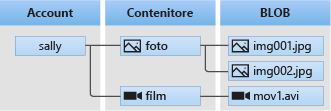

# Introduzione all'archiviazione BLOB

Archiviazione BLOB di Azure è una soluzione di archiviazione cloud Microsoft per gli oggetti dati. Archiviazione BLOB può archiviare enormi quantità di dati di oggetti non strutturati, come testo o dati binari. È possibile accedere ai dati in Archiviazione BLOB da ogni parte del mondo tramite HTTP o HTTPS. L'archiviazione BLOB può essere usata per esporre dati pubblicamente a livello mondiale o archiviare privatamente i dati delle applicazioni.

Quelli di seguito sono gli impieghi più comuni dell'archiviazione BLOB:

* Invio di immagini o documenti direttamente in un browser
* Archiviazione di file per l'accesso distribuito
* Flussi audio e video
* Archiviazione per backup e ripristino, ripristino di emergenza e archiviazione
* Archiviazione di dati a scopo di analisi da parte di un servizio locale o ospitato in Azure
* Archiviazione di dischi rigidi virtuali da usare con le macchine virtuali di Azure

## Concetti del servizio BLOB

Il servizio BLOB è composto dai componenti seguenti:

* **Account di archiviazione:** l'accesso ad Archiviazione di Azure viene eseguito esclusivamente tramite un account di archiviazione. Questo account di archiviazione può essere un **account di archiviazione per utilizzo generico (v1 o v2)** o **account di archiviazione BLOB**. Per altre informazioni, vedere [Informazioni sugli account di archiviazione di Azure](../common/storage-create-storage-account.md?toc=%2fazure%2fstorage%2fblobs%2ftoc.json).

* **Contenitore:** un contenitore è un raggruppamento di un set di BLOB. Tutti i BLOB devono trovarsi in un contenitore. In un account può esistere un numero illimitato di contenitori. In un contenitore può essere archiviato un numero illimitato di BLOB. Il nome del contenitore deve essere in lettere minuscole.

* **BLOB:** file di qualsiasi tipo e dimensione. Archiviazione di Azure offre tre tipi di BLOB: i BLOB in blocchi, i [BLOB di pagine](storage-blob-pageblob-overview.md) e i BLOB di accodamento.
  
    *BLOB in blocchi* sono ideali per l'archiviazione di file di testo o file binari, ad esempio i documenti e i file multimediali. *BLOB di accodamento* sono simili ai BLOB in blocchi in quanto sono costituiti da blocchi, ma sono ottimizzati per le operazioni di accodamento, in modo che siano utili per gli scenari di registrazione. Un singolo BLOB in blocchi può contenere fino a 50.000 blocchi da al massimo 100 MB ognuno, per una dimensione totale leggermente superiore a 4,75 TB (100 MB X 50.000). Un singolo BLOB di accodamento può contenere fino a 50.000 blocchi da al massimo 4 MB ognuno, per una dimensione totale leggermente superiore a 195 GB (4 MB X 50.000).
  
    I *BLOB di pagine* possono avere un dimensione di 8 TB al massimo e sono più efficienti per operazioni di lettura/scrittura frequenti. Le Macchine virtuali di Azure utilizzano i BLOB di pagine come dischi del sistema operativo e dati.
  
    Per informazioni sulla denominazione di contenitori e BLOB, vedere l'articolo relativo alla [denominazione e riferimento a contenitori, BLOB e metadati](/rest/api/storageservices/Naming-and-Referencing-Containers--Blobs--and-Metadata).

## Passaggi successivi

* [Creare un account di archiviazione](../common/storage-create-storage-account.md?toc=%2fazure%2fstorage%2fblobs%2ftoc.json)
* [Introduzione all'archivio BLOB di Azure con .NET](storage-dotnet-how-to-use-blobs.md)
* [Esempi di Archiviazione di Azure che usano .NET](../common/storage-samples-dotnet.md)
* [Esempi di Archiviazione di Azure che usano Java](../common/storage-samples-java.md)
