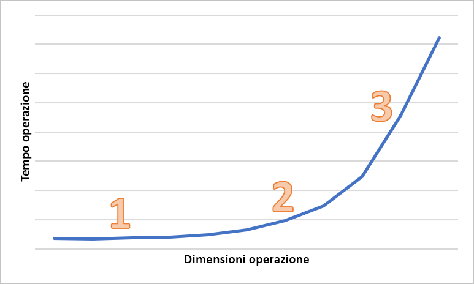

# Latenza in Archiviazione BLOB

La latenza, indicata a volte come tempo di risposta, è la quantità di tempo che un'applicazione deve attendere per il completamento di una richiesta. La latenza può influire direttamente sulle prestazioni di un'applicazione. Una bassa latenza è spesso importante per scenari di tipo humans-in-the-loop, ad esempio per l'esecuzione di transazioni con carte di credito o il caricamento di pagine Web. Richiedono una bassa latenza anche i sistemi che devono elaborare eventi in ingresso con frequenze elevate, ad esempio la registrazione di dati di telemetria o gli eventi IoT. Questo articolo descrive come comprendere e misurare la latenza per le operazioni su BLOB in blocchi e come progettare le applicazioni per una bassa latenza.

Archiviazione di Azure offre due opzioni di prestazioni diverse per i BLOB in blocchi, ovvero Premium e Standard. I BLOB in blocchi Premium offrono una latenza significativamente inferiore e più coerente rispetto ai BLOB in blocchi Standard tramite dischi SSD a prestazioni elevate. Per altre informazioni, vedere **Archiviazione BLOB in blocchi con prestazioni Premium** in [Archiviazione BLOB di Azure: livelli di accesso frequente, sporadico e archivio](storage-blob-storage-tiers.md).

## Informazioni sulla latenza di Archiviazione di Azure

La latenza di Archiviazione di Azure è correlata alle frequenze delle richieste per le operazioni di Archiviazione di Azure. Le frequenze delle richieste sono note anche come operazioni di input/output al secondo.

Per calcolare la frequenza delle richieste, determinare prima di tutto il tempo necessario per il completamento di ogni richiesta, quindi calcolare il numero di richieste che possono essere elaborate al secondo. Si supponga ad esempio che per il completamento di una richiesta siano necessari 50 millisecondi (ms). Un'applicazione che usa un thread con un'operazione di lettura o scrittura in sospeso deve raggiungere 20 operazioni di I/O al secondo (1 secondo o 1000 ms/50 ms per richiesta). In teoria, se il conteggio dei thread viene raddoppiato, l'applicazione deve essere in grado di raggiungere 40 operazioni di I/O al secondo. Se le operazioni di lettura o scrittura asincrone in sospeso per ogni thread vengono raddoppiate, l'applicazione deve essere in grado di raggiungere 80 operazioni di I/O al secondo.

In pratica, le frequenze delle richieste non vengono sempre ridimensionate in modo lineare a causa del sovraccarico nel client dovuto alla pianificazione di attività, al cambio di contesto e così via. Sul lato del servizio, può essere presente una variabilità di latenza dovuta alla pressione sul sistema di Archiviazione di Azure, a differenze nei supporti di archiviazione usati, a interferenze di altri carichi di lavoro, ad attività di manutenzione e ad altri fattori. Infine, la connessione di rete tra il client e il server può influire sulla latenza di Archiviazione di Azure a causa di congestione, rerouting o altre interruzioni.

La larghezza di banda di Archiviazione di Azure, nota anche come velocità effettiva, è correlata alla frequenza delle richieste e può essere calcolata moltiplicando la frequenza delle richieste (operazioni di I/O al secondo) per le dimensioni delle richieste. Si supponga ad esempio che esistano 160 richieste al secondo, ciascuna di 256 KiB di dati. La velocità effettiva risultante sarà di 40.960 KiB al secondo o 40 MiB al secondo.

## Metriche di latenza per i BLOB in blocchi

Archiviazione di Azure offre due metriche di latenza per i BLOB in blocchi. Queste metriche possono essere visualizzate nel portale di Azure:

- La **latenza end-to-end** misura l'intervallo di tempo tra la ricezione in Archiviazione di Azure del primo pacchetto della richiesta e la ricezione di un acknowledgment client sull'ultimo pacchetto della risposta.

- La **latenza server** misura l'intervallo di tempo tra la ricezione in Archiviazione di Azure dell'ultimo pacchetto della richiesta e la restituzione da parte di Archiviazione di Azure del primo pacchetto della risposta.

Nell'immagine seguente viene illustrata la **latenza end-to-end media di richieste riuscite** e la **latenza server media di operazioni riuscite** per un carico di lavoro di esempio che chiama l'operazione `Get Blob`:

In condizioni normali esiste tra la latenza end-to-end e la latenza server un leggero scostamento, che viene mostrato dall'immagine per il carico di lavoro di esempio.

Se si esaminano le metriche di latenza end-to-end e server e si rileva che la latenza end-to-end è superiore alla latenza server in modo significativo, analizzare l'origine della latenza aggiuntiva e risolvere il problema.

Se la latenza end-to-end e server sono simili, ma si richiede una latenza inferiore, è consigliabile eseguire la migrazione all'archiviazione BLOB in blocchi Premium.

## Fattori che influenzano la latenza

Il fattore principale che influenza la latenza è la dimensione dell'operazione. Per completare operazioni di dimensioni elevate è necessario più tempo, a causa della quantità di dati trasferiti sulla rete ed elaborati da Archiviazione di Azure.

Il diagramma seguente mostra il tempo totale per operazioni di dimensioni diverse. Per piccole quantità di dati, l'intervallo di latenza è prevalentemente dedicato alla gestione della richiesta anziché al trasferimento dei dati. L'intervallo di latenza aumenta solo leggermente man mano che aumentano le dimensioni dell'operazione (1 nel diagramma riportato di seguito). Man mano che aumentano le dimensioni dell'operazione, viene impiegato più tempo per il trasferimento dei dati e pertanto l'intervallo di latenza totale viene diviso tra la gestione della richiesta e il trasferimento dei dati (2 nel diagramma riportato di seguito). Con operazioni di dimensioni maggiori, l'intervallo di latenza viene dedicato quasi esclusivamente al trasferimento dei dati e la gestione della richiesta è in gran parte irrilevante (3 nel diagramma riportato di seguito).

Influiscono sulla latenza anche fattori di configurazione client quali la concorrenza e il threading. La velocità effettiva complessiva dipende dal numero di richieste di archiviazione in corso in un determinato momento e dal modo in cui l'applicazione gestisce il threading. Possono influire sulla latenza anche le risorse client, ad esempio la CPU, la memoria, l'archiviazione locale e le interfacce di rete.

L'elaborazione delle richieste di Archiviazione di Azure richiede risorse di memoria e CPU client. Se il client è sotto pressione a causa di una macchina virtuale poco potente o di un processo con eccessivo tempo di esecuzione nel sistema, sono disponibili meno risorse per l'elaborazione delle richieste di Archiviazione di Azure. Qualsiasi conflitto o mancanza di risorse client comporterà un aumento della latenza end-to-end senza un aumento della latenza server, con un incremento dello scostamento tra le due metriche.

Ugualmente importanti sono l'interfaccia di rete e la pipe di rete tra il client e Archiviazione di Azure. La distanza fisica può essere da sola un fattore significativo, ad esempio se una macchina virtuale client si trova in un'area di Azure diversa o in locale. Possono influire sulla latenza complessiva dell'archiviazione altri fattori quali ad esempio gli hop di rete, il routing ISP e lo stato Internet.

Per valutare la latenza, stabilire innanzitutto le metriche di base per il proprio scenario. Le metriche di base forniscono la latenza end-to-end e server prevista nel contesto dell'ambiente dell'applicazione in base al profilo del carico di lavoro, alle impostazioni di configurazione dell'applicazione, alle risorse client, alla pipe di rete e ad altri fattori. Quando si dispone delle metriche di base, è possibile identificare più facilmente le condizioni anomale e normali. Le metriche di base consentono inoltre di osservare gli effetti di parametri modificati, ad esempio la configurazione dell'applicazione o le dimensioni delle macchine virtuali.

## Passaggi successivi

- [Obiettivi di scalabilità e prestazioni di Archiviazione di Azure per gli account di archiviazione](../common/storage-scalability-targets.md)
- [Elenco di controllo di prestazioni e scalabilità di Archiviazione di Azure](../common/storage-performance-checklist.md)
