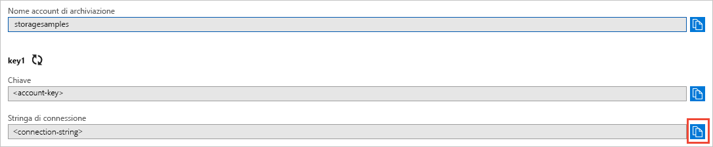

# <a name="quickstart-azure-blob-storage-client-library-for-net"></a>Guida introduttiva: Libreria client di archiviazione BLOB di Azure per .NET

Introduzione alla libreria client di Archiviazione BLOB di Azure per .NET Archiviazione BLOB di Azure è la soluzione di archiviazione di oggetti Microsoft per il cloud. Seguire questi passaggi per installare il pacchetto e provare il codice di esempio per le attività di base. L'archiviazione BLOB è ottimizzata per archiviare enormi quantità di dati non strutturati.

Usare la libreria client di Archiviazione BLOB di Azure per .NET per:

* Creare un contenitore
* Impostare le autorizzazioni in un contenitore
* Creare un oggetto BLOB in Archiviazione di Azure
* Scaricare il BLOB nel computer locale
* Elencare tutti i BLOB in un contenitore
* Eliminare un contenitore

[Documentazione di riferimento dell'API](https://docs.microsoft.com/dotnet/api/overview/azure/storage?view=azure-dotnet) | [Codice sorgente della libreria](https://github.com/Azure/azure-storage-net/tree/master/Blob) | [Pacchetto (NuGet)](https://www.nuget.org/packages/Microsoft.Azure.Storage.Blob/) | [Esempi](https://azure.microsoft.com/resources/samples/?sort=0&service=storage&platform=dotnet&term=blob)

## <a name="prerequisites"></a>Prerequisiti

* Sottoscrizione di Azure: [creare un account gratuito](https://azure.microsoft.com/free/)
* Account di archiviazione di Azure: [creare un account di archiviazione](https://docs.microsoft.com/azure/storage/common/storage-quickstart-create-account)
* [NET Core 2.1 SDK](https://dotnet.microsoft.com/download/dotnet-core), o versioni successive, per il sistema operativo in uso

## <a name="setting-up"></a>Configurazione

Questa sezione illustra come preparare un progetto da usare con la libreria client di Archiviazione BLOB di Azure per .NET.

### <a name="create-the-project"></a>Creare il progetto

Prima di tutto, creare un'applicazione .NET Core denominata **blob-quickstart**.

1. Nella finestra di una console (ad esempio cmd, PowerShell o Bash) usare il comando `dotnet new` per creare una nuova app console con il nome **blob-quickstart**. Questo comando crea un semplice progetto C# "Hello World" con un singolo file di origine: **Program.cs**.

   ```console
   dotnet new console -n blob-quickstart
   ```

2. Passare alla cartella **blob-quickstart** appena creata e creare l'app per verificare che tutto funzioni correttamente.

   ```console
   cd blob-quickstart
   ```

   ```console
   dotnet build
   ```

L'output previsto al termine della creazione dovrebbe essere simile al seguente:

```output
C:\QuickStarts\blob-quickstart> dotnet build
Microsoft (R) Build Engine version 16.0.450+ga8dc7f1d34 for .NET Core
Copyright (C) Microsoft Corporation. All rights reserved.

  Restore completed in 44.31 ms for C:\QuickStarts\blob-quickstart\blob-quickstart.csproj.
  blob-quickstart -> C:\QuickStarts\blob-quickstart\bin\Debug\netcoreapp2.1\blob-quickstart.dll

Build succeeded.
    0 Warning(s)
    0 Error(s)

Time Elapsed 00:00:03.08
```

### <a name="install-the-package"></a>Installare il pacchetto

Sempre nella directory dell'applicazione, installare la libreria client di Archiviazione BLOB di Azure per il pacchetto .NET usando il comando `dotnet add package`.

```console
dotnet add package Microsoft.Azure.Storage.Blob
```

### <a name="set-up-the-app-framework"></a>Configurare il framework dell'app

Dalla directory del progetto:

1. Aprire il file Program.cs in un editor di testo
2. Rimuovere l'istruzione **Console.WriteLine**
3. Aggiungere le direttive **using**
4. Creare un metodo **ProcessAsync** in cui risiederà il codice principale per l'esempio
5. Chiamare in modo asincrono il metodo **ProcessAsync** dal **metodo principale**

Ecco il codice:

```csharp
using System;
using System.IO;
using System.Threading.Tasks;
using Microsoft.Azure.Storage;
using Microsoft.Azure.Storage.Blob;

namespace blob_quickstart
{
    class Program
    {
        public static void Main()
        {
            Console.WriteLine("Azure Blob Storage - .NET quickstart sample\n");

            // Run the examples asynchronously, wait for the results before proceeding
            ProcessAsync().GetAwaiter().GetResult();

            Console.WriteLine("Press any key to exit the sample application.");
            Console.ReadLine();
        }

        private static async Task ProcessAsync()
        {
        }
    }
}
```

### <a name="copy-your-credentials-from-the-azure-portal"></a>Copiare le credenziali dal portale di Azure

L'applicazione di esempio deve autenticare l'accesso all'account di archiviazione. Per eseguire l'autenticazione, aggiungere all'applicazione le credenziali dell'account di archiviazione sotto forma di stringa di connessione. Visualizzare le credenziali dell'account di archiviazione seguendo questa procedura:

1. Passare al [portale di Azure](https://portal.azure.com).
2. Individuare l'account di archiviazione.
3. Nella sezione **Impostazioni** della panoramica dell'account di archiviazione selezionare **Chiavi di accesso**. A questo punto è possibile visualizzare le chiavi di accesso dell'account e la stringa di connessione completa per ogni chiave.
4. Trovare il valore **Stringa di connessione** in **key1** e selezionare il pulsante **Copia** per copiare la stringa di connessione. Il valore della stringa di connessione verrà aggiunto a una variabile di ambiente nel passaggio successivo.

    

### <a name="configure-your-storage-connection-string"></a>Configurare la stringa di connessione di archiviazione

Dopo aver copiato la stringa di connessione, scriverla in una nuova variabile di ambiente nel computer locale che esegue l'applicazione. Per impostare la variabile di ambiente, aprire una finestra della console e seguire le istruzioni per il sistema operativo specifico. Sostituire `<yourconnectionstring>` con la stringa di connessione effettiva.

Dopo aver aggiunto la variabile di ambiente, è possibile che sia necessario riavviare eventuali programmi in esecuzione che devono leggere la variabile di ambiente. Se ad esempio si usa Visual Studio come editor, riavviare Visual Studio prima di eseguire l'esempio.

#### <a name="windows"></a>Windows

```cmd
setx STORAGE_CONNECTION_STRING "<yourconnectionstring>"
```

#### <a name="linux"></a>Linux

```bash
export STORAGE_CONNECTION_STRING="<yourconnectionstring>"
```

#### <a name="macos"></a>MacOS

```bash
export STORAGE_CONNECTION_STRING="<yourconnectionstring>"
```

## <a name="object-model"></a>Modello a oggetti

Archiviazione BLOB è ottimizzata per archiviare enormi quantità di dati non strutturati. I dati non strutturati sono dati che non seguono una definizione o un modello di dati specifico, ad esempio dati di testo o binari. L’archiviazione BLOB offre tre tipi di risorse:

* Account di archiviazione.
* Un contenitore nell'account di archiviazione
* Un oggetto BLOB in un contenitore

Il diagramma seguente mostra la relazione tra queste risorse.


Per interagire con queste risorse, usare le classi .NET seguenti:

* [CloudStorageAccount](/dotnet/api/microsoft.azure.storage.cloudstorageaccount): La classe **CloudStorageAccount** rappresenta l'account di archiviazione di Azure. Usare questa classe per autorizzare l'accesso all'archiviazione BLOB tramite le chiavi di accesso dell'account.
* [CloudBlobClient](/dotnet/api/microsoft.azure.storage.blob.cloudblobclient): La classe **CloudBlobClient** fornisce un punto di accesso al servizio BLOB nel codice.
* [CloudBlobContainer](/dotnet/api/microsoft.azure.storage.blob.cloudblobcontainer): La classe **CloudBlobContainer** rappresenta un contenitore BLOB nel codice.
* [CloudBlockBlob](/dotnet/api/microsoft.azure.storage.blob.cloudblockblob): L'oggetto **CloudBlockBlob** rappresenta un BLOB in blocchi nel codice. I BLOB in blocchi sono costituiti da blocchi di dati che possono essere gestiti individualmente.

## <a name="code-examples"></a>Esempi di codice

Questi frammenti di codice di esempio illustrano come eseguire le operazioni seguenti con la libreria client di Archiviazione BLOB di Azure per .NET:

   * [Autenticare il client](#authenticate-the-client)
   * [Creare un contenitore](#create-a-container)
   * [Impostare le autorizzazioni in un contenitore](#set-permissions-on-a-container)
   * [Caricare BLOB in un contenitore](#upload-blobs-to-a-container)
   * [Elencare i BLOB in un contenitore](#list-the-blobs-in-a-container)
   * [Scaricare BLOB](#download-blobs)
   * [Eliminare un contenitore](#delete-a-container)

### <a name="authenticate-the-client"></a>Autenticare il client

Il codice seguente controlla che la variabile di ambiente contenga una stringa di connessione analizzabile per creare un oggetto [CloudStorageAccount](/dotnet/api/microsoft.azure.storage.cloudstorageaccount?view=azure-dotnet) che punti all'account di archiviazione. Per verificare la validità della stringa di connessione, usare il metodo [TryParse](/dotnet/api/microsoft.azure.storage.cloudstorageaccount.tryparse?view=azure-dotnet). Se **TryParse** ha esito positivo, inizializza la variabile *storageAccount* e restituisce **true**.

Aggiungere questo codice all'interno del metodo **ProcessAsync**:

```csharp
// Retrieve the connection string for use with the application. The storage 
// connection string is stored in an environment variable on the machine 
// running the application called STORAGE_CONNECTION_STRING. If the 
// environment variable is created after the application is launched in a 
// console or with Visual Studio, the shell or application needs to be closed
// and reloaded to take the environment variable into account.
string storageConnectionString = Environment.GetEnvironmentVariable("STORAGE_CONNECTION_STRING");

// Check whether the connection string can be parsed.
CloudStorageAccount storageAccount;
if (CloudStorageAccount.TryParse(storageConnectionString, out storageAccount))
{
    // If the connection string is valid, proceed with operations against Blob
    // storage here.
    // ADD OTHER OPERATIONS HERE
}
else
{
    // Otherwise, let the user know that they need to define the environment variable.
    Console.WriteLine(
        "A connection string has not been defined in the system environment variables. " +
        "Add an environment variable named 'STORAGE_CONNECTION_STRING' with your storage " +
        "connection string as a value.");
    Console.WriteLine("Press any key to exit the application.");
    Console.ReadLine();
}
```

> [!NOTE]
> Per eseguire le altre operazioni descritte in questo articolo, sostituire **// ADD OTHER OPERATIONS HERE** nel codice precedente con i frammenti di codice riportati nelle sezioni seguenti.

### <a name="create-a-container"></a>Creare un contenitore

Per creare il contenitore, per prima cosa creare un'istanza dell'oggetto [CloudBlobClient](/dotnet/api/microsoft.azure.storage.blob.cloudblobclient) che punti all'archivio BLOB nell'account di archiviazione. Creare quindi un'istanza dell'oggetto [CloudBlobContainer](/dotnet/api/microsoft.azure.storage.blob.cloudblobcontainer) e infine il contenitore.

In questo caso, il codice chiama il metodo [CreateAsync](/dotnet/api/microsoft.azure.storage.blob.cloudblobcontainer.createasync) per creare il contenitore. Al nome del contenitore viene aggiunto un valore GUID per garantirne l'univocità. In un ambiente di produzione è spesso preferibile usare il metodo [CreateIfNotExistsAsync](/dotnet/api/microsoft.azure.storage.blob.cloudblobcontainer.createifnotexistsasync) per creare un contenitore (solo se non esiste già).

> [!IMPORTANT]
> I nomi dei contenitori devono essere in minuscolo. Per altre informazioni sulla denominazione di contenitori e BLOB, vedere [Naming and Referencing Containers, Blobs, and Metadata](https://docs.microsoft.com/rest/api/storageservices/naming-and-referencing-containers--blobs--and-metadata) (Assegnazione di nome e riferimento a contenitori, BLOB e metadati).

```csharp
// Create the CloudBlobClient that represents the 
// Blob storage endpoint for the storage account.
CloudBlobClient cloudBlobClient = storageAccount.CreateCloudBlobClient();

// Create a container called 'quickstartblobs' and 
// append a GUID value to it to make the name unique.
CloudBlobContainer cloudBlobContainer = 
    cloudBlobClient.GetContainerReference("quickstartblobs" + 
        Guid.NewGuid().ToString());
await cloudBlobContainer.CreateAsync();
```

### <a name="set-permissions-on-a-container"></a>Impostare le autorizzazioni in un contenitore

Impostare le autorizzazioni del contenitore in modo che tutti i BLOB presenti nel contenitore siano pubblici. Un BLOB pubblico è accessibile in modo anonimo da qualsiasi client.

```csharp
// Set the permissions so the blobs are public.
BlobContainerPermissions permissions = new BlobContainerPermissions
{
    PublicAccess = BlobContainerPublicAccessType.Blob
};
await cloudBlobContainer.SetPermissionsAsync(permissions);
```

### <a name="upload-blobs-to-a-container"></a>Caricare BLOB in un contenitore

I frammenti di codice seguenti consentono di ottenere un riferimento a un oggetto **CloudBlockBlob** chiamando il metodo [GetBlockBlobReference](/dotnet/api/microsoft.azure.storage.blob.cloudblobcontainer.getblockblobreference) sul contenitore creato nella sezione precedente. Consentono quindi di caricare il file selezionato nel BLOB chiamando il metodo [UploadFromFileAsync](/dotnet/api/microsoft.azure.storage.blob.cloudblockblob.uploadfromfileasync). Questo metodo crea il BLOB se non esiste o lo sovrascrive se esiste già.

```csharp
// Create a file in your local MyDocuments folder to upload to a blob.
string localPath = Environment.GetFolderPath(Environment.SpecialFolder.MyDocuments);
string localFileName = "QuickStart_" + Guid.NewGuid().ToString() + ".txt";
string sourceFile = Path.Combine(localPath, localFileName);
// Write text to the file.
File.WriteAllText(sourceFile, "Hello, World!");

Console.WriteLine("Temp file = {0}", sourceFile);
Console.WriteLine("Uploading to Blob storage as blob '{0}'", localFileName);

// Get a reference to the blob address, then upload the file to the blob.
// Use the value of localFileName for the blob name.
CloudBlockBlob cloudBlockBlob = cloudBlobContainer.GetBlockBlobReference(localFileName);
await cloudBlockBlob.UploadFromFileAsync(sourceFile);
```

### <a name="list-the-blobs-in-a-container"></a>Elencare i BLOB in un contenitore

Elencare i BLOB presenti nel contenitore usando il metodo [ListBlobsSegmentedAsync](/dotnet/api/microsoft.azure.storage.blob.cloudblobcontainer.listblobssegmentedasync). In questo caso, al contenitore è stato aggiunto un unico BLOB, quindi l'operazione di recupero dell'elenco restituisce solo tale BLOB.

Se il numero di BLOB da restituire in una chiamata è eccessivo (per impostazione predefinita, superiore a 5000), il metodo **ListBlobsSegmentedAsync** restituisce un segmento del set di risultati totale e un token di continuazione. Per recuperare il successivo segmento di BLOB, si passa il token di continuazione restituito dalla chiamata precedente e così via finché il token non è Null. Un token di continuazione Null indica che sono stati recuperati tutti i BLOB. Il codice mostra come usare il token di continuazione per illustrare le procedure consigliate.

```csharp
// List the blobs in the container.
Console.WriteLine("List blobs in container.");
BlobContinuationToken blobContinuationToken = null;
do
{
    var results = await cloudBlobContainer.ListBlobsSegmentedAsync(null, blobContinuationToken);
    // Get the value of the continuation token returned by the listing call.
    blobContinuationToken = results.ContinuationToken;
    foreach (IListBlobItem item in results.Results)
    {
        Console.WriteLine(item.Uri);
    }
} while (blobContinuationToken != null); // Loop while the continuation token is not null.

```

### <a name="download-blobs"></a>Scaricare BLOB

Scaricare il BLOB creato in precedenza nel file system locale con il metodo [DownloadToFileAsync](/dotnet/api/microsoft.azure.storage.blob.cloudblob.downloadtofileasync). Il codice di esempio aggiunge il suffisso "_DOWNLOADED" al nome del BLOB in modo da consentire la visualizzazione di entrambi i file nel file system locale.

```csharp
// Download the blob to a local file, using the reference created earlier.
// Append the string "_DOWNLOADED" before the .txt extension so that you 
// can see both files in MyDocuments.
string destinationFile = sourceFile.Replace(".txt", "_DOWNLOADED.txt");
Console.WriteLine("Downloading blob to {0}", destinationFile);
await cloudBlockBlob.DownloadToFileAsync(destinationFile, FileMode.Create);
```

### <a name="delete-a-container"></a>Eliminare un contenitore

Il codice seguente esegue la pulizia delle risorse create eliminando l'intero contenitore con [CloudBlobContainer.DeleteAsync](/dotnet/api/microsoft.azure.storage.blob.cloudblobcontainer.deleteasync). È anche possibile eliminare i file locali, se si vuole.

```csharp
Console.WriteLine("Press the 'Enter' key to delete the example files, " +
    "example container, and exit the application.");
Console.ReadLine();
// Clean up resources. This includes the container and the two temp files.
Console.WriteLine("Deleting the container");
if (cloudBlobContainer != null)
{
    await cloudBlobContainer.DeleteIfExistsAsync();
}
Console.WriteLine("Deleting the source, and downloaded files");
File.Delete(sourceFile);
File.Delete(destinationFile);
```

## <a name="run-the-code"></a>Eseguire il codice

Questa app crea un file di test nella cartella **MyDocuments** locale e lo carica nella risorsa di archiviazione BLOB. L'esempio elenca quindi i BLOB presenti nel contenitore e scarica il file con un nuovo nome per consentire il confronto tra i nuovi file e quelli precedenti.

Se si usa Visual Studio come editor, è possibile premere **F5** per l'esecuzione.

In caso contrario, passare alla directory dell'applicazione ed eseguirla.

```console
dotnet build
```

```console
dotnet run
```

L'output dell'applicazione di esempio è simile all'esempio seguente:

```output
Azure Blob storage - .NET Quickstart example

Created container 'quickstartblobs33c90d2a-eabd-4236-958b-5cc5949e731f'

Temp file = C:\Users\myusername\Documents\QuickStart_c5e7f24f-a7f8-4926-a9da-96
97c748f4db.txt
Uploading to Blob storage as blob 'QuickStart_c5e7f24f-a7f8-4926-a9da-9697c748f
4db.txt'

Listing blobs in container.
https://storagesamples.blob.core.windows.net/quickstartblobs33c90d2a-eabd-4236-
958b-5cc5949e731f/QuickStart_c5e7f24f-a7f8-4926-a9da-9697c748f4db.txt

Downloading blob to C:\Users\myusername\Documents\QuickStart_c5e7f24f-a7f8-4926
-a9da-9697c748f4db_DOWNLOADED.txt

Press any key to delete the example files and example container.
```

Quando si preme **INVIO**, l'applicazione elimina il contenitore di archiviazione e i file. Prima dell'eliminazione, controllare che nella cartella **MyDocuments** siano presenti i due file. È possibile aprirli e verificare che sono identici. Copiare l'URL del BLOB nella finestra della console e incollarlo in un browser per visualizzare il contenuto del BLOB.

Dopo aver verificato i file, premere un tasto qualsiasi per terminare la demo ed eliminare i file di test.

## <a name="next-steps"></a>Passaggi successivi

In questa guida introduttiva si è appreso come caricare, scaricare ed elencare i BLOB con .NET.

Per informazioni su come creare un'app Web che carica un'immagine in un archivio BLOB, passare a:

> [!div class="nextstepaction"]
> [Caricare ed elaborare un'immagine](storage-upload-process-images.md)

* Per altre informazioni su .NET Core, vedere [Get started with .NET in 10 minutes](https://www.microsoft.com/net/learn/get-started/) (Introduzione a .NET in 10 minuti).
* Per esplorare un'applicazione di esempio distribuibile da Visual Studio per Windows, vedere [.NET Photo Gallery Web Application Sample with Azure Blob Storage](https://azure.microsoft.com/resources/samples/storage-blobs-dotnet-webapp/) (Esempio di applicazione Web .NET di raccolta foto con archivio BLOB di Azure).
