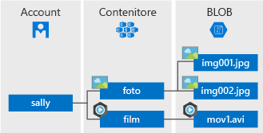

# <a name="quickstart-azure-blob-storage-client-library-v12-for-java"></a>Guida introduttiva: Libreria client di Archiviazione BLOB di Azure v12 per Java

Iniziare a usare la libreria client di Archiviazione BLOB di Azure v12 per Java. L'archivio BLOB di Azure è la soluzione di archiviazione di oggetti Microsoft per il cloud. Seguire questi passaggi per installare il pacchetto e provare il codice di esempio per le attività di base. L'archiviazione BLOB è ottimizzata per archiviare enormi quantità di dati non strutturati.

> [!NOTE]
> Per iniziare a usare la versione precedente dell'SDK, vedere [Avvio rapido: Libreria client di Archiviazione BLOB di Azure per Java](storage-quickstart-blobs-java-legacy.md).

Usare la libreria client di Archiviazione BLOB di Azure v12 per Java per:

* Creare un contenitore
* Caricare un oggetto BLOB in Archiviazione di Azure
* Elencare tutti i BLOB in un contenitore
* Scaricare un BLOB nel computer locale
* Eliminare un contenitore

[Documentazione di riferimento dell'API](https://azuresdkdocs.blob.core.windows.net/$web/java/azure-storage-blob/12.0.0/index.html) | [Codice sorgente della libreria](https://github.com/Azure/azure-sdk-for-java/tree/master/sdk/storage/azure-storage-blob) | [Pacchetto (Maven)](https://mvnrepository.com/artifact/com.azure/azure-storage-blob?repo=jcenter) | [Esempi](https://github.com/Azure/azure-sdk-for-java/tree/master/sdk/storage/azure-storage-blob/src/samples/java/com/azure/storage/blob)

[!INCLUDE [storage-multi-protocol-access-preview](../../../includes/storage-multi-protocol-access-preview.md)]

## <a name="prerequisites"></a>Prerequisiti

* [Java Development Kit (JDK)](/java/azure/jdk/?view=azure-java-stable) versione 8 o successiva
* [Apache Maven](https://maven.apache.org/download.cgi)
* Sottoscrizione di Azure: [creare un account gratuito](https://azure.microsoft.com/free/)
* Account di archiviazione di Azure: [creare un account di archiviazione](https://docs.microsoft.com/azure/storage/common/storage-quickstart-create-account)

## <a name="setting-up"></a>Configurazione

Questa sezione illustra come preparare un progetto da usare con la libreria client di Archiviazione BLOB di Azure v12 per Java.

### <a name="create-the-project"></a>Creare il progetto

Creare un'applicazione Java denominata *blob-quickstart-v12*.

1. Nella finestra di una console (ad esempio cmd, PowerShell o Bash) usare Maven *per creare una nuova app console con il nome*blob-quickstart-v12. Digitare il comando **mvn** seguente su un'unica riga per creare un semplice progetto "Hello world!" . Il comando viene visualizzato qui su più righe per migliorare la leggibilità.

   ```console
   mvn archetype:generate -DgroupId=com.blobs.quickstart
                          -DartifactId=blob-quickstart-v12
                          -DarchetypeArtifactId=maven-archetype-quickstart
                          -DarchetypeVersion=1.4
                          -DinteractiveMode=false
   ```

1. L'output della generazione del progetto avrà un aspetto simile al seguente:

    ```console
    [INFO] Scanning for projects...
    [INFO]
    [INFO] ------------------< org.apache.maven:standalone-pom >-------------------
    [INFO] Building Maven Stub Project (No POM) 1
    [INFO] --------------------------------[ pom ]---------------------------------
    [INFO]
    [INFO] >>> maven-archetype-plugin:3.1.2:generate (default-cli) > generate-sources @ standalone-pom >>>
    [INFO]
    [INFO] <<< maven-archetype-plugin:3.1.2:generate (default-cli) < generate-sources @ standalone-pom <<<
    [INFO]
    [INFO]
    [INFO] --- maven-archetype-plugin:3.1.2:generate (default-cli) @ standalone-pom ---
    [INFO] Generating project in Batch mode
    [INFO] ----------------------------------------------------------------------------
    [INFO] Using following parameters for creating project from Archetype: maven-archetype-quickstart:1.4
    [INFO] ----------------------------------------------------------------------------
    [INFO] Parameter: groupId, Value: com.blobs.quickstart
    [INFO] Parameter: artifactId, Value: blob-quickstart-v12
    [INFO] Parameter: version, Value: 1.0-SNAPSHOT
    [INFO] Parameter: package, Value: com.blobs.quickstart
    [INFO] Parameter: packageInPathFormat, Value: com/blobs/quickstart
    [INFO] Parameter: version, Value: 1.0-SNAPSHOT
    [INFO] Parameter: package, Value: com.blobs.quickstart
    [INFO] Parameter: groupId, Value: com.blobs.quickstart
    [INFO] Parameter: artifactId, Value: blob-quickstart-v12
    [INFO] Project created from Archetype in dir: C:\QuickStarts\blob-quickstart-v12
    [INFO] ------------------------------------------------------------------------
    [INFO] BUILD SUCCESS
    [INFO] ------------------------------------------------------------------------
    [INFO] Total time:  7.056 s
    [INFO] Finished at: 2019-10-23T11:09:21-07:00
    [INFO] ------------------------------------------------------------------------
        ```

1. Switch to the newly created *blob-quickstart-v12* folder.

   ```console
   cd blob-quickstart-v12
   ```

1. Nella directory *blob-quickstart-v12* creare un'altra directory denominata *data*. Qui verranno creati e archiviati i file di dati BLOB.

    ```console
    mkdir data
    ```

### <a name="install-the-package"></a>Installare il pacchetto

Aprire il file *pom.xml* nell'editor di testo. Aggiungere l'elemento di dipendenza seguente al gruppo di dipendenze.

```xml
<dependency>
    <groupId>com.azure</groupId>
    <artifactId>azure-storage-blob</artifactId>
    <version>12.0.0</version>
</dependency>
```

### <a name="set-up-the-app-framework"></a>Configurare il framework dell'app

Dalla directory del progetto:

1. Passare alla directory */src/main/java/com/blobs/quickstart*
1. Aprire il file *App.java* nell'editor
1. Eliminare l'istruzione `System.out.println("Hello world!");`
1. Aggiungere le direttive `import`

Ecco il codice:

```java
package com.blobs.quickstart;

/**
 * Azure blob storage v12 SDK quickstart
 */
import com.azure.storage.blob.*;
import com.azure.storage.blob.models.*;
import java.io.*;

public class App
{
    public static void main( String[] args ) throws IOException
    {
    }
}
```

[!INCLUDE [storage-quickstart-connection-string-include](../../../includes/storage-quickstart-credentials-include.md)]

## <a name="object-model"></a>Modello a oggetti

Archiviazione BLOB è ottimizzata per archiviare enormi quantità di dati non strutturati. I dati non strutturati sono dati che non seguono una definizione o un modello di dati specifico, ad esempio dati di testo o binari. L’archiviazione BLOB offre tre tipi di risorse:

* L'account di archiviazione
* Un contenitore nell'account di archiviazione
* Un oggetto BLOB in un contenitore

Il diagramma seguente mostra la relazione tra queste risorse.



Per interagire con queste risorse, usare le classi Java seguenti:

* [BlobServiceClient](https://azuresdkdocs.blob.core.windows.net/$web/java/azure-storage-blob/12.0.0/com/azure/storage/blob/BlobServiceClient.html): la classe `BlobServiceClient` consente di modificare le risorse di Archiviazione di Azure e i contenitori BLOB. L'account di archiviazione rappresenta lo spazio dei nomi di primo livello per il servizio BLOB.
* [BlobServiceClientBuilder](https://azuresdkdocs.blob.core.windows.net/$web/java/azure-storage-blob/12.0.0/com/azure/storage/blob/BlobServiceClientBuilder.html): la classe `BlobServiceClientBuilder` offre un'API del generatore per la configurazione e la creazione di istanze di oggetti `BlobServiceClient`.
* [BlobContainerClient](https://azuresdkdocs.blob.core.windows.net/$web/java/azure-storage-blob/12.0.0/com/azure/storage/blob/BlobContainerClient.html): la classe `BlobContainerClient` consente di modificare i contenitori di Archiviazione di Azure e i relativi oggetti BLOB.
* [BlobClient](https://azuresdkdocs.blob.core.windows.net/$web/java/azure-storage-blob/12.0.0/com/azure/storage/blob/BlobClient.html): la classe `BlobClient` consente di modificare gli oggetti BLOB di Archiviazione di Azure.
* [BlobItem](https://azuresdkdocs.blob.core.windows.net/$web/java/azure-storage-blob/12.0.0/com/azure/storage/blob/models/BlobItem.html): la classe `BlobItem` rappresenta singoli BLOB restituiti da una chiamata a `listBlobsFlat`.

## <a name="code-examples"></a>Esempi di codice

Questi frammenti di codice di esempio illustrano come eseguire le operazioni seguenti con la libreria client di Archiviazione BLOB di Azure per Java:

* [Ottenere la stringa di connessione](#get-the-connection-string)
* [Creare un contenitore](#create-a-container)
* [Caricare BLOB in un contenitore](#upload-blobs-to-a-container)
* [Elencare i BLOB in un contenitore](#list-the-blobs-in-a-container)
* [Scaricare BLOB](#download-blobs)
* [Eliminare un contenitore](#delete-a-container)

### <a name="get-the-connection-string"></a>Ottenere la stringa di connessione

Il codice seguente recupera la stringa di connessione per l'account di archiviazione dalla variabile di ambiente creata nella sezione [Configurare la stringa di connessione di archiviazione](#configure-your-storage-connection-string).

Aggiungere questo codice all'interno del metodo `Main`:

```java
System.out.println("Azure Blob storage v12 - Java quickstart sample\n");

// Retrieve the connection string for use with the application. The storage
// connection string is stored in an environment variable on the machine
// running the application called CONNECT_STR. If the environment variable
// is created after the application is launched in a console or with
// Visual Studio, the shell or application needs to be closed and reloaded
// to take the environment variable into account.
String connectStr = System.getenv("CONNECT_STR");
```

### <a name="create-a-container"></a>Creare un contenitore

Decidere un nome per il nuovo contenitore. Il codice seguente aggiunge un valore UUID al nome del contenitore per garantirne l'univocità.

> [!IMPORTANT]
> I nomi dei contenitori devono essere in minuscolo. Per altre informazioni sulla denominazione di contenitori e BLOB, vedere [Naming and Referencing Containers, Blobs, and Metadata](/rest/api/storageservices/naming-and-referencing-containers--blobs--and-metadata) (Assegnazione di nome e riferimento a contenitori, BLOB e metadati).

Successivamente, creare un'istanza della classe [BlobContainerClient](https://azuresdkdocs.blob.core.windows.net/$web/java/azure-storage-blob/12.0.0/com/azure/storage/blob/BlobContainerClient.html), quindi chiamare il metodo [create](https://azuresdkdocs.blob.core.windows.net/$web/java/azure-storage-blob/12.0.0/com/azure/storage/blob/BlobContainerClient.html#create--) per creare effettivamente il contenitore nell'account di archiviazione.

Aggiungere questo codice alla fine del metodo `Main`:

```java
// Create a BlobServiceClient object which will be used to create a container client
BlobServiceClient blobServiceClient = new BlobServiceClientBuilder().connectionString(connectStr).buildClient();

//Create a unique name for the container
String containerName = "quickstartblobs" + java.util.UUID.randomUUID();

// Create the container and return a container client object
BlobContainerClient containerClient = blobServiceClient.createBlobContainer(containerName);
```

### <a name="upload-blobs-to-a-container"></a>Caricare BLOB in un contenitore

Il frammento di codice seguente consente di:

1. Creare un file di testo nella directory *data* locale.
1. Ottenere un riferimento a un oggetto [BlobClient](https://azuresdkdocs.blob.core.windows.net/$web/java/azure-storage-blob/12.0.0/com/azure/storage/blob/BlobClient.html) chiamando il metodo [getBlobClient](https://azuresdkdocs.blob.core.windows.net/$web/java/azure-storage-blob/12.0.0/com/azure/storage/blob/BlobContainerClient.html#getBlobClient-java.lang.String-) sul contenitore dalla sezione [Creare un contenitore](#create-a-container).
1. Caricare il file di testo locale nel BLOB chiamando il metodo [uploadFromFile](https://azuresdkdocs.blob.core.windows.net/$web/java/azure-storage-blob/12.0.0/com/azure/storage/blob/BlobClient.html#uploadFromFile-java.lang.String-). Questo metodo crea il BLOB se non esiste ma non lo sovrascrive se esiste già.

Aggiungere questo codice alla fine del metodo `Main`:

```java
// Create a local file in the ./data/ directory for uploading and downloading
String localPath = "./data/";
String fileName = "quickstart" + java.util.UUID.randomUUID() + ".txt";
File localFile = new File(localPath + fileName);

// Write text to the file
FileWriter writer = new FileWriter(localPath + fileName, true);
writer.write("Hello, World!");
writer.close();

// Get a reference to a blob
BlobClient blobClient = containerClient.getBlobClient(fileName);

System.out.println("\nUploading to Blob storage as blob:\n\t" + blobClient.getBlobUrl());

// Upload the blob
blobClient.uploadFromFile(localPath + fileName);
```

### <a name="list-the-blobs-in-a-container"></a>Elencare i BLOB in un contenitore

Elencare i BLOB presenti nel contenitore chiamando il metodo [listBlobs](https://azuresdkdocs.blob.core.windows.net/$web/java/azure-storage-blob/12.0.0/com/azure/storage/blob/BlobContainerClient.html#listBlobs--). In questo caso, al contenitore è stato aggiunto un unico BLOB, quindi l'operazione di recupero dell'elenco restituisce solo tale BLOB.

Aggiungere questo codice alla fine del metodo `Main`:

```java
System.out.println("\nListing blobs...");

// List the blob(s) in the container.
for (BlobItem blobItem : containerClient.listBlobs()) {
    System.out.println("\t" + blobItem.getName());
}
```

### <a name="download-blobs"></a>Scaricare BLOB

Scaricare il BLOB creato in precedenza chiamando il metodo [downloadToFile](https://azuresdkdocs.blob.core.windows.net/$web/java/azure-storage-blob/12.0.0/com/azure/storage/blob/specialized/BlobClientBase.html#downloadToFile-java.lang.String-). Il codice di esempio aggiunge il suffisso "DOWNLOAD" al nome del file in modo da consentire la visualizzazione di entrambi i file nel file system locale.

Aggiungere questo codice alla fine del metodo `Main`:

```java
// Download the blob to a local file
// Append the string "DOWNLOAD" before the .txt extension so that you can see both files.
String downloadFileName = fileName.replace(".txt", "DOWNLOAD.txt");
File downloadedFile = new File(localPath + downloadFileName);

System.out.println("\nDownloading blob to\n\t " + localPath + downloadFileName);

blobClient.downloadToFile(localPath + downloadFileName);
```

### <a name="delete-a-container"></a>Eliminare un contenitore

Il codice seguente pulisce le risorse create dall'app eliminando l'intero contenitore tramite il metodo [delete](https://azuresdkdocs.blob.core.windows.net/$web/java/azure-storage-blob/12.0.0/com/azure/storage/blob/BlobContainerClient.html#delete--). Elimina anche i file locali creati dall'app.

L'app viene sospesa per l'input dell'utente chiamando `System.console().readLine()` prima dell'eliminazione di BLOB, contenitore e file locali. Si tratta di una valida opportunità per verificare che le risorse siano state effettivamente create correttamente, prima che vengano eliminate.

Aggiungere questo codice alla fine del metodo `Main`:

```java
// Clean up
System.out.println("\nPress the Enter key to begin clean up");
System.console().readLine();

System.out.println("Deleting blob container...");
containerClient.delete();

System.out.println("Deleting the local source and downloaded files...");
localFile.delete();
downloadedFile.delete();

System.out.println("Done");
```

## <a name="run-the-code"></a>Eseguire il codice

Questa app crea un file di test nella cartella locale e lo carica nell'archiviazione BLOB. L'esempio elenca quindi i BLOB presenti nel contenitore e scarica il file con un nuovo nome per consentire il confronto tra i nuovi file e quelli precedenti.

Passare alla directory contenente il file *pom.xml* e compilare il progetto tramite il comando `mvn` seguente.

```console
mvn compile
```

Compilare il pacchetto.

```console
mvn package
```

Eseguire il comando `mvn` seguente per eseguire l'app.

```console
mvn exec:java -Dexec.mainClass="com.blobs.quickstart.App" -Dexec.cleanupDaemonThreads=false
```

L'output dell'app è simile all'esempio seguente:

```output
Azure Blob storage v12 - Java quickstart sample

Uploading to Blob storage as blob:
        https://mystorageacct.blob.core.windows.net/quickstartblobsf9aa68a5-260e-47e6-bea2-2dcfcfa1fd9a/quickstarta9c3a53e-ae9d-4863-8b34-f3d807992d65.txt

Listing blobs...
        quickstarta9c3a53e-ae9d-4863-8b34-f3d807992d65.txt

Downloading blob to
        ./data/quickstarta9c3a53e-ae9d-4863-8b34-f3d807992d65DOWNLOAD.txt

Press the Enter key to begin clean up

Deleting blob container...
Deleting the local source and downloaded files...
Done
```

Prima di iniziare il processo di pulizia, controllare che nella cartella *Documenti* siano presenti due file. È possibile aprirli e verificare che sono identici.

Dopo aver verificato i file, premere **INVIO** per eliminare i file di test e completare la demo.

## <a name="next-steps"></a>Passaggi successivi

In questa guida introduttiva si è appreso come caricare, scaricare ed elencare i BLOB con Java.

Per visualizzare le app di esempio di Archiviazione BLOB, procedere con:

> [!div class="nextstepaction"]
> [Esempi di Archiviazione BLOB di Azure SDK v12 - Java](https://github.com/Azure/azure-sdk-for-java/tree/master/sdk/storage/azure-storage-blob/src/samples/java/com/azure/storage/blob)

* Per altre informazioni, vedere [Azure SDK per Java](https://github.com/Azure/azure-sdk-for-java/blob/master/README.md).
* Per esercitazioni, esempi, guide di avvio rapido e altre documentazioni, vedere [Azure per sviluppatori cloud Java](/azure/java/).
