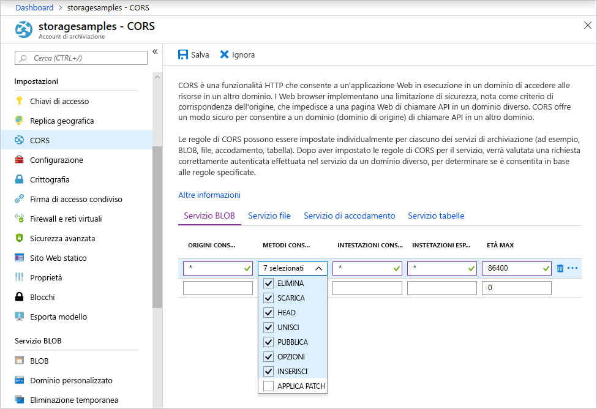

<!-- Customer intent: As a web application developer I want to interface with Azure Blob storage entirely on the client so that I can build a SPA application that is able to upload and delete files on blob storage. -->

# <a name="quickstart-upload-list-and-delete-blobs-using-azure-storage-v10-sdk-for-javascripthtml-in-the-browser"></a>Guida introduttiva: Caricare, elencare ed eliminare BLOB usando Azure Storage v10 SDK per JavaScript/HTML nel browser

In questa guida di avvio rapido si apprenderà come usare la libreria [Azure Storage SDK V10 for JavaScript - Blob](https://github.com/Azure/azure-sdk-for-js/tree/master/sdk/storage/storage-blob#readme) per gestire i BLOB di codice JavaScript eseguito interamente nel browser. L'approccio qui adottato mostra come usare le misure di sicurezza necessarie per garantire l'accesso protetto all'account di archiviazione BLOB.

## <a name="prerequisites"></a>Prerequisiti

[!INCLUDE [storage-quickstart-prereq-include](../../../includes/storage-quickstart-prereq-include.md)]

Le librerie client JavaScript di Archiviazione di Azure non funzionano direttamente dal file system e devono essere messe a disposizione da un server Web. In questo argomento si usa [Node.js](https://nodejs.org) per avviare un server di base. Se si preferisce non installare Node.js, è possibile usare un qualsiasi altro modo per eseguire un server Web locale.

Per seguire la procedura di debug, sono necessari [Visual Studio Code](https://code.visualstudio.com) e l'estensione [Debugger per Chrome](vscode:extension/msjsdiag.debugger-for-chrome) o [Debugger per Microsoft Edge](vscode:extension/msjsdiag.debugger-for-edge).

## <a name="setting-up-storage-account-cors-rules"></a>Configurazione delle regole CORS dell'account di archiviazione

Prima che l'applicazione Web possa accedere a un archivio BLOB dal client, l'account deve essere configurato per abilitare la [condivisione di risorse tra le origini](https://docs.microsoft.com/rest/api/storageservices/cross-origin-resource-sharing--cors--support-for-the-azure-storage-services) (CORS).

Tornare al portale di Azure e selezionare l'account di archiviazione. Per definire una nuova regola CORS, passare alla sezione **Impostazioni** e fare clic sul collegamento **CORS**. Fare quindi clic sul pulsante **Aggiungi** per aprire la finestra **Aggiungi regola CORS**. Per questa guida introduttiva viene creata una regola CORS aperta:



La tabella seguente descrive ogni impostazione CORS e spiega i valori usati per definire la regola.

|Impostazione  |Valore  | DESCRIZIONE |
|---------|---------|---------|
| Origini consentite | * | Accetta un elenco delimitato da virgole dei domini impostati come origini accettabili. Impostando il valore su `*`, tutti i domini potranno accedere all'account di archiviazione. |
| Verbi consentiti     | delete, get, head, merge, post, options e put | Elenca i verbi HTTP che possono essere eseguiti sull'account di archiviazione. Ai fini di questa guida introduttiva, selezionare tutte le opzioni disponibili. |
| Intestazioni consentite | * | Definisce un elenco di intestazioni della richiesta (comprese le intestazioni con prefisso) consentite per l'account di archiviazione. Impostando il valore su `*`, tutte le intestazioni potranno accedere. |
| Intestazioni esposte | * | Elenca le intestazioni di risposta consentite dall'account. Impostando il valore su `*`, l'account potrà inviare qualsiasi intestazione.  |
| Tempo trascorso massimo (secondi) | 86400 | Periodo massimo di memorizzazione della richiesta OPTIONS preliminare nella cache di un browser. Il valore *86400* consente la conservazione della cache per un giorno intero. |

> [!IMPORTANT]
> Verificare che le impostazioni usate nell'ambiente di produzione espongano l'accesso minimo necessario all'account di archiviazione per mantenere un accesso sicuro. Le impostazioni CORS descritte in questo documento sono appropriate per una guida introduttiva perché definiscono criteri di sicurezza flessibili. Queste impostazioni, tuttavia, non sono consigliate per un contesto reale.

Usare quindi Azure Cloud Shell per creare un token di sicurezza.

[!INCLUDE [Open the Azure cloud shell](../../../includes/cloud-shell-try-it.md)]

## <a name="create-a-shared-access-signature"></a>Creare una firma di accesso condiviso

La firma di accesso condiviso viene usata dal codice in esecuzione nel browser per autorizzare le richieste inviate all'archivio BLOB. Tramite la firma di accesso condiviso, il client può autorizzare l'accesso alle risorse di archiviazione senza la chiave di accesso dell'account o la stringa di connessione. Per altre informazioni sulla firma di accesso condiviso, vedere [Uso delle firme di accesso condiviso](../common/storage-sas-overview.md).

È possibile creare una firma di accesso condiviso con l'interfaccia della riga di comando di Azure tramite Azure Cloud Shell oppure con il portale di Azure o con Azure Storage Explorer. La tabella seguente descrive i parametri per i quali è necessario specificare valori per generare una firma di accesso condiviso con l'interfaccia della riga di comando.

| Parametro      |DESCRIZIONE  | Placeholder |
|----------------|-------------|-------------|
| *expiry*       | Data di scadenza del token di accesso nel formato AAAA-MM-GG. Immettere la data di domani per questa guida introduttiva. | *FUTURE_DATE* |
| *account-name* | nome dell'account di archiviazione. Usare il nome copiato in un passaggio precedente. | *YOUR_STORAGE_ACCOUNT_NAME* |
| *account-key*  | Chiave dell'account di archiviazione. Usare la chiave copiata in un passaggio precedente. | *YOUR_STORAGE_ACCOUNT_KEY* |

Usare il comando seguente dell'interfaccia della riga di comando, sostituendo ogni segnaposto con il valore effettivo, per generare una firma di accesso condiviso da usare nel codice JavaScript.

```azurecli-interactive
az storage account generate-sas \
  --permissions racwdl \
  --resource-types sco \
  --services b \
  --expiry FUTURE_DATE \
  --account-name YOUR_STORAGE_ACCOUNT_NAME \
  --account-key YOUR_STORAGE_ACCOUNT_KEY
```

La serie di valori dopo ogni parametro può risultare di difficile interpretazione. Questi valori di parametro provengono dalla prima lettera dell'autorizzazione corrispondente. La tabella seguente spiega la provenienza dei valori:

| Parametro        | Valore   | DESCRIZIONE  |
|------------------|---------|---------|
| *autorizzazioni*    | racwdl  | Questa firma di accesso condiviso consente operazioni di *lettura*, *accodamento*, *creazione*, *scrittura*, *eliminazione* ed *elenco*. |
| *resource-types* | sco     | Le risorse interessate dalla firma di accesso condiviso sono il *servizio*, il *contenitore* e l'*oggetto*. |
| *services*       | b       | Il servizio interessato dalla firma di accesso condiviso è il servizio *BLOB*. |

Una volta generata la firma di accesso condiviso, copiare il valore restituito e salvarlo dove si preferisce per usarlo in un passaggio successivo. Se la firma di accesso condiviso è stata generata con un metodo diverso dall'interfaccia della riga di comando di Azure, è necessario rimuovere il carattere `?` iniziale, se presente. Questo carattere è un separatore di URL già fornito nel modello di URL in cui viene usata la firma di accesso condiviso, più avanti in questo argomento.

> [!IMPORTANT]
> Nell'ambiente di produzione, passare i token di firma di accesso condiviso usando sempre SSL. I token di firma di accesso condiviso devono essere generati nel server e inviati alla pagina HTML per poter essere passati di nuovo all'archivio BLOB di Azure. È possibile prendere in considerazione l'uso di una funzione senza server per generare token di firma di accesso condiviso. Il portale di Azure include modelli di funzioni che consentono di generare una firma di accesso condiviso con una funzione JavaScript.

## <a name="implement-the-html-page"></a>Implementare la pagina HTML

In questa sezione si creerà una pagina Web di base e si configurerà Visual Studio Code per avviare la pagina ed eseguirne il debug. Prima di avviarla occorre però usare Node.js per avviare un server Web locale e distribuire la pagina quando il browser la richiede. Si aggiungerà quindi il codice JavaScript per chiamare varie API di archiviazione BLOB e visualizzare i risultati nella pagina. È possibile vedere i risultati di queste chiamate anche nel [portale di Azure](https://portal.azure.com), in [Azure Storage Explorer](https://azure.microsoft.com/features/storage-explorer) e nell'[estensione di Archiviazione di Azure](vscode:extension/ms-azuretools.vscode-azurestorage) per Visual Studio Code.

### <a name="set-up-the-web-application"></a>Configurare l'applicazione Web

Creare prima di tutto una nuova cartella denominata *azure-blobs-javascript* e aprirla in VS Code. Creare quindi un nuovo file in VS Code, aggiungere l'HTML seguente e salvarlo con il nome *index.html* nella cartella *azure-blobs-javascript*.

```html
<!DOCTYPE html>
<html>

<body>
    <button id="create-container-button">Create container</button>
    <button id="delete-container-button">Delete container</button>
    <button id="select-button">Select and upload files</button>
    <input type="file" id="file-input" multiple style="display: none;" />
    <button id="list-button">List files</button>
    <button id="delete-button">Delete selected files</button>
    <p><b>Status:</b></p>
    <p id="status" style="height:160px; width: 593px; overflow: scroll;" />
    <p><b>Files:</b></p>
    <select id="file-list" multiple style="height:222px; width: 593px; overflow: scroll;" />
</body>

<!-- You'll add code here later in this quickstart. -->

</html>
```

### <a name="configure-the-debugger"></a>Configurare il debugger

Per configurare l'estensione del debugger in VS Code, selezionare **Debug > Aggiungi configurazione**, quindi selezionare **Chrome** o **Edge** a seconda dell'estensione installata nella sezione Prerequisiti in precedenza. Questa azione crea un file *launch.json* e lo apre nell'editor.

Modificare quindi il file *launch.json* in modo che il valore `url` includa `/index.html`, come mostrato di seguito:

```json
{
    // Use IntelliSense to learn about possible attributes.
    // Hover to view descriptions of existing attributes.
    // For more information, visit: https://go.microsoft.com/fwlink/?linkid=830387
    "version": "0.2.0",
    "configurations": [
        {
            "type": "chrome",
            "request": "launch",
            "name": "Launch Chrome against localhost",
            "url": "http://localhost:8080/index.html",
            "webRoot": "${workspaceFolder}"
        }
    ]
}
```

Questa configurazione indica a VS Code quale browser avviare e quale URL caricare.

### <a name="launch-the-web-server"></a>Avviare il server Web

Per avviare il server Web Node.js locale, selezionare **Visualizza > Terminale** per aprire una finestra della console all'interno di VS Code, quindi immettere il comando seguente.

```console
npx http-server
```

Questo comando installa il pacchetto *http-server* e avvia il server, rendendo disponibile la cartella corrente tramite gli URL predefiniti, incluso quello indicato nel passaggio precedente.

### <a name="start-debugging"></a>Avviare il debug

Per avviare *index.html* nel browser con il debugger di VS Code associato, selezionare **Debug > Avvia debug** o premere F5 in VS Code.

L'interfaccia utente visualizzata non esegue ancora alcuna azione, ma nella prossima sezione si aggiungerà il codice JavaScript per implementare ogni funzione illustrata. È quindi possibile impostare punti di interruzione e interagire con il debugger quando viene messo in pausa nel codice.

Quando si apportano modifiche a *index.html*, assicurarsi di ricaricare la pagina per visualizzare le modifiche nel browser. In VS Code si può anche selezionare **Debug > Riavvia debug** o premere CTRL+MAIUSC+F5.

### <a name="add-the-blob-storage-client-library"></a>Aggiungere la libreria client di archiviazione BLOB

Per abilitare le chiamate all'API di archiviazione BLOB, prima di tutto [scaricare la libreria client Azure Storage SDK per JavaScript - Blob](https://aka.ms/downloadazurestoragejsblob), estrarre il contenuto del file ZIP e inserire il file *azure-storage-blob.js* nella cartella *azure-blobs-javascript*.

Quindi, incollare l'HTML seguente in *index.html* dopo il tag di chiusura `</body>`, sostituendo il commento del segnaposto.

```html
<script src="azure-storage-blob.js" charset="utf-8"></script>

<script>
// You'll add code here in the following sections.
</script>
```

Questo codice aggiunge un riferimento al file di script e fornisce una posizione per il codice JavaScript dell'utente. Ai fini di questa guida di avvio rapido, si userà il file di script *azure-storage-blob.js* in modo che sia possibile aprirlo in VS Code, leggerne il contenuto e impostare punti di interruzione. In ambiente di produzione è consigliabile usare il file *azure-storage.blob.min.js*, più compatto, anch'esso disponibile nel file ZIP.

Per altre informazioni su ogni funzione di archiviazione BLOB, vedere la [documentazione di riferimento](https://docs.microsoft.com/javascript/api/%40azure/storage-blob/index). Tenere presente che alcune delle funzioni dell'SDK sono disponibili solo in Node.js o solo nel browser.

Il codice in *azure-storage-blob.js* esporta una variabile globale denominata `azblob`, che verrà usata nel codice JavaScript per accedere alle API di archiviazione BLOB.

### <a name="add-the-initial-javascript-code"></a>Aggiungere il codice JavaScript iniziale

Incollare il codice seguente nell'elemento `<script>` mostrato nel blocco di codice precedente, sostituendo il commento del segnaposto.

```javascript
const createContainerButton = document.getElementById("create-container-button");
const deleteContainerButton = document.getElementById("delete-container-button");
const selectButton = document.getElementById("select-button");
const fileInput = document.getElementById("file-input");
const listButton = document.getElementById("list-button");
const deleteButton = document.getElementById("delete-button");
const status = document.getElementById("status");
const fileList = document.getElementById("file-list");

const reportStatus = message => {
    status.innerHTML += `${message}<br/>`;
    status.scrollTop = status.scrollHeight;
}
```

Questo codice crea campi per ogni elemento HTML che verrà usato dal codice seguente e implementa una funzione `reportStatus` per visualizzare l'output.

Nelle sezioni seguenti aggiungere ogni nuovo blocco di codice JavaScript dopo il blocco precedente.

### <a name="add-your-storage-account-info"></a>Aggiungere le informazioni sull'account di archiviazione

Aggiungere ora il codice per accedere all'account di archiviazione, sostituendo i segnaposto con il nome dell'account e la firma di accesso condiviso generata in un passaggio precedente.

```javascript
const accountName = "<Add your storage account name>";
const sasString = "<Add the SAS you generated earlier>";
const containerName = "testcontainer";
const containerURL = new azblob.ContainerURL(
    `https://${accountName}.blob.core.windows.net/${containerName}?${sasString}`,
    azblob.StorageURL.newPipeline(new azblob.AnonymousCredential));
```

Questo codice usa le informazioni sull'account e la firma di accesso condiviso per creare un'istanza di [ContainerURL](https://docs.microsoft.com/javascript/api/@azure/storage-blob/ContainerURL), utile per creare e modificare un contenitore di archiviazione.

### <a name="create-and-delete-a-storage-container"></a>Creare ed eliminare un contenitore di archiviazione

A questo punto occorre aggiungere il codice per creare ed eliminare il contenitore di archiviazione selezionando il pulsante corrispondente.

```javascript
const createContainer = async () => {
    try {
        reportStatus(`Creating container "${containerName}"...`);
        await containerURL.create(azblob.Aborter.none);
        reportStatus(`Done.`);
    } catch (error) {
        reportStatus(error.body.message);
    }
};

const deleteContainer = async () => {
    try {
        reportStatus(`Deleting container "${containerName}"...`);
        await containerURL.delete(azblob.Aborter.none);
        reportStatus(`Done.`);
    } catch (error) {
        reportStatus(error.body.message);
    }
};

createContainerButton.addEventListener("click", createContainer);
deleteContainerButton.addEventListener("click", deleteContainer);
```

Questo codice chiama le funzioni di ContainerURL [create](https://docs.microsoft.com/javascript/api/@azure/storage-blob/containerclient#create-containercreateoptions-) e [delete](https://docs.microsoft.com/javascript/api/@azure/storage-blob/containerclient#delete-containerdeletemethodoptions-) senza usare un'istanza di [Aborter](https://docs.microsoft.com/javascript/api/@azure/storage-blob/aborter). Per semplicità, in questa guida di avvio rapido questo codice presuppone che l'account di archiviazione sia stato creato e abilitato. Nel codice in ambiente di produzione usare un'istanza di Aborter per aggiungere la funzionalità di timeout.

### <a name="list-blobs"></a>Elencare i BLOB

Aggiungere quindi il codice per elencare il contenuto del contenitore di archiviazione quando si seleziona il pulsante **Elenca file**.

```javascript
const listFiles = async () => {
    fileList.size = 0;
    fileList.innerHTML = "";
    try {
        reportStatus("Retrieving file list...");
        let marker = undefined;
        do {
            const listBlobsResponse = await containerURL.listBlobFlatSegment(
                azblob.Aborter.none, marker);
            marker = listBlobsResponse.nextMarker;
            const items = listBlobsResponse.segment.blobItems;
            for (const blob of items) {
                fileList.size += 1;
                fileList.innerHTML += `<option>${blob.name}</option>`;
            }
        } while (marker);
        if (fileList.size > 0) {
            reportStatus("Done.");
        } else {
            reportStatus("The container does not contain any files.");
        }
    } catch (error) {
        reportStatus(error.body.message);
    }
};

listButton.addEventListener("click", listFiles);
```

Questo codice chiama la funzione [ContainerURL.listBlobFlatSegment](https://docs.microsoft.com/javascript/api/@azure/storage-blob/containerclient#listblobsflat-containerlistblobsoptions-) in un ciclo per assicurare che vengano recuperati tutti i segmenti. Per ogni segmento, scorre in ciclo l'elenco di elementi BLOB che contiene e aggiorna l'elenco **File**.

### <a name="upload-blobs"></a>Caricare i BLOB

Aggiungere ora il codice per caricare i file nel contenitore di archiviazione quando si seleziona il pulsante **Select and upload files** (Seleziona e carica file).

```javascript
const uploadFiles = async () => {
    try {
        reportStatus("Uploading files...");
        const promises = [];
        for (const file of fileInput.files) {
            const blockBlobURL = azblob.BlockBlobURL.fromContainerURL(containerURL, file.name);
            promises.push(azblob.uploadBrowserDataToBlockBlob(
                azblob.Aborter.none, file, blockBlobURL));
        }
        await Promise.all(promises);
        reportStatus("Done.");
        listFiles();
    } catch (error) {
        reportStatus(error.body.message);
    }
}

selectButton.addEventListener("click", () => fileInput.click());
fileInput.addEventListener("change", uploadFiles);
```

Questo codice connette il pulsante **Select and upload files** (Seleziona e carica file) all'elemento `file-input` nascosto. In questo modo l'evento `click` del pulsante attiva l'evento `click` dell'input file e visualizza la selezione file. Dopo aver selezionato i file e chiuso la finestra di dialogo, si verifica l'evento `input` e viene chiamata la funzione `uploadFiles`. Questa funzione chiama la funzione specifica del browser [uploadBrowserDataToBlockBlob](https://docs.microsoft.com/javascript/api/@azure/storage-blob/blockblobclient#uploadbrowserdata-blob---arraybuffer---arraybufferview--blockblobparalleluploadoptions-) per ogni file selezionato. Ogni chiamata restituisce una promessa, che viene aggiunta a un elenco in modo che si possa attendere tutte le promesse in una volta sola, causando il caricamento dei file in parallelo.

### <a name="delete-blobs"></a>Eliminare BLOB

Aggiungere ora il codice per eliminare i file dal contenitore di archiviazione quando si seleziona il pulsante **Delete selected files** (Elimina file selezionati ).

```javascript
const deleteFiles = async () => {
    try {
        if (fileList.selectedOptions.length > 0) {
            reportStatus("Deleting files...");
            for (const option of fileList.selectedOptions) {
                const blobURL = azblob.BlobURL.fromContainerURL(containerURL, option.text);
                await blobURL.delete(azblob.Aborter.none);
            }
            reportStatus("Done.");
            listFiles();
        } else {
            reportStatus("No files selected.");
        }
    } catch (error) {
        reportStatus(error.body.message);
    }
};

deleteButton.addEventListener("click", deleteFiles);
```

Questo codice chiama la funzione [BlobURL.delete](https://docs.microsoft.com/javascript/api/@azure/storage-blob/BlobURL#delete-aborter--iblobdeleteoptions-) per rimuovere ogni file selezionato nell'elenco. Chiama quindi la funzione `listFiles` mostrata in precedenza per aggiornare il contenuto dell'elenco **File**.

### <a name="run-and-test-the-web-application"></a>Eseguire e testare l'applicazione Web

A questo punto è possibile avviare la pagina e testarla per farsi un'idea del funzionamento dell'archiviazione BLOB. Se si verificano errori (ad esempio se si prova a elencare i file prima di aver creato il contenitore), il riquadro **Stato** visualizza il messaggio di errore ricevuto. È anche possibile impostare punti di interruzione nel codice JavaScript per esaminare i valori restituiti dalle API di archiviazione.

## <a name="clean-up-resources"></a>Pulire le risorse

Per pulire le risorse create durante questa guida di avvio rapido, passare al [portale di Azure](https://portal.azure.com) ed eliminare il gruppo di risorse creato nella sezione Prerequisiti.

## <a name="next-steps"></a>Passaggi successivi

In questa guida di avvio rapido è stato creato un semplice sito Web che accede all'archiviazione BLOB da codice JavaScript basato su browser. Per altre informazioni su come ospitare un sito Web nell'archiviazione BLOB, continuare con l'esercitazione seguente:

> [!div class="nextstepaction"]
> [Ospitare un sito Web statico nell'archiviazione BLOB](https://docs.microsoft.com/azure/storage/blobs/storage-blob-static-website-host)
