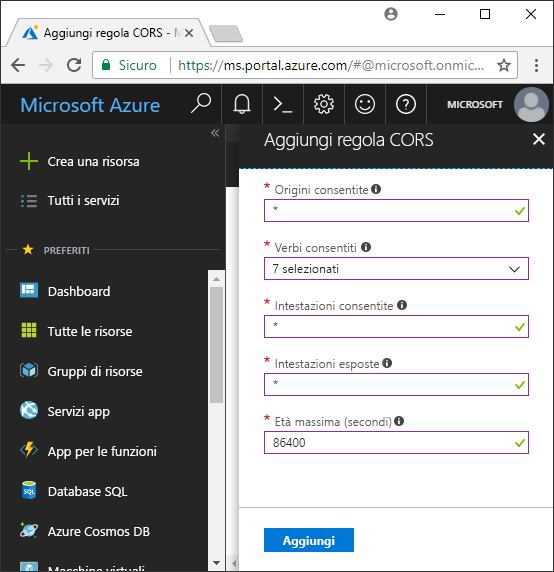

<!-- Customer intent: As a web application developer I want to interface with Azure Blob storage entirely on the client so that I can build a SPA application that is able to upload and delete files on blob storage. -->

# <a name="quickstart-upload-list-and-delete-blobs-with-azure-storage-using-javascripthtml-in-the-browser"></a>Guida introduttiva: Caricare, elencare ed eliminare BLOB con Archiviazione di Azure usando JavaScript/HTML nel browser
Questa guida introduttiva illustra come gestire i BLOB da codice eseguito interamente nel browser e le misure di sicurezza necessarie per garantire l'accesso protetto all'account di archiviazione BLOB. Per completare questa guida introduttiva è necessaria una [sottoscrizione di Azure](https://azure.microsoft.com/free/?WT.mc_id=A261C142F).

[!INCLUDE [storage-quickstart-tutorial-create-account-portal](../../../includes/storage-quickstart-tutorial-create-account-portal.md)]

### <a name="copy-security-settings"></a>Copiare le impostazioni di sicurezza
Durante questa guida introduttiva sono necessari alcuni valori correlati alla sicurezza per creare un token di sicurezza. Dal portale è possibile copiare i valori in un editor di testo per l'uso successivo. 

Selezionare l'account di archiviazione nel portale e trovare la sezione **Impostazioni**. In Impostazioni selezionare **Chiavi di accesso** e copiare il **nome dell'account di archiviazione** e il valore della **chiave** nell'intestazione **key1**. È possibile usare il pulsante di copia a destra della casella di input per copiare il valore negli Appunti.

## <a name="setting-up-storage-account-cors-rules"></a>Configurazione delle regole CORS dell'account di archiviazione 
Prima che l'applicazione Web possa accedere a un archivio BLOB dal client, l'account deve essere configurato per abilitare la [condivisione di risorse tra le origini](https://docs.microsoft.com/rest/api/storageservices/cross-origin-resource-sharing--cors--support-for-the-azure-storage-services) (CORS). 

Tornare al portale di Azure e selezionare l'account di archiviazione. Per definire una nuova regola CORS, tornare alla sezione **Impostazioni** e fare clic sul collegamento **CORS**. Fare quindi clic sul pulsante **Aggiungi** per aprire la finestra **Aggiungi regola CORS**. Per questa guida introduttiva viene creata una regola CORS aperta:



La tabella seguente descrive ogni impostazione CORS e spiega i valori usati per definire la regola.

|Impostazione  |Valore  | DESCRIZIONE |
|---------|---------|---------|
| Origini consentite | * | Accetta un elenco delimitato da virgole dei domini impostati come origini accettabili. Impostando il valore su `*`, tutti i domini potranno accedere all'account di archiviazione. |
| Verbi consentiti     | delete, get, head, merge, post, options e put | Elenca i verbi HTTP che possono essere eseguiti sull'account di archiviazione. Ai fini di questa guida introduttiva, selezionare tutte le opzioni disponibili. |
| Intestazioni consentite | * | Definisce un elenco di intestazioni della richiesta (comprese le intestazioni con prefisso) consentite per l'account di archiviazione. Impostando il valore su `*`, tutte le intestazioni potranno accedere. |
| Intestazioni esposte | * | Elenca le intestazioni di risposta consentite dall'account. Impostando il valore su `*`, l'account potrà inviare qualsiasi intestazione.  |
| Tempo trascorso massimo (secondi) | 86400 | Periodo massimo di memorizzazione della richiesta OPTIONS preliminare nella cache di un browser. Il valore *86400* consente la conservazione della cache per un giorno intero. |

> [!IMPORTANT]
> Verificare che le impostazioni usate nell'ambiente di produzione espongano l'accesso minimo necessario all'account di archiviazione per mantenere un accesso sicuro. Le impostazioni CORS descritte in questo documento sono appropriate per una guida introduttiva perché definiscono criteri di sicurezza flessibili. Queste impostazioni, tuttavia, non sono consigliate per un contesto reale.

Usare quindi Azure Cloud Shell per creare un token di sicurezza.

[!INCLUDE [Open the Azure cloud shell](../../../includes/cloud-shell-try-it.md)]

## <a name="create-a-shared-access-signature"></a>Creare una firma di accesso condiviso
La firma di accesso condiviso viene usata dal codice in esecuzione nel browser per autenticare le richieste inviate all'archivio BLOB. Tramite la firma di accesso condiviso, il client può eseguire l'autenticazione senza la stringa di connessione o la chiave di accesso dell'account. Per altre informazioni sulla firma di accesso condiviso, vedere [Uso delle firme di accesso condiviso](../common/storage-dotnet-shared-access-signature-part-1.md).

È possibile creare una firma di accesso condiviso con l'interfaccia della riga di comando di Azure oppure con Azure Cloud Shell. La tabella seguente descrive i parametri per i quali è necessario fornire valori per generare una firma di accesso condiviso.

| Parametro      |DESCRIZIONE  | Placeholder |
|----------------|-------------|-------------|
| *expiry*       | Data di scadenza del token di accesso nel formato AAAA-MM-GG. Immettere la data di domani per questa guida introduttiva. | *FUTURE_DATE* |
| *account-name* | nome dell'account di archiviazione. Usare il nome copiato in un passaggio precedente. | *YOUR_STORAGE_ACCOUNT_NAME* |
| *account-key*  | Chiave dell'account di archiviazione. Usare la chiave copiata in un passaggio precedente. | *YOUR_STORAGE_ACCOUNT_KEY* |

Lo script seguente usa l'interfaccia della riga di comando di Azure per creare una firma di accesso condiviso che è possibile passare a un servizio BLOB JavaScript.

> [!NOTE]
> Per ottenere risultati ottimali rimuovere gli spazi aggiuntivi tra i parametri prima di incollare il comando in Azure Cloud Shell.

```bash
az storage account generate-sas
                    --permissions racwdl
                    --resource-types sco
                    --services b
                    --expiry FUTURE_DATE
                    --account-name YOUR_STORAGE_ACCOUNT_NAME
                    --account-key YOUR_STORAGE_ACCOUNT_KEY
```
La serie di valori dopo ogni parametro può risultare di difficile interpretazione. Questi valori di parametro provengono dalla prima lettera dell'autorizzazione corrispondente. La tabella seguente spiega la provenienza dei valori: 

| Parametro        | Valore   | DESCRIZIONE  |
|------------------|---------|---------|
| *permissions*    | racwdl  | Questa firma di accesso condiviso consente operazioni di *lettura*, *accodamento*, *creazione*, *scrittura*, *eliminazione* ed *elenco*. |
| *resource-types* | sco     | Le risorse interessate dalla firma di accesso condiviso sono il *servizio*, il *contenitore* e l'*oggetto*. |
| *services*       | b       | Il servizio interessato dalla firma di accesso condiviso è il servizio *BLOB*. |

Ora che la firma di accesso condiviso è stata generata, copiare il valore restituito nella console in un editor di testo. Questo valore verrà usato in un passaggio successivo.

> [!IMPORTANT]
> Nell'ambiente di produzione, passare i token di firma di accesso condiviso usando sempre SSL. I token di firma di accesso condiviso devono essere generati nel server e inviati alla pagina HTML per poter essere passati di nuovo all'archivio BLOB di Azure. È possibile considerare l'uso di una funzione senza server per generare token di firma di accesso condiviso. Il portale di Azure include modelli di funzioni che consentono di generare una firma di accesso condiviso con una funzione JavaScript.

## <a name="implement-the-html-page"></a>Implementare la pagina HTML

### <a name="set-up-the-web-application"></a>Configurare l'applicazione Web
Le librerie client JavaScript di Archiviazione di Azure non funzionano direttamente dal file system e devono essere messe a disposizione da un server Web. La procedura seguente illustra quindi come usare un server Web locale semplice con Node.js.

> [!NOTE]
> Questa sezione descrive come creare un server Web locale che richiede l'installazione di Node.js nel computer. Se non si vuole installare Node.js è possibile usare un qualsiasi altro modo per eseguire un server Web locale.

Creare prima di tutto una nuova cartella per il progetto e denominarla *azure-blobs-javascript*. Aprire quindi un prompt dei comandi nella cartella *azure-blobs-javascript* e preparare l'applicazione per l'installazione del modulo del server Web immettendo il comando seguente:

```bash
npm init -y
```
L'esecuzione di *init* aggiunge i file necessari per l'installazione di un modulo del server Web. Per installare il modulo, immettere il comando seguente:

```bash
npm i http-server
```
Modificare quindi il file *package.json* e sostituire la definizione *scripts* esistente con il frammento di codice seguente:

```javascript
"scripts": {
    "start": "http-server"
}
```
Nel prompt dei comandi immettere infine `npm start` per avviare il server Web:

```bash
npm start
```

### <a name="get-the-blob-storage-client-scripts"></a>Ottenere gli script client dell'archivio BLOB
[Scaricare le librerie client JavaScript](https://aka.ms/downloadazurestoragejs), estrarre il contenuto del file ZIP e inserire i file di script della cartella *bundle* in una cartella denominata *scripts*.

### <a name="add-the-client-script-reference-to-the-page"></a>Aggiungere il riferimento allo script client nella pagina
Creare una pagina HTML nella radice della cartella *azure-blobs-javascript* e denominarla *index.html*. Dopo aver creato la pagina, aggiungere il markup seguente.

```html
<!DOCTYPE html>
<html>
    <body>
        <button id="create-button">Create Container</button>

        <input type="file" id="fileinput" />
        <button id="upload-button">Upload</button>

        <button id="list-button">List</button>
        
        <button id="delete-button">Delete</button>
    </body>
    <script src="scripts/azure-storage.blob.min.js"></script>
    <script>
        // Blob-related code goes here
    </script>
</html>
```
Questo markup aggiunge gli elementi seguenti alla pagina:

- un riferimento a *scripts/azure-storage.blob.js*
- pulsanti usati per creare un contenitore, caricare, elencare ed eliminare BLOB
- un elemento *INPUT* usato per caricare un file
- un segnaposto per il codice specifico dell'archivio

### <a name="create-a-blob-service"></a>Creare un servizio blob 
[BlobService](https://azure.github.io/azure-storage-node/BlobService.html) fornisce un'interfaccia per Archiviazione BLOB di Azure. Per creare un'istanza del servizio è necessario fornire il nome dell'account di archiviazione e la firma di accesso condiviso generata in un passaggio precedente.

```javascript
const account = {
    name: YOUR_STORAGE_ACCOUNT_NAME,
    sas:  YOUR_SAS
};

const blobUri = 'https://' + account.name + '.blob.core.windows.net';
const blobService = AzureStorage.Blob.createBlobServiceWithSas(blobUri, account.sas);
```

### <a name="create-a-blob-container"></a>Creare un contenitore BLOB
Con il servizio BLOB creato è ora possibile creare un nuovo contenitore per un BLOB caricato. Il metodo [createContainerIfNotExists](https://azure.github.io/azure-storage-node/BlobService.html#createContainerIfNotExists__anchor) crea un nuovo contenitore e non restituisce un errore se il contenitore esiste già.

```javascript
document.getElementById('create-button').addEventListener('click', () => {

    blobService.createContainerIfNotExists('mycontainer',  (error, container) => {
        if (error) {
            // Handle create container error
        } else {
            console.log(container.name);
        }
    });

});
```

### <a name="upload-a-blob"></a>Caricare un BLOB
Per caricare un BLOB da un form HTML, ottenere prima un riferimento al file selezionato tramite la matrice `files` di un elemento *INPUT* avente *type* impostato su *file*.

Dallo script è possibile fare riferimento all'elemento HTML e passare il file selezionato al servizio BLOB.

```javascript
document.getElementById('upload-button').addEventListener('click', () => {

    const file = document.getElementById('fileinput').files[0];

    blobService.createBlockBlobFromBrowserFile('mycontainer', 
                                                file.name, 
                                                file, 
                                                (error, result) => {
                                                    if(error) {
                                                        // Handle blob error
                                                    } else {
                                                        console.log('Upload is successful');
                                                    }
                                                });

});
```

Il metodo [createBlockBlobFromBrowserFile](https://azure.github.io/azure-storage-node/BlobService.html#createBlockBlobFromBrowserFile__anchor) usa direttamente il file del browser per il caricamento in un contenitore BLOB.

### <a name="list-blobs"></a>Elencare i BLOB
Dopo aver caricato un file nel contenitore BLOB, accedere a un elenco di BLOB nel contenitore usando il metodo [listBlobsSegmented](https://azure.github.io/azure-storage-node/BlobService.html#listBlobsSegmented__anchor).

```javascript
document.getElementById('list-button').addEventListener('click', () => {

    blobService.listBlobsSegmented('mycontainer', null, (error, results) => {
        if (error) {
            // Handle list blobs error
        } else {
            results.entries.forEach(blob => {
                console.log(blob.name);
            });
        }
    });
    
});
```

### <a name="delete-blobs"></a>Eliminare BLOB
È possibile eliminare il BLOB caricato chiamando [deleteBlobIfExists](https://azure.github.io/azure-storage-node/BlobService.html#deleteBlobIfExists__anchor).

```javascript
document.getElementById('delete-button').addEventListener('click', () => {

    var blobName = YOUR_BLOB_NAME;
    blobService.deleteBlobIfExists('mycontainer', blobName, (error, result) => {
        if (error) {
            // Handle delete blob error
        } else {
            console.log('Blob deleted successfully');
        }
    });
    
});
```
> [!WARNING]
> Perché questo esempio di codice funzioni, è necessario fornire un valore stringa per *blobName*.

## <a name="clean-up-resources"></a>Pulire le risorse
Per eliminare le risorse create durante questa guida introduttiva, tornare al [portale di Azure](https://portal.azure.com) e selezionare l'account di archiviazione. Dopo averlo selezionato, l'account di archiviazione può essere eliminato passando a **Panoramica > Elimina account di archiviazione**.

## <a name="next-steps"></a>Passaggi successivi
Esplorare gli esempi per informazioni su come scaricare i BLOB e segnalare lo stato di avanzamento durante il caricamento dei file.

> [!div class="nextstepaction"]
> [Script client dell'archivio BLOB](https://github.com/Azure/azure-storage-node/tree/master/browser)
