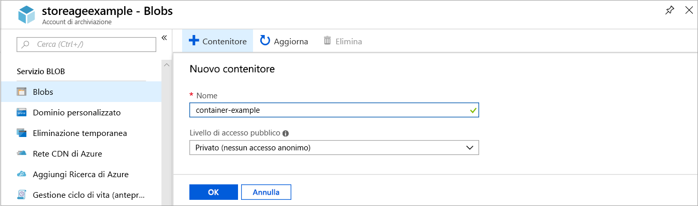
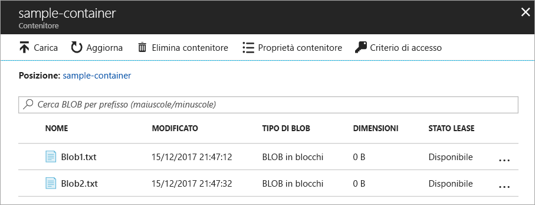
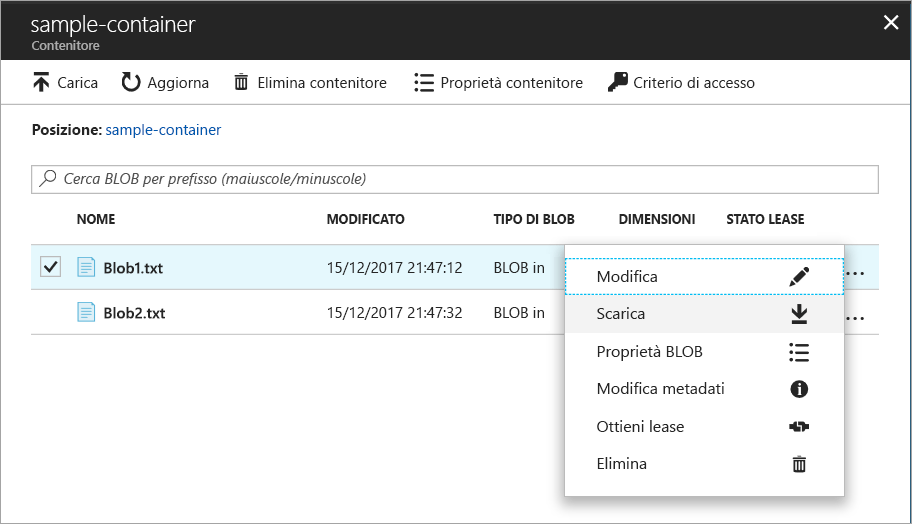
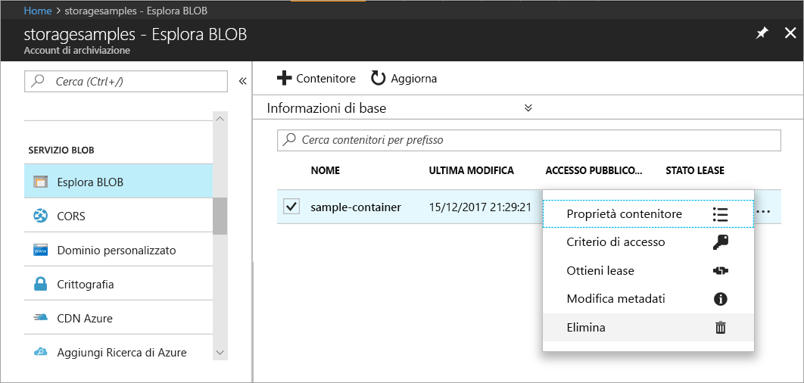

# Guida introduttiva: Caricare, scaricare ed elencare BLOB con il portale di Azure

Questa guida introduttiva spiega come usare il [portale di Azure](https://portal.azure.com/) per creare un contenitore in Archiviazione di Azure e per caricare e scaricare BLOB in blocchi in tale contenitore.

## Prerequisiti

Se non si ha una sottoscrizione di Azure, creare un [account gratuito](https://azure.microsoft.com/free/?WT.mc_id=A261C142F) prima di iniziare.

[!INCLUDE [storage-quickstart-tutorial-create-account-portal](../../../includes/storage-quickstart-tutorial-create-account-portal.md)]

## Creare un contenitore

Per creare un contenitore nel portale di Azure, seguire questa procedura:

1. Passare al nuovo account di archiviazione nel portale di Azure.
2. Nel menu a sinistra per l'account di archiviazione scorrere fino alla sezione **Servizio BLOB** e quindi selezionare **Esplora BLOB**.
3. Fare clic sul pulsante **Aggiungi contenitore**.
4. Immettere un nome per il nuovo contenitore. Il nome del contenitore deve essere composto da lettere minuscole, deve iniziare con una lettera o un numero e può contenere solo lettere, numeri e il carattere trattino (-). Per altre informazioni sulla denominazione dei contenitori e dei BLOB vedere [Naming and Referencing Containers, Blobs, and Metadata](https://docs.microsoft.com/rest/api/storageservices/naming-and-referencing-containers--blobs--and-metadata) (Denominazione e riferimento a contenitori, BLOB e metadati).
5. Impostare il livello di accesso pubblico del contenitore. Il livello predefinito è **Private (no anonymous access)** (Privato - nessun accesso anonimo).
6. Fare clic su **OK** per creare il contenitore.

    

## Caricare un BLOB in blocchi

I BLOB in blocchi sono costituiti da blocchi di dati combinati per creare un BLOB. La maggior parte degli scenari di archiviazione BLOB usa BLOB in blocchi. I BLOB in blocchi sono ideali per l'archiviazione di dati di testo e binari nel cloud, ad esempio file, immagini e video. Questa guida introduttiva spiega come usare i BLOB in blocchi. 

Per caricare un BLOB in blocchi nel nuovo contenitore nel portale di Azure, seguire questa procedura:

1. Nel portale di Azure passare al contenitore creato nella sezione precedente.
2. Selezionare il contenitore per visualizzare un elenco dei BLOB contenuti. In questo caso, poiché è stato creato un nuovo contenitore, non saranno ancora presenti BLOB.
3. Fare clic sul pulsante **Carica** per caricare un BLOB nel contenitore.
4. Cercare nel file system locale un file da caricare come BLOB in blocchi e fare clic su **Carica**.
     
    

5. Caricare tutti i BLOB desiderati in questo modo. Si noterà che i nuovi BLOB sono ora elencati all'interno del contenitore.

    

## Scaricare un BLOB in blocchi

È possibile scaricare un BLOB in blocchi per visualizzarlo nel browser o salvarlo nel file system locale. Per scaricare un BLOB in blocchi, seguire questa procedura:

1. Passare all'elenco di BLOB caricati nella sezione precedente. 
2. Selezionare il BLOB da scaricare.
3. Fare clic con il pulsante destro del mouse su **Altro** (**...**) e scegliere **Scarica**. 

## Pulire le risorse

Per rimuovere le risorse create in questa guida introduttiva, è sufficiente eliminare il contenitore. Verranno eliminati anche tutti i BLOB presenti nel contenitore.

Per eliminare il contenitore:

1. Nel portale di Azure passare all'elenco dei contenitori presenti nell'account di archiviazione.
2. Selezionare il contenitore da eliminare.
3. Fare clic con il pulsante destro del mouse su **Altro** (**...**) e scegliere **Elimina**.
4. Confermare di voler eliminare il contenitore.

       

## Passaggi successivi

In questa guida introduttiva è stato descritto il trasferimento di file tra il disco locale e Archiviazione BLOB di Azure con .NET. Per altre informazioni sull'uso dell'archiviazione BLOB, continuare la procedura relativa all'archiviazione BLOB.

> [!div class="nextstepaction"]
> [Procedura relativa alle operazioni di archiviazione BLOB](storage-dotnet-how-to-use-blobs.md)

