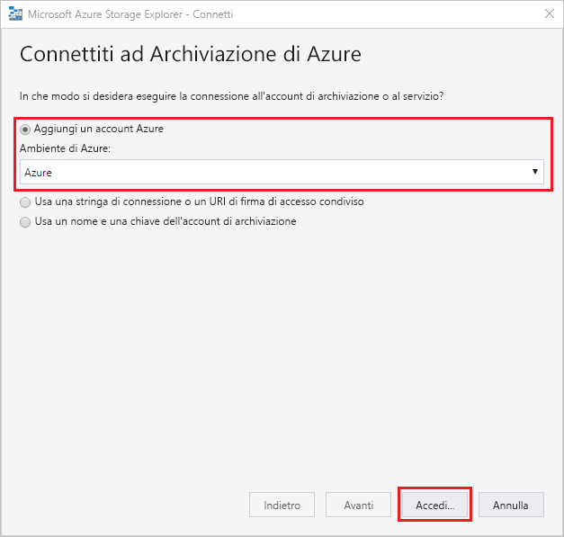
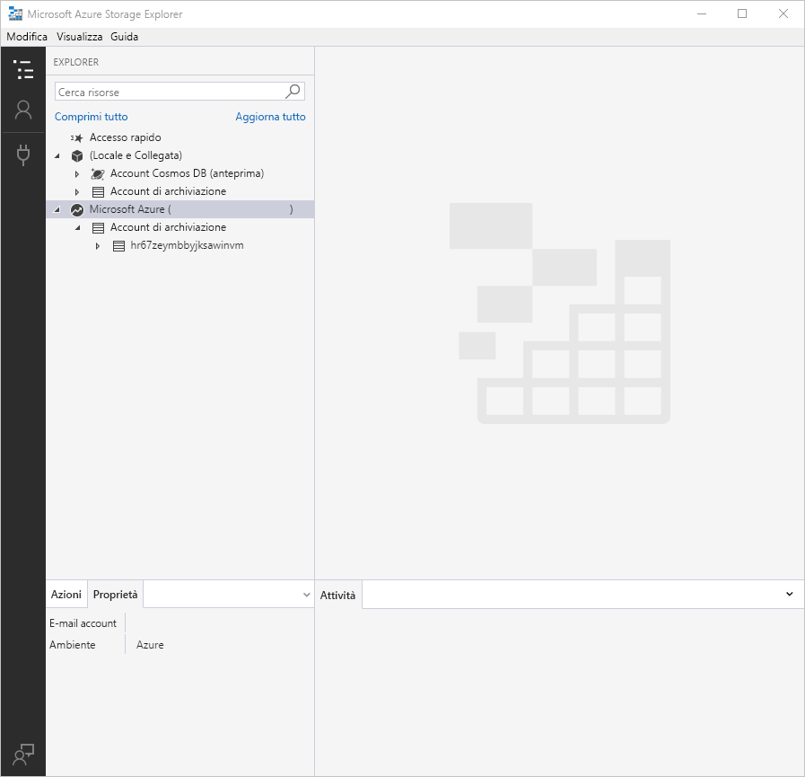
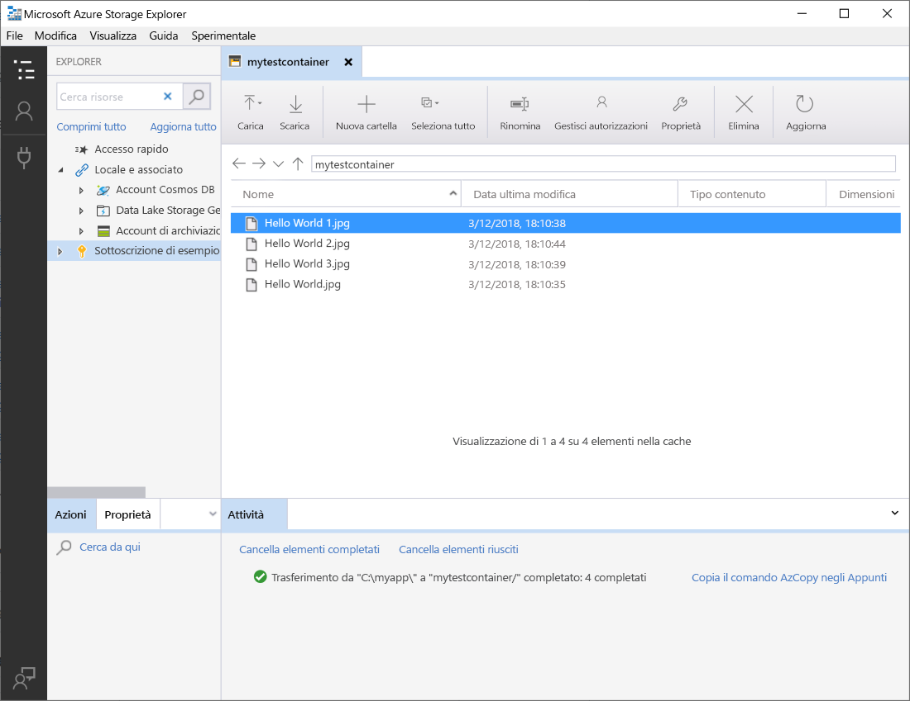
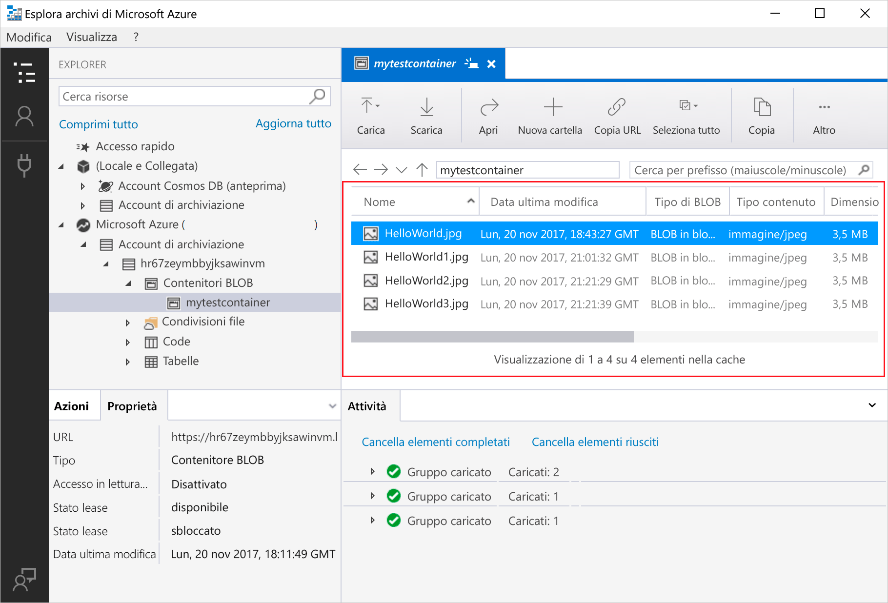
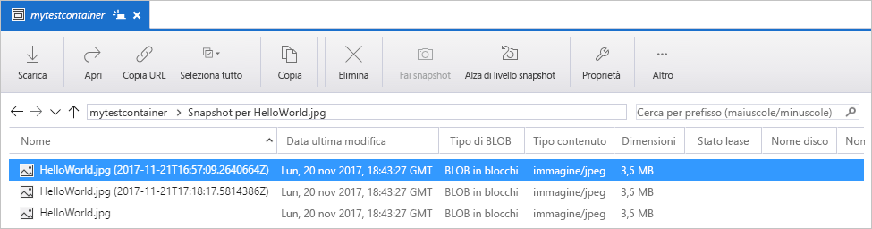

# Trasferire oggetti da e verso la risorsa di archiviazione BLOB di Azure usando Azure Storage Explorer

[Azure Storage Explorer](https://azure.microsoft.com/features/storage-explorer/) è un'interfaccia utente multipiattaforma usata per gestire i contenuti degli account di archiviazione. Questa guida descrive l'uso di Azure Storage Explorer per trasferire file tra un disco locale e l'archiviazione BLOB di Azure.

Se non si ha una sottoscrizione di Azure, creare un [account gratuito](https://azure.microsoft.com/free/?WT.mc_id=A261C142F) prima di iniziare.

La guida rapida richiede l'installazione di Azure Storage Explorer. Se è necessario installarlo, vedere [Azure Storage Explorer](https://azure.microsoft.com/features/storage-explorer/) per scaricarlo per Windows, Macintosh o Linux.

[!INCLUDE [storage-quickstart-tutorial-create-account-portal](../../../includes/storage-quickstart-tutorial-create-account-portal.md)]

## Accedere a Storage Explorer

Al primo avvio viene visualizzata la finestra **Microsoft Azure Storage Explorer - Connetti**. Storage Explorer offre numerosi modi per connettersi agli account di archiviazione. La tabella seguente elenca le diverse modalità disponibili per la connessione:

|Attività|Scopo|
|---|---|
|Aggiungere un account Azure | Consente il reindirizzamento alla pagina di accesso dell'organizzazione per l'autenticazione in Azure. |
|Usare una stringa di connessione o un URI di firma di accesso condiviso | Consente di accedere direttamente a un contenitore o a un account di archiviazione con un token di firma di accesso condiviso o una stringa di connessione condivisa. |
|Usare un nome e una chiave dell'account di archiviazione| Consente di usare un nome e una chiave dell'account di archiviazione per la connessione ad Archiviazione di Azure.|

Selezionare **Add an Azure Account** (Aggiungi un account Azure) e fare clic su **Accedi**. Attenersi alle richiesta visualizzate per accedere all'account Azure.

Al termine della connessione, Azure Storage Explorer viene caricato con la scheda **Explorer** visualizzata. Questa visualizzazione include informazioni dettagliate per tutti gli account di archiviazione di Azure e per le risorse di archiviazione locali configurate tramite gli account di [Azure Storage Emulator](../common/storage-use-emulator.md?toc=%2fazure%2fstorage%2fblobs%2ftoc.json), [Cosmos DB](../../cosmos-db/tutorial-documentdb-and-mongodb-in-storage-explorer.md?toc=%2fazure%2fstorage%2fblobs%2ftoc.json) o gli ambienti di [Azure Stack](../../azure-stack/user/azure-stack-storage-connect-se.md?toc=%2fazure%2fstorage%2fblobs%2ftoc.json).

## Creare un contenitore

Gli elementi BLOB vengono sempre caricati in un contenitore. Ciò consente di organizzare i gruppi di BLOB come si organizzano i file in cartelle sul computer.

Per creare un contenitore, espandere l'account di archiviazione creato nel passaggio precedente. Selezionare **Contenitori BLOB**, fare clic con il pulsante destro del mouse e scegliere **Crea contenitore BLOB**. Immettere il nome per il contenitore BLOB. Per un elenco di regole e restrizioni relative alla denominazione dei contenitori BLOB, vedere [Regole di denominazione dei contenitori](storage-dotnet-how-to-use-blobs.md#create-a-container). Al termine, premere **INVIO** per creare il contenitore BLOB. Dopo la creazione, il contenitore BLOB viene visualizzato sotto la cartella **Contenitori BLOB** per l'account di archiviazione selezionato.

## Caricare i BLOB nel contenitore

L'archiviazione BLOB supporta BLOB in blocchi, BLOB di aggiunta e BLOB di pagine. I file VHD usati per il backup di macchine virtuali IaaS sono BLOB di pagine. I BLOB di accodamento sono usati per la registrazione, ad esempio quando si vuole scrivere in un file e poi continuare ad aggiungere altre informazioni. La maggior parte dei file presenti nell'archiviazione BLOB è costituita da BLOB in blocchi.

Sulla barra multifunzione del contenitore selezionare **Carica**. Questa operazione consente di caricare una cartella o un file.

Scegliere i file o le cartelle da caricare. Selezionare il **Tipo BLOB**. Le opzioni accettabili sono BLOB **Aggiunta**, **Pagina** o **Blocchi**.

Se si carica un file con estensione vhd o vhdx, scegliere **Carica i file vhd/vhdx come BLOB di pagine (scelta consigliata)**.

Nel campo **Carica nella cartella (facoltativo)**specificare un nome di cartella per l'archiviazione di file o cartelle in una cartella nel contenitore. Se non viene selezionata alcuna cartella, i file vengono caricati direttamente nel contenitore.

Quando si seleziona **OK**, i file selezionati vengono accodati per il caricamento e viene caricato ogni file. Al termine del caricamento, i risultati vengono visualizzati nella finestra **Attività**.

## Visualizzare i BLOB in un contenitore

Nell'applicazione **Azure Storage Explorer** selezionare un contenitore in un account di archiviazione. Il riquadro principale mostra un elenco dei BLOB disponibili nel contenitore selezionato.

## Scaricare BLOB

Per scaricare i BLOB tramite **Azure Storage Explorer**, con un BLOB selezionato, scegliere **Download** dalla barra multifunzione. Viene visualizzata una finestra di dialogo File, che consente di immettere un nome di file. Selezionare **Salva** per avviare il download di un BLOB nella posizione locale.

## Gestire gli snapshot

Azure Storage Explorer consente di creare e gestire [snapshot](storage-blob-snapshots.md) dei BLOB. Per creare uno snapshot di un BLOB, fare clic con il pulsante destro del mouse e scegliere **Crea snapshot**. Per visualizzare gli snapshot per un BLOB, fare clic con il pulsante destro del mouse sul BLOB e scegliere **Manage Snapshots** (Gestisci gli snapshot). Nella scheda corrente viene mostrato un elenco degli snapshot per il BLOB.

## Gestire i criteri di accesso

Storage Explorer consente di gestire i criteri di accesso per i contenitori nella rispettiva interfaccia utente. Sono disponibili due tipi di criteri di accesso sicuro (firma di accesso condiviso), ovvero a livello di servizio e a livello di account. La firma di accesso condiviso a livello di account è destinata all'account di archiviazione ed è applicabile a più servizi e risorse. La firma di accesso condiviso a livello di servizio viene definita in una risorsa in un servizio specifico. Per generare una firma di accesso condiviso a livello di servizio, fare clic con il pulsante destro del mouse su qualsiasi contenitore e scegliere **Manage Access Policies** (Gestisci criteri di accesso). Per generare una firma di accesso condiviso a livello di account, fare clic con il pulsante destro del mouse sull'account di archiviazione.

Scegliere **Aggiungi** per aggiungere un nuovo criterio di accesso e definire le autorizzazioni per il criterio. Al termine, selezionare **Salva** per salvare il criterio di accesso. Questo criterio è ora disponibile per l'uso durante la configurazione di una firma di accesso condiviso.

## Usare le firme di accesso condiviso

Le firme di accesso condiviso possono essere recuperate tramite Storage Explorer. Fare clic con il pulsante destro del mouse su un account di archiviazione, su un contenitore o su un BLOB e scegliere **Get Shared Access Signature** (Ottieni firma di accesso condiviso). Scegliere l'ora di inizio e di scadenza e le autorizzazioni per l'URL della firma di accesso condiviso e selezionare **Crea**. Vengono forniti l'URL completo con la stringa di query e la stringa di query stessa ed è possibile copiarli dalla schermata successiva.

## Passaggi successivi

In questa guida introduttiva è stato descritto il trasferimento di file tra il disco locale e Archiviazione BLOB di Azure con **Azure Storage Explorer**. Per altre informazioni sull'uso dell'archiviazione BLOB, continuare la procedura relativa all'archiviazione BLOB.

> [!div class="nextstepaction"]
> [Procedura relativa alle operazioni di archiviazione BLOB](storage-how-to-use-blobs-powershell.md)
