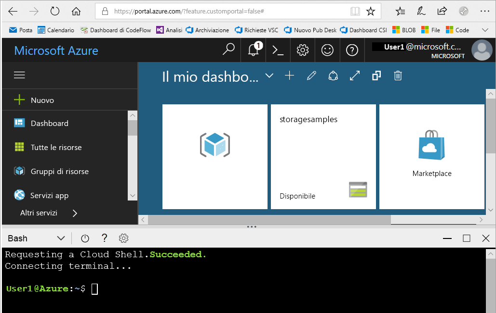
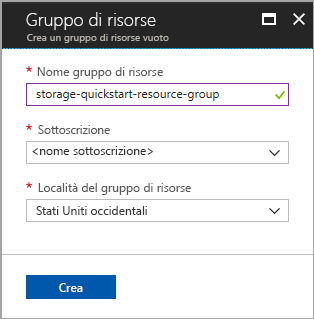
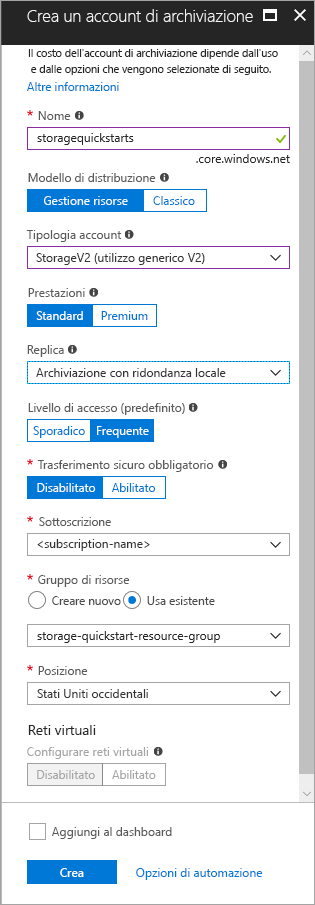

# <a name="create-a-storage-account"></a>Creare un account di archiviazione

Un account di archiviazione di Azure offre uno spazio dei nomi univoco nel cloud per archiviare gli oggetti dati in Archiviazione di Azure e accedere a tali oggetti. Un account di archiviazione contiene tutti i BLOB, file, code, tabelle e dischi creati in tale account. 

Per iniziare a usare Archiviazione di Azure, è prima necessario creare un nuovo account di archiviazione. È possibile creare un account di archiviazione di Azure usando il [portale di Azure](https://portal.azure.com/), [Azure PowerShell](https://docs.microsoft.com/powershell/azure/overview) o l'[interfaccia della riga di comando di Azure](https://docs.microsoft.com/cli/azure/overview?view=azure-cli-latest). Questa guida introduttiva illustra come usare ognuna di queste opzioni per creare il nuovo account di archiviazione. 


## <a name="prerequisites"></a>prerequisiti

Se non si ha una sottoscrizione di Azure, creare un [account gratuito](https://azure.microsoft.com/free/) prima di iniziare.

# <a name="portaltabportal"></a>[di Microsoft Azure](#tab/portal)

No.

# <a name="powershelltabpowershell"></a>[PowerShell](#tab/powershell)

Per questa guida introduttiva è richiesto il modulo Azure PowerShell versione 3.6 o successiva. Eseguire `Get-Module -ListAvailable AzureRM` per trovare la versione corrente. Se è necessario eseguire l'installazione o l'aggiornamento, vedere come [installare il modulo Azure PowerShell](/powershell/azure/install-azurerm-ps).

# <a name="azure-clitabazure-cli"></a>[Interfaccia della riga di comando di Azure](#tab/azure-cli)

È possibile accedere ad Azure ed eseguire i comandi dell'interfaccia della riga di comando di Azure in uno dei due modi seguenti:

- È possibile eseguire i comandi dell'interfaccia della riga di comando nel portale di Azure, in Azure Cloud Shell 
- È possibile installare l'interfaccia della riga di comando ed eseguire i relativi comandi in locale  

### <a name="use-azure-cloud-shell"></a>Usare Azure Cloud Shell

Azure Cloud Shell è una shell Bash gratuita che è possibile eseguire direttamente nel portale di Azure. Include l'interfaccia della riga di comando di Azure preinstallata e configurata per l'uso con l'account. Fare clic sul pulsante **Cloud Shell** nel menu in alto a destra nel portale di Azure:

[](https://portal.azure.com)

Il pulsante avvia una shell interattiva che è possibile usare per eseguire i passaggi di questa guida introduttiva:

[](https://portal.azure.com)

### <a name="install-the-cli-locally"></a>Installare l'interfaccia della riga di comando in locale

È anche possibile installare e usare l'interfaccia della riga di comando di Azure in locale. Questa guida introduttiva richiede l'interfaccia della riga di comando di Azure 2.0.4 o versioni successive. Eseguire `az --version` per trovare la versione. Se è necessario eseguire l'installazione o l'aggiornamento, vedere [Installare l'interfaccia della riga di comando di Azure 2.0](/cli/azure/install-azure-cli). 

---

## <a name="log-in-to-azure"></a>Accedere ad Azure

# <a name="portaltabportal"></a>[di Microsoft Azure](#tab/portal)

Accedere al [Portale di Azure](https://portal.azure.com).

# <a name="powershelltabpowershell"></a>[PowerShell](#tab/powershell)

Accedere alla sottoscrizione di Azure con il comando `Login-AzureRmAccount` e seguire le istruzioni visualizzate per eseguire l'autenticazione.

```powershell
Login-AzureRmAccount
```

# <a name="azure-clitabazure-cli"></a>[Interfaccia della riga di comando di Azure](#tab/azure-cli)

Per avviare Azure Cloud Shell, accedere al [portale di Azure](https://portal.azure.com).

Per accedere all'installazione locale dell'interfaccia della riga di comando, eseguire il comando di accesso:

```cli
az login
```

---

## <a name="create-a-resource-group"></a>Creare un gruppo di risorse

Un gruppo di risorse di Azure è un contenitore logico in cui le risorse di Azure vengono distribuite e gestite. Per altre informazioni sui gruppi di risorse, vedere [Panoramica di Azure Resource Manager](../../azure-resource-manager/resource-group-overview.md).

# <a name="portaltabportal"></a>[di Microsoft Azure](#tab/portal)

Per creare un gruppo di risorse nel portale di Azure, seguire questa procedura:

1. Nel portale di Azure espandere il menu a sinistra per aprire il menu dei servizi e scegliere **Gruppi di risorse**.
2. Fare clic sul pulsante **Aggiungi** per aggiungere un nuovo gruppo di risorse.
3. Immettere un nome per il nuovo gruppo di risorse.
4. Selezionare la sottoscrizione in cui creare il nuovo gruppo di risorse.
5. Scegliere la posizione per il gruppo di risorse.
6. Selezionare il pulsante **Create** .  



# <a name="powershelltabpowershell"></a>[PowerShell](#tab/powershell)

Per creare un nuovo gruppo di risorse con PowerShell, usare il comando [New-AzureRmResourceGroup](/powershell/module/azurerm.resources/new-azurermresourcegroup): 

```powershell
# put resource group in a variable so you can use the same group name going forward,
# without hardcoding it repeatedly
$resourceGroup = "storage-quickstart-resource-group"
New-AzureRmResourceGroup -Name $resourceGroup -Location $location 
```

In caso di dubbi su quale area specificare per il parametro `-Location`, è possibile recuperare un elenco di aree supportate per la sottoscrizione con il comando [Get-AzureRmLocation](/powershell/module/azurerm.resources/get-azurermlocation):

```powershell
Get-AzureRmLocation | select Location 
$location = "westus"
```

# <a name="azure-clitabazure-cli"></a>[Interfaccia della riga di comando di Azure](#tab/azure-cli)

Per creare un nuovo gruppo di risorse con l'interfaccia della riga di comando di Azure, usare il comando [az group create](/cli/azure/group#az_group_create). 

```azurecli-interactive
az group create \
    --name storage-quickstart-resource-group \
    --location westus
```

In caso di dubbi su quale area specificare per il parametro `--location`, è possibile recuperare un elenco di aree supportate per la sottoscrizione con il comando [az account list-locations](/cli/azure/account#az_account_list).

```azurecli-interactive
az account list-locations \
    --query "[].{Region:name}" \
    --out table
```

---

## <a name="create-a-general-purpose-storage-account"></a>Creare un account di archiviazione per utilizzo generico

Un account di archiviazione per utilizzo generico consente l'accesso a tutti i servizi di Archiviazione di Azure: BLOB, file, code e tabelle. È possibile creare un account di archiviazione per utilizzo generico nel livello Standard o Premium. Gli esempi in questo articolo mostrano come creare un account di archiviazione per utilizzo generico nel livello Standard (predefinito).

In Archiviazione di Azure sono disponibili due tipi di account di archiviazione per utilizzo generico:

- Account per utilizzo generico v2 
- Account per utilizzo generico v1. 

> [!NOTE]
> È consigliabile creare nuovi account di archiviazione come **account per utilizzo generico v2** in modo da sfruttare le funzionalità più recenti disponibili per tali account.  

Per altre informazioni sui tipi di account di archiviazione, vedere [Opzioni di account di archiviazione di Azure](storage-account-options.md).

Quando si assegna un nome all'account di archiviazione, tenere presenti queste regole:

- I nomi degli account di archiviazione devono avere una lunghezza compresa tra 3 e 24 caratteri e possono contenere solo numeri e lettere minuscole.
- Nome dell'account di archiviazione deve essere univoco all'interno di Azure. Due account di archiviazione non possono avere lo stesso nome.

# <a name="portaltabportal"></a>[di Microsoft Azure](#tab/portal)

Per creare un account di archiviazione per utilizzo generico v2 nel portale di Azure, eseguire questa procedura:

1. Nel portale di Azure espandere il menu a sinistra per aprire il menu dei servizi e scegliere **Altri servizi**. Scorrere quindi verso il basso fino ad **Archiviazione** e scegliere **Account di archiviazione**. Nella finestra **Account di archiviazione** visualizzata scegliere **Aggiungi**.
2. Immettere un nome per l'account di archiviazione.
3. Impostare il campo **Tipologia account** su **StorageV2 (utilizzo generico v2)**.
4. Lasciare il campo **Replica** impostato su **Archiviazione con ridondanza locale**. In alternativa, è possibile scegliere **Archiviazione con ridondanza della zona (versione in anteprima)**, **Archiviazione con ridondanza geografica** o **Archiviazione con ridondanza geografica e accesso in lettura**.
5. Non modificare i valori predefiniti per questi campi: **Modello di distribuzione**, **Prestazioni**, **Trasferimento sicuro obbligatorio**.
6. Scegliere la sottoscrizione in cui creare l'account di archiviazione.
7. Nella sezione **Gruppo di risorse** selezionare **Usa esistente** e quindi scegliere il gruppo di risorse creato nella sezione precedente.
8. Scegliere la posizione per il nuovo account di archiviazione.
9. Fare clic su **Crea** per creare l'account di archiviazione.      



# <a name="powershelltabpowershell"></a>[PowerShell](#tab/powershell)

Per creare un account di archiviazione per utilizzo generico v2 da PowerShell con l'archiviazione con ridondanza locale, usare il comando [New-AzureRmStorageAccount](/powershell/module/azurerm.storage/New-AzureRmStorageAccount): 

```powershell
New-AzureRmStorageAccount -ResourceGroupName $resourceGroup `
  -Name "storagequickstart" `
  -Location $location `
  -SkuName Standard_LRS `
  -Kind StorageV2 
```

Per creare un account di archiviazione per utilizzo generico v2 con l'archiviazione con ridondanza della zona (versione in anteprima), l'archiviazione con ridondanza geografica o l'archiviazione con ridondanza geografica e accesso in lettura, sostituire il parametro **SkuName** con il valore desiderato nella tabella seguente. 

|Opzione di replica  |Parametro SkuName  |
|---------|---------|
|Archiviazione con ridondanza locale     |Standard_LRS         |
|Archiviazione con ridondanza della zona (ZRS).     |Standard_ZRS         |
|Archiviazione con ridondanza geografica (GRS)     |Standard_GRS         |
|Archiviazione con ridondanza geografica e accesso in lettura     |Standard_RAGRS         |

# <a name="azure-clitabazure-cli"></a>[Interfaccia della riga di comando di Azure](#tab/azure-cli)

Per creare un account di archiviazione per utilizzo generico v2 dall'interfaccia della riga di comando di Azure con l'archiviazione con ridondanza locale, usare il comando [az storage account create](/cli/azure/storage/account#az_storage_account_create).

```azurecli-interactive
az storage account create \
    --name storagequickstart \
    --resource-group storage-quickstart-resource-group \
    --location westus \
    --sku Standard_LRS \
    --kind StorageV2
```

Per creare un account di archiviazione per utilizzo generico v2 con l'archiviazione con ridondanza della zona (versione in anteprima), l'archiviazione con ridondanza geografica o l'archiviazione con ridondanza geografica e accesso in lettura, sostituire il parametro **sku** con il valore desiderato nella tabella seguente. 

|Opzione di replica  |Parametro sku  |
|---------|---------|
|Archiviazione con ridondanza locale     |Standard_LRS         |
|Archiviazione con ridondanza della zona (ZRS).     |Standard_ZRS         |
|Archiviazione con ridondanza geografica (GRS)     |Standard_GRS         |
|Archiviazione con ridondanza geografica e accesso in lettura     |Standard_RAGRS         |

---

> [!NOTE]
> L'[archiviazione con ridondanza della zona](https://azure.microsoft.com/blog/announcing-public-preview-of-azure-zone-redundant-storage/preview/) è attualmente disponibile in versione di anteprima e solo per le località seguenti:
>    - Stati Uniti orientali 2
>    - Stati Uniti centrali
>    - Francia centrale. Quest'area è attualmente disponibile in anteprima. Per richiedere l'accesso, vedere [Microsoft Azure preview with Azure Availability Zones now open in France](https://azure.microsoft.com/blog/microsoft-azure-preview-with-azure-availability-zones-now-open-in-france) (Anteprima di Microsoft Azure con Zone di disponibilità di Azure ora accessibile in Francia).
    
Per altre informazioni sui diversi tipi di replica disponibili, vedere [Replica di Archiviazione di Azure](storage-redundancy.md).

## <a name="clean-up-resources"></a>Pulire le risorse

Per pulire le risorse create in questa guida introduttiva, è sufficiente eliminare il gruppo di risorse. Eliminando il gruppo di risorse vengono eliminati anche l'account di archiviazione associato e tutte le altre risorse correlate al gruppo di risorse.

# <a name="portaltabportal"></a>[di Microsoft Azure](#tab/portal)

Per rimuovere un gruppo di risorse usando il portale di Azure:

1. Nel portale di Azure espandere il menu a sinistra per aprire il menu dei servizi e scegliere **Gruppi di risorse** per visualizzare l'elenco dei gruppi di risorse.
2. Individuare il gruppo di risorse da eliminare e fare clic con il pulsante destro del mouse su **Altro** (**...**) a destra dell'elenco.
3. Scegliere **Elimina gruppo di risorse** e confermare.

# <a name="powershelltabpowershell"></a>[PowerShell](#tab/powershell)

Per rimuovere il gruppo di risorse e tutte le risorse correlate, incluso il nuovo account di archiviazione, usare il comando [Remove-AzureRmResourceGroup](/powershell/module/azurerm.resources/remove-azurermresourcegroup): 

```powershell
Remove-AzureRmResourceGroup -Name $resourceGroup
```

# <a name="azure-clitabazure-cli"></a>[Interfaccia della riga di comando di Azure](#tab/azure-cli)

Per rimuovere il gruppo di risorse e tutte le risorse correlate, incluso il nuovo account di archiviazione, usare il comando [az group delete](/cli/azure/group#az_group_delete).

```azurecli-interactive
az group delete --name myResourceGroup
```

---

## <a name="next-steps"></a>Passaggi successivi

In questa Guida introduttiva è stato creato un account di archiviazione standard per uso generico. Per informazioni su come caricare e scaricare BLOB nell'account di archiviazione, passare alla guida introduttiva su Archiviazione BLOB.

# <a name="portaltabportal"></a>[di Microsoft Azure](#tab/portal)

> [!div class="nextstepaction"]
> [Trasferire oggetti da e verso Archiviazione BLOB di Azure con il portale di Azure](../blobs/storage-quickstart-blobs-portal.md)

# <a name="powershelltabpowershell"></a>[PowerShell](#tab/powershell)

> [!div class="nextstepaction"]
> [Trasferire oggetti da e verso la risorsa di archiviazione BLOB di Azure usando PowerShell](../blobs/storage-quickstart-blobs-powershell.md)

# <a name="azure-clitabazure-cli"></a>[Interfaccia della riga di comando di Azure](#tab/azure-cli)

> [!div class="nextstepaction"]
> [Trasferire oggetti da e verso la risorsa di archiviazione BLOB con l'interfaccia della riga di comando di Azure](../blobs/storage-quickstart-blobs-cli.md)

---
