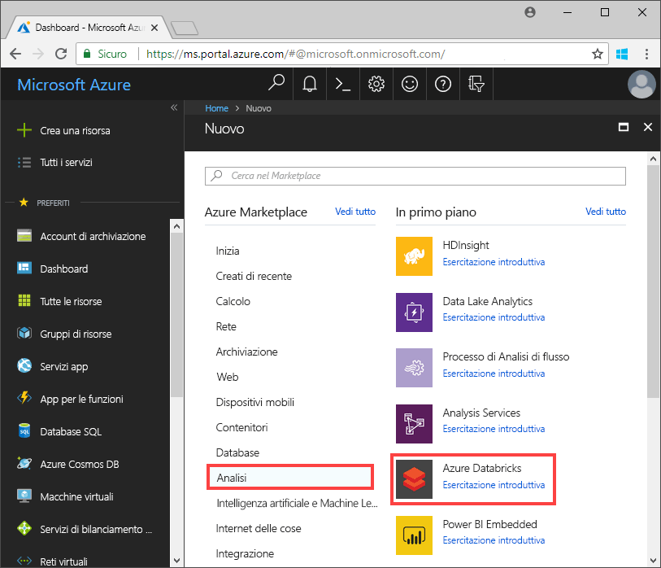
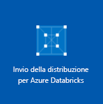
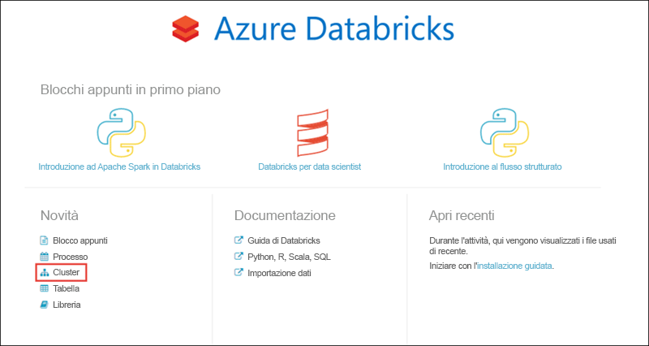
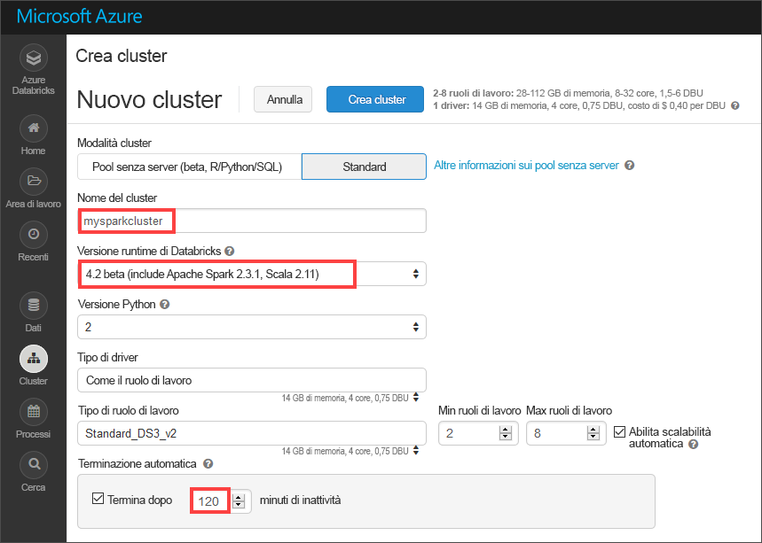
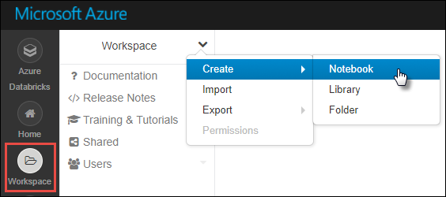
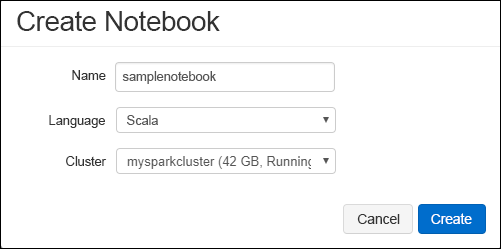
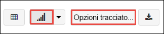
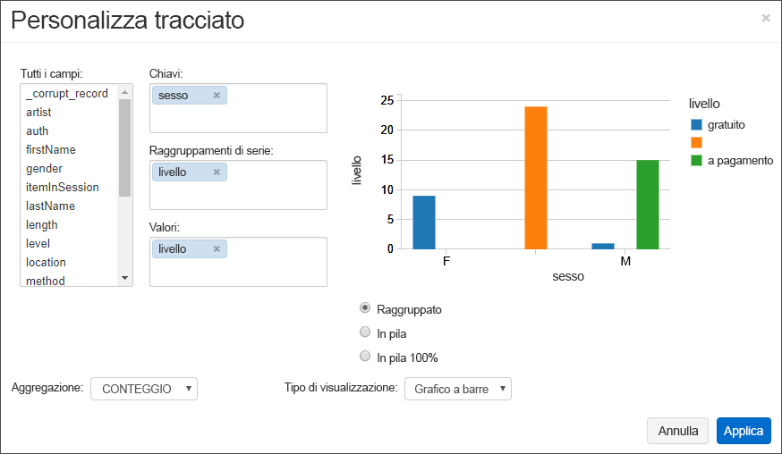
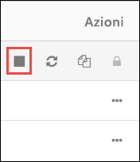

# <a name="quickstart-run-a-spark-job-on-azure-databricks-using-the-azure-portal"></a>Guida introduttiva: Eseguire un processo Spark in Azure Databricks mediante il portale di Azure

Questa guida introduttiva illustra come eseguire un processo di Apache Spark usando Azure Databricks per svolgere analisi sui dati archiviati in un account di archiviazione con la versione di anteprima di Azure Data Lake Storage Gen2 abilitata.

Nell'ambito del processo Spark si analizzeranno i dati delle sottoscrizioni di un canale radio per ottenere informazioni dettagliate sull'utilizzo gratuito/a pagamento in base ai dati demografici.

Se non si ha una sottoscrizione di Azure, [creare un account gratuito](https://azure.microsoft.com/free/) prima di iniziare.

## <a name="prerequisites"></a>Prerequisiti

- [Creare un account di archiviazione con Data Lake Storage Gen2 abilitato](quickstart-create-account.md)

## <a name="set-aside-storage-account-configuration"></a>Esaminare l'account di archiviazione

> [!IMPORTANT]
> Durante questa esercitazione è necessario avere accesso al nome e alla chiave di accesso dell'account di archiviazione. Nel portale di Azure selezionare **Tutti i servizi** e filtrare in base ad *archiviazione*. Selezionare **Account di archiviazione** e individuare l'account creato per questa esercitazione.
>
> Da **Panoramica** copiare il **nome** dell'account di archiviazione in un editor di testo. Selezionare quindi **Chiavi di accesso** e copiare il valore di **key1** nell'editor di testo, perché entrambi i valori sono necessari per i comandi illustrati di seguito.

## <a name="create-an-azure-databricks-workspace"></a>Creare un'area di lavoro di Azure Databricks

In questa sezione viene creata un'area di lavoro di Azure Databricks usando il portale di Azure.

1. Nel portale di Azure selezionare **Crea una risorsa** > **Analisi** > **Azure Databricks**.

    

2. Nella pagina **Servizio Azure Databricks** specificare i valori per creare un'area di lavoro di Databricks.

    

    Specificare i valori seguenti:

    |Proprietà  |Descrizione  |
    |---------|---------|
    |**Nome area di lavoro**     | Specificare un nome per l'area di lavoro di Databricks        |
    |**Sottoscrizione**     | Selezionare la sottoscrizione di Azure nell'elenco a discesa.        |
    |**Gruppo di risorse**     | Specificare se si vuole creare un nuovo gruppo di risorse o usarne uno esistente. Un gruppo di risorse è un contenitore con risorse correlate per una soluzione Azure. Per altre informazioni, vedere [Panoramica di Gestione risorse di Microsoft Azure](../../azure-resource-manager/resource-group-overview.md). |
    |**Posizione**     | Selezionare **Stati Uniti occidentali 2**. Se si preferisce, è possibile selezionare un'altra area pubblica.        |
    |**Piano tariffario**     |  Scegliere tra **Standard** e **Premium**. Per altre informazioni su questi piani tariffari, vedere la [pagina dei prezzi di Databricks](https://azure.microsoft.com/pricing/details/databricks/).       |

    Selezionare **Aggiungi al dashboard** e quindi fare clic su **Crea**.

3. La creazione dell'area di lavoro richiede alcuni minuti, durante i quali il portale visualizza il riquadro **Invio della distribuzione per Azure Databricks** a destra. Potrebbe essere necessario scorrere verso destra nel dashboard per visualizzare il riquadro. È presente anche un indicatore di stato nella parte superiore della schermata. È possibile esaminare lo stato di avanzamento nelle due aree.

    

## <a name="create-a-spark-cluster-in-databricks"></a>Creare un cluster Spark in Databricks

1. Nel portale di Azure passare all'area di lavoro di Databricks creata e quindi selezionare **Avvia area di lavoro**.

2. Si verrà reindirizzati al portale di Azure Databricks. Nel portale selezionare **Nuovo** > **Cluster**.

    

3. Nella pagina **New cluster** (Nuovo cluster) specificare i valori per creare un cluster.

    

    Accettare tutti gli altri valori predefiniti tranne i seguenti:

    * Immettere un nome per il cluster.
    * Creare un cluster con il runtime **4.2 beta**.
    * Assicurarsi di selezionare la casella di controllo **Terminate after 120 minutes of inactivity** (Termina dopo 120 minuti di inattività). Specificare una durata in minuti per terminare il cluster, se questo non viene usato.

4. Selezionare **Crea cluster**. Quando il cluster è in esecuzione, è possibile collegare blocchi appunti al cluster ed eseguire processi Spark.

Per altre informazioni sulla creazione di cluster, vedere [Create a Spark cluster in Azure Databricks](https://docs.azuredatabricks.net/user-guide/clusters/create.html) (Creare un cluster Spark in Azure Databricks).

## <a name="create-storage-account-file-system"></a>Creare il file system per l'account di archiviazione

In questa sezione viene creato un notebook nell'area di lavoro di Azure Databricks e quindi vengono eseguiti frammenti di codice per configurare l'account di archiviazione.

1. Nel [portale di Azure](https://portal.azure.com) passare all'area di lavoro di Azure Databricks creata e quindi selezionare **Launch Workspace** (Avvia l'area di lavoro).

2. Nel riquadro a sinistra selezionare **Workspace** (Area di lavoro). Nell'elenco a discesa **Workspace** (Area di lavoro) selezionare **Create (Crea)** > **Notebook**.

    

3. Nella finestra di dialogo **Create Notebook** (Crea un notebook) immettere un nome per il notebook. Selezionare **Scala** come linguaggio e quindi selezionare il cluster Spark creato in precedenza.

    

    Selezionare **Create**.

4. Nel codice seguente sostituire il testo **ACCOUNT_NAME** e **ACCOUNT_KEY** con i valori copiati all'inizio di questa guida introduttiva. Sostituire anche il testo **FILE_SYSTEM_NAME** con il nome che si vuole assegnare al file system. Immettere quindi il codice nella prima cella.

    ```scala
    spark.conf.set("fs.azure.account.key.<ACCOUNT_NAME>.dfs.core.windows.net", "<ACCOUNT_KEY>")
    spark.conf.set("fs.azure.createRemoteFileSystemDuringInitialization", "true")
    dbutils.fs.ls("abfss://<FILE_SYSTEM_NAME>@<ACCOUNT_NAME>.dfs.core.windows.net/")
    spark.conf.set("fs.azure.createRemoteFileSystemDuringInitialization", "false")
    ```

    Premere **MAIUSC+INVIO** per eseguire la cella di codice.

    A questo punto è stato creato il file system per l'account di archiviazione.

## <a name="ingest-sample-data"></a>Inserire dati di esempio

Prima di iniziare con questa sezione, è necessario completare i prerequisiti seguenti:

Immettere il codice seguente in una cella del notebook:

    %sh wget -P /tmp https://raw.githubusercontent.com/Azure/usql/master/Examples/Samples/Data/json/radiowebsite/small_radio_json.json

Nella cella premere `Shift` + `Enter` per eseguire il codice.

In una nuova cella sotto questa immettere il codice seguente, sostituendo **FILE_SYSTEM** e **ACCOUNT_NAME** con gli stessi valori usati in precedenza:

    dbutils.fs.cp("file:///tmp/small_radio_json.json", "abfss://<FILE_SYSTEM>@<ACCOUNT_NAME>.dfs.core.windows.net/")

Nella cella premere `Shift` + `Enter` per eseguire il codice.

## <a name="run-a-spark-sql-job"></a>Eseguire un processo Spark SQL

Eseguire le attività seguenti per eseguire un processo Spark SQL sui dati.

1. Eseguire un'istruzione SQL per creare una tabella temporanea con i dati dal file di dati JSON di esempio **small_radio_json.json**. Nel frammento di codice seguente sostituire i valori segnaposto con il nome del file system e il nome dell'account di archiviazione. Usando il notebook creato in precedenza, incollare il frammento di codice in una nuova cella di codice del notebook e quindi premere MAIUSC+INVIO.

    ```sql
    %sql
    DROP TABLE IF EXISTS radio_sample_data;
    CREATE TABLE radio_sample_data
    USING json
    OPTIONS (
     path  "abfss://<FILE_SYSTEM_NAME>@<ACCOUNT_NAME>.dfs.core.windows.net/<PATH>/small_radio_json.json"
    )
    ```

    Dopo il completamento del comando, tutti i dati presenti nel file JSON sono visualizzati in una tabella nel cluster Databricks.

    Il comando magic `%sql` del linguaggio consente di eseguire codice SQL dal blocco appunti anche se questo è di un altro tipo. Per altre informazioni, vedere [Mixing languages in a notebook](https://docs.azuredatabricks.net/user-guide/notebooks/index.html#mixing-languages-in-a-notebook) (Combinazione di linguaggi in un blocco appunti).

2. Si esaminerà ora uno snapshot dei dati JSON di esempio per comprendere meglio la query eseguita. Incollare il frammento di codice seguente in una cella di codice e premere **MAIUSC+INVIO**.

    ```sql
    %sql
    SELECT * from radio_sample_data
    ```

3. I risultati verranno visualizzati in una tabella simile a quella dello screenshot seguente (sono incluse solo alcune colonne):

    

    Tra i vari dettagli, i dati di esempio acquisiscono il sesso del pubblico di un canale radio (nome colonna **gender**) e se l'abbonamento è gratuito o a pagamento (nome colonna **level**).

4. È ora possibile creare una rappresentazione visiva dei dati da visualizzare in base al sesso, con l'indicazione di quanti utenti usano un account gratuito e quanti sono abbonati a pagamento. Nella parte inferiore della tabella dei risultati fare clic sull'icona del **grafico a barre** e quindi su **Plot Options** (Opzioni grafico).

    

5. In **Customize Plot** (Personalizza grafico) trascinare i valori come illustrato nello screenshot.

    

    - Impostare **Keys** (Chiavi) su **gender**.
    - Impostare **Series groupings** (Raggruppamenti di serie) su **level**.
    - Impostare **Values** (Valori) su **level**.
    - Impostare **Aggregation** (Aggregazione) su **COUNT** (CONTEGGIO).

6. Fare clic su **Apply**.

7. L'output mostra la rappresentazione visiva illustrata nello screenshot seguente:

     

## <a name="clean-up-resources"></a>Pulire le risorse

Dopo avere completato l'articolo, è possibile terminare il cluster. Nell'area di lavoro di Azure Databricks selezionare **Cluster** e individuare il cluster da terminare. Posizionare il cursore del mouse sui puntini di sospensione sotto la colonna **Actions** (Azioni) e fare clic sull'icona **Terminate** (Termina).



Se non viene terminato manualmente, il cluster si arresta automaticamente se è stata selezionata la casella di controllo **Terminate after \_\_ minutes of inactivity** (Termina dopo \_\_ minuti di attività) durante la creazione del cluster. Se si imposta questa opzione, il cluster si arresta dopo essere rimasto inattivo per il periodo di tempo specificato.

## <a name="next-steps"></a>Passaggi successivi

In questo articolo è stato creato un cluster Spark in Azure Databricks ed è stato eseguito un processo Spark in un account di archiviazione con Data Lake Storage Gen2 abilitato. Per informazioni su come importare dati da altre origini dati in Azure Databricks, vedere anche [Spark data sources](https://docs.azuredatabricks.net/spark/latest/data-sources/index.html) (Origini dati di Spark). Passare all'articolo successivo per informazioni su come eseguire un'operazione ETL (estrazione, trasformazione e caricamento dati) tramite Azure Databricks.

> [!div class="nextstepaction"]
>[Estrarre, trasformare e caricare dati tramite Azure Databricks](../../azure-databricks/databricks-extract-load-sql-data-warehouse.md)
