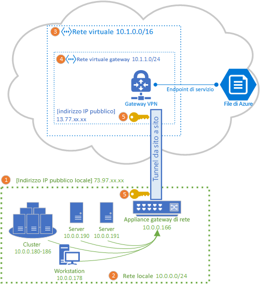
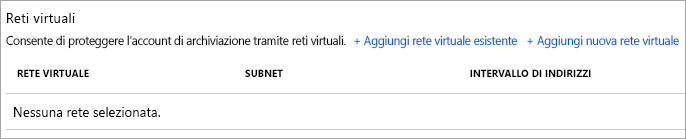
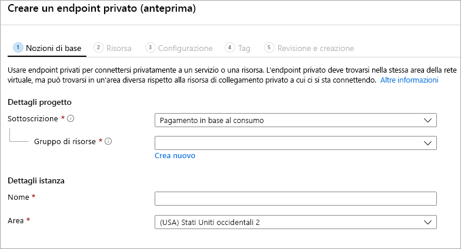

# Configurare una VPN da sito a sito per l'uso con File di Azure
È possibile usare una connessione VPN da sito a sito per montare le condivisioni file di Azure su SMB dalla rete locale, senza aprire la porta 445. È possibile configurare una VPN da sito a sito usando il servizio [Gateway VPN di Azure](../../vpn-gateway/vpn-gateway-about-vpngateways.md), ovvero una risorsa di Azure che offre servizi VPN e viene distribuita in un gruppo di risorse insieme ad account di archiviazione o altre risorse di Azure.

Per una descrizione completa delle opzioni di rete disponibili per File di Azure, è consigliabile leggere l'articolo [Panoramica della rete per File di Azure](storage-files-networking-overview.md) prima di procedere con questo articolo.

Questo articolo illustra i passaggi della configurazione di una VPN da sito a sito per montare le condivisioni file di Azure direttamente in locale. Se si vuole instradare il traffico di sincronizzazione per Sincronizzazione file di Azure tramite una VPN da sito a sito, vedere come [configurare le impostazioni di proxy e firewall di Sincronizzazione file di Azure](storage-sync-files-firewall-and-proxy.md).

## Prerequisiti
- Una condivisione file di Azure che si vuole montare in locale. Con la VPN da sito a sito, è possibile usare una condivisione file di Azure [standard](storage-how-to-create-file-share.md) o [Premium](storage-how-to-create-premium-fileshare.md).

- Un'appliance o un server di rete nel data center locale compatibile con il gateway VPN di Azure. File di Azure è indipendente dall'appliance di rete locale scelta, ma il gateway VPN di Azure mantiene un [elenco di dispositivi testati](../../vpn-gateway/vpn-gateway-about-vpn-devices.md). Per la selezione di un'appliance di rete, è opportuno tenere presente che dispositivi diversi offrono funzionalità, caratteristiche di prestazioni e funzionalità di gestione diverse.

    Se non si ha già un'appliance di rete, Windows Server contiene un ruolo predefinito del server, Routing e Accesso remoto, che può essere usato come appliance di rete locale. Per altre informazioni su come configurare Routing e Accesso remoto Windows Server, vedere [Gateway RAS](https://docs.microsoft.com/windows-server/remote/remote-access/ras-gateway/ras-gateway).

## Aggiungere un account di archiviazione alla rete virtuale
Nel portale di Azure passare all'account di archiviazione che contiene la condivisione file di Azure che si vuole montare in locale. Nel sommario dell'account di archiviazione selezionare la voce **Firewall e reti virtuali**. A meno che non sia stata aggiunta una rete virtuale all'account di archiviazione al momento della creazione, nel riquadro risultante per **Consenti l'accesso da** sarà selezionato il pulsante di opzione **Tutte le reti**.

Per aggiungere l'account di archiviazione alla rete virtuale desiderata, selezionare **Reti selezionate**. Nell'intestazione secondaria **Reti virtuali** fare clic su **+ Aggiungi rete virtuale esistente** o su **+ Aggiungi nuova rete virtuale** a seconda dello stato desiderato. La creazione di una nuova rete virtuale genera la creazione di una nuova risorsa di Azure. La risorsa rete virtuale nuova o esistente non deve necessariamente essere inclusa nello stesso gruppo di risorse o nella stessa sottoscrizione dell'account di archiviazione, ma deve trovarsi nella stessa area dell'account di archiviazione; inoltre, il gruppo di risorse e la sottoscrizione in cui viene distribuita la rete virtuale devono corrispondere a quelli in cui si distribuisce il gateway VPN. 

Se si aggiunge una rete virtuale esistente, verrà chiesto di selezionare una o più subnet a cui dovrà essere aggiunto l'account di archiviazione. Se si seleziona una nuova rete virtuale, al momento della creazione verrà creata anche una subnet ed è possibile aggiungerne altre in seguito tramite la risorsa di Azure risultante.

Se non è ancora stato aggiunto un account di archiviazione alla sottoscrizione, alla rete virtuale verrà aggiunto l'endpoint di servizio Microsoft.Storage. Questa operazione può richiedere del tempo e, finché non viene completata, non sarà possibile accedere alle condivisioni file di Azure all'interno di questo account di archiviazione, neanche tramite la connessione VPN. 

## Distribuire il gateway VPN di Azure
Nel sommario del portale di Azure selezionare **Crea una nuova risorsa** e cercare *Gateway di rete virtuale*. Il gateway di rete virtuale deve essere incluso nella stessa sottoscrizione, nella stessa area di Azure e nello stesso gruppo di risorse della rete virtuale distribuita nel passaggio precedente. Si noti che quando si seleziona la rete virtuale viene automaticamente selezionato questo gruppo di risorse. 

Per la distribuzione di un gateway VPN di Azure, è necessario compilare i campi seguenti:

- **Nome**: il nome della risorsa di Azure per il gateway VPN. Può essere qualsiasi nome che si ritiene utile per la gestione.
- **Area**: l'area in cui verrà distribuito il gateway VPN.
- **Tipo di gateway**: per la distribuzione di una VPN da sito a sito, è necessario selezionare **VPN**.
- **Tipo VPN**: è possibile scegliere *Basato su route* o **Basato su criteri** a seconda del dispositivo VPN in uso. Le VPN basate su route supportano IKEv2, mentre quelle basate su criteri supportano IKEv1. Per altre informazioni sui due tipi di gateway VPN, vedere [Informazioni sui gateway VPN basati su criteri e basati su route](../../vpn-gateway/vpn-gateway-connect-multiple-policybased-rm-ps.md#about)
- **SKU**: lo SKU controlla il numero di tunnel consentiti da sito a sito e le prestazioni desiderate per la VPN. Per selezionare lo SKU appropriato per uno specifico caso d'uso, vedere l'elenco di [SKU di gateway](../../vpn-gateway/vpn-gateway-about-vpngateways.md#gwsku). Lo SKU del gateway VPN potrà essere cambiato in seguito, se necessario.
- **Rete virtuale**: la rete virtuale creata nel passaggio precedente.
- **Indirizzo IP pubblico**: l'indirizzo IP del gateway VPN che verrà esposto su Internet. Probabilmente sarà necessario creare un nuovo indirizzo IP, ma se ne può anche usare uno esistente non utilizzato, se appropriato. Se si seleziona **Crea nuovo**, verrà creata una nuova risorsa di Azure di tipo indirizzo IP nello stesso gruppo di risorse del gateway VPN e il relativo nome sarà indicato in **Nome indirizzo IP pubblico**. Se si seleziona **Usa esistente**, è necessario selezionare un indirizzo IP esistente inutilizzato.
- **Abilita modalità attiva-attiva**: selezionare **Abilitata** solo se si sta creando una configurazione gateway attiva-attiva, altrimenti lasciare selezionata l'opzione **Disabilitata**. Per altre informazioni sulla modalità attiva-attiva, vedere [Connettività cross-premise e da rete virtuale a rete virtuale a disponibilità elevata](../../vpn-gateway/vpn-gateway-highlyavailable.md).
- **Configura ASN BGP**: selezionare **Abilitata** solo se la configurazione richiede specificamente questa impostazione. Per altre informazioni su questa impostazione, vedere [Informazioni su BGP con i gateway VPN di Azure](../../vpn-gateway/vpn-gateway-bgp-overview.md).

Selezionare **Rivedi e crea** per creare il gateway VPN. La creazione completa e la distribuzione di un gateway VPN possono richiedere fino a 45 minuti.

### Creare un gateway di rete locale per il gateway locale 
Un gateway di rete locale è una risorsa di Azure che rappresenta l'appliance di rete locale. Nel sommario del portale di Azure selezionare **Crea una nuova risorsa** e cercare *Gateway di rete locale*. Il gateway di rete locale è una risorsa di Azure che verrà distribuita insieme all'account di archiviazione, alla rete virtuale e al gateway VPN, ma non deve necessariamente trovarsi nello stesso gruppo di risorse o nella stessa sottoscrizione dell'account di archiviazione. 

Per la distribuzione della risorsa gateway di rete locale, è necessario compilare i campi seguenti:

- **Nome**: il nome della risorsa di Azure per il gateway di rete locale. Può essere qualsiasi nome che si ritiene utile per la gestione.
- **Indirizzo IP**: l'indirizzo IP pubblico del gateway locale in locale.
- **Spazio degli indirizzi**: gli intervalli di indirizzi per la rete rappresentata da questo gateway di rete locale. È possibile aggiungere più intervalli dello spazio di indirizzi, ma assicurarsi che gli intervalli specificati non si sovrappongano a quelli di altre reti a cui ci si vuole connettere. 
- **Configura le impostazioni BGP:** configurare le impostazioni BGP solo se la configurazione richiede questa impostazione. Per altre informazioni su questa impostazione, vedere [Informazioni su BGP con i gateway VPN di Azure](../../vpn-gateway/vpn-gateway-bgp-overview.md).
- **Sottoscrizione** la sottoscrizione da usare. Non deve necessariamente corrispondere alla sottoscrizione usata per il gateway VPN o per l'account di archiviazione.
- **Gruppo di risorse**: il gruppo di risorse da usare. Non deve necessariamente corrispondere al gruppo di risorse usato per il gateway VPN o per l'account di archiviazione.
- **Località**: l'area di Azure in cui dovrà essere creata la risorsa gateway di rete locale. Deve corrispondere all'area selezionata per il gateway VPN e per l'account di archiviazione.

Selezionare **Crea** per creare la risorsa gateway di rete locale.  

## Configurare l'appliance di rete locale
I passaggi specifici per configurare l'appliance di rete locale variano in base all'appliance di rete selezionata dall'organizzazione. A seconda del dispositivo scelto dall'organizzazione, l'[elenco di dispositivi testati](../../vpn-gateway/vpn-gateway-about-vpn-devices.md) potrebbe avere un collegamento alle istruzioni del fornitore per la configurazione con il gateway VPN di Azure.

## Creare un endpoint privato (anteprima)
La creazione di un endpoint privato per l'account di archiviazione fornisce all'account di archiviazione di un indirizzo IP incluso nello spazio degli indirizzi IP della rete virtuale. Quando si monta la condivisione file di Azure dall'ambiente locale usando questo indirizzo IP privato, le regole di routing definite automaticamente dall'installazione della VPN instraderanno la richiesta di montaggio all'account di archiviazione tramite la VPN. 

Nel pannello account di archiviazione selezionare **Connessioni endpoint privato** nel sommario a sinistra e quindi **+ Endpoint privato** per creare un nuovo endpoint privato. La procedura guidata risultante include più pagine da completare:

Nella scheda **Informazioni di base** selezionare il gruppo di risorse, il nome e l'area da usare per l'endpoint privato, che non devono necessariamente corrispondere a quelli dell'account di archiviazione, anche se l'endpoint privato deve essere creato nella stessa area della rete virtuale in cui inserirlo.

Nella scheda **Risorsa** selezionare il pulsante di opzione **Connettersi a una risorsa di Azure nella directory**. In **Tipo di risorsa** selezionare **Microsoft.Storage/storageAccounts**. Il campo **Risorsa** corrisponde all'account di archiviazione con la condivisione file di Azure a cui connettersi. La sottorisorsa di destinazione è **file**, perché la procedura riguarda File di Azure.

La scheda **Configurazione** consente di selezionare la rete virtuale e la subnet specifiche a cui aggiungere l'endpoint privato. Selezionare la rete virtuale creata in precedenza. È necessario selezionare una subnet distinta da quella aggiunta all'endpoint di servizio in precedenza.

La scheda **Configurazione** consente anche di configurare una zona DNS privato. Questa operazione non è necessaria, ma consente di usare un percorso UNC intuitivo, ad esempio `\\mystorageaccount.privatelink.file.core.windows.net\myshare`, invece di uno con un indirizzo IP per montare la condivisione file di Azure. A questo scopo è anche possibile usare i propri server DNS all'interno della rete virtuale.

Fare clic su **Rivedi e crea** per creare l'endpoint privato. Una volta creato l'endpoint privato, verranno visualizzate due nuove risorse: una risorsa endpoint privato e un'interfaccia di rete virtuale abbinata. La risorsa interfaccia di rete virtuale avrà l'indirizzo IP privato dedicato dell'account di archiviazione. 

## Creare la connessione da sito a sito
Per completare la distribuzione di una VPN da sito a sito, è necessario creare una connessione tra l'appliance di rete locale (rappresentata dalla risorsa gateway di rete locale) e il gateway VPN. A questo scopo, passare al gateway VPN creato in precedenza. Nel sommario del gateway VPN selezionare **Connessioni** e fare clic su **Aggiungi**. Nel riquadro **Aggiungi connessione** è necessario completare i campi seguenti:

- **Nome**: il nome della connessione. Un gateway VPN può ospitare più connessioni, quindi selezionare un nome utile per la gestione che distinguerà questa particolare connessione dalle altre.
- **Tipo di connessione**: poiché si tratta di una connessione da sito a sito, selezionare **Da sito a sito (IPSec)** nell'elenco a discesa.
- **Gateway di rete virtuale**: questo campo è impostato automaticamente sul gateway VPN con cui si sta creando la connessione e non può essere cambiato.
- **Gateway di rete locale**: questo è il gateway di rete locale da connettere al gateway VPN. Il riquadro di selezione risultante dovrebbe avere il nome del gateway di rete locale creato in precedenza.
- **Chiave condivisa (PSK)** : una combinazione di lettere e numeri usata per stabilire la crittografia per la connessione. È necessario usare la stessa chiave condivisa sia nella rete virtuale che nei gateway di rete locali. Se il gateway non ne prevede una, è possibile crearla qui e fornirla al dispositivo.

Selezionare **OK** per creare la connessione. È possibile verificare se la connessione è stata creata correttamente tramite la pagina **Connessioni**.

## Montare la condivisione file di Azure 
Il passaggio finale per la configurazione di una VPN da sito a sito consiste nel verificare che funzioni per File di Azure. A questo scopo, montare la condivisione file di Azure in locale con un sistema operativo a scelta. Per le istruzioni per il montaggio in base a sistema operativo, vedere qui:

- [Windows](storage-how-to-use-files-windows.md)
- [macOS](storage-how-to-use-files-mac.md)
- [Linux](storage-how-to-use-files-linux.md)

## Vedere anche
- [Panoramica della rete per File di Azure](storage-files-networking-overview.md)
- [Configurare una VPN da punto a sito in Windows per l'uso con File di Azure](storage-files-configure-p2s-vpn-windows.md)
- [Configurare una VPN da punto a sito in Linux per l'uso con File di Azure](storage-files-configure-p2s-vpn-linux.md)
