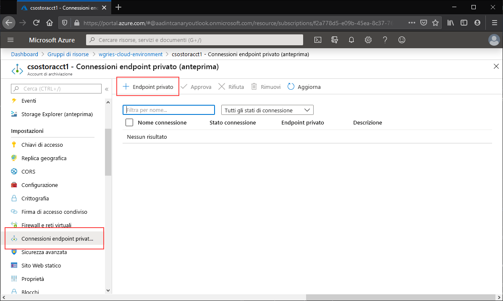
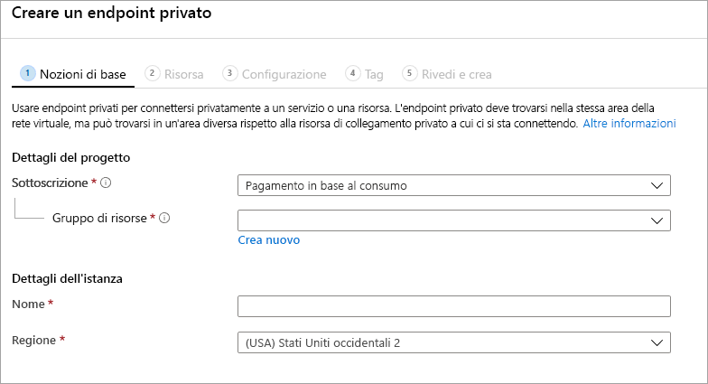
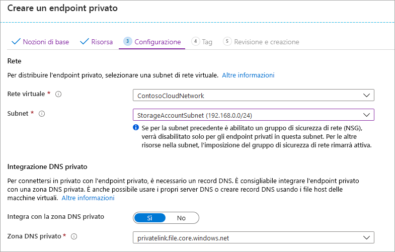
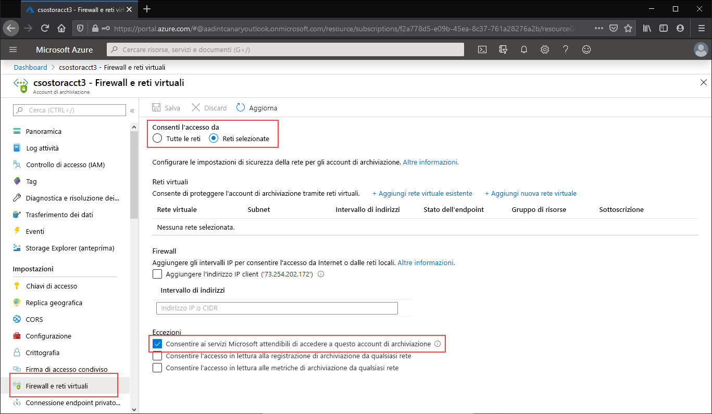
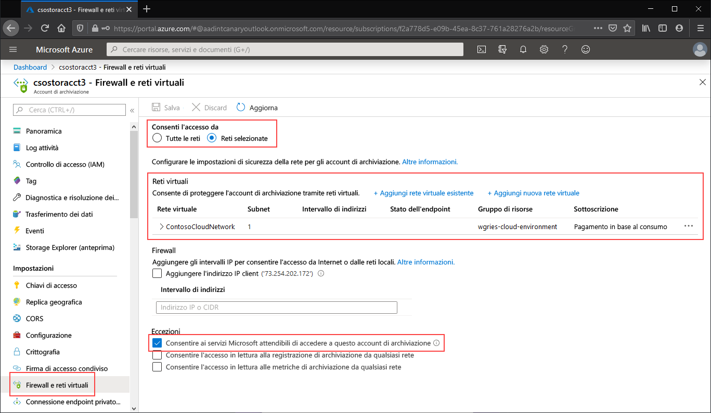

# <a name="configuring-azure-files-network-endpoints"></a>Configurazione degli endpoint di rete di File di Azure
File di Azure prevede due tipi principali di endpoint per l'accesso alle condivisioni file di Azure: 
- Endpoint pubblici, che hanno un indirizzo IP pubblico e sono accessibili da qualsiasi parte del mondo.
- Endpoint privati, presenti all'interno di una rete virtuale, che hanno un indirizzo IP privato all'interno dello spazio di indirizzi della rete virtuale.

Gli endpoint pubblici e privati sono disponibili nell'account di archiviazione di Azure. Un account di archiviazione è un costrutto di gestione che rappresenta un pool di archiviazione condiviso in cui è possibile distribuire più condivisioni file oltre ad altre risorse di archiviazione, ad esempio contenitori BLOB o code.

Questo articolo è incentrato su come configurare gli endpoint di un account di archiviazione per l'accesso diretto alle condivisioni file di Azure. La maggior parte dei dettagli forniti in questo documento si applica anche al modo in cui Sincronizzazione file di Azure interagisce con gli endpoint pubblici e privati per l'account di archiviazione. Tuttavia, per altre informazioni sulle considerazioni di rete per una distribuzione di Sincronizzazione file di Azure, vedere [Configurazione del proxy di Sincronizzazione file di Azure e impostazioni del firewall](storage-sync-files-firewall-and-proxy.md).

Prima di seguire questa guida pratica, è consigliabile leggere [Considerazioni sulla rete per File di Azure](storage-files-networking-overview.md).

## <a name="prerequisites"></a>Prerequisiti
- In questo articolo si presuppone che sia già stata creata una sottoscrizione di Azure. Se non si ha già una sottoscrizione, creare un [account gratuito](https://azure.microsoft.com/free/?WT.mc_id=A261C142F) prima di iniziare.
- In questo articolo si presuppone che sia già stata creata una condivisione file di Azure in un account di archiviazione a cui connettersi dall'ambiente locale. Per informazioni su come creare una condivisione file di Azure, vedere [Creare una condivisione file di Azure](storage-how-to-create-file-share.md).
- Se si intende usare Azure PowerShell, [installare l'ultima versione](https://docs.microsoft.com/powershell/azure/install-az-ps).
- Se si intende usare l'interfaccia della riga di comando di Azure, [installare l'ultima versione](https://docs.microsoft.com/cli/azure/install-azure-cli?view=azure-cli-latest).

## <a name="create-a-private-endpoint"></a>Creare un endpoint privato
La creazione di un endpoint privato per l'account di archiviazione comporterà la distribuzione delle risorse di Azure seguenti:

- **Endpoint privato**: una risorsa di Azure che rappresenta l'endpoint privato dell'account di archiviazione. È possibile considerarlo come una risorsa che connette un account di archiviazione e un'interfaccia di rete.
- **Interfaccia di rete**: l'interfaccia di rete che gestisce un indirizzo IP privato all'interno della rete virtuale/subnet specificata. Si tratta esattamente della stessa risorsa che viene distribuita quando si distribuisce una macchina virtuale, ma, invece di essere assegnata a una VM, appartiene all'endpoint privato.
- **Zona DNS privato**: se non è stato ancora distribuito un endpoint privato per questa rete virtuale, verrà distribuita una nuova zona DNS privato. In questa zona DNS verrà inoltre creato un record A DNS. Se in questa rete virtuale è già stato distribuito un endpoint privato, nella zona DNS esistente verrà aggiunto un nuovo record A per l'account di archiviazione. La distribuzione di una zona DNS è facoltativa, ma è consigliata e diventa obbligatoria se le condivisioni file di Azure vengono montate con un'entità servizio di AD oppure se si usa l'API FileREST.

> [!Note]  
> Questo articolo usa il suffisso DNS dell'account di archiviazione per le aree pubbliche di Azure, `core.windows.net`. Questo commento si applica anche ai cloud sovrani di Azure, ad esempio il cloud di Azure per il governo degli Stati Uniti e il cloud di Azure Cina. È sufficiente sostituire i suffissi appropriati per l'ambiente in uso. 

# <a name="portal"></a>[Portale](#tab/azure-portal)
Passare all'account di archiviazione per cui creare un endpoint privato. Nel sommario dell'account di archiviazione selezionare **Connessioni endpoint privato** e quindi **+ Endpoint privato** per creare un nuovo endpoint privato. 



La procedura guidata risultante include più pagine da completare.

Nel pannello **Informazioni di base** selezionare il gruppo di risorse, il nome e l'area da usare per l'endpoint privato, che non devono necessariamente corrispondere a quelli dell'account di archiviazione, anche se l'endpoint privato deve essere creato nella stessa area della rete virtuale in cui inserirlo.



Nel pannello **Risorsa** selezionare il pulsante di opzione **Connettersi a una risorsa di Azure nella directory**. In **Tipo di risorsa** selezionare **Microsoft.Storage/storageAccounts**. Il campo **Risorsa** corrisponde all'account di archiviazione con la condivisione file di Azure a cui connettersi. La sottorisorsa di destinazione è **file**, perché la procedura riguarda File di Azure.

Il pannello **Configurazione** consente di selezionare la rete virtuale e la subnet specifiche a cui aggiungere l'endpoint privato. Selezionare la rete virtuale creata in precedenza. È necessario selezionare una subnet distinta da quella aggiunta all'endpoint di servizio in precedenza. Il pannello Configurazione contiene anche le informazioni per la creazione o l'aggiornamento della zona DNS privato. È consigliabile usare la zona `privatelink.file.core.windows.net` predefinita.



Fare clic su **Rivedi e crea** per creare l'endpoint privato. 

Se è disponibile una macchina virtuale all'interno della rete virtuale o è stato configurato l'inoltro DNS come descritto [qui](storage-files-networking-dns.md), è possibile verificare se l'endpoint privato è stato configurato correttamente eseguendo i comandi seguenti in PowerShell, dalla riga di comando o nel terminale (per Windows, Linux o macOS). È necessario sostituire `<storage-account-name>` con il nome dell'account di archiviazione appropriato:

```
nslookup <storage-account-name>.file.core.windows.net
```

Se tutte le impostazioni sono corrette, verrà visualizzato l'output seguente, dove `192.168.0.5` è l'indirizzo IP privato dell'endpoint privato nella rete virtuale (output mostrato per Windows):

```Output
Server:  UnKnown
Address:  10.2.4.4

Non-authoritative answer:
Name:    storageaccount.privatelink.file.core.windows.net
Address:  192.168.0.5
Aliases:  storageaccount.file.core.windows.net
```

# <a name="powershell"></a>[PowerShell](#tab/azure-powershell)
Per creare un endpoint privato per l'account di archiviazione, è prima di tutto necessario ottenere un riferimento all'account di archiviazione e alla subnet della rete virtuale in cui aggiungerlo. Sostituire `<storage-account-resource-group-name>`, `<storage-account-name>`, `<vnet-resource-group-name>`, `<vnet-name>` e `<vnet-subnet-name>` di seguito:

```PowerShell
$storageAccountResourceGroupName = "<storage-account-resource-group-name>"
$storageAccountName = "<storage-account-name>"
$virtualNetworkResourceGroupName = "<vnet-resource-group-name>"
$virtualNetworkName = "<vnet-name>"
$subnetName = "<vnet-subnet-name>"

# Get storage account reference, and throw error if it doesn't exist
$storageAccount = Get-AzStorageAccount `
        -ResourceGroupName $storageAccountResourceGroupName `
        -Name $storageAccountName `
        -ErrorAction SilentlyContinue

if ($null -eq $storageAccount) {
    $errorMessage = "Storage account $storageAccountName not found "
    $errorMessage += "in resource group $storageAccountResourceGroupName."
    Write-Error -Message $errorMessage -ErrorAction Stop
}

# Get virtual network reference, and throw error if it doesn't exist
$virtualNetwork = Get-AzVirtualNetwork `
        -ResourceGroupName $virtualNetworkResourceGroupName `
        -Name $virtualNetworkName `
        -ErrorAction SilentlyContinue

if ($null -eq $virtualNetwork) {
    $errorMessage = "Virtual network $virtualNetworkName not found "
    $errorMessage += "in resource group $virtualNetworkResourceGroupName."
    Write-Error -Message $errorMessage -ErrorAction Stop
}

# Get reference to virtual network subnet, and throw error if it doesn't exist
$subnet = $virtualNetwork | `
    Select-Object -ExpandProperty Subnets | `
    Where-Object { $_.Name -eq $subnetName }

if ($null -eq $subnet) {
    Write-Error `
            -Message "Subnet $subnetName not found in virtual network $virtualNetworkName." `
            -ErrorAction Stop
}
```

Per creare un endpoint privato, è necessario creare una connessione del servizio Collegamento privato all'account di archiviazione. La connessione del servizio Collegamento privato è un input per la creazione dell'endpoint privato. 

```PowerShell
# Disable private endpoint network policies
$subnet.PrivateEndpointNetworkPolicies = "Disabled"
$virtualNetwork | Set-AzVirtualNetwork | Out-Null

# Create a private link service connection to the storage account.
$privateEndpointConnection = New-AzPrivateLinkServiceConnection `
        -Name "$storageAccountName-Connection" `
        -PrivateLinkServiceId $storageAccount.Id `
        -GroupId "file"

# Create a new private endpoint.
$privateEndpoint = New-AzPrivateEndpoint `
        -ResourceGroupName $storageAccountResourceGroupName `
        -Name "$storageAccountName-PrivateEndpoint" `
        -Location $virtualNetwork.Location `
        -Subnet $subnet `
        -PrivateLinkServiceConnection $privateEndpointConnection `
        -ErrorAction Stop
```

La creazione di una zona DNS privato di Azure consente di risolvere il nome originale dell'account di archiviazione, ad esempio `storageaccount.file.core.windows.net`, nell'indirizzo IP privato all'interno della rete virtuale. Sebbene sia facoltativa dal punto di vista della creazione di un endpoint privato, si tratta di un'operazione esplicitamente necessaria per montare la condivisione file di Azure con un'entità utente di AD o per accedere tramite l'API REST.  

```PowerShell
# Get the desired storage account suffix (core.windows.net for public cloud).
# This is done like this so this script will seamlessly work for non-public Azure.
$storageAccountSuffix = Get-AzContext | `
    Select-Object -ExpandProperty Environment | `
    Select-Object -ExpandProperty StorageEndpointSuffix

# For public cloud, this will generate the following DNS suffix:
# privatelink.file.core.windows.net.
$dnsZoneName = "privatelink.file.$storageAccountSuffix"

# Find a DNS zone matching desired name attached to this virtual network.
$dnsZone = Get-AzPrivateDnsZone | `
    Where-Object { $_.Name -eq $dnsZoneName } | `
    Where-Object {
        $privateDnsLink = Get-AzPrivateDnsVirtualNetworkLink `
                -ResourceGroupName $_.ResourceGroupName `
                -ZoneName $_.Name `
                -ErrorAction SilentlyContinue
        
        $privateDnsLink.VirtualNetworkId -eq $virtualNetwork.Id
    }

if ($null -eq $dnsZone) {
    # No matching DNS zone attached to virtual network, so create new one.
    $dnsZone = New-AzPrivateDnsZone `
            -ResourceGroupName $virtualNetworkResourceGroupName `
            -Name $dnsZoneName `
            -ErrorAction Stop

    $privateDnsLink = New-AzPrivateDnsVirtualNetworkLink `
            -ResourceGroupName $virtualNetworkResourceGroupName `
            -ZoneName $dnsZoneName `
            -Name "$virtualNetworkName-DnsLink" `
            -VirtualNetworkId $virtualNetwork.Id `
            -ErrorAction Stop
}
```

Una volta ottenuto un riferimento alla zona DNS privato, è necessario creare un record A per l'account di archiviazione.

```PowerShell
$privateEndpointIP = $privateEndpoint | `
    Select-Object -ExpandProperty NetworkInterfaces | `
    Select-Object @{ 
        Name = "NetworkInterfaces"; 
        Expression = { Get-AzNetworkInterface -ResourceId $_.Id } 
    } | `
    Select-Object -ExpandProperty NetworkInterfaces | `
    Select-Object -ExpandProperty IpConfigurations | `
    Select-Object -ExpandProperty PrivateIpAddress

$privateDnsRecordConfig = New-AzPrivateDnsRecordConfig `
        -IPv4Address $privateEndpointIP

New-AzPrivateDnsRecordSet `
        -ResourceGroupName $virtualNetworkResourceGroupName `
        -Name $storageAccountName `
        -RecordType A `
        -ZoneName $dnsZoneName `
        -Ttl 600 `
        -PrivateDnsRecords $privateDnsRecordConfig `
        -ErrorAction Stop | `
    Out-Null
```

Se è disponibile una macchina virtuale all'interno della rete virtuale o è stato configurato l'inoltro DNS come descritto [qui](storage-files-networking-dns.md), è possibile verificare se l'endpoint privato è stato configurato correttamente eseguendo i comandi seguenti:

```PowerShell
$storageAccountHostName = [System.Uri]::new($storageAccount.PrimaryEndpoints.File) | `
    Select-Object -ExpandProperty Host

Resolve-DnsName -Name $storageAccountHostName
```

Se tutte le impostazioni sono corrette, verrà visualizzato l'output seguente, dove `192.168.0.5` è l'indirizzo IP privato dell'endpoint privato nella rete virtuale:

```Output
Name                             Type   TTL   Section    NameHost
----                             ----   ---   -------    --------
storageaccount.file.core.windows CNAME  60    Answer     storageaccount.privatelink.file.core.windows.net
.net

Name       : storageaccount.privatelink.file.core.windows.net
QueryType  : A
TTL        : 600
Section    : Answer
IP4Address : 192.168.0.5
```

# <a name="azure-cli"></a>[Interfaccia della riga di comando di Azure](#tab/azure-cli)
Per creare un endpoint privato per l'account di archiviazione, è prima di tutto necessario ottenere un riferimento all'account di archiviazione e alla subnet della rete virtuale in cui aggiungerlo. Sostituire `<storage-account-resource-group-name>`, `<storage-account-name>`, `<vnet-resource-group-name>`, `<vnet-name>` e `<vnet-subnet-name>` di seguito:

```bash
storageAccountResourceGroupName="<storage-account-resource-group-name>"
storageAccountName="<storage-account-name>"
virtualNetworkResourceGroupName="<vnet-resource-group-name>"
virtualNetworkName="<vnet-name>"
subnetName="<vnet-subnet-name>"

# Get storage account ID 
storageAccount=$(az storage account show \
        --resource-group $storageAccountResourceGroupName \
        --name $storageAccountName \
        --query "id" | \
    tr -d '"')

# Get virtual network ID
virtualNetwork=$(az network vnet show \
        --resource-group $virtualNetworkResourceGroupName \
        --name $virtualNetworkName \
        --query "id" | \
    tr -d '"')

# Get subnet ID
subnet=$(az network vnet subnet show \
        --resource-group $virtualNetworkResourceGroupName \
        --vnet-name $virtualNetworkName \
        --name $subnetName \
        --query "id" | \
    tr -d '"')
```

Per creare un endpoint privato, è prima di tutto necessario assicurarsi che i criteri di rete dell'endpoint privato della subnet siano disabilitati. Quindi, è possibile creare un endpoint privato con il comando `az network private-endpoint create`

```bash
# Disable private endpoint network policies
az network vnet subnet update \
        --ids $subnet \
        --disable-private-endpoint-network-policies \
        --output none

# Get virtual network location
region=$(az network vnet show \
        --ids $virtualNetwork \
        --query "location" | \
    tr -d '"')

# Create a private endpoint
privateEndpoint=$(az network private-endpoint create \
        --resource-group $virtualNetworkResourceGroupName \
        --name "$storageAccountName-PrivateEndpoint" \
        --location $region \
        --subnet $subnet \
        --private-connection-resource-id $storageAccount \
        --group-ids "file" \
        --connection-name "$storageAccountName-Connection" \
        --query "id" | \
    tr -d '"')
```

La creazione di una zona DNS privato di Azure consente di risolvere il nome originale dell'account di archiviazione, ad esempio `storageaccount.file.core.windows.net`, nell'indirizzo IP privato all'interno della rete virtuale. Sebbene sia facoltativa dal punto di vista della creazione di un endpoint privato, si tratta di un'operazione esplicitamente necessaria per montare la condivisione file di Azure con un'entità utente di AD o per accedere tramite l'API REST.  

```bash
# Get the desired storage account suffix (core.windows.net for public cloud).
# This is done like this so this script will seamlessly work for non-public Azure.
storageAccountSuffix=$(az cloud show \
        --query "suffixes.storageEndpoint" | \
    tr -d '"')

# For public cloud, this will generate the following DNS suffix:
# privatelink.file.core.windows.net.
dnsZoneName="privatelink.file.$storageAccountSuffix"

# Find a DNS zone matching desired name attached to this virtual network.
possibleDnsZones=$(az network private-dns zone list \
        --query "[?name == '$dnsZoneName'].id" \
        --output tsv)

for possibleDnsZone in $possibleDnsZones
do
    possibleResourceGroupName=$(az resource show \
            --ids $possibleDnsZone \
            --query "resourceGroup" | \
        tr -d '"')
    
    link=$(az network private-dns link vnet list \
            --resource-group $possibleResourceGroupName \
            --zone-name $dnsZoneName \
            --query "[?virtualNetwork.id == '$virtualNetwork'].id" \
            --output tsv)
    
    if [ -z $link ]
    then
        1 > /dev/null
    else 
        dnsZoneResourceGroup=$possibleResourceGroupName
        dnsZone=$possibleDnsZone
        break
    fi  
done

if [ -z $dnsZone ]
then
    # No matching DNS zone attached to virtual network, so create a new one
    dnsZone=$(az network private-dns zone create \
            --resource-group $virtualNetworkResourceGroupName \
            --name $dnsZoneName \
            --query "id" | \
        tr -d '"')
    
    az network private-dns link vnet create \
            --resource-group $resourceGroupName \
            --zone-name $zoneName \
            --name "$virtualNetworkName-DnsLink" \
            --virtual-network $virtualNetwork \
            --registration-enabled false \
            --output none
fi
```

Una volta ottenuto un riferimento alla zona DNS privato, è necessario creare un record A per l'account di archiviazione.

```bash
privateEndpointNIC=$(az network private-endpoint show \
        --ids $privateEndpoint \
        --query "networkInterfaces[0].id" | \
    tr -d '"')

privateEndpointIP=$(az network nic show \
        --ids $privateEndpointNIC \
        --query "ipConfigurations[0].privateIpAddress" | \
    tr -d '"')

az network private-dns record-set a create \
        --resource-group $dnsZoneResourceGroup \
        --zone-name $dnsZoneName \
        --name $storageAccountName \
        --output none

az network private-dns record-set a add-record \
        --resource-group $dnsZoneResourceGroup \
        --zone-name $dnsZoneName \
        --record-set-name $storageAccountName \
        --ipv4-address $privateEndpointIP \
        --output none
```

Se è disponibile una macchina virtuale all'interno della rete virtuale o è stato configurato l'inoltro DNS come descritto [qui](storage-files-networking-dns.md), è possibile verificare se l'endpoint privato è stato configurato correttamente eseguendo i comandi seguenti:

```bash
httpEndpoint=$(az storage account show \
        --resource-group $storageAccountResourceGroupName \
        --name $storageAccountName \
        --query "primaryEndpoints.File" | \
    tr -d '"')

hostName=$(echo $httpEndpoint | cut -c7-$(expr length $httpEndpoint) | tr -d "/")
nslookup $hostName
```

Se tutte le impostazioni sono corrette, verrà visualizzato l'output seguente, dove `192.168.0.5` è l'indirizzo IP privato dell'endpoint privato nella rete virtuale:

```Output
Server:         127.0.0.53
Address:        127.0.0.53#53

Non-authoritative answer:
storageaccount.file.core.windows.net      canonical name = storageaccount.privatelink.file.core.windows.net.
Name:   storageaccount.privatelink.file.core.windows.net
Address: 192.168.0.5
```

---

## <a name="restrict-access-to-the-public-endpoint"></a>Limitare l'accesso all'endpoint pubblico
È possibile limitare l'accesso all'endpoint pubblico usando le impostazioni del firewall dell'account di archiviazione. In generale, la maggior parte dei criteri del firewall per un account di archiviazione limiterà l'accesso di rete a una o più reti virtuali. Per limitare l'accesso a un account di archiviazione consentendolo solo a una rete virtuale, sono disponibili due approcci:

- [Creare uno o più endpoint privati per l'account di archiviazione](#create-a-private-endpoint) e limitare tutto l'accesso all'endpoint pubblico. In questo modo si garantisce che solo il traffico originato dalle reti virtuali desiderate possa accedere alle condivisioni file di Azure nell'account di archiviazione.
- Limitare l'endpoint pubblico a una o più reti virtuali. Questa operazione può essere eseguita usando una funzionalità della rete virtuale denominata *endpoint di servizio*. Quando si limita il traffico verso un account di archiviazione tramite un endpoint di servizio, si può comunque accedere all'account di archiviazione tramite l'indirizzo IP pubblico.

### <a name="restrict-all-access-to-the-public-endpoint"></a>Limitare tutto l'accesso all'endpoint pubblico
Se si limita tutto l'accesso all'endpoint pubblico, l'account di archiviazione rimane comunque accessibile tramite i relativi endpoint privati. Altrimenti le richieste valide inviate all'endpoint pubblico dell'account di archiviazione verranno rifiutate. 

# <a name="portal"></a>[Portale](#tab/azure-portal)
Passare all'account di archiviazione per cui limitare tutto l'accesso all'endpoint pubblico. Nel sommario dell'account di archiviazione selezionare **Firewall e reti virtuali**.

Nella parte superiore della pagina selezionare il pulsante di opzione **Reti selezionate**. Verranno rese visibili diverse impostazioni nascoste per il controllo della restrizione dell'endpoint pubblico. Selezionare **Consenti ai servizi Microsoft attendibili di accedere a questo account di archiviazione** per consentire ai servizi Microsoft attendibili, ad esempio Sincronizzazione file di Azure, di accedere all'account di archiviazione.



# <a name="powershell"></a>[PowerShell](#tab/azure-powershell)
Il comando di PowerShell seguente negherà tutto il traffico diretto all'endpoint pubblico dell'account di archiviazione. Si noti che il parametro `-Bypass` di questo comando è impostato su `AzureServices`. Questa impostazione consentirà ai servizi Microsoft attendibili, come Sincronizzazione file di Azure, di accedere all'account di archiviazione tramite l'endpoint pubblico.

```PowerShell
# This assumes $storageAccount is still defined from the beginning of this of this guide.
$storageAccount | Update-AzStorageAccountNetworkRuleSet `
        -DefaultAction Deny `
        -Bypass AzureServices `
        -WarningAction SilentlyContinue `
        -ErrorAction Stop | `
    Out-Null
```

# <a name="azure-cli"></a>[Interfaccia della riga di comando di Azure](#tab/azure-cli)
Il comando dell'interfaccia della riga di comando seguente negherà tutto il traffico diretto all'endpoint pubblico dell'account di archiviazione. Si noti che il parametro `-bypass` di questo comando è impostato su `AzureServices`. Questa impostazione consentirà ai servizi Microsoft attendibili, come Sincronizzazione file di Azure, di accedere all'account di archiviazione tramite l'endpoint pubblico.

```bash
# This assumes $storageAccountResourceGroupName and $storageAccountName 
# are still defined from the beginning of this guide.
az storage account update \
    --resource-group $storageAccountResourceGroupName \
    --name $storageAccountName \
    --bypass "AzureServices" \
    --default-action "Deny" \
    --output none
```
---

### <a name="restrict-access-to-the-public-endpoint-to-specific-virtual-networks"></a>Limitare l'accesso all'endpoint pubblico consentendolo solo a reti virtuali specifiche
Quando si limita l'account di archiviazione consentendolo solo a specifiche reti virtuali, si autorizzano le richieste inviate all'endpoint pubblico dall'interno di tali reti virtuali. Questa operazione può essere eseguita usando una funzionalità della rete virtuale denominata *endpoint di servizio*. Si può usare con o senza endpoint privati.

# <a name="portal"></a>[Portale](#tab/azure-portal)
Passare all'account di archiviazione per cui limitare tutto l'accesso all'endpoint pubblico consentendolo solo a specifiche reti virtuali. Nel sommario dell'account di archiviazione selezionare **Firewall e reti virtuali**. 

Nella parte superiore della pagina selezionare il pulsante di opzione **Reti selezionate**. Verranno rese visibili diverse impostazioni nascoste per il controllo della restrizione dell'endpoint pubblico. Fare clic su **+ Aggiungi rete virtuale esistente** per selezionare la rete virtuale specifica a cui deve essere consentito l'accesso all'account di archiviazione tramite l'endpoint pubblico. Sarà necessario selezionare una rete virtuale e una subnet associata. 

Selezionare **Consenti ai servizi Microsoft attendibili di accedere a questo account di archiviazione** per consentire ai servizi Microsoft attendibili, ad esempio Sincronizzazione file di Azure, di accedere all'account di archiviazione.



# <a name="powershell"></a>[PowerShell](#tab/azure-powershell)
Per limitare l'accesso all'endpoint pubblico dell'account di archiviazione consentendolo solo a specifiche reti virtuali tramite endpoint di servizio, è necessario prima di tutto raccogliere informazioni sull'account di archiviazione e sulla rete virtuale. Compilare i campi `<storage-account-resource-group>`, `<storage-account-name>`, `<vnet-resource-group-name>`, `<vnet-name>` e `<subnet-name>` per raccogliere tali informazioni.

```PowerShell
$storageAccountResourceGroupName = "<storage-account-resource-group>"
$storageAccountName = "<storage-account-name>"
$restrictToVirtualNetworkResourceGroupName = "<vnet-resource-group-name>"
$restrictToVirtualNetworkName = "<vnet-name>"
$subnetName = "<subnet-name>"

$storageAccount = Get-AzStorageAccount `
        -ResourceGroupName $storageAccountResourceGroupName `
        -Name $storageAccountName `
        -ErrorAction Stop

$virtualNetwork = Get-AzVirtualNetwork `
        -ResourceGroupName $restrictToVirtualNetworkResourceGroupName `
        -Name $restrictToVirtualNetworkName `
        -ErrorAction Stop

$subnet = $virtualNetwork | `
    Select-Object -ExpandProperty Subnets | `
    Where-Object { $_.Name -eq $subnetName }

if ($null -eq $subnet) {
    Write-Error `
            -Message "Subnet $subnetName not found in virtual network $restrictToVirtualNetworkName." `
            -ErrorAction Stop
}
```

Affinché l'infrastruttura di rete di Azure consenta al traffico proveniente dalla rete virtuale di accedere all'endpoint pubblico dell'account di archiviazione, è necessario che l'endpoint di servizio `Microsoft.Storage` della subnet della rete virtuale sia esposto. I comandi di PowerShell seguenti aggiungono l'endpoint di servizio `Microsoft.Storage` alla subnet, se non è già presente.

```PowerShell
$serviceEndpoints = $subnet | `
    Select-Object -ExpandProperty ServiceEndpoints | `
    Select-Object -ExpandProperty Service

if ($serviceEndpoints -notcontains "Microsoft.Storage") {
    if ($null -eq $serviceEndpoints) {
        $serviceEndpoints = @("Microsoft.Storage")
    } elseif ($serviceEndpoints -is [string]) {
        $serviceEndpoints = @($serviceEndpoints, "Microsoft.Storage")
    } else {
        $serviceEndpoints += "Microsoft.Storage"
    }

    $virtualNetwork = $virtualNetwork | Set-AzVirtualNetworkSubnetConfig `
            -Name $subnetName `
            -AddressPrefix $subnet.AddressPrefix `
            -ServiceEndpoint $serviceEndpoints `
            -WarningAction SilentlyContinue `
            -ErrorAction Stop | `
        Set-AzVirtualNetwork `
            -ErrorAction Stop
}
```

Il passaggio finale per limitare il traffico diretto all'account di archiviazione consiste nel creare una regola di rete e aggiungerla al set di regole di rete dell'account di archiviazione.

```PowerShell
$networkRule = $storageAccount | Add-AzStorageAccountNetworkRule `
    -VirtualNetworkResourceId $subnet.Id `
    -ErrorAction Stop

$storageAccount | Update-AzStorageAccountNetworkRuleSet `
        -DefaultAction Deny `
        -Bypass AzureServices `
        -VirtualNetworkRule $networkRule `
        -WarningAction SilentlyContinue `
        -ErrorAction Stop | `
    Out-Null
```

# <a name="azure-cli"></a>[Interfaccia della riga di comando di Azure](#tab/azure-cli)
Per limitare l'accesso all'endpoint pubblico dell'account di archiviazione consentendolo solo a specifiche reti virtuali tramite endpoint di servizio, è necessario prima di tutto raccogliere informazioni sull'account di archiviazione e sulla rete virtuale. Compilare i campi `<storage-account-resource-group>`, `<storage-account-name>`, `<vnet-resource-group-name>`, `<vnet-name>` e `<subnet-name>` per raccogliere tali informazioni.

```bash
storageAccountResourceGroupName="<storage-account-resource-group>"
storageAccountName="<storage-account-name>"
restrictToVirtualNetworkResourceGroupName="<vnet-resource-group-name>"
restrictToVirtualNetworkName="<vnet-name>"
subnetName="<subnet-name>"

storageAccount=$(az storage account show \
        --resource-group $storageAccountResourceGroupName \
        --name $storageAccountName \
        --query "id" | \
    tr -d '"')

virtualNetwork=$(az network vnet show \
        --resource-group $restrictToVirtualNetworkResourceGroupName \
        --name $restrictToVirtualNetworkName \
        --query "id" | \
    tr -d '"')

subnet=$(az network vnet subnet show \
        --resource-group $restrictToVirtualNetworkResourceGroupName \
        --vnet-name $restrictToVirtualNetworkName \
        --name $subnetName \
        --query "id" | \
    tr -d '"')
```

Affinché l'infrastruttura di rete di Azure consenta al traffico proveniente dalla rete virtuale di accedere all'endpoint pubblico dell'account di archiviazione, è necessario che l'endpoint di servizio `Microsoft.Storage` della subnet della rete virtuale sia esposto. I comandi seguenti dell'interfaccia della riga di comando aggiungono l'endpoint di servizio `Microsoft.Storage` se non è già presente.

```bash
serviceEndpoints=$(az network vnet subnet show \
        --resource-group $restrictToVirtualNetworkResourceGroupName \
        --vnet-name $restrictToVirtualNetworkName \
        --name $subnetName \
        --query "serviceEndpoints[].service" \
        --output tsv)

foundStorageServiceEndpoint=false
for serviceEndpoint in $serviceEndpoints
do
    if [ $serviceEndpoint = "Microsoft.Storage" ]
    then
        foundStorageServiceEndpoint=true
    fi
done

if [ $foundStorageServiceEndpoint = false ] 
then
    serviceEndpointList=""

    for serviceEndpoint in $serviceEndpoints
    do
        serviceEndpointList+=$serviceEndpoint
        serviceEndpointList+=" "
    done
    
    serviceEndpointList+="Microsoft.Storage"

    az network vnet subnet update \
            --ids $subnet \
            --service-endpoints $serviceEndpointList \
            --output none
fi
```

Il passaggio finale per limitare il traffico diretto all'account di archiviazione consiste nel creare una regola di rete e aggiungerla al set di regole di rete dell'account di archiviazione.

```bash
az storage account network-rule add \
        --resource-group $storageAccountResourceGroupName \
        --account-name $storageAccountName \
        --subnet $subnet \
        --output none

az storage account update \
        --resource-group $storageAccountResourceGroupName \
        --name $storageAccountName \
        --bypass "AzureServices" \
        --default-action "Deny" \
        --output none
```

---

## <a name="see-also"></a>Vedere anche
- [Considerazioni sulla rete per File di Azure](storage-files-networking-overview.md)
- [Configurazione dell'inoltro DNS per File di Azure](storage-files-networking-dns.md)
- [Configurazione della VPN da sito a sito per File di Azure](storage-files-configure-s2s-vpn.md)