# Guida introduttiva: Creare e gestire una condivisione file di Azure con macchine virtuali Windows

L'articolo illustra i passaggi di base per la creazione e l'uso di una condivisione file di Azure. In questa guida introduttiva, particolare attenzione è dedicata a come configurare rapidamente una condivisione file di Azure in modo da sperimentare il funzionamento del servizio. Se sono necessarie istruzioni più dettagliate per la creazione e l'uso di condivisioni file di Azure nel proprio ambiente, vedere [Usare una condivisione file di Azure con Windows](storage-how-to-use-files-windows.md).

Se non si ha una sottoscrizione di Azure, creare un [account gratuito](https://azure.microsoft.com/free/?WT.mc_id=A261C142F) prima di iniziare.

## Accedere ad Azure

Accedere al [portale di Azure](https://portal.azure.com).

## Preparare l'ambiente

In questa guida introduttiva si configurano gli elementi seguenti:

- Un account di archiviazione di Azure e una condivisione file di Azure
- Una VM Windows Server 2016 Datacenter

### Creare un account di archiviazione

Prima di poter utilizzare una condivisione file di Azure, è necessario creare un account di archiviazione di Azure. Un account di archiviazione per utilizzo generico v2 consente l'accesso a tutti i servizi di Archiviazione di Azure: BLOB, file, code e tabelle. La guida introduttiva crea un account di archiviazione per utilizzo generico v2, ma i passaggi per creare qualsiasi tipo di account di archiviazione sono simili. Un account di archiviazione può contenere un numero illimitato di condivisioni. In una condivisione può essere archiviato un numero illimitato di file, fino ai limiti di capacità dell'account di archiviazione.

[!INCLUDE [storage-create-account-portal-include](../../../includes/storage-create-account-portal-include.md)]

### Creare una condivisione file di Azure

Quindi, creare una condivisione file.

1. Una volta completata la distribuzione dell'account di archiviazione di Azure, selezionare **Vai alla risorsa**.
1. Nel riquadro dell'account di archiviazione selezionare **File**.

    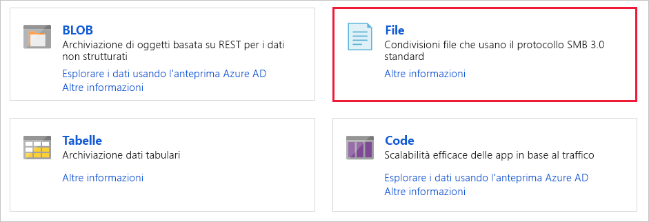

1. Selezionare **Condivisione file**.

    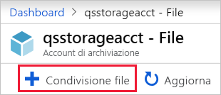

1. Denominare la nuova condivisione file *qsfileshare* > immettere "1" come **Quota** > selezionare **Crea**. Le dimensioni della quota non possono superare i 5 TiB, ma ai fini di questa guida introduttiva è necessario solo 1 GiB.
1. Creare un nuovo file txt chiamato *qsTestFile* nel computer locale.
1. Selezionare la nuova condivisione file, quindi nel percorso della condivisione file, selezionare **Carica**.

    

1. Passare al percorso in cui è stato creato il file .txt > selezionare *qsTestFile.txt* > selezionare **Carica**.

Finora, sono stati creati un account di archiviazione e una condivisione file di Azure contenente un solo file in Azure. Quindi si creerà la macchina virtuale di Azure con Windows Server 2016 Datacenter per rappresentare il server locale in questa guida introduttiva.

### Distribuire una macchina virtuale

1. In seguito, espandere il menu a sinistra del portale e scegliere **Crea una risorsa** nell'angolo superiore sinistro del portale di Azure.
1. Nella casella di ricerca sopra l'elenco delle risorse di **Azure Marketplace**, cercare e selezionare **Windows Server 2016 Datacenter** e quindi scegliere **Crea**.
1. Nella scheda **Informazioni di base** in **Dettagli del progetto** selezionare il gruppo di risorse creato per questa guida introduttiva.

   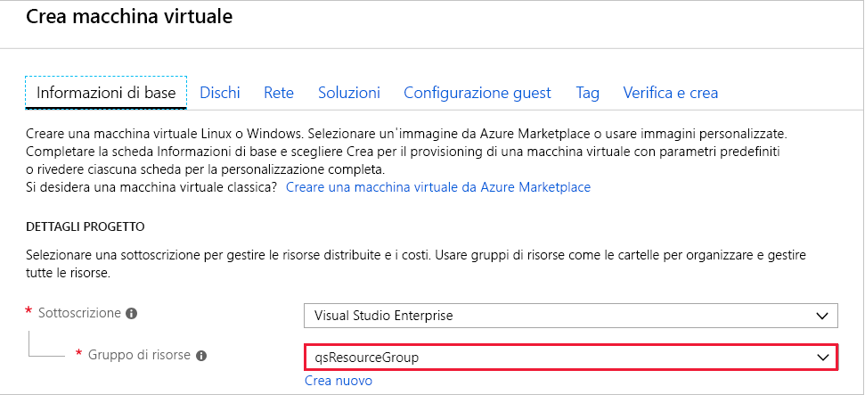

1. In **Dettagli dell'istanza** denominare la VM *qsVM*.
1. Lasciare invariate le impostazioni predefinite per **Area**, **Opzioni di disponibilità**, **Immagine** e **Dimensioni**.
1. In **Account amministratore** aggiungere *VMadmin* come **Nome utente** e immettere una **Password** per la macchina virtuale.
1. Sotto **Regole porta in ingresso**, scegliere **Consentire porte selezionate**, quindi selezionare **RDP (3389)** e **HTTP** dall'elenco a discesa.
1. Selezionare **Rivedi e crea**.
1. Selezionare **Create** (Crea). Il completamento della creazione di una nuova macchina virtuale richiederà alcuni minuti.

1. Una volta completata la distribuzione della macchina virtuale, selezionare **Vai alla risorsa**.

A questo punto, è stata creata una nuova macchina virtuale e collegato un disco dati. Ora è necessario connettersi alla macchina virtuale.

### Connettersi alla macchina virtuale

1. Selezionare **Connetti** nella pagina delle proprietà della macchina virtuale.

   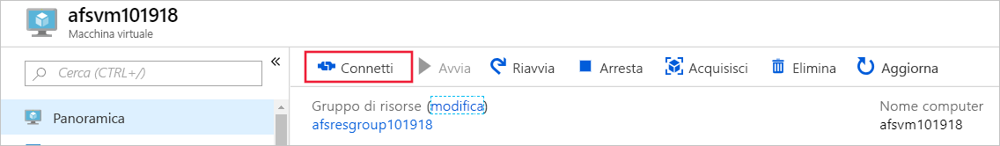

1. Nella pagina **Connettersi alla macchina virtuale** mantenere le opzioni predefinite per la connessione con **Indirizzo IP** sul **numero di porta** *3389* e selezionare **Scarica file RDP**.
1. Aprire il file RDP scaricato e selezionare **Connetti** quando richiesto.
1. Nella finestra **Sicurezza di Windows** selezionare **Altre opzioni** e quindi **Usa un altro account**. Digitare il nome utente come *localhost\nomeutente*, dove &lt;nomeutente&gt; è il nome utente dell'amministratore VM creato per la macchina virtuale. Immettere la password creata per la macchina virtuale e quindi selezionare **OK**.

   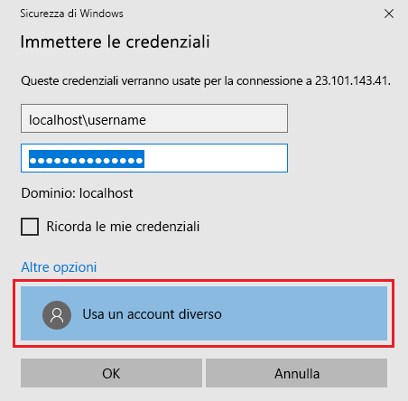

1. Durante il processo di accesso potrebbe essere visualizzato un avviso relativo al certificato. Selezionare **Sì** o **Continua** per procedere con la connessione.

## Eseguire il mapping della condivisione file di Azure a un'unità di Windows

1. Nel portale di Azure passare alla condivisione file *qsfileshare* e selezionare **Connetti**.
1. Copiare il contenuto della seconda casella e incollarlo nel **Blocco note**.

   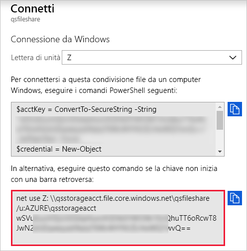

1. Nella macchina virtuale, aprire **Esplora file** e selezionare **Questo PC** nella finestra. Questa selezione modifica i menu disponibili sulla barra multifunzione. Scegliere **Connetti unità di rete** dal menu **Computer**.
1. Selezionare la lettera di unità e immettere il percorso UNC. Se sono stati seguiti i suggerimenti di denominazione in questa guida introduttiva, copiare  *\\qsstorageacct.file.core.windows.net\qsfileshare* dal **Blocco note**.

   Assicurarsi che siano selezionate entrambe le caselle di controllo.

   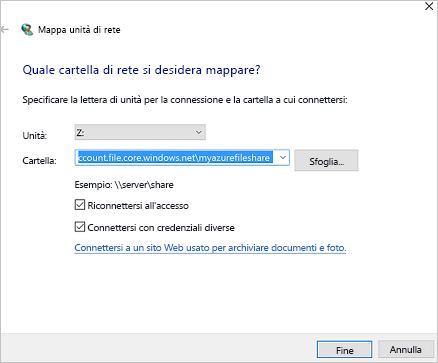

1. Selezionare **Fine**.
1. Nella finestra di dialogo **Sicurezza di Windows**:

   - Dal blocco note, copiare il nome dell'account di archiviazione preceduto da AZURE\ e incollarlo nella finestra di dialogo **Sicurezza di Windows** come nome utente. Se sono stati seguiti i suggerimenti di denominazione in questa guida introduttiva, copiare *AZURE\qsstorageacct*.
   - Dal blocco note, copiare la chiave dell'account di archiviazione e incollarla nella finestra di dialogo **Sicurezza di Windows** come password.

      

## Creare uno snapshot di condivisione

Ora che è stato eseguito il mapping dell'unità, è possibile creare uno snapshot.

1. Nel portale, passare alla condivisione file e selezionare **Creare uno snapshot**.

   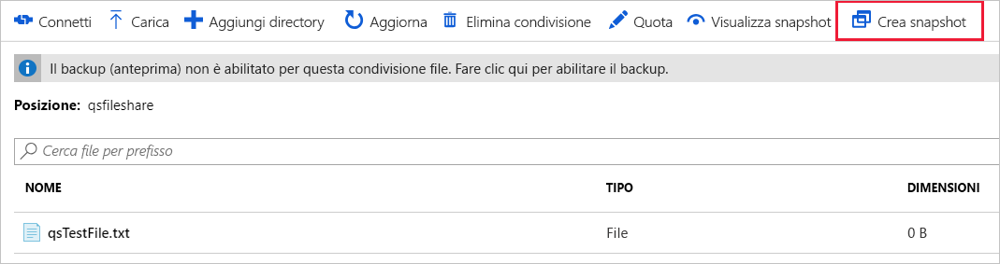

1. Nella macchina virtuale, aprire il file *qstestfile.txt* e digitare "questo file è stato modificato" > salvare e chiudere il file.
1. Creare un altro snapshot.

## Esplorare uno snapshot di condivisione

1. Nella condivisione file, selezionare **Visualizza snapshot**.
1. Nel riquadro **Snapshot di condivisioni file** selezionare il primo snapshot nell'elenco.

   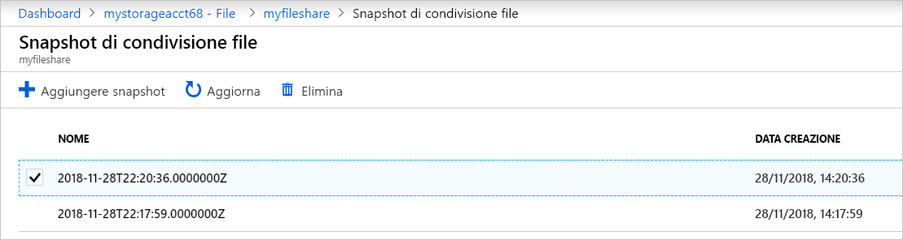

1. Nel riquadro per tale snapshot, selezionare *qsTestFile.txt*.

## Ripristino da uno snapshot

1. Nel pannello dello snapshot della condivisione file fare clic con il pulsante destro del mouse su *qsTestFile* e scegliere il pulsante **Ripristina**.
1. Selezionare **Sovrascrivi file originale**.

   

1. Nella macchina virtuale, aprire il file. È stata ripristinata la versione non modificata.

## Eliminare uno snapshot di condivisione

1. Nella condivisione file, selezionare **Visualizza snapshot**.
1. Nel riquadro **Snapshot di condivisioni file** selezionare l'ultimo snapshot nell'elenco e fare clic su **Elimina**.

   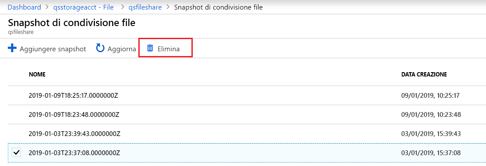

## Usare uno snapshot di condivisione in Windows

Proprio come con gli snapshot VSS in locale, è possibile visualizzare gli snapshot dalla condivisione file di Azure montata usando la scheda Versioni precedenti.

1. In Esplora file, cercare la condivisione montata.

   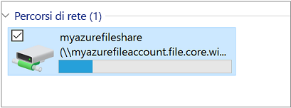

1. Selezionare *qsTestFile.txt* e > fare clic con il pulsante destro del mouse e scegliere **Proprietà** dal menu.

   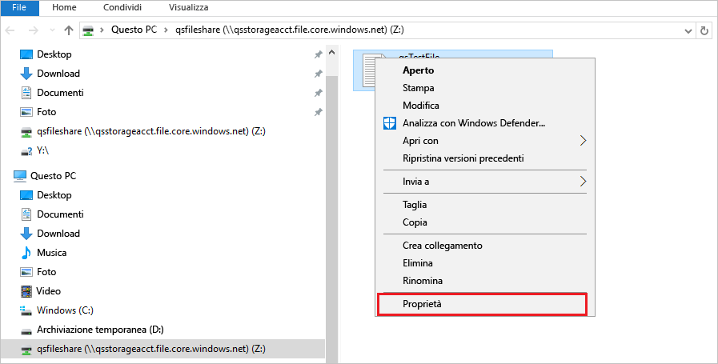

1. Selezionare **Versioni precedenti** per visualizzare l'elenco di snapshot di condivisione per questa directory.

1. Selezionare **Apri** per aprire lo snapshot.

   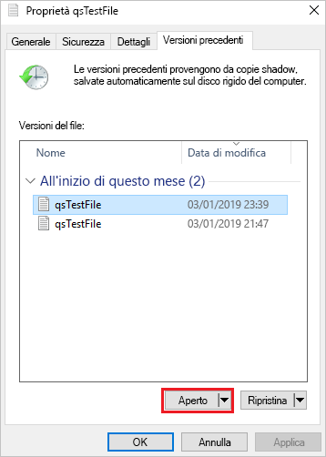

## Eseguire il ripristino da una versione precedente

1. Selezionare **Ripristina**. Questa azione copia il contenuto dell'intera directory in modo ricorsivo nel percorso originale al momento della creazione dello snapshot di condivisione.

   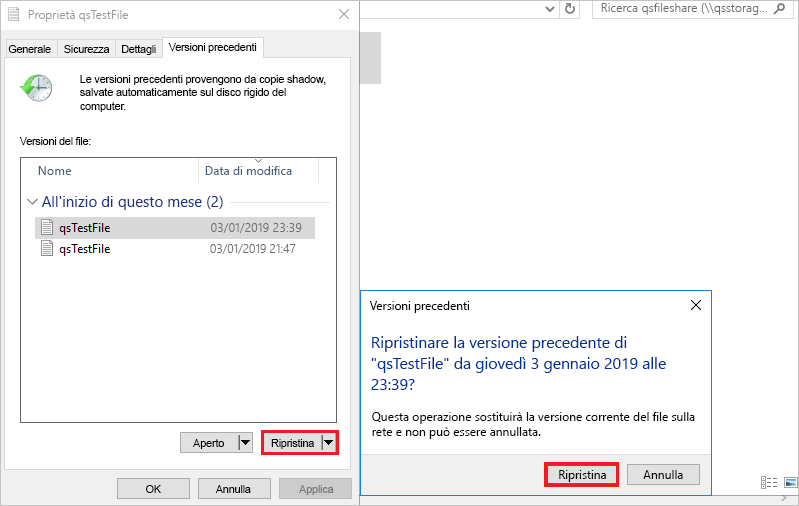

## Pulire le risorse

[!INCLUDE [storage-files-clean-up-portal](../../../includes/storage-files-clean-up-portal.md)]

## Passaggi successivi

> [!div class="nextstepaction"]
> [Usare una condivisione file di Azure con Windows](storage-how-to-use-files-windows.md)
