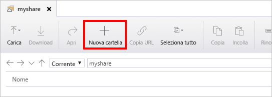

# Gestione di condivisioni file di Azure con Azure Storage Explorer 
[File di Azure](storage-files-introduction.md) è il file system cloud facile da usare di Microsoft. Questa guida contiene tutte le informazioni essenziali sull'uso delle condivisioni file di Azure con [Azure Storage Explorer](https://azure.microsoft.com/features/storage-explorer/). Azure Storage Explorer è uno strumento client di uso diffuso, disponibile per Windows, macOS e Linux, per la gestione delle condivisioni file di Azure e di altre risorse di archiviazione.

La guida rapida richiede l'installazione di Azure Storage Explorer. Se è necessario installarlo, passare a [Azure Storage Explorer](https://azure.microsoft.com/features/storage-explorer/) per scaricarlo.

In questo articolo viene spiegato come:

> [!div class="checklist"]
> * Creare un gruppo di risorse e un account di archiviazione
> * Creare una condivisione file di Azure 
> * Creare una directory
> * Caricare un file
> * Scaricare un file
> * Creare e usare uno snapshot di condivisione

Se non si ha una sottoscrizione di Azure, è possibile creare un [account gratuito](https://azure.microsoft.com/free/?WT.mc_id=A261C142F) prima di iniziare.

## Creare un account di archiviazione
Con Azure Storage Explorer non è possibile creare nuove risorse, pertanto, ai fini di questa demo, si creaerà l'account di archiviazione con il [portale di Azure](https://portal.azure.com/). 

[!INCLUDE [storage-files-create-storage-account-portal](../../../includes/storage-files-create-storage-account-portal.md)]

## Connessione di Azure Storage Explorer alle risorse di Azure
Al primo avvio viene visualizzata la finestra **Microsoft Azure Storage Explorer - Connetti**. Azure Storage Explorer offre numerosi modi per connettersi agli account di archiviazione: 

- **Accesso attraverso il proprio account Azure**: consente di accedere con le credenziali utente della propria organizzazione o con l'account Microsoft. 
- **Connessione a un account di archiviazione specifico con una stringa di connessione o un token SAS**: una stringa di connessione è una stringa speciale che contiene il nome dell'account di archiviazione e la chiave o il token SAS che consente ad Azure Storage Explorer di accedere direttamente all'account di archiviazione (anziché semplicemente visualizzare tutti gli account di archiviazione all'interno di un account di Azure). Per altre informazioni sulle stringhe di connessione, vedere [Configurare le stringhe di connessione di archiviazione di Azure](../common/storage-configure-connection-string.md?toc=%2fazure%2fstorage%2ffiles%2ftoc.json).
- **Connessione a un account di archiviazione specifico con un nome e una chiave dell'account di archiviazione**: usare il nome e la chiave del proprio account di archiviazione per connettersi all'archiviazione di Azure.

Ai fini di questa guida introduttiva, accedere con il proprio account di Azure. Selezionare **Add an Azure Account** (Aggiungi un account Azure) e fare clic su **Accedi**. Attenersi alle richiesta visualizzate per accedere all'account Azure.

### Creare una condivisione file
Per creare la prima condivisione file di Azure nell'account di archiviazione *storageacct<random number>*:

1. Espandere l'account di archiviazione creato.
2. Fare clic con il pulsante destro del mouse su **Condivisioni file** e scegliere **Crea condivisione file**.  
    

3. Digitare *myshare* come nome della condivisione file e premere **INVIO**.

> [!Important]  
> I nomi condivisione devono essere costituiti da lettere minuscole, numeri e trattini singoli, ma non possono iniziare con un trattino. Per dettagli su come denominare condivisioni e file, vedere [Denominazione e riferimento a condivisioni, directory, file e metadati](https://docs.microsoft.com/rest/api/storageservices/Naming-and-Referencing-Shares--Directories--Files--and-Metadata).

Dopo la creazione della condivisione file, nel riquadro di destra verrà visualizzata una scheda per la condivisione file. 

## Modifica dei contenuti della condivisione file di Azure
Dopo avere creato una condivisione file di Azure, è possibile montare la condivisione file con SMB in [Windows](storage-how-to-use-files-windows.md), [Linux](storage-how-to-use-files-linux.md) o [macOS](storage-how-to-use-files-mac.md). In alternativa, è possibile modificare la condivisione file di Azure con il portale di Azure. Tutte le richieste effettuate tramite il portale di Azure vengono eseguite con l'API REST di File, che consente di creare, modificare ed eliminare file e directory nei client senza accesso SMB.

### Creare una directory
Una directory consente di strutturare in modo gerarchico una condivisione file di Azure. È possibile creare più livelli, tuttavia, prima di creare una sottodirectory, è necessario assicurarsi che tutte le directory padre esistano. Ad esempio, per il percorso myDirectory/mySubDirectory, creare prima la directory *myDirectory* e quindi *mySubDirectory*. 

1. Nella scheda della condivisione file, nel menu in alto, fare clic sul pulsante **+ Nuova cartella**. Si aprirà la pagina **Crea nuova directory**.
    

2. Digitare *myDirectory* come nome e quindi fare clic su **OK**. 

La directory *myDirectory* verrà elencata nella scheda della condivisione file *myshare*.

### Caricare un file 
Caricare un file dal computer locale nella nuova directory nella condivisione file. È possibile caricare un'intera cartella o un singolo file.

1. Scegliere **Upload** (Carica) dal menu in alto. Questo comando consente di caricare una cartella o un file.

2. Selezionare **carica File** e quindi scegliere un file da caricare dal computer locale.

3. In **Upload to a directory** (Carica in una directory) digitare *myDirectory* e quindi fare clic su **Upload** (Carica). 

Al termine, il file sarà visualizzato nell'elenco nella pagina **myDirectory**.

### Scaricare un file
È possibile scaricare una copia di un file presente nella condivisione file facendo clic con il pulsante destro del mouse sul file e scegliendo **Download** (Scarica). Scegliere la posizione di salvataggio del file nel computer locale e fare clic su **Save** (Salva).

Lo stato di avanzamento del download verrà visualizzato nel riquadro **Attività** nella parte inferiore della finestra.

## Creare e modificare gli snapshot di condivisione
Uno snapshot mantiene una copia di una condivisione file di Azure eseguita in un momento specifico. Gli snapshot di una condivisione file sono simili ad altre tecnologie con cui probabilmente si ha già familiarità, ad esempio:
- [Servizio Copia Shadow del volume](https://docs.microsoft.com/previous-versions/windows/it-pro/windows-server-2008-R2-and-2008/ee923636) per i file system Windows come NTFS e ReFS
- Snapshot [Logical Volume Manager (LVM)](https://en.wikipedia.org/wiki/Logical_Volume_Manager_(Linux)#Basic_functionality) per i sistemi Linux
- Snapshot [Apple File System (APFS)](https://developer.apple.com/library/content/documentation/FileManagement/Conceptual/APFS_Guide/Features/Features.html) per macOS. 

Per creare uno snapshot di condivisione:

1. Aprire la scheda della condivisione file *myshare*.
2. Nel menu nella parte superiore della scheda fare clic su **Crea snapshot**. Questa voce può essere nascosta dietro un'icona **... (Altro)**, a seconda delle dimensioni della finestra di Azure Storage Explorer.  
    

### Elencare ed esplorare gli snapshot di condivisione
Dopo aver creato lo snapshot, è possibile elencare gli snapshot per la condivisione facendo clic su **View Snapshots for File Share** (Visualizza snapshot per la condivisione file). Questa voce può essere nascosta dietro un'icona **... (Altro)**, a seconda delle dimensioni della finestra di Azure Storage Explorer. Fare doppio clic su uno snapshot di condivisione per esplorarlo.

### Eseguire il ripristino da snapshot di condivisione
Per illustrare il ripristino di un file da uno snapshot di condivisione, è prima di tutto necessario eliminare un file dalla condivisione file di Azure attiva. Passare alla cartella *myDirectory*, fare clic con il pulsante destro del mouse sul file caricato e quindi scegliere **Elimina**. Quindi, per ripristinare il file dallo snapshot di condivisione:

1. Fare clic su **View Snapshots for File Share** (Visualizza snapshot per la condivisione file). Questa voce può essere nascosta dietro un'icona **... (Altro)**, a seconda delle dimensioni della finestra di Azure Storage Explorer.
2. Selezionare uno snapshot di condivisione dall'elenco e fare doppio clic per esplorarlo.
3. Esplorare lo snapshot fino a trovare il file che era stato eliminato, selezionarlo e quindi fare clic su **Ripristina lo snapshot**. Questa voce può essere nascosta dietro un'icona **... (Altro)**, a seconda delle dimensioni della finestra di Azure Storage Explorer. Verrà visualizzato un avviso che informa che il ripristino del file sovrascriverà il contenuto della condivisione file e non può essere annullato. Selezionare **OK**.
4. Il file si troverà ora nella posizione originale nella condivisione file di Azure attiva.

### Eliminare uno snapshot di condivisione
Per eliminare uno snapshot di condivisione, [passare all'elenco degli snapshot di condivisione](#list-and-browse-share-snapshots). Fare clic con il pulsante destro del mouse sullo snapshot di condivisione che si vuole eliminare e scegliere Elimina.

## Pulire le risorse
Non è possibile rimuovere risorse da Azure Storage Explorer. Per eseguire la pulizia in questa guida introduttiva, usare il [portale di Azure](https://portal.azure.com/). 

[!INCLUDE [storage-files-clean-up-portal](../../../includes/storage-files-clean-up-portal.md)]

## Passaggi successivi
- [Gestione di condivisioni file con il portale di Azure](storage-how-to-use-files-portal.md)
- [Gestione di condivisioni file con Azure PowerShell](storage-how-to-use-files-powershell.md)
- [Gestione di condivisioni file con l'interfaccia della riga di comando di Azure](storage-how-to-use-files-cli.md)
- [Pianificazione per la distribuzione di File di Azure](storage-files-planning.md)