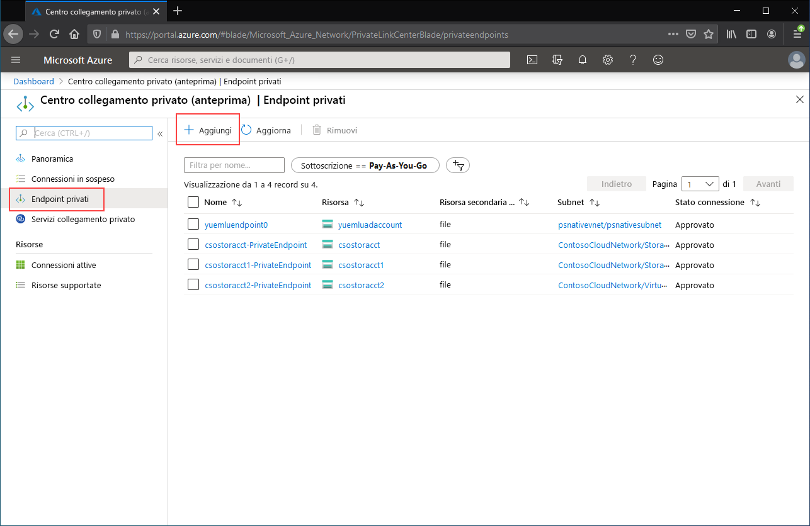
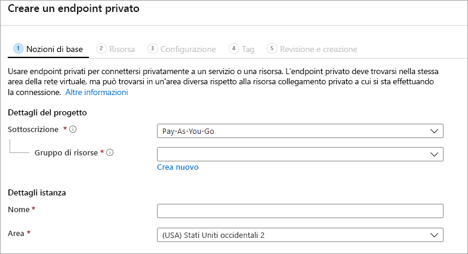

# <a name="configuring-azure-file-sync-network-endpoints"></a>Configurazione degli endpoint di rete di Sincronizzazione file di Azure
File di Azure e Sincronizzazione file di Azure prevedono due tipi principali di endpoint per l'accesso alle condivisioni file di Azure: 
- Endpoint pubblici, che hanno un indirizzo IP pubblico e sono accessibili da qualsiasi parte del mondo.
- Endpoint privati, presenti all'interno di una rete virtuale, che hanno un indirizzo IP privato all'interno dello spazio di indirizzi della rete virtuale.

Per File di Azure e Sincronizzazione file di Azure, ovvero gli oggetti di gestione di Azure, l'account di archiviazione e il servizio di sincronizzazione archiviazione controllano rispettivamente sia gli endpoint pubblici che privati. L'account di archiviazione è un costrutto di gestione che rappresenta un pool di archiviazione condiviso in cui è possibile distribuire più condivisioni file, oltre ad altre risorse di archiviazione come contenitori BLOB o code. Il servizio di sincronizzazione archiviazione è un costrutto di gestione che rappresenta i server registrati, ovvero file server Windows con una relazione di trust stabilita con Sincronizzazione file di Azure, e i gruppi di sincronizzazione, che definiscono la topologia della relazione di sincronizzazione. 

Questo articolo illustra in particolare come configurare gli endpoint di rete per File di Azure e Sincronizzazione file di Azure. Per altre informazioni su come configurare gli endpoint di rete per l'accesso diretto alle condivisioni file di Azure, invece che tramite memorizzazione nella cache in locale con Sincronizzazione file di Azure, vedere [Configurazione degli endpoint di rete di File di Azure](storage-files-networking-endpoints.md).

Prima di seguire questa guida pratica, è consigliabile leggere [Considerazioni sulla rete per Sincronizzazione file di Azure](storage-sync-files-networking-overview.md).

## <a name="prerequisites"></a>Prerequisiti 
Questo articolo presuppone quanto segue:
- Che si abbia una sottoscrizione di Azure. Se non si ha già una sottoscrizione, creare un [account gratuito](https://azure.microsoft.com/free/?WT.mc_id=A261C142F) prima di iniziare.
- Che sia già stata creata una condivisione file di Azure in un account di archiviazione a cui connettersi dall'ambiente locale. Per informazioni su come creare una condivisione file di Azure, vedere [Creare una condivisione file di Azure](storage-how-to-create-file-share.md).
- Che sia già stato creato un servizio di sincronizzazione archiviazione e registrato il file server di Windows. Per informazioni su come distribuire Sincronizzazione file di Azure, vedere [Distribuzione di Sincronizzazione file di Azure](storage-sync-files-deployment-guide.md).

Inoltre:
- Se si intende usare Azure PowerShell, [installare l'ultima versione](https://docs.microsoft.com/powershell/azure/install-az-ps).
- Se si intende usare l'interfaccia della riga di comando di Azure, [installare l'ultima versione](https://docs.microsoft.com/cli/azure/install-azure-cli?view=azure-cli-latest).

## <a name="create-the-private-endpoints"></a>Creare gli endpoint privati
Quando si crea un endpoint privato per una risorsa di Azure, vengono distribuite le risorse seguenti:

- **Endpoint privato**: una risorsa di Azure che rappresenta l'endpoint privato per l'account di archiviazione o il servizio di sincronizzazione archiviazione. È possibile considerarlo come una risorsa che connette la risorsa di Azure e un'interfaccia di rete.
- **Interfaccia di rete**: l'interfaccia di rete che gestisce un indirizzo IP privato all'interno della rete virtuale/subnet specificata. Si tratta esattamente della stessa risorsa che viene distribuita quando si distribuisce una macchina virtuale, ma, invece di essere assegnata a una VM, appartiene all'endpoint privato.
- **Zona DNS privato**: se non è stato ancora distribuito un endpoint privato per questa rete virtuale, verrà distribuita una nuova zona DNS privato. In questa zona DNS verrà anche creato un record A DNS per la risorsa di Azure. Se in questa rete virtuale è già stato distribuito un endpoint privato, nella zona DNS esistente verrà aggiunto un nuovo record A per la risorsa di Azure. La distribuzione di una zona DNS è facoltativa, ma è altamente consigliata per semplificare la gestione DNS necessaria.

> [!Note]  
> Questo articolo usa i suffissi DNS per le aree pubbliche di Azure, `core.windows.net` per gli account di archiviazione e `afs.azure.net` per i servizi di sincronizzazione archiviazione. Questa indicazione si applica anche ai cloud sovrani di Azure, ad esempio il cloud di Azure per il governo degli Stati Uniti. È sufficiente sostituire i suffissi appropriati per l'ambiente in uso.

### <a name="create-the-storage-account-private-endpoint"></a>Creare l'endpoint privato per l'account di archiviazione
# <a name="portal"></a>[Portale](#tab/azure-portal)
[!INCLUDE [storage-files-networking-endpoints-private-portal](../../../includes/storage-files-networking-endpoints-private-portal.md)]

Se è disponibile una macchina virtuale all'interno della rete virtuale o è stato configurato l'inoltro DNS come descritto nell'articolo [Configurazione dell'inoltro DNS per File di Azure](storage-files-networking-dns.md), è possibile verificare se l'endpoint privato è stato configurato correttamente eseguendo i comandi seguenti in PowerShell, dalla riga di comando o nel terminale (per Windows, Linux o macOS). È necessario sostituire `<storage-account-name>` con il nome dell'account di archiviazione appropriato:

```
nslookup <storage-account-name>.file.core.windows.net
```

Se tutte le impostazioni sono corrette, verrà visualizzato l'output seguente, dove `192.168.0.5` è l'indirizzo IP privato dell'endpoint privato nella rete virtuale (output mostrato per Windows):

```Output
Server:  UnKnown
Address:  10.2.4.4

Non-authoritative answer:
Name:    storageaccount.privatelink.file.core.windows.net
Address:  192.168.0.5
Aliases:  storageaccount.file.core.windows.net
```

# <a name="powershell"></a>[PowerShell](#tab/azure-powershell)
[!INCLUDE [storage-files-networking-endpoints-private-powershell](../../../includes/storage-files-networking-endpoints-private-powershell.md)]

Se è disponibile una macchina virtuale all'interno della rete virtuale o è stato configurato l'inoltro DNS come descritto nell'articolo [Configurazione dell'inoltro DNS per File di Azure](storage-files-networking-dns.md), è possibile verificare se l'endpoint privato è stato configurato correttamente eseguendo i comandi seguenti:

```PowerShell
$storageAccountHostName = [System.Uri]::new($storageAccount.PrimaryEndpoints.file) | `
    Select-Object -ExpandProperty Host

Resolve-DnsName -Name $storageAccountHostName
```

Se tutte le impostazioni sono corrette, verrà visualizzato l'output seguente, dove `192.168.0.5` è l'indirizzo IP privato dell'endpoint privato nella rete virtuale:

```Output
Name                             Type   TTL   Section    NameHost
----                             ----   ---   -------    --------
storageaccount.file.core.windows CNAME  60    Answer     storageaccount.privatelink.file.core.windows.net
.net

Name       : storageaccount.privatelink.file.core.windows.net
QueryType  : A
TTL        : 600
Section    : Answer
IP4Address : 192.168.0.5
```

# <a name="azure-cli"></a>[Interfaccia della riga di comando di Azure](#tab/azure-cli)
[!INCLUDE [storage-files-networking-endpoints-private-cli](../../../includes/storage-files-networking-endpoints-private-cli.md)]

Se è disponibile una macchina virtuale all'interno della rete virtuale o è stato configurato l'inoltro DNS come descritto nell'articolo [Configurazione dell'inoltro DNS per File di Azure](storage-files-networking-dns.md), è possibile verificare se l'endpoint privato è stato configurato correttamente eseguendo i comandi seguenti:

```bash
httpEndpoint=$(az storage account show \
        --resource-group $storageAccountResourceGroupName \
        --name $storageAccountName \
        --query "primaryEndpoints.file" | \
    tr -d '"')

hostName=$(echo $httpEndpoint | cut -c7-$(expr length $httpEndpoint) | tr -d "/")
nslookup $hostName
```

Se tutte le impostazioni sono corrette, verrà visualizzato l'output seguente, dove `192.168.0.5` è l'indirizzo IP privato dell'endpoint privato nella rete virtuale:

```Output
Server:         127.0.0.53
Address:        127.0.0.53#53

Non-authoritative answer:
storageaccount.file.core.windows.net      canonical name = storageaccount.privatelink.file.core.windows.net.
Name:   storageaccount.privatelink.file.core.windows.net
Address: 192.168.0.5
```

---

### <a name="create-the-storage-sync-private-endpoint"></a>Creare l'endpoint privato di sincronizzazione archiviazione
> [!Important]  
> Per usare endpoint privati nella risorsa servizio di sincronizzazione archiviazione, è necessario usare l'agente di Sincronizzazione file di Azure versione 10.1 o successiva. Le versioni dell'agente precedenti alla 10.1 non supportano gli endpoint privati nel servizio di sincronizzazione archiviazione. Tutte le versioni precedenti degli agenti supportano gli endpoint privati nella risorsa account di archiviazione.

# <a name="portal"></a>[Portale](#tab/azure-portal)
Passare a **Centro collegamento privato** digitando *Collegamento privato* nella barra di ricerca nella parte superiore del portale di Azure. Nel sommario del Centro collegamento privato selezionare **Endpoint privati** e quindi **+ Aggiungi** per creare un nuovo endpoint privato.

[](media/storage-sync-files-networking-endpoints/create-storage-sync-private-endpoint-0.png#lightbox)

La procedura guidata risultante include più pagine da completare.

Nel pannello **Informazioni di base** selezionare il gruppo di risorse, il nome e l'area da usare per l'endpoint privato, che non devono necessariamente corrispondere a quelli del servizio sincronizzazione archiviazione, anche se l'endpoint privato deve essere creato nella stessa area della rete virtuale in cui inserirlo.



Nel pannello **Risorsa** selezionare il pulsante di opzione **Connettersi a una risorsa di Azure nella directory**. In **Tipo di risorsa** selezionare **Microsoft.StorageSync/storageSyncServices**. 

Il pannello **Configurazione** consente di selezionare la rete virtuale e la subnet specifiche a cui aggiungere l'endpoint privato. Selezionare la stessa rete virtuale di quella usata per l'account di archiviazione. Il pannello Configurazione contiene anche le informazioni per la creazione o l'aggiornamento della zona DNS privato.

Fare clic su **Rivedi e crea** per creare l'endpoint privato.

È possibile verificare se l'endpoint privato è stato configurato correttamente eseguendo i comandi seguenti in PowerShell. 

```powershell
$privateEndpointResourceGroupName = "<your-private-endpoint-resource-group>"
$privateEndpointName = "<your-private-endpoint-name>"

Get-AzPrivateEndpoint `
        -ResourceGroupName $privateEndpointResourceGroupName `
        -Name $privateEndpointName `
        -ErrorAction Stop | `
    Select-Object -ExpandProperty NetworkInterfaces | `
    Select-Object -ExpandProperty Id | `
    ForEach-Object { Get-AzNetworkInterface -ResourceId $_ } | `
    Select-Object -ExpandProperty IpConfigurations | `
    Select-Object -ExpandProperty PrivateLinkConnectionProperties | `
    Select-Object -ExpandProperty Fqdns | `
    ForEach-Object { Resolve-DnsName -Name $_ } | `
    Format-List
```

Se tutte le impostazioni sono corrette, verrà visualizzato l'output seguente, dove `192.168.1.4`, `192.168.1.5`, `192.168.1.6` e `192.168.1.7` sono gli indirizzi IP privati assegnati all'endpoint privato:

```Output
Name     : mysssmanagement.westus2.afs.azure.net
Type     : CNAME
TTL      : 60
Section  : Answer
NameHost : mysssmanagement.westus2.privatelink.afs.azure.net


Name       : mysssmanagement.westus2.privatelink.afs.azure.net
QueryType  : A
TTL        : 60
Section    : Answer
IP4Address : 192.168.1.4

Name     : myssssyncp.westus2.afs.azure.net
Type     : CNAME
TTL      : 60
Section  : Answer
NameHost : myssssyncp.westus2.privatelink.afs.azure.net


Name       : myssssyncp.westus2.privatelink.afs.azure.net
QueryType  : A
TTL        : 60
Section    : Answer
IP4Address : 192.168.1.5

Name     : myssssyncs.westus2.afs.azure.net
Type     : CNAME
TTL      : 60
Section  : Answer
NameHost : myssssyncs.westus2.privatelink.afs.azure.net


Name       : myssssyncs.westus2.privatelink.afs.azure.net
QueryType  : A
TTL        : 60
Section    : Answer
IP4Address : 192.168.1.6

Name     : mysssmonitoring.westus2.afs.azure.net
Type     : CNAME
TTL      : 60
Section  : Answer
NameHost : mysssmonitoring.westus2.privatelink.afs.azure.net


Name       : mysssmonitoring.westus2.privatelink.afs.azure.net
QueryType  : A
TTL        : 60
Section    : Answer
IP4Address : 192.168.1.7

```

# <a name="powershell"></a>[PowerShell](#tab/azure-powershell)
Per creare un endpoint privato per il servizio di sincronizzazione archiviazione, sarà prima di tutto necessario ottenere un riferimento a tale servizio. Assicurarsi di sostituire `<storage-sync-service-resource-group>` e `<storage-sync-service>` con i valori appropriati per l'ambiente. I comandi di PowerShell seguenti presuppongono che siano già state popolate le informazioni sulla rete virtuale riportate sopra. 

```powershell
$storageSyncServiceResourceGroupName = "<storage-sync-service-resource-group>"
$storageSyncServiceName = "<storage-sync-service>"

$storageSyncService = Get-AzStorageSyncService `
        -ResourceGroupName $storageSyncServiceResourceGroupName `
        -Name $storageSyncServiceName `
        -ErrorAction SilentlyContinue

if ($null -eq $storageSyncService) {
    $errorMessage = "Storage Sync Service $storageSyncServiceName not found "
    $errorMessage += "in resource group $storageSyncServiceResourceGroupName."
    Write-Error -Message $errorMessage -ErrorAction Stop
}
```

Per creare un endpoint privato, è necessario creare una connessione di Collegamento privato al servizio di sincronizzazione archiviazione. La connessione di Collegamento privato è un input per la creazione dell'endpoint privato.

```PowerShell 
# Disable private endpoint network policies
$subnet.PrivateEndpointNetworkPolicies = "Disabled"
$virtualNetwork = $virtualNetwork | `
    Set-AzVirtualNetwork -ErrorAction Stop

# Create a private link service connection to the storage account.
$privateEndpointConnection = New-AzPrivateLinkServiceConnection `
        -Name "$storageSyncServiceName-Connection" `
        -PrivateLinkServiceId $storageSyncService.ResourceId `
        -GroupId "Afs" `
        -ErrorAction Stop

# Create a new private endpoint.
$privateEndpoint = New-AzPrivateEndpoint `
        -ResourceGroupName $storageSyncServiceResourceGroupName `
        -Name "$storageSyncServiceName-PrivateEndpoint" `
        -Location $virtualNetwork.Location `
        -Subnet $subnet `
        -PrivateLinkServiceConnection $privateEndpointConnection `
        -ErrorAction Stop
```

La creazione di una zona DNS privato di Azure consente di risolvere i nomi host per il servizio di sincronizzazione archiviazione, ad esempio `mysssmanagement.westus2.afs.azure.net`, negli indirizzi IP privati corretti per tale servizio all'interno della rete virtuale. Sebbene sia facoltativa dal punto di vista della creazione di un endpoint privato, si tratta di un'operazione esplicitamente necessaria per consentire l'accesso dell'agente di Sincronizzazione file di Azure al servizio di sincronizzazione archiviazione. 

```powershell
# Get the desired Storage Sync Service suffix (afs.azure.net for public cloud).
# This is done like this so this script will seamlessly work for non-public Azure.
$azureEnvironment = Get-AzContext | `
    Select-Object -ExpandProperty Environment | `
    Select-Object -ExpandProperty Name

switch($azureEnvironment) {
    "AzureCloud" {
        $storageSyncSuffix = "afs.azure.net"
    }

    "AzureUSGovernment" {
        $storageSyncSuffix = "afs.azure.us"
    }
    
    default {
        Write-Error 
                -Message "The Azure environment $_ is not currently supported by Azure File Sync." `
                -ErrorAction Stop
    }
}

# For public cloud, this will generate the following DNS suffix:
# privatelink.afs.azure.net
$dnsZoneName = "privatelink.$storageSyncSuffix"

# Find a DNS zone matching desired name attached to this virtual network.
$dnsZone = Get-AzPrivateDnsZone | `
    Where-Object { $_.Name -eq $dnsZoneName } | `
    Where-Object {
        $privateDnsLink = Get-AzPrivateDnsVirtualNetworkLink `
                -ResourceGroupName $_.ResourceGroupName `
                -ZoneName $_.Name `
                -ErrorAction SilentlyContinue
        
        $privateDnsLink.VirtualNetworkId -eq $virtualNetwork.Id
    }

if ($null -eq $dnsZone) {
    # No matching DNS zone attached to virtual network, so create new one.
    $dnsZone = New-AzPrivateDnsZone `
            -ResourceGroupName $virtualNetworkResourceGroupName `
            -Name $dnsZoneName `
            -ErrorAction Stop

    $privateDnsLink = New-AzPrivateDnsVirtualNetworkLink `
            -ResourceGroupName $virtualNetworkResourceGroupName `
            -ZoneName $dnsZoneName `
            -Name "$virtualNetworkName-DnsLink" `
            -VirtualNetworkId $virtualNetwork.Id `
            -ErrorAction Stop
}
```
Una volta ottenuto un riferimento alla zona DNS privato, è necessario creare i record A per il servizio di sincronizzazione archiviazione.

```PowerShell 
$privateEndpointIpFqdnMappings = $privateEndpoint | `
    Select-Object -ExpandProperty NetworkInterfaces | `
    Select-Object -ExpandProperty Id | `
    ForEach-Object { Get-AzNetworkInterface -ResourceId $_ } | `
    Select-Object -ExpandProperty IpConfigurations | `
    ForEach-Object { 
        $privateIpAddress = $_.PrivateIpAddress; 
        $_ | `
            Select-Object -ExpandProperty PrivateLinkConnectionProperties | `
            Select-Object -ExpandProperty Fqdns | `
            Select-Object `
                @{ 
                    Name = "PrivateIpAddress"; 
                    Expression = { $privateIpAddress } 
                }, `
                @{ 
                    Name = "FQDN"; 
                    Expression = { $_ } 
                } 
    }

foreach($ipFqdn in $privateEndpointIpFqdnMappings) {
    $privateDnsRecordConfig = New-AzPrivateDnsRecordConfig `
        -IPv4Address $ipFqdn.PrivateIpAddress
    
    $dnsEntry = $ipFqdn.FQDN.Substring(0, 
        $ipFqdn.FQDN.IndexOf(".", $ipFqdn.FQDN.IndexOf(".") + 1))

    New-AzPrivateDnsRecordSet `
            -ResourceGroupName $virtualNetworkResourceGroupName `
            -Name $dnsEntry `
            -RecordType A `
            -ZoneName $dnsZoneName `
            -Ttl 600 `
            -PrivateDnsRecords $privateDnsRecordConfig `
            -ErrorAction Stop | `
        Out-Null
}
```

# <a name="azure-cli"></a>[Interfaccia della riga di comando di Azure](#tab/azure-cli)
Per creare un endpoint privato per il servizio di sincronizzazione archiviazione, sarà prima di tutto necessario ottenere un riferimento a tale servizio. Assicurarsi di sostituire `<storage-sync-service-resource-group>` e `<storage-sync-service>` con i valori appropriati per l'ambiente. I seguenti comandi dell'interfaccia della riga di comando presuppongono che siano già state popolate le informazioni sulla rete virtuale riportate sopra. 

```bash
storageSyncServiceResourceGroupName="<storage-sync-service-resource-group>"
storageSyncServiceName="<storage-sync-service>"

storageSyncService=$(az resource show \
        --resource-group $storageSyncServiceResourceGroupName \
        --name $storageSyncServiceName \
        --resource-type "Microsoft.StorageSync/storageSyncServices" \
        --query "id" | \
    tr -d '"')

storageSyncServiceRegion=$(az resource show \
        --resource-group $storageSyncServiceResourceGroupName \
        --name $storageSyncServiceName \
        --resource-type "Microsoft.StorageSync/storageSyncServices" \
        --query "location" | \
    tr -d '"')
```

Per creare un endpoint privato, è prima di tutto necessario assicurarsi che i criteri di rete dell'endpoint privato della subnet siano disabilitati. Quindi, è possibile creare un endpoint privato con il comando `az network private-endpoint create`.

```bash
# Disable private endpoint network policies
az network vnet subnet update \
        --ids $subnet \
        --disable-private-endpoint-network-policies \
        --output none

# Get virtual network location
region=$(az network vnet show \
        --ids $virtualNetwork \
        --query "location" | \
    tr -d '"')

# Create a private endpoint
privateEndpoint=$(az network private-endpoint create \
        --resource-group $storageSyncServiceResourceGroupName \
        --name "$storageSyncServiceName-PrivateEndpoint" \
        --location $region \
        --subnet $subnet \
        --private-connection-resource-id $storageSyncService \
        --group-id "Afs" \
        --connection-name "$storageSyncServiceName-Connection" \
        --query "id" | \
    tr -d '"')
```

La creazione di una zona DNS privato di Azure consente di risolvere i nomi host per il servizio di sincronizzazione archiviazione, ad esempio `mysssmanagement.westus2.afs.azure.net`, negli indirizzi IP privati corretti per tale servizio all'interno della rete virtuale. Sebbene sia facoltativa dal punto di vista della creazione di un endpoint privato, si tratta di un'operazione esplicitamente necessaria per consentire l'accesso dell'agente di Sincronizzazione file di Azure al servizio di sincronizzazione archiviazione. 

```bash
# Get the desired storage account suffix (afs.azure.net for public cloud).
# This is done like this so this script will seamlessly work for non-public Azure.
azureEnvironment=$(az cloud show \
        --query "name" |
    tr -d '"')

storageSyncSuffix=""
if [ $azureEnvironment == "AzureCloud" ]
then
    storageSyncSuffix="afs.azure.net"
elif [ $azureEnvironment == "AzureUSGovernment" ]
then
    storageSyncSuffix="afs.azure.us"
else
    echo "Unsupported Azure environment $azureEnvironment."
fi

# For public cloud, this will generate the following DNS suffix:
# privatelinke.afs.azure.net.
dnsZoneName="privatelink.$storageSyncSuffix"

# Find a DNS zone matching desired name attached to this virtual network.
possibleDnsZones=""
possibleDnsZones=$(az network private-dns zone list \
        --query "[?name == '$dnsZoneName'].id" \
        --output tsv)

dnsZone=""
possibleDnsZone=""
for possibleDnsZone in $possibleDnsZones
do
    possibleResourceGroupName=$(az resource show \
            --ids $possibleDnsZone \
            --query "resourceGroup" | \
        tr -d '"')
    
    link=$(az network private-dns link vnet list \
            --resource-group $possibleResourceGroupName \
            --zone-name $dnsZoneName \
            --query "[?virtualNetwork.id == '$virtualNetwork'].id" \
            --output tsv)
    
    if [ -z $link ]
    then
        echo "1" > /dev/null
    else 
        dnsZoneResourceGroup=$possibleResourceGroupName
        dnsZone=$possibleDnsZone
        break
    fi  
done

if [ -z $dnsZone ]
then
    # No matching DNS zone attached to virtual network, so create a new one
    dnsZone=$(az network private-dns zone create \
            --resource-group $virtualNetworkResourceGroupName \
            --name $dnsZoneName \
            --query "id" | \
        tr -d '"')
    
    az network private-dns link vnet create \
            --resource-group $virtualNetworkResourceGroupName \
            --zone-name $dnsZoneName \
            --name "$virtualNetworkName-DnsLink" \
            --virtual-network $virtualNetwork \
            --registration-enabled false \
            --output none
    
    dnsZoneResourceGroup=$virtualNetworkResourceGroupName
fi
```

Una volta ottenuto un riferimento alla zona DNS privato, è necessario creare i record A per il servizio di sincronizzazione archiviazione.

```bash
privateEndpointNIC=$(az network private-endpoint show \
        --ids $privateEndpoint \
        --query "networkInterfaces[0].id" | \
    tr -d '"')

privateIpAddresses=$(az network nic show \
        --ids $privateEndpointNIC \
        --query "ipConfigurations[].privateIpAddress" \
        --output tsv) 

hostNames=$(az network nic show \
        --ids $privateEndpointNIC \
        --query "ipConfigurations[].privateLinkConnectionProperties.fqdns[]" \
        --output tsv)

i=0
for privateIpAddress in $privateIpAddresses
do
    j=0
    targetHostName=""
    for hostName in $hostNames
    do
        if [ $i == $j ]
        then
            targetHostName=$hostName
            break
        fi

        j=$(expr $j + 1)
    done

    endpointName=$(echo $targetHostName | \
        cut -c1-$(expr $(expr index $targetHostName ".") - 1))

    az network private-dns record-set a create \
        --resource-group $dnsZoneResourceGroup \
        --zone-name $dnsZoneName \
        --name "$endpointName.$storageSyncServiceRegion" \
        --output none
    
    az network private-dns record-set a add-record \
        --resource-group $dnsZoneResourceGroup \
        --zone-name $dnsZoneName \
        --record-set-name "$endpointName.$storageSyncServiceRegion" \
        --ipv4-address $privateIpAddress \
        --output none

    i=$(expr $i + 1)
done
```
---

## <a name="restrict-access-to-the-public-endpoints"></a>Limitare l'accesso agli endpoint pubblici
È possibile limitare l'accesso agli endpoint pubblici sia dell'account di archiviazione che dei servizi di sincronizzazione archiviazione. La limitazione dell'accesso all'endpoint pubblico fornisce una sicurezza aggiuntiva garantendo che i pacchetti di rete vengano accettati solo dalle posizioni approvate. 

### <a name="restrict-access-to-the-storage-account-public-endpoint"></a>Limitare l'accesso all'endpoint pubblico dell'account di archiviazione
Per limitare l'accesso all'endpoint pubblico, usare le impostazioni del firewall dell'account di archiviazione. In generale, la maggior parte dei criteri del firewall per un account di archiviazione limiterà l'accesso di rete a una o più reti virtuali. Per limitare l'accesso a un account di archiviazione consentendolo solo a una rete virtuale, sono disponibili due approcci:

- [Creare uno o più endpoint privati per l'account di archiviazione](#create-the-storage-account-private-endpoint) e disabilitare l'accesso all'endpoint pubblico. In questo modo si garantisce che solo il traffico originato dalle reti virtuali desiderate possa accedere alle condivisioni file di Azure nell'account di archiviazione.
- Limitare l'endpoint pubblico a una o più reti virtuali. Questa operazione può essere eseguita usando una funzionalità della rete virtuale denominata *endpoint di servizio*. Quando si limita il traffico verso un account di archiviazione tramite un endpoint di servizio, si può comunque accedere all'account di archiviazione tramite l'indirizzo IP pubblico.

#### <a name="disable-access-to-the-storage-account-public-endpoint"></a>Disabilitare l'accesso all'endpoint pubblico dell'account di archiviazione
Se si disabilita l'accesso all'endpoint pubblico, l'account di archiviazione rimane comunque accessibile tramite i relativi endpoint privati. Altrimenti le richieste valide inviate all'endpoint pubblico dell'account di archiviazione verranno rifiutate. 

# <a name="portal"></a>[Portale](#tab/azure-portal)
[!INCLUDE [storage-files-networking-endpoints-public-disable-portal](../../../includes/storage-files-networking-endpoints-public-disable-portal.md)]

# <a name="powershell"></a>[PowerShell](#tab/azure-powershell)
[!INCLUDE [storage-files-networking-endpoints-public-disable-powershell](../../../includes/storage-files-networking-endpoints-public-disable-powershell.md)]

# <a name="azure-cli"></a>[Interfaccia della riga di comando di Azure](#tab/azure-cli)
[!INCLUDE [storage-files-networking-endpoints-public-disable-cli](../../../includes/storage-files-networking-endpoints-public-disable-cli.md)]

---

#### <a name="restrict-access-to-the-storage-account-public-endpoint-to-specific-virtual-networks"></a>Limitare l'accesso all'endpoint pubblico dell'account di archiviazione consentendolo solo a specifiche reti virtuali
Quando si limita l'account di archiviazione consentendolo solo a specifiche reti virtuali, si autorizzano le richieste inviate all'endpoint pubblico dall'interno di tali reti virtuali. Questa operazione può essere eseguita usando una funzionalità della rete virtuale denominata *endpoint di servizio*. Si può usare con o senza endpoint privati.

# <a name="portal"></a>[Portale](#tab/azure-portal)
[!INCLUDE [storage-files-networking-endpoints-public-restrict-portal](../../../includes/storage-files-networking-endpoints-public-restrict-portal.md)]

# <a name="powershell"></a>[PowerShell](#tab/azure-powershell)
[!INCLUDE [storage-files-networking-endpoints-public-restrict-powershell](../../../includes/storage-files-networking-endpoints-public-restrict-powershell.md)]

# <a name="azure-cli"></a>[Interfaccia della riga di comando di Azure](#tab/azure-cli)
[!INCLUDE [storage-files-networking-endpoints-public-restrict-cli](../../../includes/storage-files-networking-endpoints-public-restrict-cli.md)]

---

### <a name="disable-access-to-the-storage-sync-service-public-endpoint"></a>Disabilitare l'accesso all'endpoint pubblico del servizio di sincronizzazione archiviazione
Sincronizzazione file di Azure consente di limitare l'accesso a reti virtuali specifiche solo tramite endpoint privati. Sincronizzazione file di Azure non supporta gli endpoint di servizio per limitare l'accesso a reti virtuali specifiche tramite l'endpoint pubblico. Ciò significa che i due stati per l'endpoint pubblico del servizio di sincronizzazione archiviazione sono abilitato e disabilitato.

# <a name="portal"></a>[Portale](#tab/azure-portal)
Non è possibile eseguire questa operazione tramite il portale di Azure. Selezionare la scheda Azure PowerShell o Interfaccia della riga di comando di Azure per le istruzioni su come disabilitare l'endpoint pubblico del servizio di sincronizzazione archiviazione. 

# <a name="powershell"></a>[PowerShell](#tab/azure-powershell)
Per disabilitare l'accesso all'endpoint pubblico del servizio di sincronizzazione archiviazione, impostare la proprietà `incomingTrafficPolicy` del servizio su `AllowVirtualNetworksOnly`. Per abilitare l'accesso all'endpoint pubblico del servizio di sincronizzazione archiviazione, impostare invece `incomingTrafficPolicy` su `AllowAllTraffic`. Assicurarsi di sostituire `<storage-sync-service-resource-group>` e `<storage-sync-service>`.

```powershell
$storageSyncServiceResourceGroupName = "<storage-sync-service-resource-group>"
$storageSyncServiceName = "<storage-sync-service>"

$storageSyncService = Get-AzResource `
        -ResourceGroupName $storageSyncServiceResourceGroupName `
        -ResourceName $storageSyncServiceName `
        -ResourceType "Microsoft.StorageSync/storageSyncServices"

$storageSyncService.Properties.incomingTrafficPolicy = "AllowVirtualNetworksOnly"
$storageSyncService = $storageSyncService | Set-AzResource -Confirm:$false -Force
```

# <a name="azure-cli"></a>[Interfaccia della riga di comando di Azure](#tab/azure-cli)
Per disabilitare l'accesso all'endpoint pubblico del servizio di sincronizzazione archiviazione, impostare la proprietà `incomingTrafficPolicy` del servizio su `AllowVirtualNetworksOnly`. Per abilitare l'accesso all'endpoint pubblico del servizio di sincronizzazione archiviazione, impostare invece `incomingTrafficPolicy` su `AllowAllTraffic`. Assicurarsi di sostituire `<storage-sync-service-resource-group>` e `<storage-sync-service>`.

```bash
storageSyncServiceResourceGroupName="<storage-sync-service-resource-group>"
storageSyncServiceName="<storage-sync-service>"

az resource update \
        --resource-group $storageSyncServiceResourceGroupName \
        --name $storageSyncServiceName \
        --resource-type "Microsoft.StorageSync/storageSyncServices" \
        --set "properties.incomingTrafficPolicy=AllowVirtualNetworksOnly" \
        --output none
```
---

## <a name="see-also"></a>Vedere anche
- [Pianificazione per la distribuzione di Sincronizzazione file di Azure](storage-sync-files-planning.md)
- [Come distribuire Sincronizzazione file di Azure](storage-sync-files-deployment-guide.md)