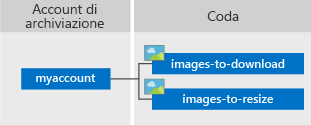

# Informazioni sulle code di Azure

Il servizio di archiviazione di accodamento di Azure consente di archiviare grandi quantità di messaggi ai quali è possibile accedere da qualsiasi parte del mondo mediante chiamate autenticate tramite HTTP o HTTPS. La dimensione massima di un singolo messaggio della coda è di 64 KB e una coda può contenere milioni di messaggi, nei limiti della capacità complessiva di un account di archiviazione.

## Utilizzi comuni

Di seguito sono riportati gli utilizzi più comuni per il servizio di archiviazione di accodamento.

* Creazione di un backlog di lavoro da elaborare in modo asincrono
* Passaggio di messaggi da un ruolo Web di Azure a un ruolo di lavoro di Azure

## Concetti del servizio di accodamento

Il servizio di accodamento contiene i componenti seguenti:

* **Formato URL:** è possibile fare riferimento alle code usando il formato URL seguente:   
    https://`<storage account>`.queue.core.windows.net/`<queue>` 
  
    L'URL seguente fa riferimento a una delle code nel diagramma:   
  
    `https://myaccount.queue.core.windows.net/images-to-download`

* **Account di archiviazione:** l'accesso ad Archiviazione di Azure viene eseguito esclusivamente tramite un account di archiviazione. Per informazioni sulla capacità dell'account di archiviazione, vedere [Obiettivi di scalabilità e prestazioni per Archiviazione di Azure](../common/storage-scalability-targets.md?toc=%2fazure%2fstorage%2fqueues%2ftoc.json) .

* **Coda:** una coda contiene un set di messaggi. Tutti i messaggi devono essere inclusi in una coda. Si noti che il nome della coda deve essere in lettere minuscole. Per altre informazioni, vedere [Denominazione di code e metadati](https://msdn.microsoft.com/library/azure/dd179349.aspx).

* **Messaggio:** un messaggio, in qualsiasi formato, con dimensioni massime di 64 kB. Il tempo massimo che un messaggio può rimanere nella coda è di sette giorni.

## Passaggi successivi

* [Creare un account di archiviazione](../storage-create-storage-account.md?toc=%2fazure%2fstorage%2fqueues%2ftoc.json)
* [Introduzione alle code con .NET](storage-dotnet-how-to-use-queues.md)
