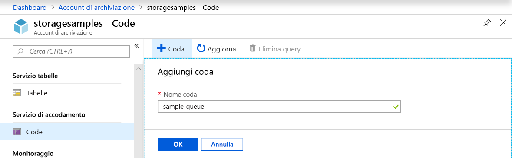
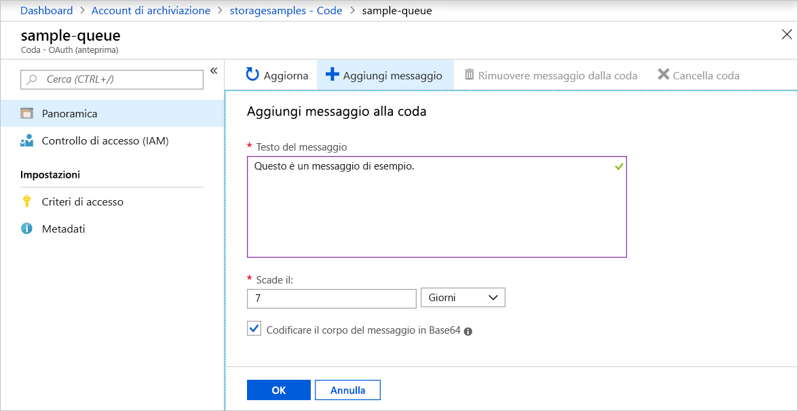
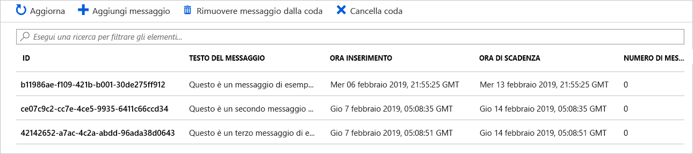
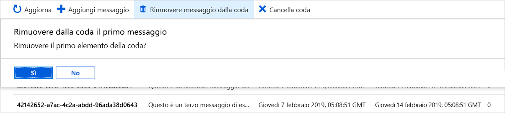

# Guida introduttiva: Creare una coda e aggiungere un messaggio con il portale di Azure

Questa guida introduttiva illustra come usare il [portale di Azure](https://portal.azure.com/) per creare una coda in Archiviazione di Azure, aggiungere messaggi e rimuoverli dalla coda.

## Prerequisiti

[!INCLUDE [storage-quickstart-prereq-include](../../../includes/storage-quickstart-prereq-include.md)]

## Creare una coda

Per creare una coda nel portale di Azure, seguire questa procedura:

1. Passare al nuovo account di archiviazione nel portale di Azure.
2. Nel menu a sinistra per l'account di archiviazione scorrere fino alla sezione **Servizio di accodamento** e quindi selezionare **Code**.
3. Selezionare il pulsante **+ Coda**.
4. Digitare un nome per la nuova coda. Il nome della coda deve essere composto da caratteri in minuscolo, deve iniziare con una lettera o un numero e può contenere solo lettere, numeri e trattino (-).
6. Selezionare **OK** per creare la coda.

    

## Aggiungere un messaggio

Aggiungere quindi un messaggio alla nuova coda. Il messaggio può avere una dimensione massima di 64 KB.

1. Selezionare la nuova coda nell'elenco delle code nell'account di archiviazione.
1. Selezionare il pulsante **+ Aggiungi messaggio** per aggiungere un messaggio alla coda. Immettere un messaggio nel campo **Testo del messaggio**. 
1. Specificare la scadenza del messaggio. Un messaggio può rimanere nella coda per un periodo massimo di 7 giorni.
1. Indicare se al messaggio deve essere applicata la codifica Base64. È consigliabile codificare i dati binari.
1. Selezionare il pulsante **OK** per aggiungere il messaggio.

    

## Visualizzare le proprietà del messaggio

Dopo l'aggiunta di un messaggio, il portale di Azure mostra un elenco di tutti i messaggi nella coda. È possibile visualizzare l'ID messaggio e il contenuto, la data e l'ora di inserimento e la data e l'ora di scadenza del messaggio, nonché quante volte il messaggio è stato rimosso dalla coda.

## Rimuovere un messaggio dalla coda

È possibile rimuovere un messaggio dalla parte anteriore della coda con il portale di Azure. Quando si rimuove un messaggio dalla coda, il messaggio viene eliminato. 

La rimozione dalla coda rimuove sempre il messaggio meno recente presente nella coda. 

## Passaggi successivi

In questa guida introduttiva è stato illustrato come creare una coda, aggiungere un messaggio, visualizzare le proprietà del messaggio e rimuoverlo dalla coda nel portale di Azure.

> [!div class="nextstepaction"]
> [Informazioni sulle code di Azure](storage-queues-introduction.md)
