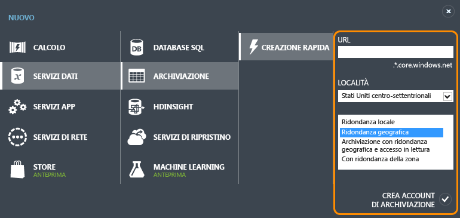
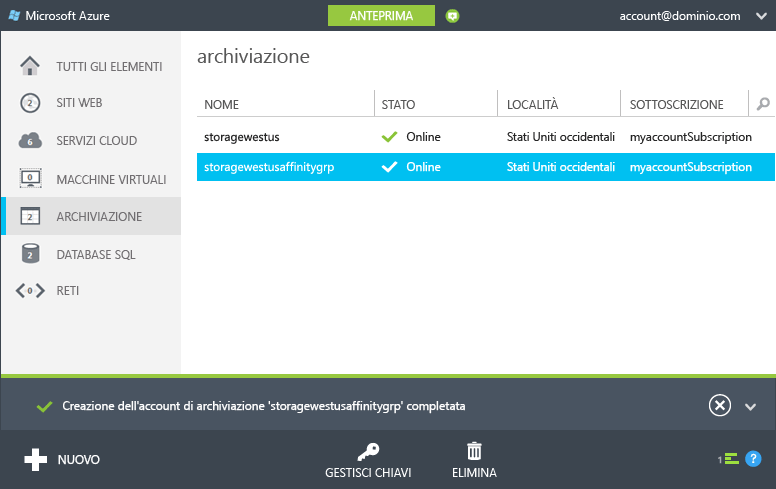
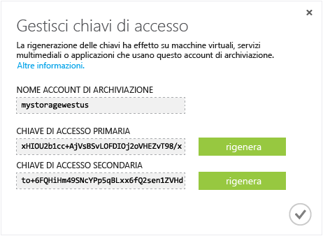

<properties
	pageTitle="Come creare, gestire o eliminare un account di archiviazione | Microsoft Azure"
	description="Informazioni su come creare, gestire o eliminare un account di archiviazione nel portale di Azure."
	services="storage"
	documentationCenter=""
	authors="tamram"
	manager="adinah"
	editor=""/>

<tags
	ms.service="storage"
	ms.workload="storage"
	ms.tgt_pltfrm="na"
	ms.devlang="na"
	ms.topic="get-started-article"
	ms.date="09/23/2015"
	ms.author="tamram"/>

# Informazioni sugli account di archiviazione di Azure

## Panoramica

Un account di archiviazione di Azure consente di accedere ai servizi BLOB, di accodamento, tabelle e file nel servizio di archiviazione di Azure. L'account di archiviazione offre uno spazio dei nomi univoco per gli oggetti dati dell'archiviazione di Azure. Per impostazione predefinita, i dati nel proprio account sono accessibili solo all'utente, ovvero al proprietario dell'account.

Sono disponibili due tipi di account di archiviazione:

- Un account di archiviazione standard include l'archiviazione BLOB, tabelle, di accodamento e file. 
- Un account di archiviazione Premium attualmente supporta solo dischi di macchine virtuali di Azure. Vedere [Archiviazione Premium: archiviazione dalle prestazioni elevate per carichi di lavoro di macchine virtuali di Azure](storage-premium-storage-preview-portal.md) per una panoramica approfondita del servizio di archiviazione Premium.

## Fatturazione dell'account di archiviazione

L'importo fatturato per l'uso di Archiviazione di Azure dipende dall'account di archiviazione. I costi di archiviazione sono determinati da quattro fattori: capacità di archiviazione, schema di replica, transazioni di archiviazione e uscita dei dati.

- La capacità di archiviazione fa riferimento alla quantità di unità di servizio dell'account di archiviazione in uso per l'archiviazione dei dati. Il costo dell'archiviazione dei dati è determinato dalla quantità di dati archiviata e dalla modalità di replica dei dati.
- La replica determina quante copie dei dati vengono gestite in una sola volta e in quali posizioni.
- Le transazioni fanno riferimento a tutte le operazioni di lettura e scrittura in Archiviazione di Azure.
- L'uscita dati fa riferimento ai dati trasferiti all'esterno di un'area di Azure. Quando un'applicazione non in esecuzione nella stessa area geografica accede ai dati nell'account di archiviazione, indipendentemente dal fatto che l'applicazione sia un servizio cloud o un altro tipo di applicazione, verrà addebitato il trasferimento dei dati in uscita. Per i servizi di Azure è possibile raggruppare dati e servizi nello stesso data center per ridurre o evitare del tutto gli addebiti per il trasferimento dei dati in uscita.  

Nella pagina relativa ai [prezzi di Azure](http://azure.microsoft.com/pricing/details/#storage) vengono fornite informazioni dettagliate sui prezzi per la capacità, la replica e le transazioni relative all'archiviazione. Nella pagina [Dettagli prezzi dei trasferimenti di dati](http://azure.microsoft.com/pricing/details/data-transfers/) vengono fornite informazioni dettagliate sui prezzi per il trasferimento dei dati in uscita.

Per informazioni sugli obiettivi di capacità e prestazioni dell'account di archiviazione, vedere [Obiettivi di scalabilità e prestazioni per Archiviazione di Azure](http://msdn.microsoft.com/library/azure/dn249410.aspx).

> [AZURE.NOTE]Quando si crea una macchina virtuale di Azure, un account di archiviazione viene creato automaticamente nel percorso di distribuzione se non si ha già un account di archiviazione in tale percorso. Non è quindi necessario attenersi alla procedura riportata sotto per creare un account di archiviazione per i dischi della macchina virtuale. Il nome dell'account di archiviazione sarà basato sul nome della macchina virtuale. Per altri dettagli, vedere la [documentazione relativa alle macchine virtuali di Azure](http://azure.microsoft.com/documentation/services/virtual-machines/).

## Creare un account di archiviazione

1. Accedere al [portale di Azure](https://manage.windowsazure.com).

2. Fare clic su **Create New**, quindi su **Storage** e infine su **Quick Create**.

	

3. In **URL** immettere un nome per l'account di archiviazione.

	> [AZURE.NOTE]I nomi degli account di archiviazione devono avere una lunghezza compresa tra 3 e 24 caratteri e possono contenere solo numeri e lettere minuscole.
	>  
	> Nome dell'account di archiviazione deve essere univoco all'interno di Azure. Il portale indica se il nome di account di archiviazione selezionato è già in uso.

	Vedere [Endpoint dell'account di archiviazione](#storage-account-endpoints) più avanti per informazioni dettagliate sul modo in cui questo nome verrà usato per indirizzare oggetti in Archiviazione di Azure.

4. In **Località/gruppo di affinità** selezionare una località per l'account di archiviazione vicina all'utente o ai clienti. Se ai dati accederanno anche altri servizi di Azure, ad esempio una macchina virtuale o un servizio cloud di Azure, potrebbe essere opportuno selezionare un gruppo di affinità nell'elenco per raggruppare l'account di archiviazione nello stesso data center con gli altri servizi di Azure usati per migliorare le prestazioni e ridurre i costi.

	Si noti che è necessario selezionare un gruppo di affinità al momento della creazione dell'account di archiviazione. Non è possibile spostare un account esistente in un gruppo di affinità. Per altre informazioni sui gruppi di affinità, vedere [Condivisione del percorso del servizio con un set di affinità](#service-co-location-with-an-affinity-group) più avanti.

	>[AZURE.IMPORTANT]Per determinare i percorsi disponibili per la sottoscrizione, è possibile richiamare l’operazione [List Providers](https://msdn.microsoft.com/library/azure/dn790524.aspx). Per elencare i provider da PowerShell, richiamare [Get-AzureLocation](https://msdn.microsoft.com/library/azure/dn757693.aspx). Da .NET, utilizzare il metodo [List](https://msdn.microsoft.com/library/azure/microsoft.azure.management.resources.provideroperationsextensions.list.aspx) della classe ProviderOperationsExtensions.
	>
	>Vedere inoltre [Aree di Azure](https://azure.microsoft.com/it-IT/regions/#services) per ulteriori informazioni su quali servizi sono disponibili in quale area.

5. Se si dispone di più sottoscrizioni Azure, viene visualizzato il campo **Subscription**. In **Subscription** immettere la sottoscrizione di Azure con cui si desidera utilizzare l'account di archiviazione.

6. In **Replica** selezionare il livello di replica desiderato per l'account di archiviazione. L'opzione di replica consigliata è la replica con ridondanza geografica, che garantisce il livello di durabilità massimo per i dati. Per altre informazioni sulle opzioni di replica di Archiviazione di Azure, vedere [Replica di archiviazione di Azure](storage-redundancy.md).

6. Fare clic su **Create Storage Account**.

	Potrebbero essere necessari alcuni minuti per creare l'account di archiviazione. Per verificare lo stato, è possibile monitorare le notifiche nella parte inferiore del portale. Il nuovo account di archiviazione creato presenta lo stato **Online** ed è pronto per essere utilizzato.

### Endpoint dell'account di archiviazione

Ogni oggetto archiviato in Archiviazione di Azure ha un indirizzo URL univoco. Il nome dell'account di archiviazione costituisce il sottodominio dell'indirizzo. La combinazione di sottodominio e nome di dominio, specifico di ogni servizio, costituisce un *endpoint* per l'account di archiviazione.

Ad esempio, se l'account di archiviazione si chiama *mystorageaccount*, gli endpoint predefiniti per l'account di archiviazione sono:

- Servizio BLOB: http://*mystorageaccount*.blob.core.windows.net

- Servizio tabelle: http://*mystorageaccount*.table.core.windows.net

- Servizio di accodamento: http://*mystorageaccount*.queue.core.windows.net

- Servizio file: http://*mystorageaccount*.file.core.windows.net

È possibile visualizzare gli endpoint per l'account di archiviazione nel dashboard di archiviazione nel portale di Azure una volta creato l'account.

L'URL per accedere a un oggetto in un account di archiviazione viene formato aggiungendo la posizione dell'oggetto nell'account di archiviazione all'endpoint. Ad esempio, il formato di un indirizzo BLOB è simile al seguente: http://*mystorageaccount*.blob.core.windows.net/*mycontainer*/*myblob*.

È anche possibile configurare un nome di dominio personalizzato da usare con l'account di archiviazione. Per altre informazioni, vedere [Configurare un nome di dominio personalizzato per i dati BLOB in un account di archiviazione di Azure](storage-custom-domain-name.md).

### Condivisione del percorso del servizio con un gruppo di affinità

Un *gruppo di affinità* è un raggruppamento geografico dei servizi e delle VM di Azure con l'account di archiviazione di Azure. che consente di migliorare le prestazioni del servizio individuando i carichi di lavoro del computer nello stesso data center o in prossimità dei destinatari. Non sono inoltre addebitate spese per l'uscita in caso di accesso ai dati di un account di archiviazione da parte di un altro servizio appartenente allo stesso gruppo di affinità.

> [AZURE.NOTE]Per creare un set di affinità, aprire l'area <b>Impostazioni</b> del portale di Azure, fare clic su <b>Gruppi di affinità</b> e quindi sul pulsante <b>Aggiungi set di affinità</b> o <b>Aggiungi</b>. È anche possibile creare e gestire gruppi di affinità mediante l'API di gestione del servizio Azure. Per altre informazioni, vedere <a href="http://msdn.microsoft.com/library/azure/ee460798.aspx">Operazioni sui gruppi di affinità</a>.

## Visualizzare, copiare e rigenerare le chiavi di accesso alle risorse di archiviazione

Quando si crea un account di archiviazione, Azure genera due chiavi di accesso alle risorse di archiviazione da 512 bit, che vengono utilizzate per l'autenticazione quando si accede all'account di archiviazione. Fornendo due chiavi di accesso alle risorse di archiviazione, Azure consente di rigenerare le chiavi senza interruzioni per il servizio di archiviazione o l'accesso a tale servizio.

> [AZURE.NOTE]È consigliabile non condividere le chiavi di accesso alle risorse di archiviazione con altri utenti. Per permettere l'accesso alle risorse di archiviazione senza fornire le chiavi di accesso, è possibile usare una *firma di accesso condiviso*. Una firma di accesso condiviso fornisce l'accesso a una risorsa nell'account per un intervallo di tempo definito e con le autorizzazioni specificate. Per altre informazioni, vedere l'[esercitazione sulla firma di accesso condiviso](storage-dotnet-shared-access-signature-part-1.md).

Nel [portale di Azure](http://manage.windowsazure.com) passare a **Gestisci chiavi** nel dashboard o alla pagina **Archiviazione** per visualizzare, copiare e rigenerare le chiavi di accesso alle risorse di archiviazione usate per accedere ai servizi BLOB, tabelle e di accodamento.

### Copia di una chiave di accesso alle risorse di archiviazione  

È possibile utilizzare **Manage Keys** per copiare una chiave di accesso alle risorse di archiviazione da utilizzare in una stringa di connessione. La stringa di connessione richiede il nome dell'account di archiviazione e una chiave da usare nell'autenticazione. Per informazioni su come configurare le stringhe di connessione per accedere ai servizi di archiviazione di Azure, vedere [Configurazione delle stringhe di connessione](http://msdn.microsoft.com/library/azure/ee758697.aspx).

1. Nel [portale di Azure](http://manage.windowsazure.com) fare clic su **Archiviazione** e quindi sul nome dell'account di archiviazione per aprire il dashboard.

2. Fare clic su **Manage Keys**.

 	**Verrà aperto **Manage Access Keys.

	

3. Per copiare una chiave di accesso alle risorse di archiviazione, selezionare il testo della chiave. Fare quindi clic con il pulsante destro del mouse e scegliere **Copy**.

### Rigenerazione delle chiavi di accesso alle risorse di archiviazione
È consigliabile modificare le chiavi di accesso all'account di archiviazione periodicamente per garantire la sicurezza delle connessioni alle risorse di archiviazione. Vengono assegnate due chiavi di accesso in modo da mantenere le connessioni all'account di archiviazione mediante una chiave di accesso mentre si rigenera l'altra.

> [AZURE.WARNING]La rigenerazione delle chiavi di accesso influisce sulle macchine virtuali, sui servizi multimediali e sulle applicazioni che dipendono dall'account di archiviazione. È necessario aggiornare tutti i client che usano la chiave di accesso per accedere all'account di archiviazione per l'uso della nuova chiave.

**Macchine virtuali** - Se l'account di archiviazione contiene macchine virtuali in esecuzione, sarà necessario ridistribuire tutte le macchine virtuali dopo aver rigenerato le chiavi di accesso. Per evitare la ridistribuzione, arrestare le macchine virtuali prima di rigenerare le chiavi di accesso.

**Servizi multimediali**: se sono presenti servizi multimediali che dipendono dall'account di archiviazione, è necessario risincronizzare le chiavi di accesso con il servizio multimediale dopo aver rigenerato le chiavi.

**Applicazioni**: se sono presenti applicazioni Web o servizi cloud che usano l'account di archiviazione, se si rigenerano le chiavi le connessioni andranno perse, a meno che non venga eseguito il rollover delle chiavi. Di seguito è riportato il processo:

1. Aggiornare le stringhe di connessione nel codice dell'applicazione in modo che facciano riferimento alla chiave di accesso secondaria dell'account di archiviazione.

2. Rigenerare la chiave di accesso primaria per l'account di archiviazione. Nel dashboard o nella pagina [Configura](http://manage.windowsazure.com) del **portale di Azure** fare clic su **Gestisci chiavi**. Fare clic su **Rigenera** sotto la chiave di accesso primaria e quindi fare clic su **Sì** per confermare che si vuole generare una nuova chiave.

3. Aggiornare le stringhe di connessione nel codice in modo che facciano riferimento alla nuova chiave di accesso primaria.

4. Rigenerare la chiave di accesso secondaria.

## Eliminare un account di archiviazione

Per rimuovere un account di archiviazione non più in uso, utilizzare **Delete** nel dashboard o nella pagina **Configure**. **Delete** elimina l'intero account di archiviazione, inclusi tutti i BLOB, le tabelle e le code nell'account.

> [AZURE.WARNING]Non è possibile ripristinare un account di archiviazione eliminato, né recuperare gli elementi che conteneva prima dell'eliminazione. Assicurarsi di eseguire il backup di tutti gli elementi da salvare prima di eliminare l'account. Lo stesso vale per tutte le risorse nell'account: dopo aver eliminato un BLOB, una tabella, una coda o un file, non è più possibile recuperarlo.
>
> Se l'account di archiviazione contiene file VHD per una macchina virtuale di Azure, è necessario eliminare eventuali immagini e dischi che usano tali file VHD prima di poter eliminare l'account di archiviazione. Arrestare innanzitutto la macchina virtuale se è in esecuzione e quindi eliminarlo. Per eliminare i dischi, passare alla scheda **Disks** ed eliminare eventuali dischi. Per eliminare le immagini, passare alla scheda **Immagini** ed eliminare eventuali immagini archiviate nell'account.

1. Nel [portale di Azure](http://manage.windowsazure.com) fare clic su **Archiviazione**.

2. Fare clic ovunque nella voce dell'account di archiviazione tranne che sul nome e quindi fare clic su **Delete**.

	 -Oppure-

	Fare clic sul nome dell'account di archiviazione per aprire il dashboard e quindi fare clic su **Delete**.

3. Fare clic su **Sì** per confermare l'eliminazione dell'account di archiviazione.

## Passaggi successivi

- Per altre informazioni sul servizio di archiviazione di Azure, vedere la relativa documentazione sul sito Web [azure.com](http://azure.microsoft.com/documentation/services/storage/) e su [MSDN](http://msdn.microsoft.com/library/azure/gg433040.aspx).

- [Blog del team di Archiviazione di Azure](http://blogs.msdn.com/b/windowsazurestorage/).

<!---HONumber=Oct15_HO1-->