<properties
    pageTitle="Introduzione ad Archiviazione file di Azure in Windows | Microsoft Azure"
    description="Archiviare i dati dei file nel cloud con Archiviazione file di Azure e montare la condivisione di file nel cloud da una macchina virtuale Azure (VM) o da un'applicazione locale che esegue Windows."
    services="storage"
    documentationCenter=".net"
    authors="mine-msft"
    manager="aungoo"
    editor="tysonn" />

<tags ms.service="storage"
    ms.workload="storage"
    ms.tgt_pltfrm="na"
    ms.devlang="dotnet"
    ms.topic="hero-article"
    ms.date="10/18/2016"
    ms.author="minet" />

# Introduzione ad Archiviazione file di Azure in Windows

[AZURE.INCLUDE [storage-selector-file-include](../../includes/storage-selector-file-include.md)]
 
[AZURE.INCLUDE [storage-try-azure-tools-files](../../includes/storage-try-azure-tools-files.md)]

[AZURE.INCLUDE [storage-file-overview-include](../../includes/storage-file-overview-include.md)]

Per informazioni sull'uso di Archiviazione file con Linux, vedere [Come usare l'archiviazione file di Azure con Linux](storage-how-to-use-files-linux.md).

Per informazioni sugli obiettivi di scalabilità e prestazioni di Archiviazione file, vedere [Obiettivi di scalabilità e prestazioni per Archiviazione di Azure](storage-scalability-targets.md#scalability-targets-for-blobs-queues-tables-and-files).

[AZURE.INCLUDE [storage-dotnet-client-library-version-include](../../includes/storage-dotnet-client-library-version-include.md)]

[AZURE.INCLUDE [storage-file-concepts-include](../../includes/storage-file-concepts-include.md)]

## Video: Come usare l'archiviazione file di Azure con Windows

Ecco un video che illustra come creare e usare Condivisioni file di Azure in Windows.

> [AZURE.VIDEO azure-file-storage-with-windows]

## Informazioni sull'esercitazione

In questa guida introduttiva vengono illustrate le nozioni di base sull'uso dell'archiviazione file di Microsoft Azure. In questa esercitazione si apprenderà come:

- Usare il portale di Azure o PowerShell per creare una nuova condivisione file di Azure, aggiungere una directory, caricare un file locale nella condivisione ed elencare i file nella directory.
- Montare la condivisione file seguendo la stessa procedura usata per una condivisione SMB.
- Usare la libreria client di archiviazione di Azure per .NET per accedere alla condivisione file da un'applicazione locale. Creare un'applicazione console ed eseguire queste azioni con la condivisione file:
    - Scrivere il contenuto di un file della condivisione nella finestra della console.
    - Impostare la quota (dimensione massima) per la condivisione file.
    - Creare una firma di accesso condiviso per un file che usa un criterio di accesso condiviso definito nella condivisione.
    - Copiare un file in un altro file nello stesso account di archiviazione.
    - Copiare un file in un BLOB nello stesso account di archiviazione.
- Usare la metrica di archiviazione di Azure per la risoluzione dei problemi

Il servizio Archiviazione file è ora supportato per tutti gli account di archiviazione, quindi è possibile usare un account di archiviazione esistente o crearne uno nuovo. Per informazioni sulla creazione di un nuovo account di archiviazione, vedere [Creare un account di archiviazione](storage-create-storage-account.md#create-a-storage-account) .

## Usare il portale di Azure per gestire una condivisione file

Il [portale di Azure](https://portal.azure.com) offre ai clienti un'interfaccia utente per gestire le condivisioni file. Nel portale è possibile:

- Creare la propria condivisione file
- Caricare i file nella condivisione file e scaricarli
- Monitorare l'utilizzo effettivo di ogni condivisione file
- Rettificare la quota delle dimensioni della condivisione
- Ottenere il comando `net use` da usare per montare la condivisione file da un client Windows

### Creare la condivisione file

1. Accedere al portale di Azure.

2. Nel menu di navigazione fare clic su **Account di archiviazione** o su **Account di archiviazione (versione classica)**.

    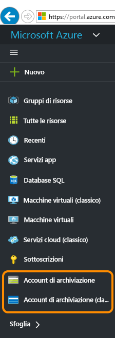

3. Scegliere l'account di archiviazione.

    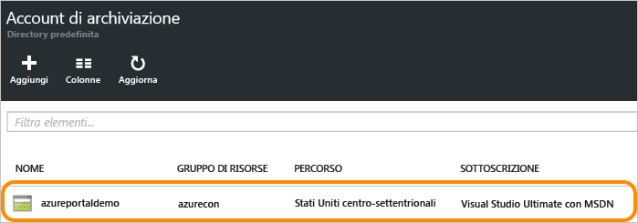

4. Scegliere il servizio "File".

    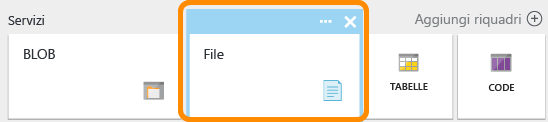

5. Fare clic su "Condivisioni file" e selezionare il collegamento per creare la prima condivisione file.

    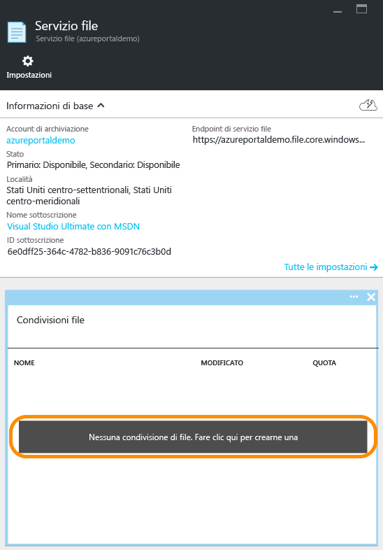

6. Immettere il nome della condivisione e le dimensioni, fino a 5120 GB, per creare la prima condivisione file. Dopo che la condivisione file è stata creata, è possibile montarla da qualsiasi file system che supporti SMB 2.1 o SMB 3.0.

    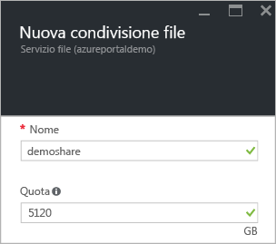

### Caricare e scaricare file

1. Scegliere una condivisione file già creata.

    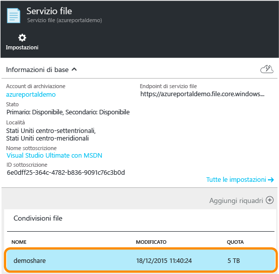

2. Fare clic su **Carica** per aprire l'interfaccia utente per il caricamento dei file.

    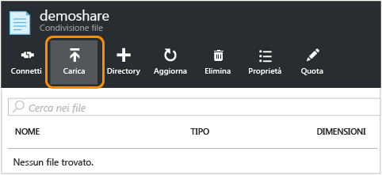

3. Fare clic con il pulsante destro del mouse su un file e scegliere **Scarica** per scaricarlo in locale.

    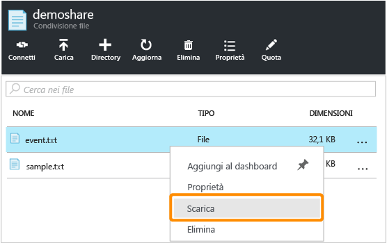

### Gestire la condivisione file

1. Fare clic su **Quota** per modificare le dimensioni della condivisione file, fino a 5120 GB.

    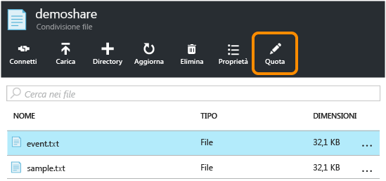

2. Fare clic su **Connetti** per ottenere la riga di comando per montare la condivisione file da Windows.

    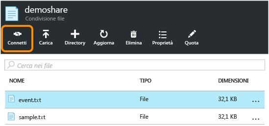

    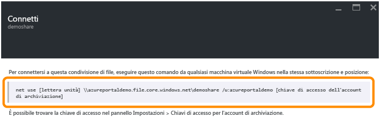

    >[AZURE.TIP] Per trovare la chiave di accesso dell'account di archiviazione per il montaggio, fare clic su **Impostazioni** per l'account di archiviazione e quindi su **Chiavi di accesso**.

    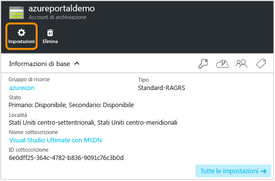

    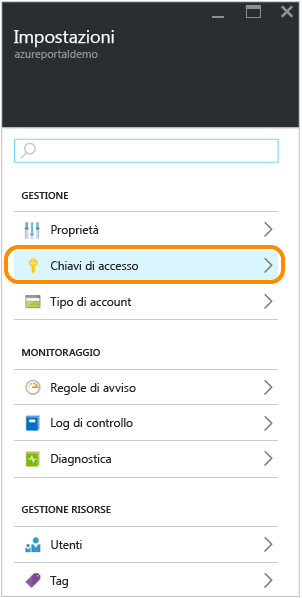

## Usare PowerShell per gestire una condivisione file

In alternativa, è possibile usare Azure PowerShell per creare e gestire le condivisioni file.

### Installare i cmdlet di PowerShell per l'archiviazione di Azure

Per prepararsi all'uso di PowerShell, scaricare e installare i cmdlet di Azure PowerShell. Vedere [Come installare e configurare Azure PowerShell](../powershell-install-configure.md) per le istruzioni relative al punto di installazione e all’installazione.

> [AZURE.NOTE] Si consiglia di scaricare e installare oppure aggiornare il modulo alla versione di Azure PowerShell più recente.

Per aprire una finestra di Azure PowerShell, fare clic su **Start** e digitare **Windows PowerShell**. La finestra di PowerShell carica automaticamente il modulo Azure PowerShell.

### Creare un contesto per l'account e la chiave di archiviazione

A questo punto, creare il contesto dell'account di archiviazione. Il contesto incapsula il nome e la chiave dell'account di archiviazione. Per istruzioni sulla copia della chiave dell'account dal [portale di Azure](https://portal.azure.com), vedere [Visualizzare e copiare le chiavi di accesso alle risorse di archiviazione](storage-create-storage-account.md#view-and-copy-storage-access-keys).

Sostituire `storage-account-name` e `storage-account-key` con il nome e la chiave dell'account di archiviazione nell'esempio seguente.

    # create a context for account and key
    $ctx=New-AzureStorageContext storage-account-name storage-account-key

### Creare una nuova condivisione file

Creare quindi la nuova condivisione, denominata `logs`.

    # create a new share
    $s = New-AzureStorageShare logs -Context $ctx

A questo punto si ha una condivisione file nell'archiviazione file. Vengono quindi aggiunti un file e una directory.

> [AZURE.IMPORTANT] Il nome della condivisione file deve essere composto solo da caratteri minuscoli. Per dettagli su come denominare condivisioni e file, vedere [Denominazione e riferimento a condivisioni, directory, file e metadati](https://msdn.microsoft.com/library/azure/dn167011.aspx).

### Creare una directory nella condivisione file

A questo punto, si crea una directory nella condivisione. Nell'esempio seguente la directory è denominata `CustomLogs`.

    # create a directory in the share
    New-AzureStorageDirectory -Share $s -Path CustomLogs

### Caricare un file locale nella directory

Caricare un file locale nella directory. Nel seguente esempio viene caricato un file da `C:\temp\Log1.txt`. Modificare il percorso del file in modo che punti a un file valido nel computer locale.

    # upload a local file to the new directory
    Set-AzureStorageFileContent -Share $s -Source C:\temp\Log1.txt -Path CustomLogs

### Elencare i file nella directory

Per visualizzare un file nella directory, è possibile elencare tutti i file della directory. Questo comando restituisce file e sottodirectory, se presenti, nella directory CustomLogs.

    # list files in the new directory
    Get-AzureStorageFile -Share $s -Path CustomLogs | Get-AzureStorageFile

Get-AzureStorageFile restituisce un elenco di file e directory per qualsiasi oggetto di directory passato. "Get-AzureStorageFile -Share $s" restituisce un elenco di file e directory nella directory radice. Per ottenere un elenco di file in una sottodirectory, è necessario passare la sottodirectory a Get-AzureStorageFile. La prima parte del comando fino alla pipe restituisce un'istanza di directory della sottodirectory CustomLogs. Il comando viene quindi passato a Get-AzureStorageFile, che restituisce i file e le directory in CustomLogs.

### Copiare i file

A partire dalla versione 0.9.7 di Azure PowerShell, è possibile copiare un file in un altro file, un file in un BLOB o un BLOB in un file. Di seguito viene illustrato come eseguire queste operazioni di copia con i cmdlet di PowerShell.

    # copy a file to the new directory
    Start-AzureStorageFileCopy -SrcShareName srcshare -SrcFilePath srcdir/hello.txt -DestShareName destshare -DestFilePath destdir/hellocopy.txt -Context $srcCtx -DestContext $destCtx

    # copy a blob to a file directory
    Start-AzureStorageFileCopy -SrcContainerName srcctn -SrcBlobName hello2.txt -DestShareName hello -DestFilePath hellodir/hello2copy.txt -DestContext $ctx -Context $ctx

## Montare la condivisione file

Grazie al supporto per SMB 3.0, Archiviazione file ora supporta la crittografia e i punti di controllo persistenti dai client SMB 3.0. Il supporto per la crittografia significa che i client SMB 3.0 possono montare una condivisione file da qualsiasi posizione, ad esempio:

- Macchina virtuale di Azure nella stessa area (anche con SMB 2.1)
- Macchina virtuale di Azure in un'area diversa (solo SMB 3.0)
- Applicazione client locale (solo SMB 3.0)

Quando un client accede al servizio Archiviazione file, la versione di SMB usata dipende dalla versione di SMB supportata dal sistema operativo. La tabella seguente mostra un riepilogo del supporto per i client Windows. Per altre informazioni, vedere il blog sulle [versioni di SMB](http://blogs.technet.com/b/josebda/archive/2013/10/02/windows-server-2012-r2-which-version-of-the-smb-protocol-smb-1-0-smb-2-0-smb-2-1-smb-3-0-or-smb-3-02-you-are-using.aspx).

| Client Windows         | Versione di SMB supportata |
|:-----------------------|:----------------------|
| Windows 7              | SMB 2.1               |
| Windows Server 2008 R2 | SMB 2.1               |
| Windows 8              | SMB 3.0               |
| Windows Server 2012    | SMB 3.0               |
| Windows Server 2012 R2 | SMB 3.0               |
| Windows 10             | SMB 3.0               |

### Montare la condivisione file da una macchina virtuale di Azure che esegue Windows

Per illustrare come si monta una condivisione file di Azure, viene creata una macchina virtuale di Azure che esegue Windows e viene eseguito l'accesso remoto per montare la condivisione.

1. Creare prima di tutto una nuova macchina virtuale di Azure seguendo le istruzioni in [Creare la prima macchina virtuale Windows nel portale di Azure](../virtual-machines/virtual-machines-windows-hero-tutorial.md).
2. Accedere quindi in remoto alla nuova macchina virtuale seguendo le istruzioni in [Come connettersi e accedere a una macchina virtuale di Azure che esegue Windows](../virtual-machines/virtual-machines-windows-connect-logon.md).
3. Aprire una finestra di PowerShell nella macchina virtuale.

### Mantenere le credenziali dell'account di archiviazione per la macchina virtuale

Prima di eseguire il montaggio nella condivisione file, mantenere le credenziali dell'account di archiviazione nella macchina virtuale. Questo passaggio consente a Windows di riconnettere automaticamente la condivisione file quando la macchina virtuale viene riavviata. Per mantenere le credenziali dell'account, eseguire il comando `cmdkey` nella finestra di PowerShell della macchina virtuale. Sostituire `<storage-account-name>` con il nome dell'account di archiviazione e `<storage-account-key>` con la chiave dell'account di archiviazione.

    cmdkey /add:<storage-account-name>.file.core.windows.net /user:<storage-account-name> /pass:<storage-account-key>

Windows esegue la riconnessione alla condivisione file quando la macchina virtuale viene riavviata. È possibile verificare che la condivisione sia stata riconnessa eseguendo il comando `net use` in una finestra di PowerShell.

Si noti che le credenziali vengono mantenute solo nel contesto in cui viene eseguito `cmdkey`. Se si sviluppa un'applicazione che viene eseguita come servizio, sarà necessario che le credenziali vengano mantenute anche in quel contesto.

### Montare la condivisione file usando le credenziali mantenute

Dopo aver stabilito una connessione remota alla macchina virtuale, è possibile eseguire il comando `net use` per montare la condivisione file usando la sintassi seguente. Sostituire `<storage-account-name>` con il nome dell'account di archiviazione e `<share-name>` con il nome della condivisione di archiviazione file.

    net use <drive-letter>: \\<storage-account-name>.file.core.windows.net\<share-name>

    example :
    net use z: \\samples.file.core.windows.net\logs

Poiché sono state mantenute le credenziali dell'account di archiviazione nel passaggio precedente, non è necessario inserirle con il comando `net use`. Se le credenziali non sono state mantenute, includerle come parametro passato al comando `net use` , come illustrato nell'esempio seguente.

    net use <drive-letter>: \\<storage-account-name>.file.core.windows.net\<share-name> /u:<storage-account-name> <storage-account-key>

    example :
    net use z: \\samples.file.core.windows.net\logs /u:samples <storage-account-key>

A questo punto è possibile usare la condivisione di archiviazione file dalla macchina virtuale come si farebbe con qualsiasi altra unità. È possibile eseguire i comandi file standard dal prompt dei comandi o visualizzare la condivisione montata e i relativi contenuti da Esplora file. È anche possibile eseguire il codice dalla macchina virtuale che accede alla condivisione file usando le API I/O del file Windows standard, ad esempio quelle fornite dagli [spazi dei nomi System.IO](http://msdn.microsoft.com/library/gg145019.aspx) in .NET Framework.

La condivisione file può essere montata anche da un ruolo in esecuzione in un servizio cloud di Azure eseguendo l'accesso remoto al ruolo.

### Montare la condivisione file da un client locale che esegue Windows

Per montare la condivisione file da un client locale, è prima necessario seguire questa procedura:

- Installare una versione di Windows che supporta il protocollo SMB 3.0. Windows userà la crittografia SMB 3.0 per eseguire il trasferimento di dati sicuro dal client locale alla condivisione file di Azure nel cloud.
- Aprire l'accesso a Internet per la porta 445 (TCP in uscita) nella rete locale, come richiesto dal protocollo SMB.

> [AZURE.NOTE] Alcuni provider di servizi Internet bloccano la porta 445, quindi è opportuno verificare con il proprio provider di servizi.

## Sviluppare con Archiviazione file

Per scrivere codice che chiama Archiviazione file, è possibile usare le librerie client di archiviazione per .NET e Java o l'API REST di Archiviazione di Azure. L'esempio in questa sezione illustra come usare una condivisione file con la [libreria client di Archiviazione di Azure per .NET](https://msdn.microsoft.com/library/mt347887.aspx) da una semplice applicazione console in esecuzione sul desktop.

### Creare l'applicazione console e ottenere l'assembly

Per creare una nuova applicazione console in Visual Studio e installare il pacchetto NuGet contenente la libreria client di archiviazione di Azure:

1. In Visual Studio scegliere **File > Nuovo progetto** e quindi **Windows > Applicazione console** dall'elenco di modelli di Visual C#.
2. Specificare un nome per l'applicazione console e quindi fare clic su **OK**.
3. Dopo aver creato il progetto, fare clic con il pulsante destro del mouse sul progetto in Esplora soluzioni e scegliere **Gestisci pacchetti NuGet**. Cercare online "WindowsAzure.Storage" e fare clic su **Installa** per installare il pacchetto della libreria client di archiviazione di Azure per .NET e le dipendenze.

Anche gli esempi di codice in questo articolo usano la [libreria di Gestione configurazione di Microsoft Azure](https://msdn.microsoft.com/library/azure/mt634646.aspx) per recuperare la stringa di connessione di archiviazione da un file app.config nell'applicazione console. Gestione configurazione di Azure permette di recuperare la stringa di connessione in fase di esecuzione indipendentemente dal fatto che l'applicazione sia in esecuzione in Microsoft Azure o in un'applicazione Web, desktop o per dispositivi mobili.

Per installare il pacchetto di Gestione configurazione di Azure, fare clic con il pulsante destro del mouse sul progetto in Esplora soluzioni e scegliere **Gestisci pacchetti NuGet**. Cercare online "ConfigurationManager" e fare clic su **Installa** per installare il pacchetto.

L'uso di Gestione configurazione di Azure è facoltativo. È anche possibile usare un'API, ad esempio la [classe ConfigurationManager](https://msdn.microsoft.com/library/system.configuration.configurationmanager.aspx)di .NET Framework.

### Salvare le credenziali dell'account di archiviazione nel file app.config

A questo punto salvare le credenziali nel file app.config del progetto. Modificare il file app.config in modo che assomigli all'esempio seguente, sostituendo `myaccount` con il nome dell'account di archiviazione e `mykey` con la chiave dell'account di archiviazione.

    <?xml version="1.0" encoding="utf-8" ?>
    <configuration>
        <startup>
            <supportedRuntime version="v4.0" sku=".NETFramework,Version=v4.5" />
        </startup>
        <appSettings>
            <add key="StorageConnectionString" value="DefaultEndpointsProtocol=https;AccountName=myaccount;AccountKey=StorageAccountKeyEndingIn==" />
        </appSettings>
    </configuration>

> [AZURE.NOTE] L'ultima versione dell'emulatore di archiviazione di Azure non supporta l'archiviazione file. La stringa di connessione deve indirizzare a un account di archiviazione di Azure nel cloud per poter usare il servizio Archiviazione file.

### Aggiungere le dichiarazioni dello spazio dei nomi

Aprire il file `program.cs` da Esplora soluzioni e aggiungere le dichiarazioni dello spazio dei nomi seguenti all'inizio del file.

    using Microsoft.Azure; // Namespace for Azure Configuration Manager
    using Microsoft.WindowsAzure.Storage; // Namespace for Storage Client Library
    using Microsoft.WindowsAzure.Storage.Blob; // Namespace for Blob storage
    using Microsoft.WindowsAzure.Storage.File; // Namespace for File storage

[AZURE.INCLUDE [storage-cloud-configuration-manager-include](../../includes/storage-cloud-configuration-manager-include.md)]

### Accedere alla condivisione file a livello di programmazione

A questo punto aggiungere il codice seguente al metodo `Main()`, dopo il codice indicato sopra, per recuperare la stringa di connessione. Questo codice ottiene un riferimento al file creato in precedenza e genera i contenuti nella finestra della console.

    // Create a CloudFileClient object for credentialed access to File storage.
    CloudFileClient fileClient = storageAccount.CreateCloudFileClient();

    // Get a reference to the file share we created previously.
    CloudFileShare share = fileClient.GetShareReference("logs");

    // Ensure that the share exists.
    if (share.Exists())
    {
        // Get a reference to the root directory for the share.
        CloudFileDirectory rootDir = share.GetRootDirectoryReference();

        // Get a reference to the directory we created previously.
        CloudFileDirectory sampleDir = rootDir.GetDirectoryReference("CustomLogs");

        // Ensure that the directory exists.
        if (sampleDir.Exists())
        {
            // Get a reference to the file we created previously.
            CloudFile file = sampleDir.GetFileReference("Log1.txt");

            // Ensure that the file exists.
            if (file.Exists())
            {
                // Write the contents of the file to the console window.
                Console.WriteLine(file.DownloadTextAsync().Result);
            }
        }
    }

Eseguire l'applicazione console per visualizzare l'output.

### Impostare la dimensione massima per una condivisione file

A partire dalla versione 5.x della libreria del client di archiviazione di Azure, è possibile impostare la quota (o dimensione massima) per una condivisione file, in gigabyte. È anche possibile controllare la quantità di dati archiviata attualmente nella condivisione.

Impostando la quota per una condivisione, è possibile limitare la dimensione totale dei file archiviati nella condivisione. Se la dimensione totale dei file nella condivisione supera la quota impostata per la condivisione, i client non saranno in grado di aumentare le dimensioni dei file esistenti o creare nuovi file, a meno che tali file non siano vuoti.

L'esempio seguente illustra come controllare l'uso corrente per una condivisione e come impostare la quota per la condivisione.

    // Parse the connection string for the storage account.
    CloudStorageAccount storageAccount = CloudStorageAccount.Parse(
        Microsoft.Azure.CloudConfigurationManager.GetSetting("StorageConnectionString"));

    // Create a CloudFileClient object for credentialed access to File storage.
    CloudFileClient fileClient = storageAccount.CreateCloudFileClient();

    // Get a reference to the file share we created previously.
    CloudFileShare share = fileClient.GetShareReference("logs");

    // Ensure that the share exists.
    if (share.Exists())
    {
        // Check current usage stats for the share.
        // Note that the ShareStats object is part of the protocol layer for the File service.
        Microsoft.WindowsAzure.Storage.File.Protocol.ShareStats stats = share.GetStats();
        Console.WriteLine("Current share usage: {0} GB", stats.Usage.ToString());

        // Specify the maximum size of the share, in GB.
        // This line sets the quota to be 10 GB greater than the current usage of the share.
        share.Properties.Quota = 10 + stats.Usage;
        share.SetProperties();

        // Now check the quota for the share. Call FetchAttributes() to populate the share's properties.
        share.FetchAttributes();
        Console.WriteLine("Current share quota: {0} GB", share.Properties.Quota);
    }

### Generare la firma di accesso condiviso per un file o una condivisione file

A partire dalla versione 5.x della Libreria del client di archiviazione di Azure, è possibile generare una firma di accesso condiviso (SAS) per una condivisione file o per un singolo file. È inoltre possibile creare un criterio di accesso condiviso in una condivisione file per gestire le firme di accesso condiviso. È consigliabile creare un criterio di accesso condiviso, in quanto fornisce un modo per revocare la firma SAS se necessario.

Nell'esempio seguente viene creato un criterio di accesso condiviso in una condivisione e quindi viene usato tale criterio per fornire i vincoli per una firma di accesso condiviso su un file della condivisione.

    // Parse the connection string for the storage account.
    CloudStorageAccount storageAccount = CloudStorageAccount.Parse(
        Microsoft.Azure.CloudConfigurationManager.GetSetting("StorageConnectionString"));

    // Create a CloudFileClient object for credentialed access to File storage.
    CloudFileClient fileClient = storageAccount.CreateCloudFileClient();

    // Get a reference to the file share we created previously.
    CloudFileShare share = fileClient.GetShareReference("logs");

    // Ensure that the share exists.
    if (share.Exists())
    {
        string policyName = "sampleSharePolicy" + DateTime.UtcNow.Ticks;

        // Create a new shared access policy and define its constraints.
        SharedAccessFilePolicy sharedPolicy = new SharedAccessFilePolicy()
            {
                SharedAccessExpiryTime = DateTime.UtcNow.AddHours(24),
                Permissions = SharedAccessFilePermissions.Read | SharedAccessFilePermissions.Write
            };

        // Get existing permissions for the share.
        FileSharePermissions permissions = share.GetPermissions();

        // Add the shared access policy to the share's policies. Note that each policy must have a unique name.
        permissions.SharedAccessPolicies.Add(policyName, sharedPolicy);
        share.SetPermissions(permissions);

        // Generate a SAS for a file in the share and associate this access policy with it.
        CloudFileDirectory rootDir = share.GetRootDirectoryReference();
        CloudFileDirectory sampleDir = rootDir.GetDirectoryReference("CustomLogs");
        CloudFile file = sampleDir.GetFileReference("Log1.txt");
        string sasToken = file.GetSharedAccessSignature(null, policyName);
        Uri fileSasUri = new Uri(file.StorageUri.PrimaryUri.ToString() + sasToken);

        // Create a new CloudFile object from the SAS, and write some text to the file.
        CloudFile fileSas = new CloudFile(fileSasUri);
        fileSas.UploadText("This write operation is authenticated via SAS.");
        Console.WriteLine(fileSas.DownloadText());
    }

Per altre informazioni sulla creazione e sull'uso di firme di accesso condiviso, vedere [Uso delle firme di accesso condiviso](storage-dotnet-shared-access-signature-part-1.md) e [Creare e usare una firma di accesso condiviso con l'archiviazione BLOB](storage-dotnet-shared-access-signature-part-2.md).

### Copiare i file

A partire dalla versione 5.x della libreria del client di archiviazione di Azure, è possibile copiare un file in un altro file, un file in un BLOB o un BLOB in un file. Le sezioni seguenti illustrano come eseguire queste operazioni di copia a livello di programmazione.

È inoltre possibile utilizzare AzCopy per copiare un file in un altro o per copiare un blob in un file o viceversa. Vedere [Trasferire dati con l'utilità della riga di comando AzCopy](storage-use-azcopy.md).

> [AZURE.NOTE] Se si copia un BLOB in un file o un file in un BLOB, è necessario utilizzare una firma di accesso condiviso (SAS) per autenticare l'oggetto di origine, anche se si copia nello stesso account di archiviazione.

**Copiare un file in un altro file**

Nell'esempio seguente viene copiato un file in un altro file nella stessa condivisione. Poiché questa operazione esegue la copia tra file nello stesso account di archiviazione, è possibile utilizzare l'autenticazione chiave condivisa per eseguire la copia.

    // Parse the connection string for the storage account.
    CloudStorageAccount storageAccount = CloudStorageAccount.Parse(
        Microsoft.Azure.CloudConfigurationManager.GetSetting("StorageConnectionString"));

    // Create a CloudFileClient object for credentialed access to File storage.
    CloudFileClient fileClient = storageAccount.CreateCloudFileClient();

    // Get a reference to the file share we created previously.
    CloudFileShare share = fileClient.GetShareReference("logs");

    // Ensure that the share exists.
    if (share.Exists())
    {
        // Get a reference to the root directory for the share.
        CloudFileDirectory rootDir = share.GetRootDirectoryReference();

        // Get a reference to the directory we created previously.
        CloudFileDirectory sampleDir = rootDir.GetDirectoryReference("CustomLogs");

        // Ensure that the directory exists.
        if (sampleDir.Exists())
        {
            // Get a reference to the file we created previously.
            CloudFile sourceFile = sampleDir.GetFileReference("Log1.txt");

            // Ensure that the source file exists.
            if (sourceFile.Exists())
            {
                // Get a reference to the destination file.
                CloudFile destFile = sampleDir.GetFileReference("Log1Copy.txt");

                // Start the copy operation.
                destFile.StartCopy(sourceFile);

                // Write the contents of the destination file to the console window.
                Console.WriteLine(destFile.DownloadText());
            }
        }
    }

**Copiare un file in un BLOB**

Nell'esempio seguente viene creato un file che viene copiato in un BLOB nello stesso account di archiviazione. Nell'esempio viene creata una firma di accesso condiviso per il file di origine, che il servizio utilizza per autenticare l'accesso al file di origine durante l'operazione di copia.

    // Parse the connection string for the storage account.
    CloudStorageAccount storageAccount = CloudStorageAccount.Parse(
        Microsoft.Azure.CloudConfigurationManager.GetSetting("StorageConnectionString"));

    // Create a CloudFileClient object for credentialed access to File storage.
    CloudFileClient fileClient = storageAccount.CreateCloudFileClient();

    // Create a new file share, if it does not already exist.
    CloudFileShare share = fileClient.GetShareReference("sample-share");
    share.CreateIfNotExists();

    // Create a new file in the root directory.
    CloudFile sourceFile = share.GetRootDirectoryReference().GetFileReference("sample-file.txt");
    sourceFile.UploadText("A sample file in the root directory.");

    // Get a reference to the blob to which the file will be copied.
    CloudBlobClient blobClient = storageAccount.CreateCloudBlobClient();
    CloudBlobContainer container = blobClient.GetContainerReference("sample-container");
    container.CreateIfNotExists();
    CloudBlockBlob destBlob = container.GetBlockBlobReference("sample-blob.txt");

    // Create a SAS for the file that's valid for 24 hours.
    // Note that when you are copying a file to a blob, or a blob to a file, you must use a SAS
    // to authenticate access to the source object, even if you are copying within the same
    // storage account.
    string fileSas = sourceFile.GetSharedAccessSignature(new SharedAccessFilePolicy()
    {
        // Only read permissions are required for the source file.
        Permissions = SharedAccessFilePermissions.Read,
        SharedAccessExpiryTime = DateTime.UtcNow.AddHours(24)
    });

    // Construct the URI to the source file, including the SAS token.
    Uri fileSasUri = new Uri(sourceFile.StorageUri.PrimaryUri.ToString() + fileSas);

    // Copy the file to the blob.
    destBlob.StartCopy(fileSasUri);

    // Write the contents of the file to the console window.
    Console.WriteLine("Source file contents: {0}", sourceFile.DownloadText());
    Console.WriteLine("Destination blob contents: {0}", destBlob.DownloadText());

È possibile copiare un BLOB in un file nello stesso modo. Se l'oggetto di origine è un BLOB, creare una firma di accesso condiviso per consentire l'accesso al BLOB durante l'operazione di copia.

## Risoluzione dei problemi di Archiviazione file con le metriche

Analisi di flusso di Azure ora supporta le metriche per Archiviazione file. Grazie ai dati di metrica, è possibile monitorare le richieste e diagnosticare i problemi.

È possibile abilitare le metriche per Archiviazione file dal [portale di Azure](https://portal.azure.com). È anche possibile abilitare le metriche a livello ci codice chiamando l'operazione Set File Service Properties tramite l'API REST o una delle soluzioni analoghe disponibili nella libreria client di archiviazione.

L'esempio di codice seguente mostra come usare la libreria client di archiviazione per .NET per abilitare la metrica per l'archiviazione file.

Aggiungere prima le istruzioni `using` seguenti al file program.cs, oltre a quelle aggiunte sopra:

    using Microsoft.WindowsAzure.Storage.File.Protocol;
    using Microsoft.WindowsAzure.Storage.Shared.Protocol;

Si noti che, mentre gli archivi BLOB, tabelle e code usano il tipo `ServiceProperties` condiviso nello spazio dei nomi `Microsoft.WindowsAzure.Storage.Shared.Protocol`, Archiviazione file usa il proprio tipo, ovvero il tipo `FileServiceProperties` nello spazio dei nomi `Microsoft.WindowsAzure.Storage.File.Protocol`. È tuttavia necessario fare riferimento a entrambi gli spazi dei nomi dal proprio codice, per poter compilare il codice seguente.

    // Parse your storage connection string from your application's configuration file.
    CloudStorageAccount storageAccount = CloudStorageAccount.Parse(
            Microsoft.Azure.CloudConfigurationManager.GetSetting("StorageConnectionString"));
    // Create the File service client.
    CloudFileClient fileClient = storageAccount.CreateCloudFileClient();

    // Set metrics properties for File service.
    // Note that the File service currently uses its own service properties type,
    // available in the Microsoft.WindowsAzure.Storage.File.Protocol namespace.
    fileClient.SetServiceProperties(new FileServiceProperties()
    {
        // Set hour metrics
        HourMetrics = new MetricsProperties()
        {
            MetricsLevel = MetricsLevel.ServiceAndApi,
            RetentionDays = 14,
            Version = "1.0"
        },
        // Set minute metrics
        MinuteMetrics = new MetricsProperties()
        {
            MetricsLevel = MetricsLevel.ServiceAndApi,
            RetentionDays = 7,
            Version = "1.0"
        }
    });

    // Read the metrics properties we just set.
    FileServiceProperties serviceProperties = fileClient.GetServiceProperties();
    Console.WriteLine("Hour metrics:");
    Console.WriteLine(serviceProperties.HourMetrics.MetricsLevel);
    Console.WriteLine(serviceProperties.HourMetrics.RetentionDays);
    Console.WriteLine(serviceProperties.HourMetrics.Version);
    Console.WriteLine();
    Console.WriteLine("Minute metrics:");
    Console.WriteLine(serviceProperties.MinuteMetrics.MetricsLevel);
    Console.WriteLine(serviceProperties.MinuteMetrics.RetentionDays);
    Console.WriteLine(serviceProperties.MinuteMetrics.Version);

## Domande frequenti su Archiviazione file

1. **L'autenticazione basata su Active Directory è supportata da Archiviazione file?**

    Al momento non è supportata l'autenticazione basata su Active Directory o sugli elenchi di controllo di accesso (ACL), ma è inclusa nell'elenco delle richieste di funzionalità. Per ora, per fornire l'autenticazione alla condivisione file vengono usate le chiavi dell'account di archiviazione di Azure. È disponibile una soluzione alternativa che prevede l'uso di firme di accesso condiviso tramite l'API REST o le librerie client. Le firme di accesso condiviso consentono di generare token con autorizzazioni specifiche che restano valide per un periodo di tempo definito. Ad esempio, è possibile generare un token con accesso di sola lettura a un determinato file. Tutti coloro che possiedono il token nel periodo in cui è valido hanno l'accesso in sola lettura a tale file.

    La firma di accesso condiviso è supportata solo tramite l'API REST o le librerie client. Quando si monta la condivisione file tramite il protocollo SMB, non è possibile usare una firma di accesso condiviso per delegare l'accesso al contenuto.

2. **Le condivisioni file di Azure sono visibili pubblicamente su Internet o sono raggiungibili solo tramite Azure?**

    Se la porta 445 (TCP in uscita) è aperta e il client supporta il protocollo SMB 3.0,*ovvero*, Windows 8 o Windows Server 2012, la condivisione file è disponibile tramite Internet.  

3. **Il traffico di rete tra una macchina virtuale di Azure e una condivisione file viene conteggiato come larghezza di banda esterna e addebitato alla sottoscrizione?**

    Se la condivisione file e la macchina virtuale si trovano in aree diverse, il traffico che viene scambiato viene addebitato come larghezza di banda esterna.

4. **Se il traffico di rete viene scambiato tra una macchina virtuale di Azure e una condivisione file nella stessa area è gratuito?**

    Sì. Se il traffico viene scambiato all'interno della stessa area, è gratuito.

5. **La connessione dalle macchine virtuali locali ad Archiviazione file di Azure dipende da Azure ExpressRoute?**

    No. Se non si ha ExpressRoute è comunque possibile accedere alla condivisione file dall'ambiente locale, purché la porta 445 (TCP in uscita) sia aperta per l'accesso a Internet. È tuttavia possibile usare ExpressRoute con Archiviazione di Azure, se lo si desidera.

6. **Il "controllo di condivisione file" per un cluster di failover è uno dei casi di utilizzo per Archiviazione file di Azure?**

    Questa funzionalità non è supportata al momento.

7. **Al momento Archiviazione file supporta solo l'archiviazione con ridondanza locale o l'archiviazione con ridondanza geografica, è corretto?**  

    È previsto il supporto per l'archiviazione con ridondanza geografica e accesso in lettura, ma non sono ancora state definite le date.

8. **Quando sarà possibile usare gli account di archiviazione esistenti per Archiviazione file di Azure?**

    Il servizio Archiviazione file di Azure è ora abilitato per tutti gli account di archiviazione.

9. **Verrà anche aggiunta un'operazione Rename all'API REST?**

    L'operazione Rename non è ancora supportata nell'API REST.

10. **È possibile usare condivisioni annidate, ovvero una condivisione all'interno di un'altra condivisione?**

    No. La condivisione file è il driver virtuale che è possibile montare, quindi le condivisioni annidate non sono supportate.

11. **È possibile specificare autorizzazioni di sola lettura o di sola scrittura per le cartelle all'interno della condivisione?**

    Se la condivisione file viene montata tramite SMB, non è disponibile questo livello di controllo sulle autorizzazioni. È tuttavia possibile ottenere lo stesso risultato creando una firma di accesso condiviso tramite l'API REST o le librerie client.  

12. **Le prestazioni sono ridotte quando si prova a decomprimere i file in Archiviazione file. Cosa devo fare?**

    Per trasferire grandi quantità di file in Archiviazione file, è consigliabile usare AzCopy, Azure PowerShell (Windows) o l'interfaccia della riga di comando di Azure (Linux/Unix), in quanto questi strumenti sono stati ottimizzati per il trasferimento in rete.

13. **Patch rilasciata per risolvere il problema di prestazioni lente con file di Azure**

    Il team di Windows ha recentemente rilasciato una patch per risolvere un problema di prestazioni lente quando il cliente accede all'archivio file di Azure da Windows 8.1 o Windows Server 2012 R2. Per altre informazioni, vedere l'articolo della Knowledge Base associato, [Rallentamento delle prestazioni quando si accede all'archiviazione file di Azure da Windows 8.1 o Windows Server 2012 R2](https://support.microsoft.com/en-us/kb/3114025).

14. **Uso dell'archivio file di Azure con IBM MQ**

    IBM ha rilasciato un documento per guidare i clienti di IBM MQ nella configurazione dell'archivio file di Azure con il relativo servizio. Per altre informazioni, vedere la pagina relativa alla [How to setup IBM MQ Multi instance queue manager with Microsoft Azure File Service](https://github.com/ibm-messaging/mq-azure/wiki/How-to-setup-IBM-MQ-Multi-instance-queue-manager-with-Microsoft-Azure-File-Service)(Configurazione di IBM MQ Multi Instance Queue Manager (MIQM) con il servizio file di Microsoft Azure).

## Passaggi successivi

Vedere i collegamenti seguenti per ulteriori informazioni sull'archiviazione file di Azure.

### Articoli concettuali e video

- [Archiviazione di file in Azure: un file system SMB nel cloud senza problemi per Windows e Linux](https://azure.microsoft.com/documentation/videos/azurecon-2015-azure-files-storage-a-frictionless-cloud-smb-file-system-for-windows-and-linux/)
- [Come usare Archiviazione file di Azure con Linux](storage-how-to-use-files-linux.md)

### Supporto degli strumenti per Archiviazione file

- [Uso di Azure PowerShell con Archiviazione di Azure](storage-powershell-guide-full.md)
- [Come usare AzCopy con Archiviazione di Microsoft Azure](storage-use-azcopy.md)
- [Utilizzo dell'interfaccia della riga di comando di Azure con archiviazione di Azure](storage-azure-cli.md#create-and-manage-file-shares)

### Riferimenti

- [Informazioni di riferimento sulla libreria client di archiviazione per .NET](https://msdn.microsoft.com/library/azure/dn261237.aspx)
- [Riferimento API REST del servizio File](http://msdn.microsoft.com/library/azure/dn167006.aspx)

### Post di BLOG

- [Archiviazione file di Azure è attualmente disponibile a livello generale](https://azure.microsoft.com/blog/azure-file-storage-now-generally-available/)
- [Analisi di archiviazione file di Azure](https://azure.microsoft.com/blog/inside-azure-file-storage/)
- [Introduzione al servizio File di Microsoft Azure](http://blogs.msdn.com/b/windowsazurestorage/archive/2014/05/12/introducing-microsoft-azure-file-service.aspx)
- [Mantenimento delle connessioni ai file di Microsoft Azure](http://blogs.msdn.com/b/windowsazurestorage/archive/2014/05/27/persisting-connections-to-microsoft-azure-files.aspx)

<!--HONumber=Oct16_HO2-->

