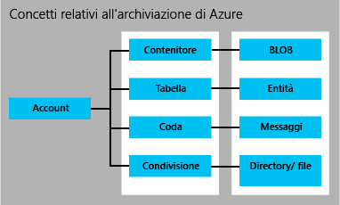

<properties 
	pageTitle="Introduzione ad Archiviazione | Microsoft Azure" 
	description="Informazioni generali su Archiviazione di Microsoft Azure." 
	services="storage" 
	documentationCenter="" 
	authors="tamram" 
	manager="adinah" 
	editor=""/>

<tags 
	ms.service="storage" 
	ms.workload="storage" 
	ms.tgt_pltfrm="na" 
	ms.devlang="na" 
	ms.topic="article" 
	ms.date="01/05/2016" 
	ms.author="tamram"/>

# Introduzione ad Archiviazione di Microsoft Azure

## Panoramica

Questo articolo fornisce un’introduzione estesa a Archiviazione di Microsoft Azure per gli sviluppatori, i professionisti IT e i decisori aziendali. Leggendo l'articolo si apprenderà:

- Che cos'è Archiviazione di Azure e come è possibile usarlo nelle applicazioni cloud, mobili, server e desktop
- Quali tipi di dati è possibile archiviare con i servizi Archiviazione di Azure: archiviazione BLOB, tabelle, code e file
- Come viene gestito l'accesso ai dati in Archiviazione di Azure
- Come vengono protetti i dati di Archiviazione di Azure tramite la ridondanza e la replica 
- Come procedere per creare la prima applicazione di Archiviazione di Azure

Per un’introduzione rapida all’uso di Archiviazione di Azure, vedere [Introduzione all’uso di BLOB, tabelle e code di Azure in 5 minuti](storage-getting-started-guide.md)

Se si sta cercando una panoramica rapida di livello elevato di Archiviazione, consultare questo articolo oppure, per una panoramica specifica del prodotto, vedere BLOB di Azure, Tabelle di Azure, Code di Azure e File di Azure.

## Informazioni su Archiviazione di Azure

Il cloud computing consente di disporre di nuovi scenari per le applicazioni che richiedono un sistema di archiviazione scalabile, durevole e a disponibilità elevata per i propri dati. Questo è esattamente lo scopo per cui è stato sviluppato Archiviazione di Microsoft Azure. Oltre a consentire agli sviluppatori di compilare applicazioni di grande portata per supportare nuovi scenari, Archiviazione di Azure offre anche la base di archiviazione per il servizio Macchine virtuali di Azure, un'ulteriore prova della sua affidabilità.

Archiviazione di Azure è estremamente scalabile, per consentire l'archiviazione e l'elaborazione di centinaia di terabyte di dati per supportare gli scenari di Big Data necessari per applicazioni scientifiche, di analisi finanziaria e multimediali. In alternativa, è possibile archiviare piccole quantità di dati necessarie per un piccolo sito Web aziendale. Qualsiasi siano le esigenze, il cliente paga solo per i dati archiviati. In Archiviazione di Azure sono al momento archiviate decine di migliaia di miliardi di oggetti univoci dei clienti e sono gestiti in media milioni di richieste al secondo.

Archiviazione di Azure è un servizio flessibile, per consentire la progettazione di applicazioni per un pubblico vasto e globale e per ridimensionare tali applicazioni in base alle esigenze, sia in termini di quantità di dati archiviati che di numero di richieste effettuate su tali dati. Il cliente paga solo per ciò che utilizza e solo quando lo utilizza.

Archiviazione di Azure utilizza un sistema di partizionamento automatico che applica automaticamente il bilanciamento del carico dei dati in base al traffico. Pertanto, se le richieste dell'applicazione aumentano, vengono automaticamente allocate le risorse appropriate per soddisfare le nuove esigenze.

Archiviazione di Azure è accessibile da qualsiasi luogo, da qualsiasi tipo di applicazione, sia che venga eseguita nel cloud, in un desktop, in un server locale o in un dispositivo mobile o un tablet. È possibile usare Archiviazione di Azure in scenari mobili in cui l'applicazione archivia un subset di dati nel dispositivo e li sincronizza con un set completo di dati archiviati nel cloud.

Archiviazione di Azure supporta client che utilizzano vari sistemi operativi (inclusi Windows e Linux) e numerosi linguaggi di programmazione (inclusi .NET, Java e C++) per facilitare le operazioni di sviluppo. Espone inoltre le risorse di dati tramite API REST semplici, disponibili per qualsiasi client in grado di inviare e ricevere dati tramite HTTP/HTTPS.

L'archiviazione premium di Azure offre prestazioni elevate, supporto disco a bassa latenza per carichi di lavoro con uso intensivo di I/O in esecuzione su Macchine virtuali di Azure. Con l'archiviazione premium di Azure, è possibile collegare più dischi di dati permanenti a una macchina virtuale e configurarli per poter soddisfare i requisiti di prestazioni. Ogni disco di dati è supportato da un disco SSD nell'archiviazione premium di Azure per le massime prestazioni di I/O. Per altre informazioni, vedere [Archiviazione premium: archiviazione ad alte prestazioni per carichi di lavoro delle macchine virtuali di Azure](../storage-premium-storage-preview-portal).

## Presentazione dei servizi di archiviazione di Azure

Un account di archiviazione di Azure è un account sicuro che consente di accedere ai servizi in Archiviazione di Azure. L'account di archiviazione offre uno spazio dei nomi univoco per le risorse di archiviazione. Sono disponibili due tipi di account di archiviazione:

- Un account di archiviazione standard include l'archiviazione BLOB, tabelle, di accodamento e file.
- Un account di archiviazione premium attualmente supporta solo dischi di macchine virtuali di Azure.

Prima di creare un account di archiviazione, è necessario effettuare una sottoscrizione di Azure, ovvero a un piano per accedere ai diversi servizi di Azure. [È possibile creare un massimo di 100 account di archiviazione con denominazione univoca con una singola sottoscrizione.](../azure-subscription-service-limits.md) Vedere i [dettagli sui prezzi di Archiviazione](http://azure.microsoft.com/pricing/details/storage/) per informazioni sui prezzi in base al volume.

Per iniziare a usare Azure, è possibile scaricare una [versione di valutazione gratuita](http://azure.microsoft.com/pricing/free-trial/). Se si decide di acquistare un piano, è possibile scegliere una delle numerose [opzioni di vendita](http://azure.microsoft.com/pricing/purchase-options/). Gli utenti [iscritti a MSDN](http://azure.microsoft.com/pricing/member-offers/msdn-benefits-details/) ricevono crediti mensili gratuiti che possono essere usati con i servizi di Azure, incluso il servizio Archiviazione di Azure.

### Account di archiviazione standard

Un account di archiviazione standard consente di accedere all'archiviazione BLOB, all'archiviazione tabelle, all'archiviazione di accodamento e all'archiviazione file:

- Nell'**archiviazione BLOB** sono archiviati i dati di file. Un BLOB può essere qualsiasi tipo di dati di testo o binari, ad esempio un documento, un file multimediale o un programma di installazione di un'applicazione. L'archiviazione BLOB è talvolta denominata archiviazione di oggetti. 
- Nell'**archiviazione tabelle** sono archiviati set di dati strutturati. L'archiviazione delle tabelle utilizza un archivio dati chiave-attributo NoSQL, che consente lo sviluppo e l'accesso rapido a grandi quantità di dati.
- L'**archiviazione code** offre un sistema di messaggistica affidabile per l'elaborazione del flusso di lavoro e per la comunicazione tra i componenti dei servizi cloud.
- L'**archiviazione file** offre uno spazio di archiviazione condiviso per le applicazioni legacy che usano il protocollo SMB standard. Le macchine virtuali e i servizi cloud di Azure possono condividere dati file tra componenti delle applicazioni tramite le condivisioni montate e le applicazioni locali possono accedere ai dati file in una condivisione tramite l'API REST del servizio file. 

Ogni account di archiviazione standard può includere fino a 500 TB di dati combinati di BLOB, code, tabelle e file. Per informazioni sulla capacità dell'account di archiviazione standard, vedere [Obiettivi di scalabilità e prestazioni di Archiviazione di Azure](storage-scalability-targets.md).

La figura seguente mostra le relazioni tra le risorse di archiviazione di Azure in un account di archiviazione standard:

Per informazioni su come creare un account di archiviazione standard, vedere [Creare, gestire o eliminare un account di archiviazione](storage-create-storage-account.md).

### Account di archiviazione premium

L'archiviazione premium di Azure attualmente supporta solo dischi di macchine virtuali di Azure. Per una panoramica approfondita di Archiviazione premium di Azure vedere [Archiviazione premium: archiviazione ad alte prestazioni per carichi di lavoro delle macchine virtuali di Azure](http://go.microsoft.com/fwlink/?LinkId=521898).

[AZURE.INCLUDE [storage-versions-include](../../includes/storage-versions-include.md)]

## Archiviazione BLOB

Per gli utenti che dispongono di grandi quantità di dati non strutturati da archiviare nel cloud, l'archiviazione BLOB offre una soluzione conveniente e scalabile. È possibile usare gli archivi BLOB per archiviare contenuto come:

- Documenti 
- Dati dei social network come foto, video, musica e blog
- Backup di file, computer, database e dispositivi
- Immagini e testo per applicazioni Web
- Dati di configurazione per applicazioni cloud
- Big Data, come log e altri set di dati di grandi dimensioni

Ogni BLOB è organizzato in un contenitore. I contenitori sono inoltre una soluzione utile per assegnare criteri di sicurezza a gruppi di oggetti. Un account di archiviazione può contenere un numero qualsiasi di contenitori e un contenitore può contenere un numero qualsiasi di BLOB, fino a che non viene raggiunto il limite di capacità di 500 TB dell'account di archiviazione.

Gli archivi BLOB offrono tre tipi di BLOB: i BLOB in blocchi , i BLOB di accodamento e i BLOB di pagine (dischi). I BLOB in blocchi sono ottimizzati per lo streaming e l'archiviazione di oggetti cloud e sono una soluzione adatta per l'archiviazione di documenti, file multimediali, backup e così via. I BLOB di accodamento sono simili ai BLOB in blocchi, ma ottimizzati per le operazioni di Accodamento. Un BLOB di accodamento può essere aggiornato solo aggiungendo un nuovo blocco alla fine. I BLOB di accodamento sono una buona scelta per scenari quali la registrazione, dove i nuovi dati devono essere scritti solo fino alla fine del BLOB.

I BLOB di pagine sono ottimizzati per la rappresentazione di dischi IaaS e per il supporto di scritture casuali. Possono raggiungere una dimensione massima di 1 TB. Un disco IaaS collegato a una rete di macchine virtuali Azure è un disco rigido virtuale archiviato come BLOB di pagine.

Se si dispone di set di dati molto grandi e i vincoli della rete ne impediscono il caricamento o il download in archivi BLOB tramite una connessione, è possibile spedire un'unità disco rigido a Microsoft per importare o esportare i dati direttamente dal data center tramite il [Servizio Importazione/Esportazione di Azure](storage-import-export-service.md). È inoltre possibile copiare i dati BLOB all'interno del proprio account di archiviazione o tra account di archiviazione diversi.

## Archiviazione tabelle

Le applicazioni moderne spesso richiedono l'utilizzo di archivi dati con scalabilità e flessibilità maggiori di quelli delle versioni precedenti del software. Il servizio di archiviazione tabelle offre un archivio a disponibilità elevata e altamente scalabile, per consentire la scalabilità automatica dell'applicazione in base alle richieste degli utenti. Archiviazione tabelle è l'archivio chiave-attributo NoSQL di Microsoft. Ha una struttura senza schema, il che lo rende diverso dai database relazionali tradizionali. Con un archivio dati senza schema è facile adattare i dati con il variare delle esigenze dell'applicazione. L'archiviazione tabelle è semplice da usare e consente di velocizzare lo sviluppo e la creazione di applicazioni. L'accesso ai dati è rapido e conveniente per tutti i tipi di applicazione. L'archiviazione tabelle presenta in genere costi decisamente più bassi rispetto alle soluzioni SQL tradizionali per volumi simili di dati.

Archiviazione tabelle è un archivio chiave-attributo, ovvero ogni valore di una tabella è archiviato con un nome di proprietà tipizzato che può essere usato per filtrare i dati e specificare i criteri di selezione. Una raccolta di proprietà con i rispettivi valori costituisce un'entità. Poiché l'archiviazione tabelle non ha uno schema, due entità della stessa tabella possono contenere raccolte diverse di proprietà, che possono essere di tipi diversi.

È possibile usare l'archiviazione tabelle per archiviare set di dati flessibili, ad esempio i dati utente per le applicazioni Web, le rubriche, le informazioni sui dispositivi e altri tipi di metadati richiesti dal servizio. In una tabella possono essere archiviate il numero desiderato di tabelle e un account di archiviazione può contenere un numero qualsiasi di tabelle, fino a che non viene raggiunto il limite di capacità dell'account di archiviazione.

In modo analogo ai BLOB e alle code, gli sviluppatori possono gestire e accedere all'archivio tabelle tramite protocolli REST standard, anche se l'archiviazione tabelle supporta anche un subset del protocollo OData, per semplificare le funzionalità di query avanzate e abilitare i formati JSON e AtomPub (basato su XML).

Per le attuali applicazioni basate su Internet, i database NoSQL come l'archivio tabelle offrono una comoda alternativa ai database relazionali tradizionali.

## Archiviazione di accodamento

Durante la progettazione di applicazioni scalabili, i componenti dell'applicazione vengono spesso separati, per poter essere scalati in modo indipendente. L'archiviazione di accodamento offre una soluzione di messaggistica affidabile per la comunicazione asincrona tra i componenti dell'applicazione, che possono essere eseguiti nel cloud, in un desktop, in un server locale o in un dispositivo mobile. Supporta inoltre la gestione di attività asincrone e la creazione di flussi di lavoro dei processi.

Un account di archiviazione può contenere il numero desiderato di code. Una coda può contenere un numero qualsiasi di messaggi, fino al raggiungimento del limite di capacità dell'account di archiviazione. I singoli messaggi possono avere una dimensione massima di 64 KB.

## Archiviazione file

Archiviazione file offre condivisioni file SMB basate sul cloud per consentire la migrazione delle applicazioni legacy ad Azure in modo veloce e senza costi di riscrittura. Archiviazione di File di Azure, le applicazioni in esecuzione in macchine virtuali di Azure o i servizi cloud consentono di montare una condivisione di file nel cloud, esattamente come un'applicazione desktop che consente di montare una condivisione SMB tipica. Non ci sono limiti per i componenti delle applicazioni che possono montare e accedere contemporaneamente alla condivisione di archiviazione file.

Poiché una condivisione di archiviazione file è una condivisione file SMB standard, le applicazioni in esecuzione in Azure possono accedere ai dati nella condivisione tramite le API di I/O del file system. Gli sviluppatori possono quindi riutilizzare il codice esistente e le competenze acquisite per eseguire la migrazione delle applicazioni esistenti. I professionisti IT possono usare i cmdlet di PowerShell per creare, montare e gestire condivisioni di archiviazione file nell'ambito delle attività di amministrazione per le applicazioni Azure.

Come altri servizi di archiviazione di Azure, archiviazione file espone un'API REST per l'accesso ai dati in una condivisione. Le applicazioni locali possono chiamare l'API REST di archiviazione file per accedere ai dati in una condivisione file. Le aziende possono quindi decidere di eseguire la migrazione di alcune applicazioni legacy ad Azure e di continuare a eseguirne altre dall'interno dell'organizzazione locale. Si noti che è possibile montare una condivisione file solo per le applicazioni in esecuzione in Azure. Le applicazioni locali possono accedere alla condivisione file solo tramite l'API REST.

Le applicazioni distribuite possono anche usare l'archiviazione file per archiviare e condividere dati di applicazioni e strumenti di sviluppo e test utili. Ad esempio, un'applicazione può archiviare file di configurazione e dati di diagnostica quali log, metriche e dump di arresto anomalo del sistema in una condivisione di archiviazione file in modo che siano disponibili per più macchine virtuali o ruoli. Gli sviluppatori e gli amministratori possono archiviare le utilità necessarie per compilare o gestire un'applicazione in una condivisione di archiviazione file disponibile per tutti i componenti anziché installarle in ogni macchina virtuale o istanza del ruolo.

## Accedere a risorse BLOB, tabelle, accodamento e file

Per impostazione predefinita, solo il proprietario dell'account di archiviazione può accedere alle risorse dell'account. Per garantire la sicurezza dei dati, ogni richiesta di risorse dell'account deve essere autenticata. L'autenticazione si basa su un modello di chiave condivisa. I BLOB possono inoltre essere configurati per supportare l'autenticazione anonima.

Durante la creazione dell'account di archiviazione, vengono assegnate due chiavi di accesso private utilizzate per l'autenticazione. La presenza di due chiavi garantisce la disponibilità dell'applicazione quando si rigenerano le chiavi nell'ambito delle normali operazioni di gestione delle chiavi di sicurezza.

Se è necessario consentire agli utenti l'accesso controllato alle risorse di archiviazione, è possibile creare una [firma di accesso condiviso](storage-dotnet-shared-access-signature-part-1.md). Una firma di accesso condiviso (SAS) è un token che può essere aggiunto a un URL per consentire l'accesso delegato a una risorsa di archiviazione. Coloro che possiedono il token possono accedere alla risorsa a cui esso fa riferimento con le autorizzazioni specificate e per il periodo di validità del token stesso. A partire dalla versione del 4/5/2015, Archiviazione di Azure supporta due tipi di firme di accesso condiviso: firma di accesso condiviso del servizio e firma di accesso condiviso dell'account.

La firma di accesso condiviso del servizio delega l'accesso a una risorsa in uno solo dei servizi di archiviazione, ovvero nel servizio BLOB, nel servizio di accodamento, nel servizio tabelle o nel servizio file.

Una firma di accesso condiviso dell'account delega l'accesso alle risorse in uno o più servizi di archiviazione. È possibile delegare l'accesso alle operazioni a livello di servizio che non sono disponibili con un servizio SAS. È anche possibile delegare l'accesso alle operazioni di lettura, scrittura ed eliminazioni in contenitori BLOB, tabelle, code e condivisioni file, che con una firma di accesso condiviso del servizio non è consentito.

È infine possibile specificare che un contenitore e i relativi BLOB o che un BLOB specifico sia disponibile per l'accesso pubblico. Quando si indica che un contenitore o un BLOB è pubblico, qualsiasi utente lo potrà leggere in forma anonima, in quanto non è necessaria l'autenticazione. I contenitori e i BLOB pubblici sono utili per esporre risorse come file multimediali e documenti ospitati in siti Web. Per ridurre la latenza di rete per un pubblico globale, è possibile memorizzare nella cache i dati BLOB usati dai siti Web con la rete CDN di Azure.

Vedere [Gestire l'accesso alle risorse di archiviazione di Azure](storage-manage-access-to-resources.md) e [Autenticazione per i servizi di archiviazione di Azure](https://msdn.microsoft.com/library/azure/dd179428.aspx) per ulteriori informazioni sull'accesso protetto all'account di archiviazione.

## Replica per garantire la durabilità e la disponibilità elevata

[AZURE.INCLUDE [storage-replication-options-include](../../includes/storage-replication-options-include.md)]

## Prezzi

I costi addebitati ai clienti per Archiviazione di Azure si basano su quattro fattori: la capacità di archiviazione usata, l'opzione di replica selezionata, il numero di richieste effettuate al servizio e i dati in uscita.

La capacità di archiviazione fa riferimento alla quantità di unità di servizio dell'account di archiviazione in uso per l'archiviazione dei dati. Il costo dell'archiviazione dei dati è determinato dalla quantità di dati archiviata e dalla modalità di replica dei dati. Ogni operazione di lettura e scrittura in Archiviazione di Azure effettua anche una richiesta al servizio. I dati in uscita sono i dati trasferiti al di fuori di un'area di Microsoft Azure. Quando un'applicazione non in esecuzione nella stessa area geografica accede ai dati nell'account di archiviazione, indipendentemente dal fatto che l'applicazione sia un servizio cloud o un altro tipo di applicazione, verrà addebitato il trasferimento dei dati in uscita. Per i servizi di Microsoft Azure è possibile raggruppare dati e servizi negli stessi data center per ridurre o eliminare gli addebiti per il trasferimento dei dati e dei processi in uscita.

Nella pagina [Dettagli prezzi di archiviazione](http://azure.microsoft.com/pricing/details/storage/) vengono fornite informazioni dettagliate sui prezzi per la capacità, la replica e le transazioni relative all'archiviazione. Nella pagina [Dettagli prezzi dei trasferimenti di dati](http://azure.microsoft.com/pricing/details/data-transfers/) vengono fornite informazioni dettagliate sui prezzi per il trasferimento dei dati in uscita. È possibile usare la pagina per il [calcolo dei prezzi di Archiviazione di Azure](http://azure.microsoft.com/pricing/calculator/?scenario=data-management) per stimare i costi.

## Sviluppo per l'archiviazione

Archiviazione di Azure espone risorse di archiviazione tramite un'[API REST](http://msdn.microsoft.com/library/azure/dd179355.aspx) che può essere chiamata da qualsiasi linguaggio in grado di effettuare richieste HTTP/HTTPS. In Archiviazione di Azure sono inoltre disponibili librerie di programmazione per diversi linguaggi comuni. Tali librerie semplificano molti aspetti dell'utilizzo di Archiviazione di Azure gestendo dettagli come la chiamata sincrona e asincrona, l'esecuzione delle operazioni in batch, la gestione delle eccezioni, la ripetizione automatica dei tentativi, il comportamento operativo e così via. Le librerie attualmente disponibili riguardano i linguaggi e le piattaforme seguenti, ma presto ne saranno disponibili altre:

- [.NET](http://go.microsoft.com/fwlink/?LinkID=390731)
- [Codice nativo](http://msdn.microsoft.com/library/azure/dn495438.aspx)
- [Java/Android](/develop/java/)
- [Node.JS](/develop/nodejs/)
- [PHP](/develop/php/)
- [Ruby](/develop/ruby/)
- [Python](/develop/python/)
- [PowerShell](http://msdn.microsoft.com/library/azure/dn495240.aspx)

## Passaggi successivi

Per iniziare a usare Archiviazione di Azure, vedere le risorse seguenti:

### Download

- [Pacchetto NuGet per l'Archiviazione di Azure - Librerie client per .NET, Windows Phone e Windows Runtime](https://www.nuget.org/packages/WindowsAzure.Storage/)
- [Azure SDK e strumenti](http://azure.microsoft.com/downloads/)
- [Emulatore di archiviazione di Azure](http://www.microsoft.com/en-in/download/details.aspx?id=43709)
- [Azure PowerShell](http://go.microsoft.com/?linkid=9811175&clcid=0x409)

### Codice sorgente

- [Librerie di Archiviazione di Microsoft Azure per .NET](https://github.com/Azure/azure-storage-net)

### Documentazione

- [Documentazione di Archiviazione di Azure](http://azure.microsoft.com/documentation/services/storage/)
- [Informazioni di riferimento sulle API REST dei servizi di archiviazione di Azure](http://msdn.microsoft.com/library/azure/dd179355.aspx)
- [Introduzione all'utilità della riga di comando AzCopy](storage-use-azcopy.md)

### Per gli utenti PowerShell
- [Uso di Azure PowerShell con Archiviazione di Azure](storage-powershell-guide-full.md)
- [Cmdlet di archiviazione di Azure per la gestione dei servizi](http://msdn.microsoft.com/library/azure/dn806401.aspx)
- [Cmdlet di archiviazione di Azure per Gestione risorse di Azure](https://msdn.microsoft.com/library/azure/mt269418.aspx)

### Per gli sviluppatori .NET

- [Informazioni di riferimento sulla libreria client .NET](http://msdn.microsoft.com/library/azure/wa_storage_30_reference_home.aspx)
- [Come usare l'archiviazione BLOB da .NET](storage-dotnet-how-to-use-blobs.md)
- [Come usare l'archiviazione tabelle da .NET](storage-dotnet-how-to-use-tables.md)
- [Come usare l'archiviazione di accodamento da .NET](storage-dotnet-how-to-use-queues.md)
- [Come usare l'archiviazione file di Azure con PowerShell e .NET](storage-dotnet-how-to-use-files.md)

### Per sviluppatori Java/Android

- [Informazioni di riferimento sulla libreria client Java](http://dl.windowsazure.com/storage/javadoc/)
- [Come usare l'archiviazione BLOB da Java/Android](../storage-java-how-to-use-blob-storage/)
- [Come usare l'archiviazione tabelle da Java/Android](../storage-java-how-to-use-table-storage/)
- [Come usare l'archiviazione di accodamento da Java/Android](../storage-java-how-to-use-queue-storage/)

### Per gli sviluppatori Node.js

- [Come usare l'archiviazione BLOB da Node.js](storage-nodejs-how-to-use-blob-storage.md)
- [Come usare l'archiviazione tabelle da Node.js](storage-nodejs-how-to-use-table-storage.md)
- [Come usare l'archiviazione di accodamento da Node.js](storage-nodejs-how-to-use-queues.md)

### Per gli sviluppatori PHP

- [Come usare l'archiviazione BLOB da PHP](storage-php-how-to-use-blobs.md)
- [Come usare l'archiviazione tabelle da PHP](storage-php-how-to-use-table-storage.md)
- [Come usare l'archiviazione di accodamento da PHP](storage-php-how-to-use-queues.md)

### Per gli sviluppatori Ruby

- [Come usare l'archiviazione BLOB da Ruby](storage-ruby-how-to-use-blob-storage.md)
- [Come usare l'archiviazione tabelle da Ruby](storage-ruby-how-to-use-table-storage.md)
- [Come usare l'archiviazione di accodamento da Ruby](storage-ruby-how-to-use-queue-storage.md)

### Per gli sviluppatori Python

- [Come usare l'archiviazione BLOB da Python](storage-python-how-to-use-blob-storage.md)
- [Come usare l'archiviazione tabelle da Python](storage-python-how-to-use-table-storage.md)
- [Come usare l'archiviazione di accodamento da Python](storage-python-how-to-use-queue-storage.md)
 

<!---HONumber=AcomDC_0107_2016-->