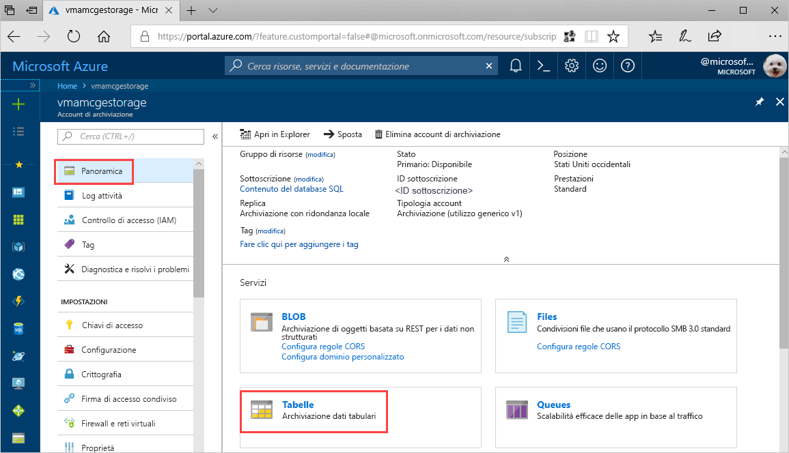
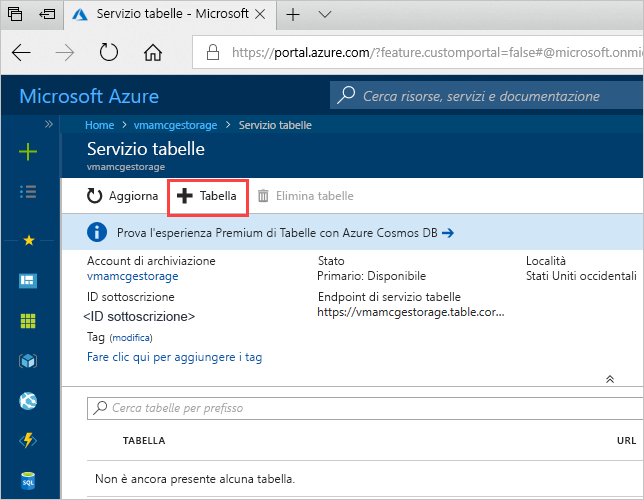
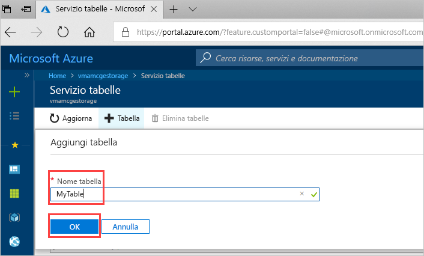

# Guida introduttiva: Creare una tabella di archiviazione di Azure nel portale di Azure 

Questa guida introduttiva mostra come creare tabelle ed entità nel portale di Azure basato sul Web. Questa guida introduttiva illustra anche come creare un account di archiviazione di Azure.

[!INCLUDE [quickstarts-free-trial-note](../../../includes/quickstarts-free-trial-note.md)]

## prerequisiti

Per completare questa guida introduttiva, per prima cosa creare un account di archiviazione di Azure nel [portale di Azure](https://portal.azure.com/#create/Microsoft.StorageAccount-ARM). Per informazioni sulla creazione dell'account, vedere [Creare un account di archiviazione](../common/storage-quickstart-create-account.md).

## Aggiungere una tabella

È ora possibile usare il servizio tabelle nel portale di Azure per creare una tabella.

1. Fare clic su Panoramica > Tabelle.

   

2. Fare clic su **+ Tabella**.

   

3. Digitare un nome per la tabella nella casella **Nome tabella** e quindi fare clic su **OK**. 

   

## Passaggi successivi

- [Linee guida per la progettazione di tabelle](table-storage-design-guidelines.md)