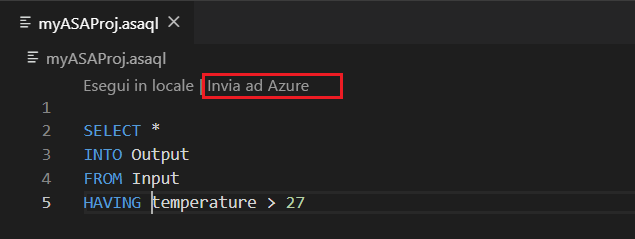

# Copiare o eseguire il backup dei processi di Analisi di flusso di AzureCopy or back up Azure Stream Analytics jobs

È possibile copiare o eseguire il backup dei processi di Analisi di flusso di Azure distribuiti usando Visual Studio Code o Visual Studio.You can copy or back up your deployed Azure Stream Analytics jobs using Visual Studio Code or Visual Studio. 

## Prima di iniziare
* Se non si dispone di una sottoscrizione di Azure, creare un [account gratuito.](https://azure.microsoft.com/free/)

* Accedere al [portale](https://portal.azure.com/)di Azure .

* Installare [l'estensione Analisi flusso](quick-create-vs-code.md#install-the-azure-stream-analytics-tools-extension) di Azure per visual studio Code o gli strumenti di Analisi di flusso di Azure per Visual [Studio.](quick-create-vs-code.md#install-the-azure-stream-analytics-tools-extension)  

## Visual Studio Code

1. Fare clic sull'icona di **Azure** nella barra delle attività del codice di Visual Studio e quindi espandere il nodo **Analisi flusso.** I processi devono essere visualizzati sotto le sottoscrizioni.

   

2. Per esportare un processo in un progetto locale, individuare il processo che si desidera esportare in Esplora analisi di flusso nel codice di Visual Studio.To export a job to a local project, locate the job you wish to export in the **Stream Analytics Explorer** in Visual Studio Code. Quindi selezionare una cartella per il progetto.

    

    Il progetto viene esportato nella cartella selezionata e aggiunto nell'area di lavoro corrente.

    

3. Per pubblicare il processo in un'altra area o backup utilizzando un\*altro nome, selezionare Seleziona dalle sottoscrizioni da **pubblicare** nell'editor di query (.asaql) e seguire le istruzioni.

    

## Visual Studio

1. Seguire le istruzioni per l'esportazione di un processo [di Analisi di flusso di Azure distribuito in un progetto.](https://docs.microsoft.com/azure/stream-analytics/stream-analytics-vs-tools#export-jobs-to-a-project)

2. Aprire \*il file con estensione asaql nell'editor di query, selezionare **Invia ad Azure** nell'editor di script e seguire le istruzioni per pubblicare il processo in un'altra area o eseguire il backup usando un nuovo nome.

## Passaggi successivi

* [Guida introduttiva: Creare un processo di Analisi di flusso usando il codice di Visual StudioQuickstart: Create a Stream Analytics job by using Visual Studio Code](quick-create-vs-code.md)
* [Guida introduttiva: Creare un processo di Analisi di flusso tramite Visual StudioQuickstart: Create a Stream Analytics job by using Visual Studio](stream-analytics-quick-create-vs.md)
* [Distribuire un processo di Analisi di flusso di Azure con CI/CD usando Azure Pipelines](stream-analytics-tools-visual-studio-cicd-vsts.md)
