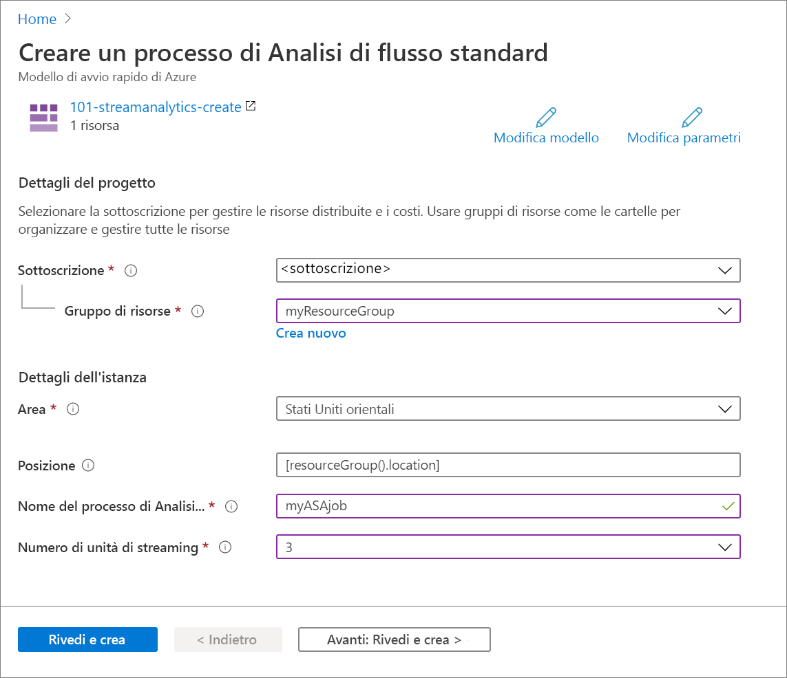

# <a name="quickstart-create-an-azure-stream-analytics-job-by-using-an-arm-template"></a>Avvio rapido: Creare un processo di Analisi di flusso di Azure con un modello di Resource Manager

In questo argomento di avvio rapido si usa un modello di Azure Resource Manager per creare un processo di Analisi di flusso di Azure. Una volta creato il processo, è possibile convalidare la distribuzione.

[!INCLUDE [About Azure Resource Manager](../../includes/resource-manager-quickstart-introduction.md)]

Se l'ambiente soddisfa i prerequisiti e si ha familiarità con l'uso dei modelli di Resource Manager, selezionare il pulsante **Distribuisci in Azure**. Il modello verrà aperto nel portale di Azure.

[](https://portal.azure.com/#create/Microsoft.Template/uri/https%3A%2F%2Fraw.githubusercontent.com%2FAzure%2Fazure-quickstart-templates%2Fmaster%2F101-streamanalytics-create%2Fazuredeploy.json)

## <a name="prerequisites"></a>Prerequisiti

Per completare questo articolo, sono necessari gli elementi seguenti:

* Una sottoscrizione di Azure: [creare un account gratuito](https://azure.microsoft.com/free/).

## <a name="review-the-template"></a>Rivedere il modello

Il modello usato in questo avvio rapido proviene dai [modelli di avvio rapido di Azure](https://azure.microsoft.com/resources/templates/101-streamanalytics-create/).

:::code language="json" source="~/quickstart-templates/101-streamanalytics-create/azuredeploy.json":::

La risorsa di Azure definita nel modello è [Microsoft.StreamAnalytics/StreamingJobs](/azure/templates/microsoft.streamanalytics/streamingjobs): creare un processo di Analisi di flusso di Azure.

## <a name="deploy-the-template"></a>Distribuire il modello

In questa sezione viene creato un processo di Analisi di flusso di Azure usando il modello di Azure Resource Manager.

1. Selezionare l'immagine seguente per accedere ad Azure e aprire un modello. Il modello crea un processo di Analisi di flusso di Azure.

   [](https://portal.azure.com/#create/Microsoft.Template/uri/https%3A%2F%2Fraw.githubusercontent.com%2FAzure%2Fazure-quickstart-templates%2Fmaster%2F101-streamanalytics-create%2Fazuredeploy.json)

2. Specificare i valori richiesti per creare il processo di Analisi di flusso di Azure.

   

   Specificare i valori seguenti:

   |Proprietà  |Descrizione  |
   |---------|---------|
   |**Sottoscrizione**     | Selezionare la sottoscrizione di Azure nell'elenco a discesa.        |
   |**Gruppo di risorse**     | Specificare se si vuole creare un nuovo gruppo di risorse o usarne uno esistente. Un gruppo di risorse è un contenitore con risorse correlate per una soluzione Azure. Per altre informazioni, vedere [Panoramica di Gestione risorse di Microsoft Azure](../azure-resource-manager/management/overview.md). |
   |**Area**     | Selezionare **Stati Uniti orientali**. Per le altre aree disponibili, vedere [Prodotti disponibili in base all'area](https://azure.microsoft.com/regions/services/).        |
   |**Nome del processo di Analisi di flusso**     | Specificare un nome per il processo di Analisi di flusso.      |
   |**Numero di unità di streaming**     |  Scegliere il numero di unità di streaming necessario. Per altre informazioni, vedere [Informazioni e modifica delle unità di streaming](stream-analytics-streaming-unit-consumption.md).       |

3. Selezionare **Rivedi e crea** e quindi **Crea**.

## <a name="review-deployed-resources"></a>Esaminare le risorse distribuite

È possibile usare il portale di Azure per controllare il processo di Analisi di flusso di Azure oppure lo script dell'interfaccia della riga di comando di Azure o di Azure PowerShell seguente per elencare la risorsa.

### <a name="azure-cli"></a>Interfaccia della riga di comando di Azure

```azurecli-interactive
echo "Enter your Azure Stream Analytics job name:" &&
read streamAnalyticsJobName &&
echo "Enter the resource group where the Azure Stream Analytics job exists:" &&
read resourcegroupName &&
az stream-analytics job show -g $resourcegroupName -n $streamAnalyticsJobName
```

### <a name="azure-powershell"></a>Azure PowerShell

```azurepowershell-interactive
$resourceGroupName = Read-Host -Prompt "Enter the resource group name where your Azure Stream Analytics job exists"
(Get-AzResource -ResourceType "Microsoft.StreamAnalytics/StreamingJobs" -ResourceGroupName $resourceGroupName).Name
 Write-Host "Press [ENTER] to continue..."
```

## <a name="clean-up-resources"></a>Pulire le risorse

Se si prevede di usare le esercitazioni successive, è consigliabile non cancellare le risorse create. Quando non è più necessario, eliminare il gruppo di risorse per eliminare il processo di Analisi di flusso di Azure. Per eliminare il gruppo di risorse con l'interfaccia della riga di comando di Azure oppure con Azure PowerShell:

### <a name="azure-cli"></a>Interfaccia della riga di comando di Azure

```azurecli-interactive
echo "Enter the Resource Group name:" &&
read resourceGroupName &&
az group delete --name $resourceGroupName &&
echo "Press [ENTER] to continue ..."
```

### <a name="azure-powershell"></a>Azure PowerShell

```azurepowershell-interactive
$resourceGroupName = Read-Host -Prompt "Enter the Resource Group name"
Remove-AzResourceGroup -Name $resourceGroupName
Write-Host "Press [ENTER] to continue..."
```

## <a name="next-steps"></a>Passaggi successivi

In questo argomento di avvio rapido è stato creato un processo di Analisi di flusso di Azure usando un modello di Azure Resource Manager ed è stata convalidata la distribuzione. Passare all'articolo successivo per informazioni su come esportare un modello di Azure Resource Manager per un processo esistente usando VS Code.

> [!div class="nextstepaction"]
> [Esportare un modello di Resource Manager per un processo di Analisi di flusso di Azure ](resource-manager-export.md)
