# <a name="quickstart-create-an-azure-stream-analytics-job-in-visual-studio-code-preview"></a>Guida introduttiva: Creare un processo di Analisi di flusso di Azure in Visual Studio Code (anteprima)

Questo argomento di avvio rapido descrive come creare ed eseguire un processo di Analisi di flusso di Azure usando l'estensione di Strumenti Analisi di flusso di Azure per Visual Studio Code. Il processo di esempio legge i dati in streaming da un dispositivo hub IoT di Azure. Viene definito un processo che calcola la temperatura media quando supera i 27° e scrive gli eventi di output risultanti in un nuovo file nell'archiviazione BLOB.

> [!NOTE]
> Gli strumenti di Visual Studio e Visual Studio Code non supportano i processi nelle aree Cina orientale, Cina settentrionale, Germania centrale e Germania nord-orientale.

## <a name="before-you-begin"></a>Prima di iniziare

* Se non si ha una sottoscrizione di Azure, creare un [account gratuito](https://azure.microsoft.com/free/).

* Accedere al [portale di Azure](https://portal.azure.com/).

* Installare [Visual Studio Code](https://code.visualstudio.com/).

## <a name="install-the-azure-stream-analytics-tools-extension"></a>Installare l'estensione di Strumenti Analisi di flusso di Azure

1. Aprire Visual Studio Code.

2. In **Estensioni** nel riquadro a sinistra cercare **Analisi di flusso** e selezionare **Installa** per l'estensione **Strumenti Analisi di flusso di Azure**.

3. Dopo aver installato l'estensione, verificare che **Strumenti Analisi di flusso di Azure** sia visibile nelle **estensioni abilitate**.

   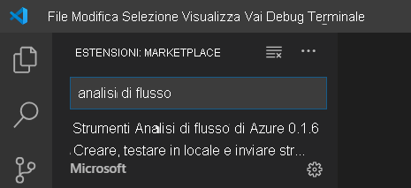

## <a name="activate-the-azure-stream-analytics-tools-extension"></a>Attivare l'estensione di Strumenti Analisi di flusso di Azure

1. Selezionare l'icona **Azure** sulla barra delle attività di Visual Studio Code. In **Analisi di flusso** sulla barra laterale selezionare **Accedi ad Azure**.

   

2. Una volta eseguito l'accesso, il nome dell'account Azure viene visualizzato sulla barra di stato nell'angolo inferiore sinistro della finestra di Visual Studio Code.

> [!NOTE]
> Se non viene eseguita la disconnessione, la volta successiva l'estensione di Strumenti di Analisi di flusso di Azure eseguirà automaticamente l'accesso. Se l'account prevede l'autenticazione a due fattori, è consigliabile usare l'autenticazione tramite telefono anziché un PIN.
> In caso di problemi con la creazione di elenchi delle risorse, risulta generalmente utile eseguire la disconnessione e quindi riconnettersi. Per disconnettersi, immettere il comando `Azure: Sign Out`.

## <a name="prepare-the-input-data"></a>Preparare i dati di input

Prima di definire il processo di Analisi di flusso, è necessario preparare i dati che saranno poi configurati come input del processo. Per preparare i dati di input richiesti dal processo, completare questa procedura:

1. Accedere al [portale di Azure](https://portal.azure.com/).

2. Selezionare **Crea una risorsa** > **Internet delle cose** > **Hub IoT**.

3. Nel riquadro **Hub IoT** immettere le informazioni seguenti:

   |**Impostazione**  |**Valore consigliato**  |**Descrizione**  |
   |---------|---------|---------|
   |Subscription  | \<Your subscription\> |  Selezionare la sottoscrizione di Azure da usare. |
   |Gruppo di risorse   |   asaquickstart-resourcegroup  |   Selezionare **Crea nuovo** e immettere il nome di un nuovo gruppo di risorse per l'account. |
   |Region  |  \<Select the region that is closest to your users\> | Selezionare un'area geografica in cui è possibile ospitare l'hub IoT. Usare la località più vicina agli utenti. |
   |Nome hub IoT  | MyASAIoTHub  |   Scegliere un nome per l'hub IoT.   |

   

4. Selezionare **Avanti: Dimensioni e piano**.

5. Selezionare un'opzione per **Piano tariffario e livello di scalabilità**. Per questa guida introduttiva, selezionare il livello **F1 - Gratuito** se ancora disponibile nella sottoscrizione. Se il livello gratuito non è disponibile, scegliere il livello più basso disponibile. Per altre informazioni, vedere [Azure IoT Hub Prezzi](https://azure.microsoft.com/pricing/details/iot-hub/).

   

6. Selezionare **Rivedi e crea**. Esaminare le informazioni sull'hub IoT e selezionare **Crea**. La creazione dell'hub IoT può richiedere alcuni minuti. È possibile monitorare lo stato di avanzamento nel riquadro **Notifiche**.

7. Nel menu di spostamento dell'hub IoT selezionare **Aggiungi** in **Dispositivi IoT**. Aggiungere un ID per **ID dispositivo** e selezionare **Salva**.

   

8. Dopo aver creato il dispositivo, aprirlo dall'elenco **Dispositivi IoT**. Copiare la stringa in **Stringa di connessione (chiave primaria)** e salvarla in un Blocco note per usarla in seguito.

   

## <a name="run-the-iot-simulator"></a>Eseguire il simulatore IoT

1. Aprire il [simulatore online Azure IoT Raspberry Pi](https://azure-samples.github.io/raspberry-pi-web-simulator/) in una nuova scheda o finestra del browser.

2. Sostituire il segnaposto nella riga 15 con la stringa di connessione del dispositivo hub IoT salvata n precedenza.

3. Selezionare **Run** (Esegui). L'output dovrebbe mostrare i dati del sensore e i messaggi inviati all'hub IoT.

   

## <a name="create-blob-storage"></a>Creare l'archiviazione BLOB

1. Nell'angolo superiore sinistro del portale di Azure selezionare **Crea una risorsa** > **Archiviazione** > **Account di archiviazione**.

2. Nel riquadro **Crea account di archiviazione** immettere un nome, una posizione e un gruppo di risorse per l'account di archiviazione. Scegliere la stessa posizione e lo stesso gruppo di risorse dell'hub IoT creato. Selezionare quindi **Rivedi e crea** per creare l'account.

   

3. Dopo aver creato l'account di archiviazione, selezionare il riquadro **BLOB** nel riquadro **Panoramica**.

   

4. Nella pagina **Servizio BLOB** selezionare **Contenitore** e specificare un nome per il contenitore, ad esempio **container1**. Lasciare **Livello di accesso pubblico** impostato su **Privato (nessun accesso anonimo)** e scegliere **OK**.

   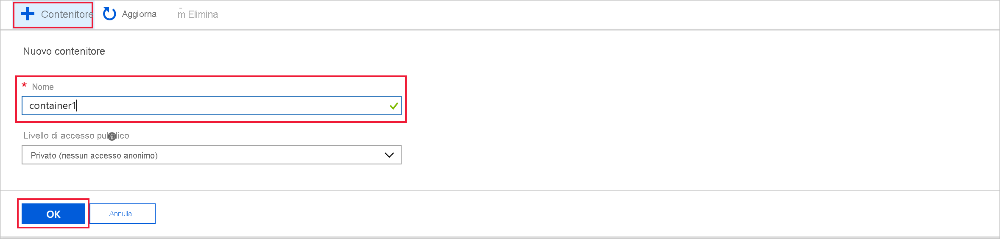

## <a name="create-a-stream-analytics-project"></a>Creare un progetto di Analisi di flusso

1. In Visual Studio Code premere **CTRL+MAIUSC+P** per aprire il riquadro comandi. Immettere quindi **ASA** e selezionare **ASA: Create New Project**(ASA: Crea nuovo progetto).

   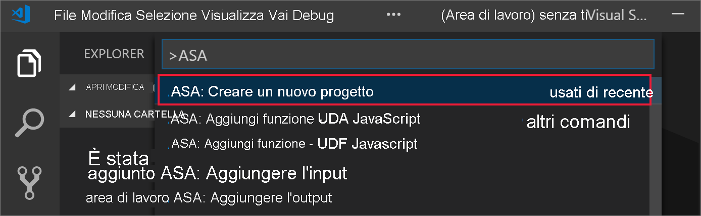

2. Immettere il nome del progetto, ad esempio **myASAproj**, e selezionare una cartella per il progetto.

    

3. Il nuovo progetto viene aggiunto all'area di lavoro. Un progetto di Analisi di flusso è costituito da tre cartelle: **Inputs**, **Outputs** e **Functions**, oltre che dallo script di query **(*.asaql)** , da un file **JobConfig.json** e da un file di configurazione **asaproj.json**.

    Il file di configurazione **asaproj.json** contiene gli input, gli output e le informazioni sul file di configurazione del processo che servono per inviare ad Azure il processo di analisi di flusso.

    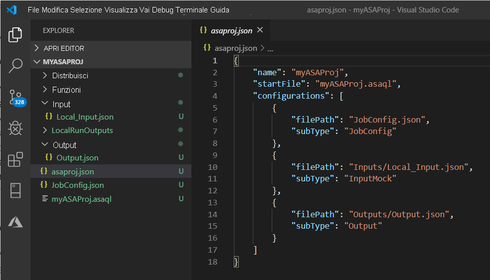

> [!Note]
> Quando si aggiungono gli input e gli output dal riquadro comandi, i percorsi corrispondenti vengono automaticamente aggiunti in **asaproj.json**. Se si aggiungono o si rimuovono direttamente gli input o gli output sul disco, è necessario aggiungerli o rimuoverli manualmente da **asaproj.json**. È possibile scegliere di inserire gli input e gli output in un'unica posizione e in seguito farvi riferimento in diversi processi specificando i percorsi in ogni file **asaproj.json**.

## <a name="define-the-transformation-query"></a>Definire la query di trasformazione

1. Aprire **myASAproj.asaql** dalla cartella del progetto.

2. Aggiungere la query seguente:

   ```sql
   SELECT *
   INTO Output
   FROM Input
   HAVING Temperature > 27
   ```

## <a name="define-a-live-input"></a>Definire un input live

1. Fare clic con il pulsante destro del mouse sulla cartella **Inputs** nel progetto di Analisi di flusso. Scegliere quindi **ASA: Add Input** (ASA: Aggiungi input) dal menu di scelta rapida.

    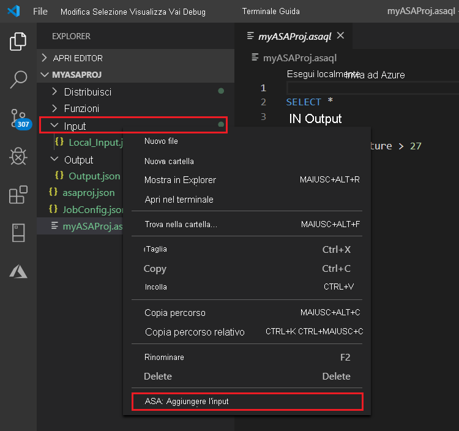

    Oppure premere **CTRL+MAIUSC+P** per aprire il riquadro comandi e immettere **ASA: Add Input** (ASA: Aggiungi input).

   

2. Scegliere **Hub IoT** come tipo di input.

   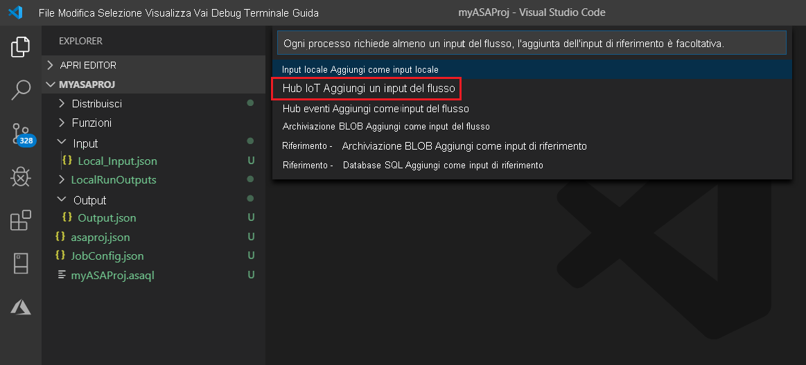

3. Se l'input è stato aggiunto dal riquadro comandi, selezionare lo script di query di Analisi di flusso che userà l'input. Verrà automaticamente popolato con il percorso del file **myASAproj.asaql**.

   

4. Scegliere **Select from your Azure Subscriptions** (Seleziona dalle sottoscrizioni di Azure) dal menu a discesa.

    

5. Modificare il file **IoTHub1.json** appena generato con i valori seguenti. Mantenere i valori predefiniti per i campi non menzionati qui.

   |Impostazione|Valore consigliato|Descrizione|
   |-------|---------------|-----------|
   |Nome|Input|Immettere un nome per identificare l'input del processo.|
   |IoTHubNamespace|MyASAIoTHub|Scegliere o immettere il nome dell'hub IoT. I nomi di hub IoT vengono rilevati automaticamente se sono stati creati nella stessa sottoscrizione.|
   |SharedAccessPolicyName|iothubowner| |

   È possibile usare la funzionalità CodeLens per immettere una stringa, selezionare una voce da un elenco a discesa o modificare il testo direttamente nel file. Lo screenshot seguente mostra **Select from your Subscriptions** (Seleziona dalle sottoscrizioni) come esempio. Le credenziali vengono automaticamente elencate e salvate in Gestione credenziali locale.

   

   

## <a name="preview-input"></a>Visualizzare l'input in anteprima

Selezionare **Preview data** (Anteprima dati) in **IoTHub1.json** nella riga superiore. Alcuni dati di input verranno recuperati dall'hub IoT e visualizzati nella finestra di anteprima. Il processo potrebbe richiedere un po' di tempo.

 

## <a name="define-an-output"></a>Definire un output

1. Premere **CTRL+MAIUSC+P** per aprire il riquadro comandi. Immettere quindi **ASA: Add Output** (ASA: Aggiungi output).

   

2. Scegliere **Archiviazione BLOB** come tipo di sink.

3. Scegliere lo script di query di Analisi di flusso che userà l'input.

4. Come nome del file di output immettere **BlobStorage**.

5. Modificare **BlobStorage** con i valori seguenti. Mantenere i valori predefiniti per i campi non menzionati qui. Usare la funzionalità CodeLens per immettere una stringa o selezionarne una da un elenco a discesa.

   |Impostazione|Valore consigliato|Descrizione|
   |-------|---------------|-----------|
   |Nome|Output| Immettere un nome per identificare l'output del processo.|
   |Account di archiviazione|asaquickstartstorage|Scegliere o immettere il nome dell'account di archiviazione. I nomi degli account di archiviazione vengono rilevati automaticamente se sono stati creati nella stessa sottoscrizione.|
   |Contenitore|container1|Selezionare il contenitore esistente creato nell'account di archiviazione.|
   |Modello di percorso|output|Immettere il nome di un percorso di file da creare all'interno del contenitore.|

   

## <a name="compile-the-script"></a>Compilare lo script

La compilazione dello script controlla la sintassi e genera i modelli di Azure Resource Manager per la distribuzione automatica.

Esistono due modi per attivare la compilazione dello script:

- Selezionare lo script dall'area di lavoro e quindi compilarlo dal riquadro comandi.

   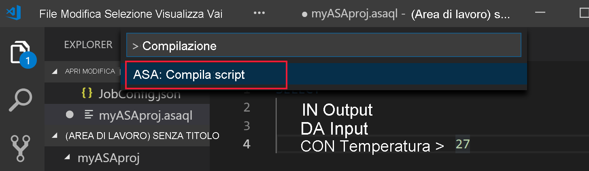

- Fare clic con il pulsante destro del mouse sullo script e scegliere **ASA: Compile Script** (ADL: Compila script).

    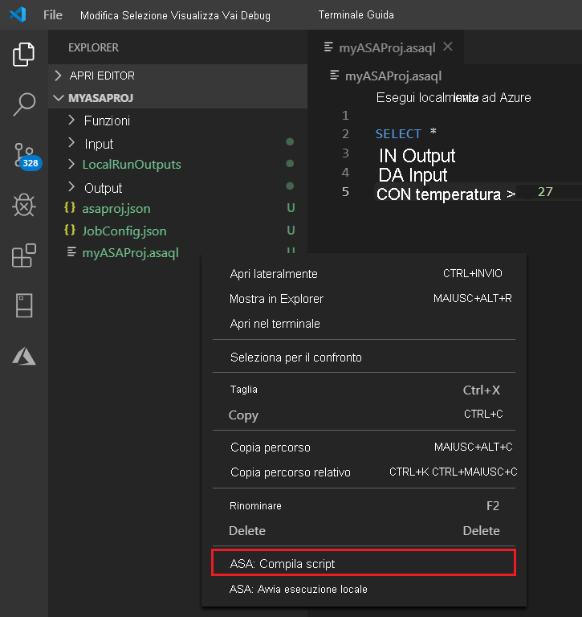

Dopo la compilazione, i due modelli di Azure Resource Manager generati saranno disponibili nella cartella **Deploy** del progetto. Questi due file vengono usati per la distribuzione automatica.

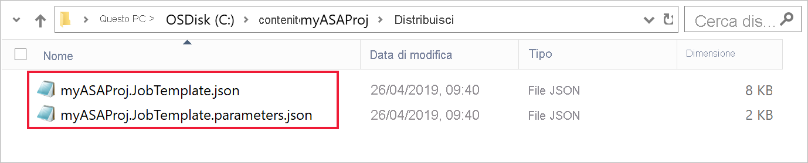

## <a name="submit-a-stream-analytics-job-to-azure"></a>Inviare ad Azure un processo di Analisi di flusso

1. Nella finestra dell'editor di script dello script di query selezionare **Submit to Azure** (Invia ad Azure).

   

2. Selezionare la sottoscrizione nell'elenco popup.

3. Scegliere **Select a job** (Seleziona un processo). Scegliere quindi **Create New Job** (Crea nuovo processo).

4. Immettere il nome del processo, **myASAjob**, quindi seguire le istruzioni per scegliere il gruppo di risorse e la posizione.

5. Selezionare **Invia ad Azure**. I log sono disponibili nella finestra di output. 

6. Al termine della creazione del processo, è possibile visualizzarlo in **Esplora analisi di flusso**.

    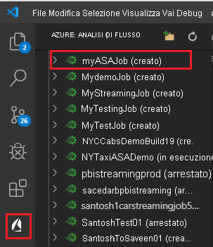

## <a name="start-the-stream-analytics-job-and-check-output"></a>Avviare il processo di Analisi di flusso e controllare l'output

1. Aprire **Esplora analisi di flusso** in Visual Studio Code e cercare il processo **myASAJob**.

2. Fare clic con il pulsante destro del mouse sul nome del processo. Nel menu di scelta rapida selezionare **Avvia**.

   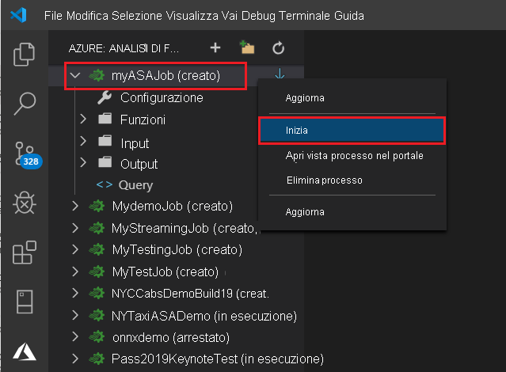

3. Scegliere **Adesso** nella finestra popup per avviare il processo.

4. Si noti che lo stato del processo è diventato **In esecuzione**. Fare clic con il pulsante destro del mouse sul nome del processo e scegliere **Open Job View in Portal** (Apri la visualizzazione processo nel portale) per visualizzare le metriche degli eventi di input e di output. Questa azione può richiedere qualche minuto.

5. Per visualizzare i risultati, aprire l'archiviazione BLOB nell'estensione di Visual Studio Code o nel portale di Azure.

## <a name="clean-up-resources"></a>Pulire le risorse

Quando non sono più necessari, eliminare il gruppo di risorse, il processo di streaming e tutte le risorse correlate. Eliminando il processo si evita di pagare per le unità di streaming usate dal processo. 

Se si prevede di usare il processo in futuro, è possibile arrestarlo e riavviarlo in un secondo momento. Se non si prevede di usare di nuovo questo processo, seguire questa procedura per eliminare tutte le risorse create in questo argomento di avvio rapido:

1. Scegliere **Gruppi di risorse** dal menu a sinistra del portale di Azure e quindi selezionare il nome della risorsa creata.  

2. Nella pagina del gruppo di risorse selezionare **Elimina**. Immettere il nome del gruppo di risorse da eliminare nella casella di testo e quindi selezionare **Elimina**.

## <a name="next-steps"></a>Passaggi successivi

In questo argomento di avvio rapido è stato distribuito un semplice processo di Analisi di flusso con Visual Studio Code. È possibile distribuire processi di Analisi di flusso anche usando il [portale di Azure](stream-analytics-quick-create-portal.md), [PowerShell](stream-analytics-quick-create-powershell.md) e [Visual Studio](stream-analytics-quick-create-vs.md).

Per informazioni sugli strumenti di Analisi di flusso di Azure per Visual Studio Code, vedere gli articoli seguenti:

* [Eseguire test locali delle query di Analisi di flusso con dati di esempio con Visual Studio Code](visual-studio-code-local-run.md)

* [Testare i processi di Analisi di flusso di Azure in locale con input live tramite Visual Studio Code](visual-studio-code-local-run-live-input.md)

* [Usare Visual Studio Code per visualizzare i processi di Analisi di flusso di Azure](visual-studio-code-explore-jobs.md)

* [Configurare pipeline CI/CD con il pacchetto npm](setup-cicd-vs-code.md)
